<div align="center">

# ⚡ WindowsOptimizer 2.0
### Киберспортивный Центр Оптимизации Windows 11 & 10 и Глубокой Настройки Ядра NT

[](https://github.com/temkalt/WindowsOptimizer)
[](https://github.com/temkalt/WindowsOptimizer)
[-0078D6.svg?style=for-the-badge&logo=windows)](https://github.com/temkalt/WindowsOptimizer)
[](https://github.com/temkalt/WindowsOptimizer)
[](https://htmlpreview.github.io/?https://github.com/temkalt/WindowsOptimizer/blob/main/CHITAT_KNIGU.html)

<p align="center">
  <b>Ультимативная соревновательная среда настройки Windows без плацебо, мусора и деструктивных твиков.</b><br>
  Создана на базе анализа 20 фундаментальных направлений компьютерной инженерии, академических исследований задержек ввода (Click-to-Photon), архитектуры ядра Windows NT и опыта ведущих мировых оверклокерских сообществ.
</p>

---

### 🚀 ЕДИНСТВЕННЫЙ СПОСОБ ЗАПУСКА

Откройте **PowerShell от имени Администратора** и вставьте одну команду:

```powershell
irm https://raw.githubusercontent.com/temkalt/WindowsOptimizer/main/WindowsOptimizer.ps1 | iex
```

*(или альтернативная короткая ссылка)*
```powershell
irm https://raw.githubusercontent.com/temkalt/WindowsOptimizer/main/launch.ps1 | iex
```

---

### 📖 ИНТЕРАКТИВНАЯ БАЗА ЗНАНИЙ (20 ТОМОВ ЭНЦИКЛОПЕДИИ)

[](https://htmlpreview.github.io/?https://github.com/temkalt/WindowsOptimizer/blob/main/CHITAT_KNIGU.html)

> 💡 **База Знаний WindowsOptimizer** — это 20 глав фундаментального академического руководства по тюнингу ядра Windows, субтаймингам памяти, аппаратным таймерам, DPC-латентности и сетевому стеку (более 2.3 МБ чистого структурированного текста без воды).

</div>

---

## 🔬 Изученные Проекты, Репозитории, Исследования и Экспертные Источники

При разработке `WindowsOptimizer 2.0` была проделана колоссальная исследовательская работа. Мы объединили, проанализировали и декомпилировали наработки ключевых проектов и инженерных лабораторий:

```mermaid
graph TD
    A["WindowsOptimizer 2.0 Architecture"] --> B["1. Академические Исследования & Лаборатории"]
    A --> C["2. Открытые GitHub Проекты"]
    A --> D["3. Экспертные Оверклокерские Форумы"]
    A --> E["4. Киберспортивные Твикерские Пакеты"]

    B --> B1["Blur Busters (Mark Rejhon) - Input Lag & Display Motion"]
    B --> B2["NVIDIA Research - Reflex SDK, LDAT & P-State Architecture"]
    B --> B3["Microsoft Windows NT Kernel Internals (Mark Russinovich)"]
    B --> B4["Intel PresentMon 2.0 & CapFrameX Frame Pacing"]

    C --> C1["ChrisTitusTech/winutil (PowerShell Architecture)"]
    C --> C2["farag2/Sophia-Script-for-Windows (Debloat Core)"]
    C --> C3["undergroundwires/privacy.sexy & hellzerg/optimizer"]
    C --> C4["SweetLow/hidusbf (USB Polling Rate Overclocking)"]
    C --> C5["Wagnardsoft DDU & ISLC (Memory & Driver Cleaning)"]

    D --> D1["Overclock.net (OCN) - DRAM Sub-timings & Vdroop LLC"]
    D --> D2["Guru3D - Display Drivers, RTSS & MPO Diagnostics"]
    D --> D3["Reddit r/overclocking & r/MouseReview"]

    E --> E1["Igromanoff News - Anomaly Resolution 4:3 TDR Fix & Power Plans"]
    E --> E2["Calypto OS Optimization Guide & Melody Tweaking Guide"]
    E --> E3["FR33THY & Astrux Esports Packs"]
```



### 1. Академические исследования задержек и дисплеев
* **Blur Busters (Chief Blur Buster Mark Rejhon):** фундаментальные исследования Sample-and-Hold размытия, физики сканирования строк дисплея (Scan-out Latency), технологий стробирования подсветки (ULMB 2, BenQ DyAc 2, ASUS ELMB-Sync, ViewSonic PureXP) и руководства *G-Sync 101* (комбинация G-Sync + V-Sync NVCP + FPS Cap -3).
* **NVIDIA System Latency Research:** микроархитектура конвейера рендеринга, технология NVIDIA Reflex Low Latency + Boost, аппаратный анализатор LDAT, фиксация базовых состояний питания GPU (`DisableDynamicPstate = 1`) и форсирование P-State 0.
* **Архитектура ядра Windows NT (Mark Russinovich & David Solomon):** квантование планировщика потоков (Thread Quantum Lengths), математика 6-битной маски `Win32PrioritySeparation` (0x16 Variable Short vs 0x28 Fixed Long), служба мультимедийного планировщика MMCSS (`SystemProfile`).
* **Аппаратные таймеры и тактирование:** спецификации Invariant TSC (Time Stamp Counter), HPET, ACPI Power Management Timer, исключение задержек `NtSetTimerResolution` / `timeBeginPeriod` и учет изменений глобального таймера Windows 10 2004+ / Windows 11 (`GlobalTimerResolutionRequests = 1`).

### 2. Открытые репозитории и инструменты GitHub
* [`ChrisTitusTech/winutil`](https://github.com/ChrisTitusTech/winutil) — изучение архитектуры автономного выполнения скриптов через PowerShell.
* [`farag2/Sophia-Script-for-Windows`](https://github.com/farag2/Sophia-Script-for-Windows) — анализ модульной структуры деблоатинга, безопасного отключения UWP/AppX и задач планировщика.
* [`hellzerg/optimizer`](https://github.com/hellzerg/optimizer) & [`undergroundwires/privacy.sexy`](https://github.com/undergroundwires/privacy.sexy) — аудит политик телеметрии и правил приватности Group Policy.
* [`CXWorld/CapFrameX`](https://github.com/CXWorld/CapFrameX) & [`GameTechDev/PresentMon`](https://github.com/GameTechDev/PresentMon) — методология захвата времени кадра, метрики 0.1% Low FPS и Click-to-Photon.
* [`microe1/MouseTester`](https://github.com/microe1/MouseTester) — анализ сенсоров PixArt (PAW3395, PAW3950) и Logitech HERO, устранение сглаживания и джиттера.
* [`SweetLow/hidusbf`](https://github.com/SweetLow/hidusbf) — низкоуровневый оверклокинг контроллеров USB для мышей и геймпадов (DualSense / Xbox) до 1000–8000 Hz.
* **Wagnardsoft DDU & ISLC** — безопасная очистка видеодрайверов и тайминги очистки списка ожидания памяти Standby List.

### 3. Инженерные и оверклокерские форумы
* **Overclock.net (OCN):** калибровка вторичных и третичных субтаймингов памяти DDR4/DDR5 (tRFC, tREFI, tFAW, tRRD), устранение DPC-латентности аудиодрайверов Realtek HD Audio.
* **Guru3D Forums:** решение проблем Multi-Plane Overlay (MPO `OverlayTestMode = 5`), кастомные разрешения CRU (Large Vertical Total) и низколатентный DirectFlip.
* **Сообщества Reddit (`r/overclocking`, `r/MouseReview`, `r/Monitors`):** валидация отсутствия плацебо в соревновательных играх CS2, Apex Legends и Valorant.

---

## 🔍 100% Реальный Глубокий Аудит Системы в Live-Режиме

В утилите **нет фальшивых анимаций, фейковых процентов и симуляций**. При каждом запуске скрипт напрямую опрашивает параметры вашей установленной Windows:

```text
============================================================================
          WindowsOptimizer 2.0 - 100% РЕАЛЬНЫЙ АУДИТ СИСТЕМЫ                
============================================================================
 [*] Сканирование ядра Windows, реестра, таймеров, драйверов и служб...

  [+] Отключение телеметрии и сбора данных (DiagTrack)
  [+] Отключение быстрой загрузки и гибернации (Hiberboot)
  [+] Фиксация ядра Windows в DDR RAM (DisablePagingExecutive = 1)
  [+] Кванты CPU для киберспорта (Win32PrioritySeparation 22/26)
  [+] Глобальное микросекундное разрешение таймера 0.500 ms
  [+] Отключение MPO (Устранение статтеров и сбоев DWM)
  [+] Отключение фоновой записи Xbox GameDVR
  [+] Снятие сетевого троттлинга (NetworkThrottlingIndex = 0xFFFFFFFF)
  [+] 100% Приоритет сетевых пакетов (SystemResponsiveness = 0)
  [+] Приоритет игрового и аудио потока MMCSS (High Priority)
  [+] Нулевая задержка клавиатуры (FilterKeys AutoRepeat 150ms)
  [+] Оптимизация файловой системы NTFS (8.3 Names Off)
  [-] Отключение обновления времени доступа LastAccess на NVMe
  [-] Прямой доступ к ядру Ring 0 (VBS / Core Isolation Отключен)

============================================================================
  РЕАЛЬНАЯ ГОТОВНОСТЬ СИСТЕМЫ: 86% [########################----] (12 из 14 проверок)
  Активный план электропитания: Igromanoff AMD VIP
============================================================================
```

---

## 📦 15 Разделов Оптимизации (Полный Состав Пака)

| № | Раздел | Описание и Ключевые Твики |
|---|---|---|
| **01** | **ПЕРВЫМ ДЕЛОМ** | Создание точек восстановления, резервное копирование реестра и сетевых адаптеров |
| **02** | **WINDOWS И ДЕБЛОЙТ** | Отключение VBS / Core Isolation (буст 1% Low), удаление DiagTrack, UAC, Cortana, AI Recall |
| **03** | **ПРОЦЕССОР И ТАЙМЕРЫ** | Win32PrioritySeparation 0x16, системный таймер 0.500ms, калибровка Ryzen 9800X3D V-Cache |
| **04** | **ВИДЕОКАРТА И ГРАФИКА** | Anomaly Resolution 4:3 TDR Fix, отключение MPO, HAGS, GPU Dynamic P-State Lock, AMD ULPS Off |
| **05** | **ПЛАНЫ ЭЛЕКТРОПИТАНИЯ** | Кастомный план Igromanoff AMD VIP (GUID 77777777...), Intel V1-V3, LLC Esports Plan |
| **06** | **ПАМЯТЬ И ДИСКИ** | `DisablePagingExecutive = 1`, отключение StorPort Idle, оптимизация NTFS 8.3 и LastAccess |
| **07** | **ИНТЕРНЕТ И СЕТЬ** | Nagle Algorithm Bypass (`TcpAckFrequency = 1`, `TCPNoDelay = 1`), аппаратный тюнинг NIC (EEE/Green Off) |
| **08** | **МЫШЬ И КЛАВИАТУРА** | Линейный MarkC 1:1, очереди буфера 16, FilterKeys 0ms (15ms Repeat), SweetLow HIDUSBF |
| **09** | **ЗВУК И МУЛЬТИМЕДИА** | MMCSS Tasks Games High SFIO Priority, `NoLazyMode = 1`, защита от заиканий звука |
| **10** | **СЛУЖБЫ И ПЛАНИРОВЩИК** | Отключение 15 категорий фоновых задач планировщика Windows, опциональный Extreme Services Debloat |
| **11** | **УСТРОЙСТВА И MSI MODE** | Message Signaled Interrupts (MSI-X) High Priority для GPU, Ethernet контроллера и NVMe |
| **12** | **ИГРОВЫЕ КОНФИГИ** | Оптимальные CFG и запуск для CS2 (`-mainthreadpriority 2`), Apex Legends, Valorant, Warzone |
| **13** | **ДИАГНОСТИКА** | Встроенные комплексы LatencyMon, TestMem5 (Anta777), LinX AMD, Y-Cruncher, Prime95 |
| **14** | **ОЧИСТКА СИСТЕМЫ** | Очистка TEMP, DirectX Shader Cache (NVIDIA/AMD/Intel), логов Event Viewer и USB-устройств |
| **15** | **ВОССТАНОВЛЕНИЕ** | Полный возврат всех параметров Windows, сетевого стека и стандартного питания в 1 клик |

---

## 🛡️ Безопасность и Античиты (Anti-Cheat Compatibility)

* **100% Совместимость с Турнирными Античитами:** Riot Vanguard (Valorant), FACEIT Anti-Cheat (CS2), Easy Anti-Cheat (Apex Legends/Fortnite), BattlEye (R6 Siege), Ricochet (Warzone).
* **Сохранение UAC и LUA:** Значения `EnableLUA = 1` сохранены для предотвращения блокировок со стороны драйверов уровня ядра (Ring 0) античитов.
* **Обратимость всех настроек:** Любое изменение фиксируется в локальном аудит-логе и может быть моментально отменено в разделе восстановления.

---

<div align="center">

### ⚡ WindowsOptimizer 2.0 — Побеждай с Минимальным Инпутлагом!

```powershell
irm https://raw.githubusercontent.com/temkalt/WindowsOptimizer/main/WindowsOptimizer.ps1 | iex
```

</div>
