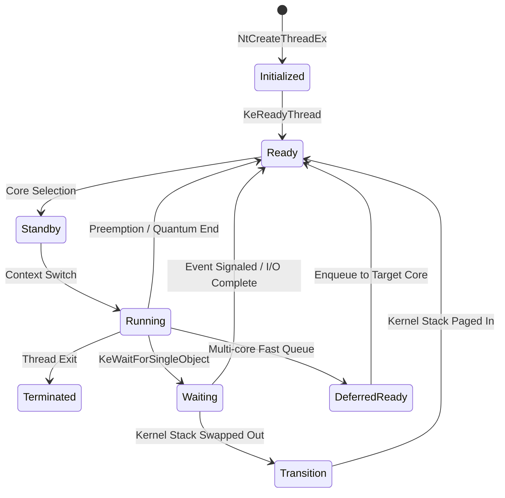
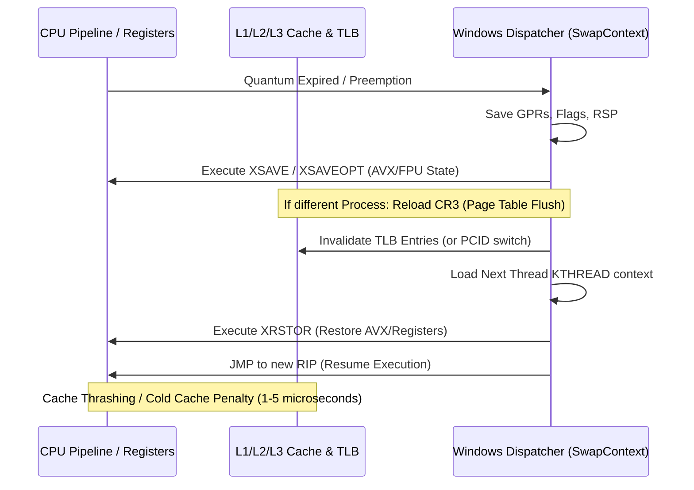

# Глава 1: Ядро Windows, Диспетчер Потоков (Scheduler), Квантование CPU, MMCSS и Оптимизация Процессорного Планирования

> **Целевая аудитория:** Системные инженеры, исследователи задержек операционных систем, разработчики низкоуровневого ПО и энтузиасты киберспортивного твикинга.  
> **Область охвата:** Архитектура Windows NT Kernel (от Windows 10 21H2 до Windows 11 24H2+), внутренние структуры диспетчера, математика `Win32PrioritySeparation`, сервис MMCSS, аппаратное планирование Intel Thread Director / AMD CPPC, влияние SMT/Hyper-Threading на задержки и 1%/0.1% Lows, изоляция прерываний (DPC/ISR) и инструментальный анализ через ETW/WPA.

---

## Содержание

1. [Архитектура Диспетчера Windows NT (Kernel Scheduler Fundamentals)](#1-архитектура-диспетчера-windows-nt-kernel-scheduler-fundamentals)
   - [Модель состояний потока (Thread State Machine)](#модель-состояний-потока-thread-state-machine)
   - [Иерархия приоритетов (Priority Levels 0–31)](#иерархия-приоритетов-priority-levels-031)
   - [Механизмы динамического повышения приоритета (Dynamic Priority Boosts)](#механизмы-динамического-повышения-приоритета-dynamic-priority-boosts)
   - [Очереди готовности (Ready Queues) и структуры KPRCB](#очереди-готовности-ready-queues-и-структуры-kprcb)
2. [Квантование Процессорного Времени (CPU Quanta Internals)](#2-квантование-процессорного-времени-cpu-quanta-internals)
   - [Квантовые единицы (Quantum Units) и системный таймер](#квантовые-единицы-quantum-units-и-системный-таймер)
   - [Декрементация кванта и завершение кванта (Quantum Expiration)](#декрементация-кванта-и-завершение-кванта-quantum-expiration)
   - [Накладные расходы на переключение контекста (Context Switch Overhead)](#накладные-расходы-на-переключение-контекста-context-switch-overhead)
3. [Математический Анализ и Конфигурация Win32PrioritySeparation](#3-математический-анализ-и-конфигурация-win32priorityseparation)
   - [Побитовая структура 6-битовой маски](#побитовая-структура-6-битовой-маски)
   - [Полная матрица значений и их дешифрация](#полная-матрица-значений-и-их-дешифрация)
   - [Влияние на задержки (Input Lag) и стабильность фреймтайма (1% / 0.1% Lows)](#влияние-на-задержки-input-lag-и-стабильность-фреймтайма-1--01-lows)
4. [Мультимедийный Планировщик MMCSS (Multimedia Class Scheduler Service)](#4-мультимедийный-планировщик-mmcss-multimedia-class-scheduler-service)
   - [Архитектура и назначение MMCSS](#архитектура-и-назначение-mmcss)
   - [Параметры HKLM\...\Multimedia\SystemProfile](#параметры-hklm-multimediasystemprofile)
   - [Конфигурация профиля Tasks\Games и аудио-потоков](#конфигурация-профиля-tasksgames-и-аудио-потоков)
   - [Взаимодействие с игровыми движками и Windows Audio Engine](#взаимодействие-с-игровыми-движками-и-windows-audio-engine)
5. [Архитектура Современных CPU и Гетерогенное Планирование](#5-архитектура-современных-cpu-и-гетерогенное-планирование)
   - [Intel Thread Director (ITD) и гибридные архитектуры (P/E Cores)](#intel-thread-director-itd-и-гибридные-архитектуры-pe-cores)
   - [Парковка ядер (Core Parking) и C-States Latency](#парковка-ядер-core-parking-и-c-states-latency)
   - [Intel SpeedShift (HWP) и Energy Performance Preference (EPP)](#intel-speedshift-hwp-и-energy-performance-preference-epp)
   - [AMD CPPC, Preferred Cores и асимметричные процессоры Ryzen X3D](#amd-cppc-preferred-cores-и-асимметричные-процессоры-ryzen-x3d)
6. [Hyper-Threading / SMT: Анализ Задержек и Конкуренции Ресурсов](#6-hyper-threading--smt-анализ-задержек-и-конкуренции-ресурсов)
   - [Разделение исполнительных блоков и Cache Contention](#разделение-исполнительных-блоков-и-cache-contention)
   - [Когда отключение SMT улучшает 1% и 0.1% Lows](#когда-отключение-smt-улучшает-1-и-01-lows)
7. [Привязка Процессов (Affinity), CPU Sets и Изоляция Прерываний](#7-привязка-процессов-affinity-cpu-sets-и-изоляция-прерываний)
   - [Hard Affinity vs Soft Affinity vs CPU Sets](#hard-affinity-vs-soft-affinity-vs-cpu-sets)
   - [Изоляция DPC/ISR и распределение прерываний (MSI Mode)](#изоляция-dpcisr-и-распределение-прерываний-msi-mode)
   - [Механика Process Lasso и ProBalance](#механика-process-lasso-и-probalance)
8. [Мифы, Плацебо и Опасные Настройки](#8-мифы-плацебо-и-опасные-настройки)
9. [Пошаговая Реализация, Скрипты Оптимизации и Отката](#9-пошаговая-реализация-скрипты-оптимизации-и-отката)
10. [Инструментальная Валидация через WPA, ETW и LatencyMon](#10-инструментальная-валидация-через-wpa-etw-и-latencymon)
11. [Библиография и Ссылки на Инструменты](#11-библиография-и-ссылки-на-инструменты)

---

## 1. Архитектура Диспетчера Windows NT (Kernel Scheduler Fundamentals)

Диспетчер Windows NT (Kernel Dispatcher) представляет собой **вытесняющий (preemptive), приоритетно-ориентированный многопоточный планировщик**, работающий на уровне ядра (`ntoskrnl.exe`). Планировщик оперирует исключительно **потоками (threads, структуры `KTHREAD`/`ETHREAD`)**, а не процессами (`EPROCESS`). Процесс выступает лишь контейнером адресного пространства и дескрипторов ресурсов.

```
+-----------------------------------------------------------------------+
|                           Windows Kernel (NTOSKRNL)                   |
|                                                                       |
|   +---------------------------------------------------------------+   |
|   |                  Thread Dispatcher / Scheduler                |   |
|   +---------------------------------------------------------------+   |
|         |                     |                      |                |
|         v                     v                      v                |
|   [Ready Queue 0]      [Ready Queue 1]        [Ready Queue 31]        |
|   (Idle Threads)       (Dynamic 1-15)         (Real-Time 16-31)       |
|         |                     |                      |                |
|         +---------------------+----------------------+                |
|                               |                                       |
|                               v                                       |
|                  +--------------------------+                         |
|                  | KPRCB (Per-Core Struct)  |                         |
|                  | Current / Next / Idle    |                         |
|                  +--------------------------+                         |
|                               |                                       |
|                               v                                       |
|                  +--------------------------+                         |
|                  | Hardware Core / LP (CPU) |                         |
|                  +--------------------------+                         |
+-----------------------------------------------------------------------+
```

### Модель состояний потока (Thread State Machine)

Каждый поток в Windows находится в одном из строго определенных состояний (определяемых полем `KTHREAD.State`):



1. **Initialized:** Поток создан, структуры `ETHREAD`/`KTHREAD` аллоцированы в невыгружаемом пуле (Non-Paged Pool), но выполнение еще не начато.
2. **Ready:** Поток готов к исполнению и ожидает назначения на логический процессор в очереди готовности (`DispatcherReadyListHead`).
3. **DeferredReady:** Промежуточное оптимизационное состояние в многопроцессорных системах. Поток уже выбран для выполнения на конкретном ядре, но еще не помещен в его локальную очередь, что минимизирует межъядерные блокировки (Spinlock contention).
4. **Standby:** Поток выбран диспетчером для выполнения на конкретном ядре в следующий момент времени. На каждом ядре может быть только один поток в состоянии Standby (`KPRCB.NextThread`).
5. **Running:** Поток непосредственно исполняется на исполнительных конвейерах ядра процессора (`KPRCB.CurrentThread`).
6. **Waiting:** Поток добровольно уступил управление или заблокирован в ожидании синхронизационного примитива (`KEVENT`, `KMUTEX`, `KSEMAPHORE`, I/O Completion Port, таймер).
7. **Transition:** Поток готов к выполнению, но его стек ядра временно выгружен в страничный файл (Paged Out) диспетчером памяти (Memory Manager).
8. **Terminated:** Поток завершил выполнение и освобождает ресурсы.

### Иерархия приоритетов (Priority Levels 0–31)

Диспетчер Windows NT использует 32 целочисленных уровня приоритета (0–31):

| Диапазон уровней | Категория | Описание и особенности диспетчеризации |
|---|---|---|
| **0** | **System Idle** | Единственный поток `Idle Thread` (`ntoskrnl.exe`), исполняемый при отсутствии полезной нагрузки. Переводит ядро в ACPI C-States (`MWAIT`/`HLT`). |
| **1 – 15** | **Dynamic / Variable Priority** | Стандартный диапазон для пользовательских приложений и системных служб. Приоритеты динамически модифицируются планировщиком (Dynamic Boosts). |
| **16 – 31** | **Real-Time Priority** | Приоритеты реального времени. **Динамический бустинг отключен.** Потоки с Real-Time приоритетом никогда не теряют квант в пользу динамических потоков и исполняются до блокировки или появления потока с еще более высоким приоритетом. |

#### Классы приоритетов процессов (Process Priority Classes)
Приложения в Win32 задают класс приоритета через API `SetPriorityClass`, который транслируется в базовый приоритет процесса:
- `IDLE_PRIORITY_CLASS` $\rightarrow$ Базовый приоритет 4
- `BELOW_NORMAL_PRIORITY_CLASS` $\rightarrow$ Базовый приоритет 6
- `NORMAL_PRIORITY_CLASS` $\rightarrow$ Базовый приоритет 8 (стандартный для большинства игр и программ)
- `ABOVE_NORMAL_PRIORITY_CLASS` $\rightarrow$ Базовый приоритет 10
- `HIGH_PRIORITY_CLASS` $\rightarrow$ Базовый приоритет 13
- `REALTIME_PRIORITY_CLASS` $\rightarrow$ Базовый приоритет 24

Внутри процесса поток может иметь относительный приоритет (`SetThreadPriority`): `THREAD_PRIORITY_IDLE` (-15), `THREAD_PRIORITY_LOWEST` (-2), `THREAD_PRIORITY_BELOW_NORMAL` (-1), `THREAD_PRIORITY_NORMAL` (0), `THREAD_PRIORITY_ABOVE_NORMAL` (+1), `THREAD_PRIORITY_HIGHEST` (+2), `THREAD_PRIORITY_TIME_CRITICAL` (+15).

> [!WARNING]
> Установка игре или системным утилитам класса `REALTIME_PRIORITY_CLASS` (приоритеты 24+) категорически не рекомендуется: если поток реального времени войдет в цикл ожидания (spin-wait) или перегрузит ядро, он заблокирует обработку ввода Windows (`csrss.exe`, `dwm.exe`), системные DPC/ISR таймеры и вызовет полное зависание ОС.

### Механизмы динамического повышения приоритета (Dynamic Priority Boosts)

Для динамического диапазона (уровни 1–15) планировщик Windows применяет автоматический подъем приоритета:

1. **I/O Completion Boost:** При завершении операции ввода-вывода драйвер вызывает `IoCompleteRequest(Irp, PriorityBoost)`. Прирост приоритета зависит от типа устройства:
   - Клавиатура / Мышь: `IO_KEYBOARD_INCREMENT` (+6), `IO_MOUSE_INCREMENT` (+6) — обеспечивает мгновенный отклик игры на движение мыши.
   - Звуковая карта: `IO_SOUND_INCREMENT` (+8) — предотвращает опустошение аудио-буфера (audio dropouts / crackling).
   - Дисковая подсистема: `IO_DISK_INCREMENT` (+1).
   - Сетевой стек: `IO_NETWORK_INCREMENT` (+1).
2. **Foreground Window Boost (GUI Boost):** Потоки процесса, владеющего окном в фокусе (Foreground Window), получают временный бустинг приоритета и дополнительный квант процессорного времени.
3. **Synchronization Boost:** Поток, разблокированный после ожидания `KEVENT` или `KMUTEX`, получает подъем приоритета на +1..+2 для ускорения выхода из критической секции.
4. **Anti-CPU Starvation Boost (Balance Set Manager):** Специальный системный поток Balance Set Manager (`ntoskrnl.exe`) каждые 1 секунду сканирует очереди готовности `DispatcherReadyListHead`. Если поток находится в состоянии `Ready` более 4 секунд (~300 тиков таймера) без выделения CPU (голодание / CPU Starvation), диспетчер временно поднимает его приоритет до **15** и выдает удвоенный квант времени. После исчерпания кванта приоритет немедленно сбрасывается к исходному.

### Очереди готовности (Ready Queues) и структуры KPRCB

Каждое логическое процессорное ядро в Windows имеет собственную структуру **KPRCB (Kernel Processor Control Block)**. Внутри нее находятся:
- `KPRCB.DispatcherReadyListHead[32]`: 32 двусвязных списка очередей готовности для каждого уровня приоритета (0–31).
- `KPRCB.ReadySummary`: 32-битовая битовая маска, где каждый бит указывает на наличие готовых потоков в соответствующей очереди. Позволяет процессору найти поток наивысшего приоритета за одну процессорную инструкцию `BSR` / `LZCNT` ($O(1)$ complexity).
- Per-Core Locking: В современных версиях Windows NT диспетчер использует распределенные спинлоки для каждой структуры PRCB отдельно, избегая глобальной блокировки диспетчера (Global Dispatcher Lock) и обеспечивая высокое масштабирование на многоядерных процессорах (до 256+ логических потоков).

---

## 2. Квантование Процессорного Времени (CPU Quanta Internals)

### Квантовые единицы (Quantum Units) и системный таймер

**Квант (Quantum)** — это фиксированное количество времени, в течение которого поток может непрерывно выполняться на ядре до того, как диспетчер переоценит приоритеты и переключит контекст.

```
Системный таймер (15.625 ms / default)  --> [ Tick ] ---> [ Tick ] ---> [ Tick ]
                                              |              |              |
Квантовые единицы (Quantum Units)       --> [ 3 units ]    [ 3 units ]    [ 3 units ]
                                            |<----------- 1 Clock Tick ------------>|
```

- В ядре Windows NT квант измеряется не в миллисекундах напрямую, а в **квантовых единицах (Quantum Units)**.
- **1 системный тик таймера (Clock Tick) равен 3 квантовым единицам.**
- При стандартном тике таймера по умолчанию в 15.625 мс (64 Гц):  
  $$1\text{ Quantum Unit} = \frac{15.625\text{ ms}}{3} \approx 5.208\text{ ms}$$
- При высоком разрешении таймера (High-Resolution Timer, $0.5\text{ ms}$ / 2000 Гц):  
  $$1\text{ Quantum Unit} = \frac{0.5\text{ ms}}{3} \approx 0.166\text{ ms}$$

### Декрементация кванта и завершение кванта (Quantum Expiration)

В структуре `KTHREAD` за управление квантом отвечают поля:
- `KTHREAD.Quantum`: текущий остаток квантовых единиц.
- `KTHREAD.QuantumTarget`: базовый размер кванта, присвоенный потоку при планировании.

#### Алгоритм работы аппаратного таймера:
1. При каждом прерывании таймера (Clock Interrupt / DPC) диспетчер вычитает **3 единицы** из поля `KTHREAD.Quantum` текущего потока.
2. Если поток выполнял системный вызов или ожидал примитив синхронизации, но не исчерпал квант, неизрасходованный остаток сохраняется.
3. Когда `KTHREAD.Quantum <= 0` (Quantum Expiration):
   - Диспетчер проверяет, есть ли в `DispatcherReadyListHead` другие потоки с тем же или более высоким приоритетом.
   - Если таких потоков нет, поток получает новый полный квант (`Quantum = QuantumTarget`) и продолжает выполнение.
   - Если в очереди есть потоки того же приоритета, приоритет текущего потока понижается (если был динамический бустинг), поток помещается в хвост очереди `Ready`, и происходит **переключение контекста (Context Switch)**.

### Накладные расходы на переключение контекста (Context Switch Overhead)

Переключение контекста между потоками — аппаратно дорогая операция, сопровождающаяся следующими фазами:



1. **Сохранение регистрового контекста:** Сохранение General Purpose Registers (RAX, RBX, RCX, RDX, RSI, RDI, R8-R15, RSP, RIP, RFLAGS).
2. **Сохранение расширенного состояния (XSAVE/XRSTOR):** Сохранение 512-битных/256-битных регистров AVX-512, AVX2, SSE, FPU (до 2.5 КБ данных на поток).
3. **Смена адресного пространства (CR3 Reload):** Если переключение происходит между потоками *разных процессов*, процессор должен перезаписать регистр управления `CR3`. Это приводит к сбросу буфера ассоциативной трансляции (TLB Flush), если не используется технология PCID (Process-Context Identifiers).
4. **Загрязнение кэша (Cache Thrashing / Cache Pollution):** Новый поток загружает в L1 Data (32–48 КБ) и L1 Instruction (32 КБ) кэши собственные строки данных, вытесняя горячие кэш-линии предыдущего потока. Задержка холодного доступа к L3/RAM составляет от 40 до 80 нс на строку.

---

## 3. Математический Анализ и Конфигурация Win32PrioritySeparation

Ключ реестра `Win32PrioritySeparation` управляет тремя фундаментальными аспектами диспетчеризации Windows: **длиной кванта**, **изменчивостью кванта (фокус vs фон)** и **коэффициентом фокусного бустинга**.

```
Путь в реестре: HKLM\SYSTEM\CurrentControlSet\Control\PriorityControl
Имя параметра:  Win32PrioritySeparation
Тип данных:     REG_DWORD (32-bit unsigned integer, используются младшие 6 бит)
```

### Побитовая структура 6-битовой маски

Значение представляет собой 6-битовое число в формате `[Bits 5-4][Bits 3-2][Bits 1-0]`:

```
 Бит 5   Бит 4      Бит 3   Бит 2      Бит 1   Бит 0
+---------------+  +---------------+  +---------------+
| Quantum Length|  | Quantum Type  |  | Foreground    |
| (Short / Long)|  | (Var / Fixed) |  | Boost Ratio   |
+---------------+  +---------------+  +---------------+
```

#### 1. Биты [5:4] — Quantum Length (Длина базового кванта)
- `00` (Default): Значение по умолчанию для редакции ОС (Workstation = Short, Server = Long).
- `01` (Short): **Короткие кванты.** Базовый квант равен **6 квантовым единицам (2 тика)**. Оптимизировано для интерактивных пользовательских интерфейсов и игр с высокой частотой кадров.
- `10` (Long): **Длинные кванты.** Базовый квант равен **36 квантовым единицам (12 тиков)**. Оптимизировано для серверов баз данных и фоновых вычислительных задач.
- `11`: Зарезервировано / недопустимо (сбрасывается ядром в default).

#### 2. Биты [3:2] — Quantum Variation (Изменчивость кванта)
- `00` (Default): Значение по умолчанию (Workstation = Variable, Server = Fixed).
- `01` (Variable): **Переменные кванты.** Потоки оконных приложений на переднем плане (Foreground) получают увеличенный квант по сравнению с фоновыми потоками.
- `10` (Fixed): **Фиксированные кванты.** Все потоки получают абсолютно одинаковый квант времени, независимо от того, находится ли их окно на переднем плане или свернуто.
- `11`: Недопустимо.

#### 3. Биты [1:0] — Foreground Boost Ratio (Коэффициент бустинга активного окна)
*Применяется только в режиме Variable (Биты [3:2] = `01` или `00` на Client).*
- `00` (None / 1:1): Фоновые и активные потоки получают одинаковое время (множитель x1).
- `01` (Medium / 2:1): Активное окно получает в 2 раза больший квант, чем фоновые задачи (множитель x2).
- `10` (High / 3:1): Активное окно получает в 3 раза больший квант, чем фоновые задачи (множитель x3).
- `11`: Зарезервировано.

### Полная матрица значений и их дешифрация

Ниже представлена точная математическая таблица расшифровки популярных значений `Win32PrioritySeparation`:

| Hex | Dec | Двоичный вид `[5:4][3:2][1:0]` | Длина кванта | Тип кванта | Boost Ratio | Квант фона (тиков / units) | Квант фокуса (тиков / units) | Практическое применение |
|---|---|---|---|---|---|---|---|---|
| **0x02** | **2** | `00 00 10` | Default (Short) | Default (Var) | High (3:1) | 2 тика (6 units) | 6 тиков (18 units) | **Дефолт Windows Client.** Оптимально для повседневной многозадачности. |
| **0x16** | **22** | `01 01 10` | **Short** | **Variable** | **High (3:1)** | 2 тика (6 units) | 6 тиков (18 units) | **Эталон для киберспорта и игр.** Максимальный приоритет активной игры при минимальных задержках ввода. |
| **0x14** | **20** | `01 01 00` | **Short** | **Variable** | **None (1:1)** | 2 тика (6 units) | 2 тика (6 units) | Короткие равные кванты. Ультрабыстрое переключение, повышенный context switch rate. |
| **0x18** | **24** | `01 10 00` | **Short** | **Fixed** | **None (1:1)** | 2 тика (6 units) | 2 тика (6 units) | Фиксированные короткие кванты для всех процессов без дискриминации фона. |
| **0x1A** | **26** | `01 10 10` | **Short** | **Fixed** | **High (3:1)** | 2 тика (6 units) | 6 тиков (18 units)* | Псевдо-фиксированный режим с приоритетом фокуса. |
| **0x26** | **38** | `10 01 10` | **Long** | **Variable** | **High (3:1)** | 4 тика (12 units)| 12 тиков (36 units)| Длинные переменные кванты. Снижает накладные расходы переключения, полезно для тяжелых симуляторов. |
| **0x28** | **40** | `10 10 00` | **Long** | **Fixed** | **None (1:1)** | 12 тиков (36 u) | 12 тиков (36 units)| **Дефолт Windows Server.** Переключатель "Оптимизировать работу служб фонового режима" в `sysdm.cpl`. |
| **0x2A** | **42** | `10 10 10` | **Long** | **Fixed** | **High (3:1)** | 12 тиков (36 u) | 36 тиков (108 u)  | Серверный режим с экстремальным фокусным бустингом. |

*\* Примечание: В некоторых ревизиях ядра NT флаг Fixed (`10`) жестко игнорирует биты бустинга [1:0], приравнивая фокусный квант к фоновому.*

### Влияние на задержки (Input Lag) и стабильность фреймтайма (1% / 0.1% Lows)

```
[Значение 0x16 (Short, Var, Boost)] ---> Игра держит ядро 18 units -> Минимальный context switch -> Высокий 1% Lows
                                    ---> Быстрый возврат управления (2 ticks) при прерывании мыши/клавиатуры

[Значение 0x28 (Long, Fixed)]       ---> Игра делит процессор поровну со всеми фоновыми службами (по 36 units)
                                    ---> Задержка обработки ввода может достигать 15-30 мс при загрузке CPU
```

1. **Почему `0x16` (22 decimal) является золотым стандартом для гейминга:**
   - Игра в фокусе получает **18 квантовых единиц (6 тиков таймера)** непрерывного исполнения. Это защищает поток отрисовки (Render Thread) от вытеснения второстепенными службами Windows (Windows Update, Search Indexer, телеметрия).
   - Фоновые службы получают минимальный квант **6 единиц (2 тика)**. Если фоновый поток вытеснит игру, он завершит свой квант максимально быстро и вернет процессор игре.
   - Итог: **Снижение микростаттеров, рост показателей 1% и 0.1% Low FPS, устранение дропов кадров при резких движениях мыши.**

2. **Почему `0x28` (40 decimal) противопоказан для киберспорта:**
   - Любая фоновая служба, проснувшись по I/O или таймеру, получает гигантский квант в 36 единиц (12 тиков = ~187 мс при стандартном таймере). Игровой поток ждет своей очереди в десятки раз дольше, что приводит к ощутимым задержкам регистрации выстрелов и скачкам фреймтайма (Frametime Spikes).

---

## 4. Мультимедийный Планировщик MMCSS (Multimedia Class Scheduler Service)

### Архитектура и назначение MMCSS

**MMCSS (Multimedia Class Scheduler Service)** — системная служба Windows (исполняемый файл `svchost.exe -k netsvcs`, библиотека `mmcss.dll`), введенная начиная с Windows Vista для приоритезации мультимедийных задач реального времени (аудиопотоки, видеовоспроизведение, захват кадров и игровые циклы) без блокировки операционной системы.

MMCSS динамически повышает базовый приоритет зарегистрированных потоков в диапазон **16–26** (зону Real-Time / High Priority) на основе параметров реестра.

```
+-----------------------------------------------------------------------+
|                 Multimedia Application / Game Engine                  |
|                                                                       |
|   1. AvSetMmThreadCharacteristicsW(L"Games", &taskIndex)              |
+-----------------------------------------------------------------------+
                                   |
                                   v
+-----------------------------------------------------------------------+
|                      MMCSS Service (mmcss.dll)                        |
|                                                                       |
|   - Читает профиль HKLM\...\Multimedia\SystemProfile\Tasks\Games      |
|   - Повышает приоритет потока до Priority=6 (или 8)                   |
|   - Передает GPU Priority=8 в DirectX Graphics Kernel (DXGKRNL)       |
|   - Применяет SFIO Priority="High" к дисковым операциям               |
+-----------------------------------------------------------------------+
                                   |
                                   v
+-----------------------------------------------------------------------+
|                Windows NT Thread Dispatcher & DWM/GPU                 |
+-----------------------------------------------------------------------+
```

### Параметры HKLM\...\Multimedia\SystemProfile

```
Путь в реестре: HKEY_LOCAL_MACHINE\SOFTWARE\Microsoft\Windows NT\CurrentVersion\Multimedia\SystemProfile
```

| Параметр | Тип | По умолчанию | Оптимально | Описание и техническое обоснование |
|---|---|---|---|---|
| **`SystemResponsiveness`** | `REG_DWORD` | `20` (Hex `0x14`) | `0` или `10` | Процент процессорного времени, гарантированно резервируемый для низкоприоритетных и фоновых задач. По умолчанию 20% CPU отдается фоновым задачам даже при 100% нагрузке мультимедиа. Значение `0` снимает резервацию, отдавая 100% CPU MMCSS-потокам игры. |
| **`NetworkThrottlingIndex`** | `REG_DWORD` | `10` (Hex `0x0A`) | `0xFFFFFFFF` (4294967295) | **Критический параметр для сетевых игр.** При воспроизведении аудио/видео драйвер `ndis.sys` ограничивает обработку не-мультимедийных сетевых пакетов до 10 пакетов/мс для защиты от DPC-шторма. Значение `0xFFFFFFFF` полностью отключает троттлинг сети, снижая пинг и исключая packet loss. |
| **`NoLazyMode`** | `REG_DWORD` | *Отсутствует* | `1` | Отключает энергосберегающий "ленивый" режим MMCSS, предотвращая сброс приоритетов при временном простое потока. |
| **`LazyModeTimeout`** | `REG_DWORD` | *Отсутствует* | `0xFFFFFFFF` | Устанавливает бесконечный таймаут до перехода в Lazy Mode. |
| **`SchedulerTimerResolution`** | `REG_DWORD` | *Отсутствует* | `10000` (1 ms) | Желаемое разрешение таймера планировщика MMCSS в сотнях наносекунд. |

### Конфигурация профиля Tasks\Games и аудио-потоков

Подраздел `HKLM\SOFTWARE\Microsoft\Windows NT\CurrentVersion\Multimedia\SystemProfile\Tasks\Games` конфигурирует параметры для игр, вызывающих API `AvSetMmThreadCharacteristics`:

| Параметр | Тип | По умолчанию | Оптимально | Техническое назначение |
|---|---|---|---|---|
| **`GPU Priority`** | `REG_DWORD` | `8` | `8` | Приоритет планирования GPU-контекста в планировщике драйвера дисплея WDDM (`dxgkrnl.sys`). Диапазон 0–31 (в контексте MMCSS эффективный максимум — 8). |
| **`Priority`** | `REG_DWORD` | `2` или `6` | `6` (или `8`) | Базовый приоритет потока MMCSS. Значение `6` соответствует высокому динамическому приоритету, `8` — приоритету реального времени Pro Audio. |
| **`Scheduling Category`** | `REG_SZ` | `"Medium"` | `"High"` | Категория выделения процессорного времени (`High`, `Medium`, `Low`). |
| **`SFIO Priority`** | `REG_SZ` | `"Normal"` | `"High"` | **Special File I/O Priority.** Повышает приоритет дисковых операций ввода-вывода потоковой подгрузки игровых ресурсов (текстур, моделей), устраняя заикания при переходе между локациями. |
| **`Affinity`** | `REG_DWORD` | `0` | `0` | Маска привязки ядер для MMCSS (0 = использовать все ядра без ограничений). |
| **`Clock Rate`** | `REG_DWORD` | `10000` | `10000` | Частота синхронизации планировщика задач (10000 = 1.0 мс). |

### Взаимодействие с игровыми движками и Windows Audio Engine

- **Игровые движки (Unreal Engine, Unity, Source 2, Frostbite):** При инициализации аудио- и рендер-потоков движки загружают библиотеку `avrt.dll` и вызывают `AvSetMmThreadCharacteristicsW(L"Games", &taskIndex)`. Если ключ `Tasks\Games` оптимизирован, главный игровой цикл получает наивысший приоритет GPU и I/O планирования.
- **Windows Audio Engine (WASAPI / Spatial Audio):** Потоки аудиодвижка регистрируются под профилями `Audio` и `Pro Audio`. Настройка `SystemResponsiveness = 0` гарантирует, что даже при пиковых 100% нагрузках на видеокарту и процессор звук в игре не начнет трещать или прерываться (Audio Buffer Underrun).

---

## 5. Архитектура Современных CPU и Гетерогенное Планирование

### Intel Thread Director (ITD) и гибридные архитектуры (P/E Cores)

Начиная с 12-го поколения (Alder Lake, Raptor Lake, Arrow Lake / Core Ultra), процессоры Intel используют гетерогенную топологию:
- **Performance Cores (P-cores / Golden Cove, Raptor Cove, Lion Cove):** Высокопроизводительные ядра с высокой тактовой частотой, широким конвейером (6-8 wide decode), поддержкой Hyper-Threading и низкими задержками кэша L2 (1.25–3 МБ на ядро).
- **Efficient Cores (E-cores / Gracemont, Crestmont, Skymont):** Энергоэффективные ядра, объединенные в кластеры по 4 штуки с общим кэшем L2 (4 МБ на кластер), без Hyper-Threading.

```
+-----------------------------------------------------------------------------------+
|                        Intel Heterogeneous CPU Topology                           |
|                                                                                   |
|  +---------------------------------------+  +----------------------------------+  |
|  |           P-Core Cluster              |  |         E-Core Cluster           |  |
|  |  +---------------+ +---------------+  |  |  +----+ +----+  +----+ +----+   |  |
|  |  |  P-Core 0     | |  P-Core 1     |  |  |  | E0 | | E1 |  | E2 | | E3 |   |  |
|  |  |  (SMT: T0/T1) | |  (SMT: T0/T1) |  |  |  +----+ +----+  +----+ +----+   |  |
|  |  |  L2: 2.0 MB   | |  L2: 2.0 MB   |  |  |         L2: 4.0 MB Shared        |  |
|  |  +---------------+ +---------------+  |  +----------------------------------+  |
|  +---------------------------------------+                     |                  |
|                      |                                         |                  |
|                      +--------------------+--------------------+                  |
|                                           |                                       |
|                                           v                                       |
|                       +---------------------------------------+                   |
|                       |       Shared L3 Ring Bus Cache        |                   |
|                       +---------------------------------------+                   |
+-----------------------------------------------------------------------------------+
```

#### Intel Enhanced Hardware Feedback Interface (EHFI / ITD):
Аппаратный микроконтроллер внутри процессора анализирует типы исполняемых инструкций в реальном времени и классифицирует потоки:
- **Class 0:** Стандартные скалярные целочисленные инструкции (Legacy code).
- **Class 1:** Расширенные векторные инструкции AVX2 (Advanced Vector Extensions).
- **Class 2:** Глубокие вычисления с плавающей точкой / AVX-512 / FP-heavy.
- **Class 3:** Сериализованные инструкции, критичные к задержке выборки памяти (Serialization / High IPC).

#### Разница в планировании: Windows 10 vs Windows 11
- **Windows 10:** Планировщик не обладает полной поддержкой интерфейса EHFI/ITD. Распределение потоков происходит на основе стандартной загрузки, что приводит к ошибочной отправке основного потока игры на E-core. Задержка межъядерного взаимодействия (P-Core L2 $\leftrightarrow$ E-Core L2 через Ring Bus) составляет **40–65 нс**, что вызывает катастрофические просадки 0.1% Low FPS и микрозаикания.
- **Windows 11 (22H2 / 23H2 / 24H2):** Полная интеграция с ITD. Игровые потоки гарантированно удерживаются на P-ядрах, а фоновые задачи ОС сбрасываются на E-ядра.

#### Твики гетерогенного планирования в схеме электропитания (Powercfg):
Для принудительного удержания всех критических потоков на P-ядрах применяются следующие параметры политики:

```powershell
# Subgroup: 54533251-82be-4824-96c1-47b60b740d00 (Processor Power Management)

# Heterogeneous thread scheduling policy (93b8b6dc-0698-4d1c-9ee4-0644e900c85d)
# 1 = Schedule exclusively to more performant processors (P-cores only)
# 2 = Schedule to more performant processors when possible (Prefer P-cores)
powercfg -setacvalueindex scheme_current 54533251-82be-4824-96c1-47b60b740d00 93b8b6dc-0698-4d1c-9ee4-0644e900c85d 2

# Heterogeneous short running thread scheduling policy (bae08b81-2d5e-4688-ad6a-13243356654b)
# 1 = Performant processors only
powercfg -setacvalueindex scheme_current 54533251-82be-4824-96c1-47b60b740d00 bae08b81-2d5e-4688-ad6a-13243356654b 1

powercfg -setactive scheme_current
```

### Парковка ядер (Core Parking) и C-States Latency

**Core Parking** — функция энергосбережения ядра Windows, которая динамически отключает и переводит незадействованные ядра процессора в глубокие спящие C-состояния (C3, C6, C7, Package C-States).

```
Ядро в состоянии C0 (Active):       Задержка пробуждения = 0 мкс
Ядро припарковано в C1 (Halt):      Задержка пробуждения = ~1-2 мкс
Ядро припарковано в C6 (Power Gate): Задержка пробуждения = 50 - 250+ мкс (Unpark Latency Spike)
```

Когда игре внезапно требуется вычислительная мощность для физического просчета взрыва или подгрузки геометрии, спящее ядро должно проснуться (Unpark Event), включить тактовый генератор и восстановить регистры из кэша. Задержка в **50–250 мкс** на каждое такое событие вызывает мгновенный разрыв кадра (Stutter).

#### Полное отключение парковки ядер (100% Unpark):
```powershell
# Установка минимального и максимального процента активных ядер на 100%
# Min Unparked Cores (0cc5b647-c1df-4637-891a-dec35c318583)
powercfg -setacvalueindex scheme_current 54533251-82be-4824-96c1-47b60b740d00 0cc5b647-c1df-4637-891a-dec35c318583 100

# Max Unparked Cores (ea062031-0e34-4ff1-9b6d-eb1059334028)
powercfg -setacvalueindex scheme_current 54533251-82be-4824-96c1-47b60b740d00 ea062031-0e34-4ff1-9b6d-eb1059334028 100

# Для гетерогенных процессоров (Efficiency Class 1):
powercfg -setacvalueindex scheme_current 54533251-82be-4824-96c1-47b60b740d00 0cc5b647-c1df-4637-891a-dec35c318584 100
powercfg -setacvalueindex scheme_current 54533251-82be-4824-96c1-47b60b740d00 ea062031-0e34-4ff1-9b6d-eb1059334029 100

powercfg -setactive scheme_current
```

### Intel SpeedShift (HWP) и Energy Performance Preference (EPP)

- **Legacy SpeedStep (P-States):** Управление частотой процессора осуществлялось операционной системой через прерывания драйвера `intelppm.sys` с интервалом проверки нагрузки в **15–30 мс**.
- **Intel SpeedShift Technology (HWP - Hardware-Controlled P-States):** Аппаратный контроллер процессора автономно изменяет частоту и напряжение ядер каждые **1 мс**.

#### Настройка Energy Performance Preference (EPP):
Параметр EPP (GUID `3668d466-4f2f-455b-b50c-00246ab5ab5d`) задает баланс между энергосбережением и мгновенным выходом на максимальную частоту:
- `0` — **100% Performance (Max Performance):** Процессор немедленно переходит на максимальный Turbo Boost при возникновении малейшей нагрузки, исключая задержки нарастания частоты (Frequency Ramp-up Delay).
- `255` — Max Power Saving.

```powershell
# EPP на 0 (Максимальная производительность)
powercfg -setacvalueindex scheme_current 54533251-82be-4824-96c1-47b60b740d00 3668d466-4f2f-455b-b50c-00246ab5ab5d 0
powercfg -setactive scheme_current
```

### AMD CPPC, Preferred Cores и асимметричные процессоры Ryzen X3D

**AMD CPPC (Collaborative Power and Performance Control / CPPC2)** — интерфейс UEFI ACPI, посредством которого процессор сообщает ядру Windows фабричные характеристики качества каждого физического ядра (на основе V/F кривой и кремниевого биннинга).

#### Особенности двухчиплетных процессоров с 3D V-Cache (Ryzen 9 7900X3D, 7950X3D, 9950X3D):
1. **Топология:**
   - **CCD0 (V-Cache CCD):** 8 ядер с гигантским кэшем L3 (32 МБ + 64 МБ 3D V-Cache = 96 МБ), но пониженной пиковой частотой (~5.25 ГГц).
   - **CCD1 (Frequency CCD):** 8 ядер со стандартным кэшем L3 (32 МБ), но максимальной частотой (~5.7 ГГц).
2. **Проблема межчиплетного трафика (Cross-CCD Latency):**
   - Задержка обращения к памяти внутри одного CCD: **14–18 нс**.
   - Задержка обращения через шину **Infinity Fabric (IF / SDF)** к кэшу соседнего CCD: **70–90 нс**.
3. **Решение:** Для игр критически важно зафиксировать процесс игры на **CCD0** (ядра 0–15 с учетом SMT), исключая миграцию потоков на CCD1. Это устраняет скачки межчиплетной латентности и обеспечивает стабильный 0.1% Low FPS.

---

## 6. Hyper-Threading / SMT: Анализ Задержек и Конкуренции Ресурсов

### Разделение исполнительных блоков и Cache Contention

Технология **SMT (Simultaneous Multithreading / Intel Hyper-Threading)** создает два логических процессора (Logical Processors) на базе одного физического процессорного ядра.

```
+-----------------------------------------------------------------------+
|                       Physical CPU Core Pipeline                      |
|                                                                       |
|   +---------------------------------------------------------------+   |
|   |         Front-End: Fetch / Decode / Branch Prediction         |   |
|   +---------------------------------------------------------------+   |
|                                 |                                     |
|                                 v                                     |
|   +---------------------------------------------------------------+   |
|   |    Execution Engine: ALUs, AGUs, Vector FPUs (Ports 0 - 11)   |   |
|   +---------------------------------------------------------------+   |
|            |                                             |            |
|            v                                             v            |
|   [ Logical Thread 0 ]                         [ Logical Thread 1 ]   |
|   (Game Main Thread)                           (Discord / Background) |
|            |                                             |            |
|            +----------------------+----------------------+            |
|                                   |                                   |
|                                   v                                   |
|   +---------------------------------------------------------------+   |
|   |        L1 Data Cache (32-48 KB) / L2 Cache (1-2 MB)           |   |
|   |        SHARED & VULNERABLE TO CACHE POLLUTION                 |   |
|   +---------------------------------------------------------------+   |
+-----------------------------------------------------------------------+
```

#### Механизмы ресурсной деградации при включенном SMT:
1. **Execution Port Contention:** Если поток игры (Thread 0) и фоновый поток (Thread 1) одновременно пытаются выполнить векторную инструкцию `FADD`/`FMUL` на Порту 0/1, конвейер физического ядра принудительно останавливается (Pipeline Stall), удваивая время выполнения тактов (IPC падает).
2. **L1D Cache Thrashing:** Объем кэша L1D мал (32–48 КБ). Поток-сосед вымывает критические данные игрового движка, заставляя главный рендер-поток ожидать данные из L2/L3 (задержка возрастает с 4-5 тактов до 14-45 тактов).
3. **Thread Context Thrashing:** Потоки игры могут случайно назначаться на соседние логические ядра одного физического ядра вместо независимых физических ядер.

### Когда отключение SMT улучшает 1% и 0.1% Lows

| Конфигурация CPU | Рекомендация SMT/HT | Обоснование и влияние на задержки |
|---|---|---|
| **8 физических ядер (Ryzen 7 7800X3D, 9800X3D, Core i7/i9 8P)** | **SMT OFF (для киберспорта)** | Играм (CS2, Valorant, Apex, PUBG) достаточно 8 чистых физических ядер. Отключение SMT полностью устраняет конкуренцию за порты и кэш L1/L2. **Результат: фреймтайм становится идеально гладкой линией, устраняются редкие микрофризы.** |
| **6 физических ядер (Ryzen 5 7600X, 5600X, Core i5 6P)** | **Зависит от игры** | Для киберспорта без фоновых задач SMT OFF дает снижение задержек. В тяжелых AAA-играх (Cyberpunk 2077, Starfield, Warzone) 6 физических потоков могут загрузиться на 100%, вызвав CPU Bottleneck. |
| **4 физических ядра (Core i3, Ryzen 3)** | **SMT ON (Обязательно)** | 4 физических потока недостаточно для современных движков и фоновых процессов Windows. Отключение SMT приведет к 100% загрузке CPU и сильным лагам. |

---

## 7. Привязка Процессов (Affinity), CPU Sets и Изоляция Прерываний

### Hard Affinity vs Soft Affinity vs CPU Sets

В Windows реализовано три механизма управления размещением потоков на процессорных ядрах:

```
1. Hard Affinity (SetProcessAffinityMask):
   - Жесткая битовая маска.
   - Поток имеет право исполняться ТОЛЬКО на указанных ядрах.
   - Если все указанные ядра заняты DPC/ISR, поток простаивает (Hard Stutter Risk).

2. Soft Affinity (SetThreadIdealProcessorEx):
   - Планировщик старается назначить поток на "идеальное" ядро.
   - Если ядро занято, поток свободно мигрирует на любое другое ядро.

3. CPU Sets (SetProcessDefaultCpuSets / SetThreadSelectedCpuSets):
   - Современный API (начиная с Windows 10).
   - Выделяет ядру предпочтительный пул процессов, но не блокирует системные потоки.
   - Идеально совместим с Game Mode и античитами (Easy Anti-Cheat, BattlEye, Vanguard).
```

### Изоляция DPC/ISR и распределение прерываний (MSI Mode)

Любое аппаратное прерывание (движение мыши на 1000–8000 Гц, сетевой пакет от NIC, рендер-сигнал от GPU) генерирует аппаратное прерывание **ISR (Interrupt Service Routine)**, которое планирует процедуру отложенного вызова **DPC (Deferred Procedure Call)**.

> [!IMPORTANT]
> DPC и ISR исполняются на уровне IRQL (Interrupt Request Level) выше, чем любые пользовательские потоки (включая приоритеты реального времени). Если прерывание мыши или сетевой карты обрабатывается на том же ядре, где исполняется Main Game Thread, игра **принудительно замораживается на время обработки прерывания**.

#### Стратегия изоляции прерываний:
- **Core 0 / Core 1:** Выделяются под системные DPC/ISR прерывания (USB контроллер мыши/клавиатуры, сетевая карта Ethernet/Wi-Fi, NVMe контроллер).
- **Core 2 – Core N:** Полностью изолируются от прерываний и отдаются под главный цикл игры (Game Main Loop / Render Thread).

```
   Core 0 (LP 0, 1):   [USB 8000Hz DPC] [NIC 2.5G DPC] [System Interrupts]
   Core 1 (LP 2, 3):   [NVMe Storage I/O] [Audio Driver DPC]
   Core 2 (LP 4, 5):   ================> [ GAME MAIN RENDER THREAD ] <================ (ЧИСТОЕ ЯДРО БЕЗ ПРЕРЫВАНИЙ)
   Core 3 (LP 6, 7):   [ Game Physics / Worker Threads ]
   Core 4 (LP 8, 9):   [ Game Worker Threads ]
   Core 5 (LP 10, 11): [ Game Worker Threads / Audio ]
```

### Механика Process Lasso и ProBalance

Утилита **Process Lasso (Bitsum)** использует низкоуровневые хуки ядра Windows NT:
1. **ProBalance (Process Balance):** Автоматически временно понижает динамический приоритет фоновых процессов (до `Below Normal`), если они вызывают всплеск нагрузки CPU во время активного гейминга.
2. **CPU Affinity & CPU Sets Rules:** Автоматически принудительно фиксирует игру на нужных ядрах (например, только P-ядра или только CCD0 с V-Cache), сбрасывая фоновые процессы (Discord, OBS, Chrome) на оставшиеся ядра.

---

## 8. Мифы, Плацебо и Опасные Настройки

### Миф 1: "Отключение службы MMCSS ускоряет Windows"
- **Реальность:** Отключение службы MMCSS ломает интерфейс `AvSetMmThreadCharacteristics`, выключает аппаратную приоритезацию GPU для Desktop Window Manager (`dwm.exe`) и приводит к рассинхронизации аудиодвижков (WASAPI/ASIO) с появлением треска и щелчков в звуковом тракте.

### Миф 2: "Значение Win32PrioritySeparation 0x28 (40) лучше всего для FPS"
- **Реальность:** Значение `0x28` переводит планировщик в режим сервера (Long, Fixed Quanta). Все фоновые службы Windows получают гигантские кванты времени по 36 единиц. Любой фоновый процесс при пробуждении замораживает игру на заметно большее время, ухудшая Input Lag и 0.1% Lows.

### Миф 3: "Отключение SMT полезно абсолютно всем"
- **Реальность:** На 4-ядерных и 6-ядерных процессорах отключение SMT приводит к 100% CPU bottleneck в современных играх. Отключать SMT имеет смысл **только при наличии 8 и более полноценных физических ядер**.

### Миф 4: "Привязка всех системных служб и драйверов к Core 0"
- **Реальность:** Нагрузка Core 0 до 100% прерываниями приводит к состоянию `DPC Starvation`, зависанию системного таймера, синим экранам `DPC_WATCHDOG_VIOLATION (0x00000133)` и выпадению кадров.

---

## 9. Пошаговая Реализация, Скрипты Оптимизации и Отката

### PowerShell Скрипт Оптимизации (`Optimize-KernelScheduler.ps1`)

Запускать в консоли PowerShell от имени Администратора.

```powershell
# =====================================================================
# Windows Kernel, Scheduler & CPU Optimization Script
# Author: Windows Latency & Kernel Research Lab
# =====================================================================

# Требование прав администратора
if (-not ([Security.Principal.WindowsPrincipal][Security.Principal.WindowsIdentity]::GetCurrent()).IsInRole([Security.Principal.WindowsBuiltInRole]::Administrator)) {
    Write-Error "Скрипт должен быть запущен от имени Администратора!"
    exit 1
}

Write-Host "[1/5] Создание точки восстановления системы..." -ForegroundColor Cyan
try {
    Checkpoint-Computer -Description "Before_Kernel_Scheduler_Optimization" -RestorePointType "MODIFY_SETTINGS" -ErrorAction SilentlyContinue
    Write-Host "  -> Точка восстановления создана." -ForegroundColor Green
} catch {
    Write-Host "  -> Предупреждение: Не удалось создать точку восстановления (служба VSS отключена)." -ForegroundColor Yellow
}

Write-Host "[2/5] Настройка Win32PrioritySeparation (0x16 / Short, Variable, High Boost)..." -ForegroundColor Cyan
$PriorityPath = "HKLM:\SYSTEM\CurrentControlSet\Control\PriorityControl"
if (-not (Test-Path $PriorityPath)) { New-Item -Path $PriorityPath -Force | Out-Null }
# 0x16 = 22 decimal (Short quanta, Variable, 3:1 Foreground Boost)
Set-ItemProperty -Path $PriorityPath -Name "Win32PrioritySeparation" -Value 22 -Type DWord
Write-Host "  -> Win32PrioritySeparation установлен в 0x16 (22)." -ForegroundColor Green

Write-Host "[3/5] Оптимизация MMCSS (SystemProfile & Tasks\Games)..." -ForegroundColor Cyan
$SystemProfilePath = "HKLM:\SOFTWARE\Microsoft\Windows NT\CurrentVersion\Multimedia\SystemProfile"
if (-not (Test-Path $SystemProfilePath)) { New-Item -Path $SystemProfilePath -Force | Out-Null }

Set-ItemProperty -Path $SystemProfilePath -Name "SystemResponsiveness" -Value 0 -Type DWord
Set-ItemProperty -Path $SystemProfilePath -Name "NetworkThrottlingIndex" -Value 4294967295 -Type DWord # 0xFFFFFFFF
Set-ItemProperty -Path $SystemProfilePath -Name "NoLazyMode" -Value 1 -Type DWord
Set-ItemProperty -Path $SystemProfilePath -Name "LazyModeTimeout" -Value 4294967295 -Type DWord
Set-ItemProperty -Path $SystemProfilePath -Name "SchedulerTimerResolution" -Value 10000 -Type DWord # 1.0 ms

$GamesTaskPath = "$SystemProfilePath\Tasks\Games"
if (-not (Test-Path $GamesTaskPath)) { New-Item -Path $GamesTaskPath -Force | Out-Null }

Set-ItemProperty -Path $GamesTaskPath -Name "GPU Priority" -Value 8 -Type DWord
Set-ItemProperty -Path $GamesTaskPath -Name "Priority" -Value 6 -Type DWord
Set-ItemProperty -Path $GamesTaskPath -Name "Scheduling Category" -Value "High" -Type String
Set-ItemProperty -Path $GamesTaskPath -Name "SFIO Priority" -Value "High" -Type String
Set-ItemProperty -Path $GamesTaskPath -Name "Affinity" -Value 0 -Type DWord
Set-ItemProperty -Path $GamesTaskPath -Name "Clock Rate" -Value 10000 -Type DWord
Write-Host "  -> Параметры MMCSS и Tasks\Games успешно оптимизированы." -ForegroundColor Green

Write-Host "[4/5] Отключение парковки ядер (Core Unparking) и настройка EPP..." -ForegroundColor Cyan
# Subgroup: 54533251-82be-4824-96c1-47b60b740d00 (Processor Power Management)
$PPM_GUID = "54533251-82be-4824-96c1-47b60b740d00"

# Распарковка стандартных ядер (Min/Max Unpark Cores = 100%)
powercfg -setacvalueindex scheme_current $PPM_GUID 0cc5b647-c1df-4637-891a-dec35c318583 100
powercfg -setacvalueindex scheme_current $PPM_GUID ea062031-0e34-4ff1-9b6d-eb1059334028 100

# Распарковка ядер класса энергоэффективности 1 (для гибридных CPU)
powercfg -setacvalueindex scheme_current $PPM_GUID 0cc5b647-c1df-4637-891a-dec35c318584 100
powercfg -setacvalueindex scheme_current $PPM_GUID ea062031-0e34-4ff1-9b6d-eb1059334029 100

# Energy Performance Preference (EPP = 0 / Max Performance)
powercfg -setacvalueindex scheme_current $PPM_GUID 3668d466-4f2f-455b-b50c-00246ab5ab5d 0

# Политики планирования для гетерогенных процессоров (P-core preference)
powercfg -setacvalueindex scheme_current $PPM_GUID 93b8b6dc-0698-4d1c-9ee4-0644e900c85d 2 # Prefer Performant
powercfg -setacvalueindex scheme_current $PPM_GUID bae08b81-2d5e-4688-ad6a-13243356654b 1 # Short threads on Performant

powercfg -setactive scheme_current
Write-Host "  -> Парковка ядер отключена, EPP установлен в 0 (Max Performance)." -ForegroundColor Green

Write-Host "[5/5] Проверка состояния службы MMCSS..." -ForegroundColor Cyan
$MmcssService = Get-Service -Name "MMCSS" -ErrorAction SilentlyContinue
if ($MmcssService) {
    Set-Service -Name "MMCSS" -StartupType Automatic
    if ($MmcssService.Status -ne 'Running') {
        Start-Service -Name "MMCSS"
    }
    Write-Host "  -> Служба MMCSS активна и работает." -ForegroundColor Green
} else {
    Write-Host "  -> Служба MMCSS управляется через svchost netsvcs (нормально для современных Windows)." -ForegroundColor Gray
}

Write-Host "`nОптимизация успешно завершена! Рекомендуется перезагрузить ПК." -ForegroundColor Magenta
```

---

### PowerShell Скрипт Отката (`Restore-KernelScheduler-Defaults.ps1`)

```powershell
# =====================================================================
# Windows Kernel Scheduler & MMCSS Defaults Restore Script
# =====================================================================

if (-not ([Security.Principal.WindowsPrincipal][Security.Principal.WindowsIdentity]::GetCurrent()).IsInRole([Security.Principal.WindowsBuiltInRole]::Administrator)) {
    Write-Error "Скрипт должен быть запущен от имени Администратора!"
    exit 1
}

Write-Host "Восстановление значений Windows по умолчанию..." -ForegroundColor Yellow

# 1. Win32PrioritySeparation -> 0x02 (Client Default)
Set-ItemProperty -Path "HKLM:\SYSTEM\CurrentControlSet\Control\PriorityControl" -Name "Win32PrioritySeparation" -Value 2 -Type DWord

# 2. MMCSS SystemProfile Defaults
$SystemProfilePath = "HKLM:\SOFTWARE\Microsoft\Windows NT\CurrentVersion\Multimedia\SystemProfile"
Set-ItemProperty -Path $SystemProfilePath -Name "SystemResponsiveness" -Value 20 -Type DWord
Set-ItemProperty -Path $SystemProfilePath -Name "NetworkThrottlingIndex" -Value 10 -Type DWord
Remove-ItemProperty -Path $SystemProfilePath -Name "NoLazyMode" -ErrorAction SilentlyContinue
Remove-ItemProperty -Path $SystemProfilePath -Name "LazyModeTimeout" -ErrorAction SilentlyContinue

# 3. MMCSS Tasks\Games Defaults
$GamesTaskPath = "$SystemProfilePath\Tasks\Games"
Set-ItemProperty -Path $GamesTaskPath -Name "GPU Priority" -Value 8 -Type DWord
Set-ItemProperty -Path $GamesTaskPath -Name "Priority" -Value 2 -Type DWord
Set-ItemProperty -Path $GamesTaskPath -Name "Scheduling Category" -Value "Medium" -Type String
Set-ItemProperty -Path $GamesTaskPath -Name "SFIO Priority" -Value "Normal" -Type String

# 4. Power Plan Defaults (Сброс схемы)
powercfg -restoredefaultschemes

Write-Host "Заводские параметры ядра и планировщика успешно восстановлены!" -ForegroundColor Green
```

---

## 10. Инструментальная Валидация через WPA, ETW и LatencyMon

### 1. Анализ DPC/ISR задержек через LatencyMon

1. Скачайте и установите **LatencyMon** (Resplendence).
2. Запустите мониторинг кнопкой **Start (Play)** и запустите тяжелую игровую сессию на 5–10 минут.
3. Проанализируйте вкладку **Drivers**:
   - `Highest execution (ms)` для драйверов `nvlddmkm.sys` (GPU), `ndis.sys` / `tcpip.sys` (Сеть), `Wdf01000.sys` (Kernel Framework), `storport.sys` (Диск).
   - **Целевое значение для киберспорта:** Максимальная DPC latency любого драйвера должна быть **$< 50\text{ }\mu\text{s}$ (0.05 ms)**. Значения выше 500 мкс (0.5 ms) свидетельствуют о DPC-статтерах.

### 2. Глубокий анализ Context Switches и Thread Ready Time в Windows Performance Analyzer (WPA)

Event Tracing for Windows (ETW) — эталонный инструмент анализа ядра.

```cmd
:: 1. Запуск сбора трассировки планировщика и DPC/ISR через Windows Performance Recorder
wpr.exe -start GeneralProfile -start CPU -start DPCISR -filemode

:: 2. Исполнение игрового сценария (30-60 секунд игры)

:: 3. Остановка сбора и сохранение отчета
wpr.exe -stop C:\Trace_Scheduler.etl "Scheduler Latency Analysis"
```

#### Ключевые метрики для анализа в WPA (`Trace_Scheduler.etl`):
1. **CPU Usage (Precise) $\rightarrow$ Context Switches:**
   - **New Thread / Old Thread:** Анализ переключений между потоком игры и фоновыми службами.
   - **Ready Time ( $\mu\text{s}$ ):** Время, которое поток игры провел в очереди `Ready`, ожидая освобождения ядра. Должно быть близко к **$0\text{ }\mu\text{s}$**.
   - **Wait Time ( $\mu\text{s}$ ):** Время ожидания системных событий или I/O.
2. **DPC/ISR Usage by Module:**
   - Позволяет увидеть точную длительность выполнения каждого прерывания на каждом конкретном ядре CPU.

---

## 11. Библиография и Ссылки на Инструменты

1. **Pavel Yosifovich, Mark E. Russinovich, David A. Solomon, Alex Ionescu.** *Windows Internals, Part 1 & Part 2 (7th Edition).* Microsoft Press.
2. **Microsoft Learn:** *Processor Power Management and Core Parking Architecture.* [learn.microsoft.com](https://learn.microsoft.com/en-us/windows-hardware/customize/power-settings/configure-processor-power-management-settings)
3. **Microsoft Learn:** *Multimedia Class Scheduler Service (MMCSS) Reference.* [learn.microsoft.com](https://learn.microsoft.com/en-us/windows/win32/procthread/multimedia-class-scheduler-service)
4. **Intel Corporation:** *Intel 64 and IA-32 Architectures Optimization Reference Manual: Hybrid Architecture & Thread Director.*
5. **AMD Corporation:** *Processor Programming Reference (PPR) for AMD Family 19h / 1A0h (Zen 4 / Zen 5 Architecture).*
6. **Mark Rejhon (Blur Busters):** *Microsecond Frame Pacing, Input Lag & Context Switching Mechanics.* [blurbusters.com](https://blurbusters.com)
7. **Process Lasso (Bitsum):** *ProBalance Technology & Windows Thread Scheduling Behavior.* [bitsum.com](https://bitsum.com)
8. **LatencyMon (Resplendence Software):** Real-time Audio & DPC Latency Checker. [resplendence.com](https://www.resplendence.com/latencymon)
