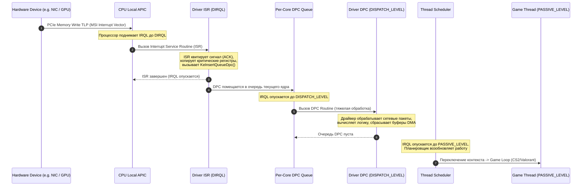

# ГЛАВА 3: DPC/ISR LATENCY, АППАРАТНЫЕ ПРЕРЫВАНИЯ И ОПТИМИЗАЦИЯ MSI/MSI-X AFFINITY

---

## ВВЕДЕНИЕ И АКТУАЛЬНОСТЬ ДЛЯ КИБЕРСПОРТА

В соревновательных играх (CS2, Valorant, Apex Legends, Overwatch 2, Call of Duty: Warzone) плавность игрового процесса определяется не столько средним числом кадров в секунду (Average FPS), сколько **стабильностью времени кадра (Frametime consistency)** и **задержкой доставки аппаратных событий (Input-to-Photon / Click-to-Response Latency)**. 

Даже если видеокарта генерирует 500 FPS (время кадра 2.0 мс), единичный спайк системной задержки длительностью **1000–1500 мкс (1.0–1.5 мс)** на уровне ядра Windows способен полностью заблокировать цикл рендеринга игры или поток опроса мыши. В результате игрок сталкивается с:
* Микростаттерами (Micro-stutters) и резкими просадками 1% и 0.1% Low FPS.
* Пропуском или задержкой ввода (Input lag, "ватная" мышь, рассинхронизация прицела).
* Аудио-дропаутами (треск, щелчки, искажение позиционирования звука в критических игровых моментах).

Корнем этих проблем практически всегда является подсистема **обработки аппаратных прерываний: механизм ISR (Interrupt Service Routine) и DPC (Deferred Procedure Call)**. 

В данной главе детально разбирается физика и логика прерываний в архитектуре x86-64/Windows NT, аппаратные механизмы APIC/MSI-X, причины деградации производительности в популярных драйверах (`nvlddmkm.sys`, `ndis.sys`, `dxgkrnl.sys`, `storport.sys`, `wdf01000.sys`, `HDAudBus.sys`, `acpi.sys`), а также пошаговая методология оптимизации распределения прерываний (Interrupt Affinity) и режимов передачи сигналов (MSI/MSI-X).

---

## 1. АРХИТЕКТУРА ПРЕРЫВАНИЙ В WINDOWS (LOW-LEVEL OS MECHANICS)

### 1.1. Аппаратный уровень: от физического пина до шины PCIe

Аппаратное устройство (видеокарта, сетевая карта, NVMe SSD, USB-контроллер) не может самостоятельно изменять память пользовательского приложения. Когда устройство завершает операцию (например, сетевой адаптер принял Ethernet-кадр в буфер DMA, или GPU отрисовал буфер кадров), оно обязано уведомить центральный процессор (CPU).

Существует два принципиально разных метода доставки этого сигнала:
1. **Legacy Pin-Based Interrupts (INTx / Line-Based IRQ):**
   * Физические электрические линии на материнской плате (`INTA#`, `INTB#`, `INTC#`, `INTD#`), подключенные к контроллеру прерываний (IO-APIC / 8259 PIC).
   * Когда устройству нужно прервать CPU, оно переводит линию в низкий уровень напряжения (Level-triggered).
   * **Проблема разделения линий (IRQ Sharing):** Количество линий физически ограничено (в архитектуре PC их обычно от 16 до 24). Если на одной линии IRQ 16 висят видеокарта, контроллер USB и контроллер SATA, при любом сигнале операционная система вынуждена последовательно опрашивать драйверы *всех* трех устройств, чтобы выяснить, кто из них сгенерировал прерывание. Это порождает критический оверхед.
2. **Message Signaled Interrupts (MSI / MSI-X):**
   * Механизм, появившийся в стандарте PCI 2.2 и ставший обязательным фундаментом PCI Express (PCIe).
   * Прерывание не использует выделенные провода. Вместо этого устройство генерирует стандартную **операцию записи в память (Memory Write TLP — Transaction Layer Packet)** по зарезервированному аппаратному адресу контроллера прерываний процессора (Local APIC): `0xFEE00000 + (Destination_ID << 12)`.
   * Пакет содержит 32-битный адрес и 16-битные данные, кодирующие уникальный **вектор прерывания**.
   * Local APIC ядра CPU перехватывает эту запись на шине и мгновенно активирует прерывание нужного вектора без какого-либо опроса посторонних устройств.

```
+-------------------------------------------------------------------------------+
|                       СРАВНЕНИЕ МЕХАНИЗМОВ ПРЕРЫВАНИЙ                         |
+-------------------------------------------------------------------------------+
| Характеристика          | Legacy Line-Based (INTx)   | MSI / MSI-X (PCIe)     |
+-------------------------+----------------------------+------------------------+
| Физическая среда        | Выделенные линии (провода) | Пакеты PCIe TLP (DMA)  |
| Разделение IRQ (Sharing)| ДА (высокий оверхед)       | НЕТ (у каждого свой ID)|
| Число векторов на девайс| 1 вектор                   | MSI: до 32, MSI-X: 2048|
| Адресация конкретных CPU| Ограничена IO-APIC         | Прямая в LAPIC ядра    |
| Аппаратная задержка     | Высокая (опрос шины)       | Минимальная (Direct)   |
| Состояние гонки (Race)  | Возможно (синхронизация)   | Исключено (In-order)   |
+-------------------------+----------------------------+------------------------+
```

---

### 1.2. Иерархия уровней приоритета прерываний Windows (IRQL Hierarchy)

Ядро Windows NT управляет аппаратным и программным приоритетом выполнения кода через механизм **IRQL (Interrupt Request Level)**. Не путайте IRQL с приоритетами потоков планировщика (Thread Priorities 0–31): IRQL — это аппаратный/низкоуровневый фильтр процессора.

Код, выполняющийся на более высоком IRQL, **мгновенно и безусловно вытесняет (preempts)** код, работающий на более низком IRQL на данном процессорном ядре.

```
       УРОВНИ IRQL В WINDOWS x86_64
  ▲
  │  HIGH_LEVEL (31 / 15)       -- Machine Check, NMI, аппаратная паника
  │  POWER_LEVEL / IPI_LEVEL    -- Межпроцессорные прерывания (Inter-Processor Interrupt)
  │  CLOCK_LEVEL                -- Аппаратный таймер платформы (System Clock Timer)
  │  PROFILE_LEVEL              -- Профайлер ядра (Performance Counters)
  │  DIRQL (Device IRQL 3..26)  -- ISR драйверов устройств (GPU, NIC, NVMe, USB)
  │  DISPATCH_LEVEL / DPC (2)   -- Выполнение DPC, планировщик потоков (Dispatcher)
  │  APC_LEVEL (1)              -- Асинхронные вызовы процедур, Page Faults
  │  PASSIVE_LEVEL (0)          -- Все пользовательские потоки (игры, службы, DWM)
  ▼
```

#### Ключевые свойства уровней IRQL:
1. **PASSIVE_LEVEL (0):**
   * Нормальное состояние выполнения пользовательских процессов (`cs2.exe`, `Discord.exe`, `dwm.exe`) и большинства системных потоков ядра.
   * Доступны все функции ОС, разрешена подкачка страниц памяти (Page Faults разрешены), потоки управляются планировщиком Windows по квантам времени.
2. **APC_LEVEL (1):**
   * Используется для доставки асинхронных вызовов процедур (например, завершение операций ввода-вывода I/O Completion).
3. **DISPATCH_LEVEL (2) / DPC Level:**
   * **Критический уровень для игровой производительности!**
   * На этом уровне работает диспетчер планировщика ядра (Thread Dispatcher) и выполняются процедуры DPC.
   * **Правила DISPATCH_LEVEL:**
     * Планировщик потоков **ОСТАНОВЛЕН**. Ни один пользовательский поток (даже с приоритетом `Realtime` / Priority 31) не может выполниться на этом ядре, пока не очистится очередь DPC!
     * Запрещено обращение к выгружаемой памяти (Paging). Любой Page Fault на DISPATCH_LEVEL приводит к немедленному синему экрану (`BSOD: DRIVER_IRQL_NOT_LESS_OR_EQUAL` или `PAGE_FAULT_IN_NONPAGED_AREA`).
     * Запрещены любые блокирующие операции ожидания (например, `KeWaitForSingleObject` с ненулевым таймаутом).
4. **DIRQL (Device IRQL, уровни 3–26 / 3–31):**
   * Уровень выполнения ISR (Interrupt Service Routine) конкретных аппаратных устройств.
   * Блокирует все прерывания того же или более низкого приоритета на текущем ядре.

---

### 1.3. Жизненный цикл аппаратного прерывания: от сигнала до игрового кадра

Чтобы понять, как драйвер вызывает задержку ввода, проследим пошаговый путь аппаратного события в архитектуре Windows:



#### Этап 1: Аппаратный сигнал и вызов ISR (DIRQL)
1. Устройство отправляет MSI TLP пакет по шине PCIe.
2. Встроенный в ядро CPU контроллер Local APIC принимает вектор, приостанавливает текущую инструкцию процессора, сохраняет регистры контекста и поднимает IRQL ядра до соответствующего `DIRQL`.
3. Ядро Windows вызывает зарегистрированную функцию драйвера — **ISR (Interrupt Service Routine)**.
4. **Архитектурное требование к ISR:** ISR обязан выполняться в течение считанных микросекунд (**< 10–20 мкс**). Он должен:
   * Быстро квитировать (Acknowledge) прерывание в регистрах устройства, чтобы контроллер снял сигнал.
   * Сохранить минимально необходимое состояние в память (Non-Paged Pool).
   * Запросить отложенную процедуру DPC через вызов ядра `IoRequestDpc` или `KeInsertQueueDpc`.
   * Вернуть значение `TRUE` и завершиться.

#### Этап 2: Помещение в очередь DPC и выполнение на DISPATCH_LEVEL
1. Функция `KeInsertQueueDpc` помещает объект `KDPC` в локальную очередь прерываний ядра (**Per-Core DPC Queue** структуры `KPRCB`).
2. Процессор опускает IRQL с `DIRQL` до `DISPATCH_LEVEL` (2).
3. Ядро Windows начинает обработку очереди DPC. Вызывается функция драйвера `CustomDpc` / `DpcRoutine`.
4. На уровне DPC драйвер выполняет основную "тяжелую" вычислительную работу:
   * Распаковка сетевых пакетов TCP/IP / NDIS.
   * Синхронизация буферов кадра NVIDIA / AMD и управление Flip Queue.
   * Обработка дисковых транзакций NVMe/SATA.
   * Пересчет аудио-буферов.

#### Этап 3: Возврат на PASSIVE_LEVEL и планирование потоков
1. Когда очередь DPC на ядре полностью опустошена, IRQL ядра опускается до `PASSIVE_LEVEL` (0).
2. Диспетчер потоков ядра (Thread Dispatcher) производит Context Switch и передает квант процессорного времени главному потоку игры (`cs2.exe`, поток рендеринга DirectX/Vulkan).

---

### 1.4. Анатомия "Latency Spike" и механизм разрушения 0.1% Low FPS

Почему плохо написанный драйвер или неоптимальная конфигурация прерываний ломает киберспортивный геймплей:

1. **Монополизация ядра на DISPATCH_LEVEL:**
   * В архитектуре Windows процедуры DPC не квантуются жестким тайм-аутом. Если драйвер видеокарты (`nvlddmkm.sys`) или сетевой карты (`ndis.sys`) зависает в цикле обработки на **1500 мкс (1.5 мс)**, процессор **НЕ МОЖЕТ** переключиться на поток игры.
2. **Блокировка отрисовки кадра (Frame Drop):**
   * При частоте обновления монитора 240 Гц бюджет времени одного кадра составляет **4.16 мс** (при 360 Гц — **2.77 мс**, при 540 Гц — **1.85 мс**).
   * Если DPC-рутина драйвера занимает 1.5 мс, игра физически не успевает сформировать командный буфер DirectX/Vulkan к моменту V-Blank / Present. Происходит потеря тайминга, кадр задерживается, на графике Frametime возникает резкий пик (Spike), а игрок видит микрофриз.
3. **Разрушение опроса мыши (Polling Rate Jitter):**
   * Мышь с частотой 1000 Гц отправляет пакет каждые 1.0 мс; мышь с 4000 Гц — каждые 0.25 мс (250 мкс); мышь с 8000 Гц — каждые 0.125 мс (125 мкс).
   * Если USB-контроллер или системный DPC застревает на 500–1000 мкс, пакеты координат мыши накапливаются в буфере. Когда DPC завершается, игра получает сразу пачку накопившихся пакетов ("пакетный взрыв"). Прицел совершает неестественный рывок, мышечная память игрока нарушается.

---

## 2. АНАЛИЗ ЗАДЕРЖЕК В LATENCYMON: ДИАГНОСТИКА И ПРОБЛЕМНЫЕ ДРАЙВЕРЫ

### 2.1. Внутреннее устройство LatencyMon и интерпретация метрик

Программа **LatencyMon** (от компании Resplendence Software) использует специальный драйвер режима ядра (`latencymon.sys` / `rspndr.sys`) и механизм высокоточных аппаратных таймеров (`KeQueryPerformanceCounter` / RDTSC), чтобы измерять время, проводимое системой в прерываниях.

```
+---------------------------------------------------------------------------------------+
|                             ОСНОВНЫЕ МЕТРИКИ LATENCYMON                               |
+---------------------------------------------------------------------------------------+
| Метрика                                    | Физический смысл                         |
+--------------------------------------------+------------------------------------------+
| Highest reported DPC routine execution     | Максимальная длительность одиночного     |
| time (µs)                                  | вызова DPC конкретного драйвера.         |
+--------------------------------------------+------------------------------------------+
| Highest reported ISR routine execution     | Максимальная длительность первичного     |
| time (µs)                                  | обработчика ISR на уровне DIRQL.         |
+--------------------------------------------+------------------------------------------+
| Highest measured interrupt to process      | Время между возникновением прерывания и  |
| latency (µs)                               | моментом возврата управления потоку.     |
+--------------------------------------------+------------------------------------------+
| Hard pagefault resolution time (µs)        | Время подкачки страницы памяти с диска.  |
+--------------------------------------------+------------------------------------------+
| Total DPC count / Total ISR count          | Суммарная частота прерываний устройства. |
+--------------------------------------------+------------------------------------------+
```

#### Градации системной задержки (DPC Latency Tier List):

* **< 30 мкс (Идеально / Киберспорт Элитный класс):**
  * Полностью оптимизированная система с настроенным MSI-X, изоляцией прерываний, отключенным троттлингом C-States и кастомным профилем питания. Время кадра монолитно.
* **30 – 100 мкс (Отлично / Турнирный стандарт):**
  * Чистая система без конфликтов драйверов. Отсутствуют ощутимые задержки ввода.
* **100 – 350 мкс (Удовлетворительно / Стандартная Windows 10/11):**
  * Типичная "коробочная" Windows с включенным энергосбережением PCIe, стандартными драйверами и динамическим троттлингом процессора.
* **> 500 мкс (Неудовлетворительно):**
  * Заметный джиттер мыши, просадки 0.1% Low в соревновательных играх при 240+ FPS.
* **> 1000 мкс (1.0 мс) (Критический уровень):**
  * Аудио-дропауты, явные фризы, срывы сенсора мыши при высоких частотах опроса (1000–8000 Гц).

---

### 2.2. Исчерпывающий разбор "Offending Drivers" (Проблемных драйверов)

#### 1. `nvlddmkm.sys` (NVIDIA Windows Kernel Mode Driver)
* **Причины высоких задержек:**
  1. **PowerMizer P-States:** По умолчанию видеокарта постоянно меняет промежуточные состояния питания (P0 / P2 / P5 / P8) в моменты смены 2D/3D нагрузки. Переключение PLL частот GPU вызывает резкий DPC Spike длительностью до **800–1200 мкс**.
  2. **HDCP (High-bandwidth Digital Content Protection) Polling:** Фоновый опрос криптографической защиты монитора.
  3. **NVIDIA HD Audio & USB-C Controller:** Встроенный в видеокарту аудиоконтроллер часто делит одну аппаратную очередь с графическим ядром, вызывая взаимные блокировки.
* **Методы оптимизации:**
  * Включение **MSI Mode** с приоритетом `High` для видеокарты.
  * Установка режима управления электропитанием: *"Предпочтителен режим максимальной производительности"* в NVIDIA Control Panel (фиксация P0 state).
  * Отключение устройства *High Definition Audio Controller* (привязанного к видеокарте), если звук выводится через отдельный ЦАП/Realtek/USB.

#### 2. `ndis.sys` / `e1d68x64.sys` (Intel) / `rt640x64.sys` (Realtek) / `e2xw10.sys` (Killer)
* **Причины высоких задержек:**
  1. **Interrupt Moderation (Модерация прерываний):** Сетевая карта задерживает прерывание, ожидая накопления пачки пакетов для экономии CPU. Это снижает общую нагрузку на процессор, но создает задержку доставки каждого отдельного пакета (Packet Latency Jitter).
  2. **Energy Efficient Ethernet (EEE) / Green Ethernet:** Уход физического уровня сетевого чипа (PHY) в энергосбережение между получением пакетов.
  3. **Receive Side Scaling (RSS) Misconfiguration:** Обработка очередей входящего сетевого трафика на ядре CPU 0, где одновременно работает игра.
* **Методы оптимизации:**
  * Отключение *Energy Efficient Ethernet*, *Green Ethernet*, *Gigabit Lite*.
  * Тонкая настройка *Interrupt Moderation Rate* (выставление в `Off` или `Low` в зависимости от мощности CPU).
  * Включение MSI/MSI-X и перенос RSS очередей на неигровые ядра.

#### 3. `dxgkrnl.sys` (DirectX Graphics Kernel Subsystem)
* **Причины высоких задержек:**
  1. **MPO (Multiplane Overlay):** Аппаратное наложение плоскостей рабочего стола, вызывающее сбои синхронизации DWM при несоответствии частот обновления мониторов.
  2. **TDR (Timeout Detection and Recovery):** Диспетчер мониторинга зависания видеочипа.
  3. **Неправильная работа HAGS (Hardware Accelerated GPU Scheduling)** на старых поколениях GPU.
* **Методы оптимизации:**
  * Отключение MPO через реестр (`OverlayTestMode = 5`).
  * Настройка квантов диспетчера и оптимизация DirectFlip presentation model.

#### 4. `storport.sys` / `stornvme.sys` (Storage Port Driver & Native NVMe Driver)
* **Причины высоких задержек:**
  1. **APST (Autonomous Power State Transitions):** Агрессивный переход NVMe накопителя в состояния энергосбережения (PS1, PS2, PS3, PS4). Выход из глубокого сна PS4 занимает до **10–50 мс**, вызывая глухой фриз при подгрузке текстуры в игре.
  2. **StorPort Idle Power Management:** Засыпание шины контроллера хранения данных.
* **Методы оптимизации:**
  * Отключение APST через реестр и Powercfg.
  * Отключение `EnableIdlePowerManagement` в драйвере StorPort.

#### 5. `wdf01000.sys` (Windows Driver Framework - KMDF)
* **Причины высоких задержек:**
  * Является системным драйвером-оберткой ядра. Сам по себе `wdf01000.sys` не генерирует задержку — он исполняет код сторонних драйверов, написанных на KMDF.
  * Чаще всего под ним скрываются: софт для управления RGB-подсветкой (iCUE, Armory Crate, Razer Synapse), кастомные драйверы мышей и античиты.
* **Методы оптимизации:**
  * Удаление сторонних RGB/вендорных служб.
  * Разгрузка шины USB (отключение виртуальных USB-хабов).

#### 6. `HDAudBus.sys` / `audiodg.sys` (High Definition Audio Bus Driver)
* **Причины высоких задержек:**
  * Конфликт буферизации MMCSS (Multimedia Class Scheduler Service) и задержки цифрового тракта Realtek HD Audio при частотах 44.1/48/96/192 кГц.
* **Методы оптимизации:**
  * Перевод звукового контроллера в MSI Mode.
  * Изоляция процесса `audiodg.exe` на выделенное ядро с приоритетом Realtime и отключением звуковых эффектов (Audio Enhancements).

#### 7. `acpi.sys` (Advanced Configuration and Power Interface)
* **Причины высоких задержек:**
  1. **C-State Package Transitions:** Процессор засыпает при отсутствии нагрузки (C1E, C6, C8, C10). Задержка пробуждения ядра (C-State Exit Latency) составляет от **20 до 150 мкс**.
  2. **Опрос батарей и температурных зон ACPI:** Постоянные аппаратные запросы через медленную шину SMBus/EC (Embedded Controller).
* **Методы оптимизации:**
  * Фиксация C-States в BIOS (отключение C-States / C-States Demotion / Package C-State) или тонкая настройка параметров питания через powercfg.
  * Использование оптимизированного плана питания с запретом глубоких состояний сна ядер.

---

## 3. MESSAGE SIGNALED INTERRUPTS (MSI / MSI-X) ПРОТИВ LINE-BASED (INTx)

### 3.1. Архитектурные преимущества MSI/MSI-X

MSI (Message Signaled Interrupts) и MSI-X — это фундаментальное улучшение интерфейса прерываний шины PCI Express.

```
       АРХИТЕКТУРА ДОСТАВКИ ПРЕРЫВАНИЙ В СИСТЕМЕ
       
   [ Legacy INTx ]                                [ MSI / MSI-X ]
+-------------------+                          +-------------------+
|  PCIe Устройство  |                          |  PCIe Устройство  |
+---------+---------+                          +---------+---------+
          | Физическая линия (Pin)                       | Пакет PCIe TLP
          ▼                                              | (Direct Memory Write)
+-------------------+                                    |
|   Чипсет IO-APIC  |                                    |
+---------+---------+                                    |
          | Трансляция прерывания                        |
          ▼                                              ▼
+------------------------------------------------------------------+
|                    Системная шина (PCIe Fabric)                  |
+---------------------------------+--------------------------------+
                                  |
                                  ▼
                   +-----------------------------+
                   |   Local APIC (Ядро CPU)     |
                   +-----------------------------+
```

#### Почему перевод устройств в MSI Mode критически важен:
1. **Устранение разделяемых прерываний (No Shared IRQ):**
   * В режиме Legacy IRQ устройства получают номера от IRQ 1 до IRQ 23. Из-за нехватки линий видеокарта часто делит IRQ 16 с контроллером USB 3.0 и сетевой картой.
   * В режиме MSI устройство получает **отрицательный номер прерывания** в диспетчере устройств (например, `IRQ -4` или `IRQ -12`), что означает эксклюзивный 32-битный вектор в адресном пространстве Local APIC.
2. **Исключение состояния гонки (No Latency Race Conditions):**
   * При передаче DMA-данных в режиме Legacy прерывание по проводу может прийти в CPU раньше, чем данные из буфера PCIe физически дойдут до оперативной памяти. Драйверу приходится делать холостые циклы ожидания (Flush Read).
   * В режиме MSI запись вектора прерывания в память идет **тем же путем**, что и данные DMA (In-order Delivery). Когда CPU получает вектор прерывания, данные гарантированно уже находятся в ОЗУ!
3. **Поддержка многовекторности (Multi-Vector / MSI-X):**
   * Стандартный MSI поддерживает до 32 векторов.
   * MSI-X поддерживает до **2048 независимых векторов прерываний**, позволяя современным сетевым картам (Intel I225/I226, Realtek RTL8125 2.5GbE) и NVMe контроллерам распределять входящие очереди строго по отдельным физическим ядрам процессора.

---

### 3.2. Внутренности реестра Windows для управления MSI

В Windows конфигурация MSI для каждого конкретного PCI-устройства хранится в системном реестре в ветке перечислителя PnP (Plug and Play):

**Путь к параметрам MSI:**
```text
HKEY_LOCAL_MACHINE\SYSTEM\CurrentControlSet\Enum\PCI\<DEVICE_ID>\<INSTANCE_ID>\Device Parameters\Interrupt Management\MessageSignaledInterruptProperties
```

#### Ключевые параметры реестра:
* **`MSISupported` (REG_DWORD):**
  * `0` = Режим MSI отключен. Устройство принудительно работает в Legacy Line-Based IRQ.
  * `1` = Режим MSI включен. Устройство генерирует PCIe Memory Write TLP прерывания.
* **`MessageNumberLimit` (REG_DWORD):**
  * Лимит количества векторов прерываний, выделяемых устройству.
  * По умолчанию для видеокарт: `1` или `4` (в зависимости от драйвера).
  * Для многоочередных сетевых карт и NVMe SSD: от `4` до `64`.

---

### 3.3. Разбор утилиты MSI Utility v3 и параметра DevicePriority

Утилита **MSI Utility v3** (созданная сообществом Guru3D/Calypto) является стандартным инструментом визуального контроля и редактирования параметров MSI.

Один из важнейших параметров в утилите — выпадающий список **Interrupt Priority (DevicePriority)**.

**Путь в реестре:**
```text
HKEY_LOCAL_MACHINE\SYSTEM\CurrentControlSet\Enum\PCI\<DEVICE_ID>\<INSTANCE_ID>\Device Parameters\Interrupt Management\Affinity Policy
Параметр: DevicePriority (REG_DWORD)
```

```
+-------------------------------------------------------------------------------+
|                       ЗНАЧЕНИЯ ПАРАМЕТРА DEVICEPRIORITY                       |
+-------------------------------------------------------------------------------+
| Значение (Hex/Dec) | Название в MSI Utility | Поведение ядра Windows          |
+--------------------+------------------------+---------------------------------+
| 0x00000000 (0)     | Undefined              | Стандартный приоритет драйвера  |
| 0x00000001 (1)     | Low                    | Низкий приоритет DIRQL          |
| 0x00000002 (2)     | Normal                 | Средний (нормальный) приоритет  |
| 0x00000003 (3)     | High                   | Наивысший приоритет DIRQL       |
+--------------------+------------------------+---------------------------------+
```

#### Механика работы DevicePriority:
В архитектуре ядра Windows NT и x86 Local APIC каждый вектор прерывания имеет приоритет, определяемый старшими битами номера вектора прерывания (от 32 до 255).
Когда параметр `DevicePriority` установлен в `3 (High)`, ядро Windows при инициализации IRP-требований выделяет устройству **более высокий номер вектора прерывания** (ближе к верхним границам DIRQL). 

Это означает:
* Если на одном ядре CPU одновременно возникают прерывания от видеокарты (High) и накопителя SATA (Normal), Local APIC первым вызовет ISR видеокарты.
* ISR устройства с приоритетом High может вытеснить выполнение ISR устройства с приоритетом Normal/Low.

> [!WARNING]
> **КРИТИЧЕСКАЯ ОШИБКА: "Выставление High Priority на ВСЕ устройства"**
> 
> Популярное в интернете заблуждение гласит: *"Открой MSI Utility и поставь High на все строчки подряд"*.
> **Это грубая архитектурная ошибка!**
> Если все устройства имеют одинаковый приоритет High, механизм приоритезации теряет всякий физический смысл. Более того, это создает проблему **инверсии приоритетов (Priority Inversion)** и вызывает голодание критических очередей ядра (DPC Starvation).
> 
> **Золотое правило настройки приоритетов:**
> * **GPU (NVIDIA / AMD):** `High` (минимальная задержка вывода кадра).
> * **Сетевая карта (Ethernet NIC):** `High` (при игре по кабелю) или `Normal`.
> * **NVMe Controller:** `High` или `Normal`.
> * **USB Host Controller:** `Undefined` или `Normal` (избегайте High, чтобы сбои в USB-периферии не вешали GPU).
> * **HD Audio Controller:** `Undefined` или `Normal` (никогда не ставьте High!).
> * **Все остальные системные мосты/контроллеры:** `Undefined`.

---

## 4. АФФИНИТИ ПРЕРЫВАНИЙ И ИЗОЛЯЦИЯ ЯДЕР (INTERRUPT AFFINITY & CORE ISOLATION)

### 4.1. Проблема "Core 0 Bottleneck"

По умолчанию операционная система Windows распределяет системные аппаратные прерывания по алгоритму балансировки, в котором подавляющее большинство нераспределенных прерываний, DPC аппаратного системного таймера (System Clock) и фоновых служб ядра направляются на **Core 0 (Логический процессор 0 и 1)**.

Если игрок запускает соревновательную игру (CS2, Valorant), и главный игровой поток (Game Main Thread) или поток рендеринга DWM попадает на Core 0, возникает тяжелый конфликт ресурсов:
1. Игровой поток исполняет критический цикл обработки физики и интерполяции.
2. Сетевая карта получает пачку пакетов и бомбардирует Core 0 прерываниями DIRQL.
3. Процессор вынужден непрерывно сбрасывать конвейер инструкций, инвалидировать кэш первого уровня (L1 Instruction / L1 Data Cache) и переключаться на ISR/DPC драйверов.
4. Результат: резкие спайки Frametime, потеря кадров и плавающий отклик сенсора мыши.

```
                  ПРОБЛЕМА CORE 0 BOTTLENECK (СТОКОВАЯ СИСТЕМА)
+---------------------------------------------------------------------------------+
| CORE 0 (CPU 0 / 1) [ПЕРЕГРУЖЕНО]         | CORE 2..N [ПРОСТАИВАЕТ]              |
+------------------------------------------+--------------------------------------+
| - System Clock DPC                       | - Второстепенные потоки              |
| - GPU ISR / DPC (nvlddmkm.sys)           | - Worker threads игры                |
| - NIC ISR / DPC (ndis.sys)               |                                      |
| - NVMe I/O ISR                           |                                      |
| - DWM Composition Thread                 |                                      |
| - CS2 Main Game Loop Thread <--- КОНФЛИКТ!|                                     |
+------------------------------------------+--------------------------------------+
```

---

### 4.2. Топология процессоров и стратегии изоляции прерываний

Для идеальной производительности прерывания критических устройств (видеокарта, сетевая карта, дисковый контроллер) должны быть **жестко разнесены по отдельным физическим ядрам**, полностью освобождая ядра, на которых работает игра.

#### 1. Особенности архитектуры AMD Ryzen (Zen 3 / Zen 4 / Zen 5 / X3D)
* **Single CCD (Ryzen 5 5600X, 7600X, Ryzen 7 5700X, 5800X3D, 7800X3D, 9800X3D):**
  * Все 8 физических ядер делят общий монолитный L3-кэш (32 МБ или 96 МБ с 3D V-Cache).
  * **Стратегия:**
    * Core 0 (CPU 0/1): Системные таймеры, ОС, фоновые службы.
    * Core 1 (CPU 2/3): Прерывания GPU (`nvlddmkm.sys`).
    * Core 2 (CPU 4/5): Прерывания Сети (Ethernet NIC / RSS Queues).
    * Core 3..7 (CPU 6..15): Чистые ядра для игры (`cs2.exe`, `valorant.exe`) с нулевым прерыванием от периферии.
* **Dual CCD (Ryzen 9 5900X, 5950X, 7900X, 7950X, 7900X3D, 7950X3D):**
  * Межъядерный обмен между CCD0 и CCD1 через шину Infinity Fabric вносит штраф задержки **60–80 нс**.
  * Для моделей X3D: CCD0 имеет 3D V-Cache (быстрый для игр), CCD1 — стандартный частотный.
  * **Стратегия:** Все прерывания устройств (GPU, NIC, NVMe, USB) направляются строго на **CCD1 (Frequency Cores / Вторые 6–8 ядер)**, а **CCD0 (V-Cache)** отдается эксклюзивно под игровой процесс.

#### 2. Особенности архитектуры Intel (12th / 13th / 14th Gen & Core Ultra)
* **P-Cores (Performance) vs E-Cores (Efficient):**
  * E-ядра имеют более низкую тактовую частоту, не имеют Hyper-Threading и объединены в кластеры с общим L2-кэшем.
  * **Опасность:** Вынос DPC/ISR сетевой карты или GPU на E-Cores часто приводит к задержкам из-за низкой однопоточной производительности E-ядер и задержек кольцевой шины (Ring Bus Latency).
  * **Стратегия:** Изолируйте прерывания на младших **физических P-ядрах** (например, P-Core 1 и P-Core 2), оставляя P-Core 3..N и E-ядра для игрового движка и фонового софта (Discord, OBS).

---

### 4.3. Параметры реестра Affinity Policy и расчет масок KAFFINITY

Внутренняя политика привязки прерываний настраивается в реестре по следующему пути:

```text
HKEY_LOCAL_MACHINE\SYSTEM\CurrentControlSet\Enum\PCI\<DEVICE_ID>\<INSTANCE_ID>\Device Parameters\Interrupt Management\Affinity Policy
```

#### Ключевые параметры Affinity Policy:
1. **`DevicePolicy` (REG_DWORD):**
   * `0x00000000` (`IrqPolicyMachineDefault`) — Автоматический выбор ядра операционной системой.
   * `0x00000001` (`IrqPolicyAllCloseProcessors`) — Все близкие процессоры.
   * `0x00000002` (`IrqPolicyOneCloseProcessor`) — Один ближайший процессор к шине устройства.
   * `0x00000003` (`IrqPolicyAllProcessorsInMachine`) — Все процессоры в системе.
   * **`0x00000004` (`IrqPolicySpecifiedProcessors`)** — **Жесткая фиксация на процессорах, заданных маской `AssignmentSetOverride`**.
   * `0x00000005` (`IrqPolicySpreadMessagesAcrossAllProcessors`) — Равномерное распределение сообщений MSI по ядрам.
2. **`AssignmentSetOverride` (REG_BINARY или REG_DWORD / REG_QWORD):**
   * Задает битовую маску процессоров (**KAFFINITY bitmask**) в формате Little-Endian.
   * Каждый бит соответствует логическому процессору в системе (CPU 0 = Бит 0, CPU 1 = Бит 1, CPU 2 = Бит 2 и т.д.).

```
           ТАБЛИЦА РАСЧЕТА БИТОВЫХ МАСОК (KAFFINITY MASK)
+-------------------------------------------------------------------------------+
| Номер ядра (Core / Thread) | Двоичный вид (Binary) | Hex Mask (DWORD) | Hex LE (REG_BINARY)|
+----------------------------+-----------------------+------------------+--------------------+
| CPU 0 (Core 0 Thread 0)    | 0000 0000 0000 0001   | 0x00000001       | 01 00 00 00        |
| CPU 1 (Core 0 Thread 1)    | 0000 0000 0000 0010   | 0x00000002       | 02 00 00 00        |
| CPU 2 (Core 1 Thread 0)    | 0000 0000 0000 0100   | 0x00000004       | 04 00 00 00        |
| CPU 3 (Core 1 Thread 1)    | 0000 0000 0000 1000   | 0x00000008       | 08 00 00 00        |
| CPU 4 (Core 2 Thread 0)    | 0000 0000 0001 0000   | 0x00000010       | 10 00 00 00        |
| CPU 5 (Core 2 Thread 1)    | 0000 0000 0010 0000   | 0x00000020       | 20 00 00 00        |
| CPU 6 (Core 3 Thread 0)    | 0000 0000 0100 0000   | 0x00000040       | 40 00 00 00        |
| CPU 7 (Core 3 Thread 1)    | 0000 0000 1000 0000   | 0x00000080       | 80 00 00 00        |
| CPU 2 + CPU 3 (Весь Core 1)| 0000 0000 0000 1100   | 0x0000000C       | 0C 00 00 00        |
| CPU 4 + CPU 5 (Весь Core 2)| 0000 0000 0011 0000   | 0x00000030       | 30 00 00 00        |
+----------------------------+-----------------------+------------------+--------------------+
```

---

### 4.4. Утилиты настройки: IntFilter и GoInterruptPolicy

Для настройки аффинити прерываний на практике используются специализированные утилиты:

1. **Microsoft Interrupt Affinity Tool (`intfilter.exe` / `intaffinity.exe`):**
   * Официальная утилита из Microsoft Windows Driver Kit (WDK).
   * Позволяет выбрать PCI устройство и графически расставить чекбоксы на целевых ядрах процессора.
2. **GoInterruptPolicy (by Melodii / Calypto community):**
   * Современная утилита с открытым исходным кодом, позволяющая массово задавать `DevicePolicy = 4` и маски `AssignmentSetOverride` без ручного редактирования длинных путей реестра.

---

## 5. ОПТИМИЗАЦИЯ DPC ДИСКОВОЙ ПОДСИСТЕМЫ (STORPORT & NVME)

Дисковый стек Windows, управляемый драйверами `storport.sys` и `stornvme.sys`, традиционно ориентирован на максимальное энергосбережение в ноутбуках. На настольном киберспортивном ПК эти настройки вызывают скрытые задержки ввода-вывода (I/O Latency Spikes).

### 5.1. Отключение StorPort Idle Power Management

Драйвер `storport.sys` переводит контроллеры накопителей в состояние пониженного энергопотребления при кратковременном отсутствии дисковых запросов. При возобновлении чтения/записи контроллер тратит сотни микросекунд на пробуждение.

**Реестр для отключения StorPort Idle:**
```text
[HKEY_LOCAL_MACHINE\SYSTEM\CurrentControlSet\Services\storport\Parameters]
"EnableIdlePowerManagement"=dword:00000000
```

---

### 5.2. Отключение автономных переходов питания NVMe (APST)

В спецификации NVMe определены состояния питания от PS0 (полная производительность) до PS4 (глубокий сон). Функция **APST (Autonomous Power State Transitions)** заставляет сам контроллер SSD засыпать без участия ОС.

**Реестр для отключения APST в Windows:**
```text
[HKEY_LOCAL_MACHINE\SYSTEM\CurrentControlSet\Services\stornvme\Parameters\Device]
"EnableAPST"=dword:00000000
"IdlePowerMode"=dword:00000000
```

---

### 5.3. Разблокировка и тюнинг параметров питания дисков через Powercfg

В схемах электропитания Windows скрыты критические параметры задержки дисков. Для их разблокировки и отключения выполните команды:

```cmd
:: Разблокировка параметров первичного и вторичного таймаута NVMe Idle
reg add "HKLM\SYSTEM\CurrentControlSet\Control\Power\PowerSettings\0012ee47-9041-4b5d-9b77-535fba8b1442\d639518a-e56d-4345-8af2-b9f32fb26109" /v Attributes /t REG_DWORD /d 2 /f
reg add "HKLM\SYSTEM\CurrentControlSet\Control\Power\PowerSettings\0012ee47-9041-4b5d-9b77-535fba8b1442\fc95af4b-4e17-4d29-9325-ebf0e5ec74fb" /v Attributes /t REG_DWORD /d 2 /f

:: Разблокировка управления питанием связи AHCI/SATA (HIPM/DIPM)
reg add "HKLM\SYSTEM\CurrentControlSet\Control\Power\PowerSettings\0012ee47-9041-4b5d-9b77-535fba8b1442\0b2d69d7-a2a1-449c-9680-f91c70521c60" /v Attributes /t REG_DWORD /d 2 /f

:: Установка таймаутов в 0 (Отключено) для текущей схемы питания
powercfg -setacvalueindex SCHEME_CURRENT 0012ee47-9041-4b5d-9b77-535fba8b1442 d639518a-e56d-4345-8af2-b9f32fb26109 0
powercfg -setacvalueindex SCHEME_CURRENT 0012ee47-9041-4b5d-9b77-535fba8b1442 fc95af4b-4e17-4d29-9325-ebf0e5ec74fb 0
powercfg -setacvalueindex SCHEME_CURRENT 0012ee47-9041-4b5d-9b77-535fba8b1442 0b2d69d7-a2a1-449c-9680-f91c70521c60 0
powercfg -setactive SCHEME_CURRENT
```

---

## 6. ПРОФЕССИОНАЛЬНЫЙ АНАЛИЗ ЧЕРЕЗ WINDOWS PERFORMANCE TOOLKIT (WPR / WPA / ETW)

Когда LatencyMon фиксирует задержку, он показывает только имя драйвера (`nvlddmkm.sys`), но не показывает, **какая именно внутренняя функция драйвера** вызвала зависание ядра. 

Для глубокой низкоуровневой трассировки используется профессиональный инструмент инженеров Microsoft — **Windows Performance Recorder (WPR)** и **Windows Performance Analyzer (WPA)** на базе механизма **ETW (Event Tracing for Windows)**.

```
+-------------------------------------------------------------------------------+
|                       WORKFLOW АНАЛИЗА DPC/ISR ЧЕРЕЗ ETW                      |
+-------------------------------------------------------------------------------+
| 1. Запись трассировки  --> wpr.exe -start CPU -start DPCISR -filemode        |
| 2. Воспроизведение     --> Играем 60 секунд в CS2 / ловим фриз                |
| 3. Остановка записи    --> wpr.exe -stop C:\trace_dpc.etl                     |
| 4. Загрузка символов   --> Подключение Microsoft Symbol Server в WPA          |
| 5. Анализ стека        --> Раскрытие DPC/ISR Usage by Module and Function     |
+-------------------------------------------------------------------------------+
```

### 6.1. Пошаговый алгоритм записи трассировки

1. Установите **Windows Performance Toolkit** (входит в состав Windows ADK).
2. Запустите командную строку (CMD) от имени Администратора.
3. Запустите кольцевую запись трассировки прерываний:
   ```cmd
   wpr -start CPU -start DPCISR -filemode
   ```
4. Запустите игру или действие, вызывающее статтер, и поиграйте **30–60 секунд**.
5. Остановите запись и сохраните лог в файл:
   ```cmd
   wpr -stop C:\DPC_Trace.etl "DPC Analysis"
   ```

---

### 6.2. Анализ данных в Windows Performance Analyzer (WPA)

1. Запустите `wpa.exe` и откройте файл `C:\DPC_Trace.etl`.
2. В меню настройте пути к отладочным символам: **Trace -> Configure Symbol Paths**.
   * Добавьте строку: `srv*C:\Symbols*https://msdl.microsoft.com/download/symbols`
   * Нажмите **Trace -> Load Symbols** (WPA загрузит точные имена функций ядра и драйверов).
3. В левой панели разверните раздел **Computation** и дважды кликните на график **DPC and ISR Usage by Module, Stack**.

```
                ПРИМЕР ТАБЛИЦЫ АНАЛИЗА ДРАЙВЕРА В WPA
+-----------------------------------------------------------------------------------------------+
| Module Name     | Function Name              | Count  | Total Time (ms) | Max Time (µs) | CPU |
+-----------------+----------------------------+--------+-----------------+---------------+-----+
| nvlddmkm.sys    | _nv012485_sub_routine      | 42,105 | 84.12           | 1,240.5       | 0   |
| ndis.sys        | ndisReceiveWorkerThread    | 18,340 | 22.40           | 450.2         | 0   |
| dxgkrnl.sys     | DxgkPresentMultiplaneOv... | 5,120  | 14.80           | 380.0         | 1   |
| ntoskrnl.exe    | KiDispatchInterrupt        | 120,400| 150.30          | 12.4          | ALL |
+-----------------------------------------------------------------------------------------------+
```

#### Что искать в отчете:
* **Max Time (µs) > 500 µs:** Вызов, ставший непосредственной причиной микрофриза.
* **CPU Column:** Если 90% времени DPC крутится на CPU 0, это прямое доказательство необходимости настройки **Interrupt Affinity** для разгрузки нулевого ядра.

---

## 7. ПРАКТИЧЕСКИЙ ГАЙД: АВТОМАТИЗАЦИЯ, РЕЕСТР И СКРИПТЫ POWERSHELL

Ниже представлен полноценный, готовый к развертыванию скрипт PowerShell, который производит автоматический аудит PCI-устройств, переводит ключевую игровую периферию (GPU, Сеть, NVMe) в режим **MSI Mode**, выставляет оптимальные приоритеты и изолирует прерывания.

### 7.1. Скрипт автоматической настройки MSI Mode и Priority (`Enable-MSI-Optimization.ps1`)

```powershell
<#
.SYNOPSIS
    Скрипт глубокой оптимизации MSI Mode, Device Priority и Interrupt Affinity.
.DESCRIPTION
    Переводит GPU, Сетевые адаптеры и NVMe SSD в режим MSI (MSISupported = 1),
    настраивает корректные приоритеты устройств и вычисляет базовую изоляцию прерываний.
#>

# Требование прав Администратора
if (-NOT ([Security.Principal.WindowsPrincipal][Security.Principal.WindowsIdentity]::GetCurrent()).IsInRole([Security.Principal.WindowsBuiltInRole]::Administrator)) {
    Write-Warning "Скрипт должен быть запущен от имени Администратора!"
    Break
}

Write-Host "==========================================================" -ForegroundColor Cyan
Write-Host "   АВТОМАТИЧЕСКАЯ НАСТРОЙКА MSI MODE И INTERRUPT POLICY   " -ForegroundColor Cyan
Write-Host "==========================================================" -ForegroundColor Cyan

# Базовый путь к устройствам PCI в реестре
$pciRoot = "HKLM:\SYSTEM\CurrentControlSet\Enum\PCI"

# Получение списка всех PCI-устройств
$pciDevices = Get-ChildItem -Path $pciRoot

# 1. ОПТИМИЗАЦИЯ ВИДЕОКАРТЫ (GPU)
Write-Host "`n[1/3] Поиск и оптимизация видеокарты (Display Controller)..." -ForegroundColor Yellow
$gpuFound = $false

foreach ($dev in $pciDevices) {
    $instances = Get-ChildItem -Path $dev.PSPath
    foreach ($inst in $instances) {
        $devClass = (Get-ItemProperty -Path $inst.PSPath -Name "Class" -ErrorAction SilentlyContinue).Class
        $devDesc = (Get-ItemProperty -Path $inst.PSPath -Name "DeviceDesc" -ErrorAction SilentlyContinue).DeviceDesc
        
        if ($devClass -eq "Display") {
            $gpuFound = $true
            $gpuPath = "$($inst.PSPath)\Device Parameters\Interrupt Management"
            
            # Создание подразделов
            New-Item -Path "$gpuPath\MessageSignaledInterruptProperties" -Force | Out-Null
            New-Item -Path "$gpuPath\Affinity Policy" -Force | Out-Null
            
            # Включение MSI Mode
            Set-ItemProperty -Path "$gpuPath\MessageSignaledInterruptProperties" -Name "MSISupported" -Value 1 -Type DWord
            Set-ItemProperty -Path "$gpuPath\MessageSignaledInterruptProperties" -Name "MessageNumberLimit" -Value 1 -Type DWord
            
            # Установка DevicePriority = High (3)
            Set-ItemProperty -Path "$gpuPath\Affinity Policy" -Name "DevicePriority" -Value 3 -Type DWord
            
            Write-Host " [+] GPU: $devDesc" -ForegroundColor Green
            Write-Host "     -> MSI Enabled (1), Limit (1), Priority: HIGH (3)" -ForegroundColor Gray
        }
    }
}

if (-not $gpuFound) { Write-Warning "Видеокарта не найдена или драйвер не инициализирован." }

# 2. ОПТИМИЗАЦИЯ СЕТЕВЫХ АДАПТЕРОВ (NIC)
Write-Host "`n[2/3] Поиск и оптимизация сетевых адаптеров (Network Cards)..." -ForegroundColor Yellow

foreach ($dev in $pciDevices) {
    $instances = Get-ChildItem -Path $dev.PSPath
    foreach ($inst in $instances) {
        $devClass = (Get-ItemProperty -Path $inst.PSPath -Name "Class" -ErrorAction SilentlyContinue).Class
        $devDesc = (Get-ItemProperty -Path $inst.PSPath -Name "DeviceDesc" -ErrorAction SilentlyContinue).DeviceDesc
        
        if ($devClass -eq "Net") {
            $nicPath = "$($inst.PSPath)\Device Parameters\Interrupt Management"
            
            New-Item -Path "$nicPath\MessageSignaledInterruptProperties" -Force | Out-Null
            New-Item -Path "$nicPath\Affinity Policy" -Force | Out-Null
            
            # Включение MSI Mode
            Set-ItemProperty -Path "$nicPath\MessageSignaledInterruptProperties" -Name "MSISupported" -Value 1 -Type DWord
            
            # Установка DevicePriority = High (3) для Ethernet
            Set-ItemProperty -Path "$nicPath\Affinity Policy" -Name "DevicePriority" -Value 3 -Type DWord
            
            Write-Host " [+] NIC: $devDesc" -ForegroundColor Green
            Write-Host "     -> MSI Enabled (1), Priority: HIGH (3)" -ForegroundColor Gray
        }
    }
}

# 3. ОПТИМИЗАЦИЯ НАКОПИТЕЛЕЙ NVME (Storage Controllers)
Write-Host "`n[3/3] Поиск и оптимизация контроллеров NVMe..." -ForegroundColor Yellow

foreach ($dev in $pciDevices) {
    $instances = Get-ChildItem -Path $dev.PSPath
    foreach ($inst in $instances) {
        $devClass = (Get-ItemProperty -Path $inst.PSPath -Name "Class" -ErrorAction SilentlyContinue).Class
        $devDesc = (Get-ItemProperty -Path $inst.PSPath -Name "DeviceDesc" -ErrorAction SilentlyContinue).DeviceDesc
        
        if ($devClass -eq "SCSIAdapter" -or $devDesc -like "*NVMe*" -or $devDesc -like "*NVM Express*") {
            $nvmePath = "$($inst.PSPath)\Device Parameters\Interrupt Management"
            
            New-Item -Path "$nvmePath\MessageSignaledInterruptProperties" -Force | Out-Null
            New-Item -Path "$nvmePath\Affinity Policy" -Force | Out-Null
            
            # Включение MSI Mode
            Set-ItemProperty -Path "$nvmePath\MessageSignaledInterruptProperties" -Name "MSISupported" -Value 1 -Type DWord
            
            # Установка DevicePriority = High (3)
            Set-ItemProperty -Path "$nvmePath\Affinity Policy" -Name "DevicePriority" -Value 3 -Type DWord
            
            Write-Host " [+] Storage: $devDesc" -ForegroundColor Green
            Write-Host "     -> MSI Enabled (1), Priority: HIGH (3)" -ForegroundColor Gray
        }
    }
}

# 4. ОТКЛЮЧЕНИЕ СТОРОННЕГО ЭНЕРГОСБЕРЕЖЕНИЯ STORPORT И APST
Write-Host "`n[+] Применение системных твиков StorPort и NVMe..." -ForegroundColor Yellow

# Storport Idle Disable
$storportPath = "HKLM:\SYSTEM\CurrentControlSet\Services\storport\Parameters"
if (-not (Test-Path $storportPath)) { New-Item -Path $storportPath -Force | Out-Null }
Set-ItemProperty -Path $storportPath -Name "EnableIdlePowerManagement" -Value 0 -Type DWord

# Stornvme APST Disable
$stornvmePath = "HKLM:\SYSTEM\CurrentControlSet\Services\stornvme\Parameters\Device"
if (-not (Test-Path $stornvmePath)) { New-Item -Path $stornvmePath -Force | Out-Null }
Set-ItemProperty -Path $stornvmePath -Name "EnableAPST" -Value 0 -Type DWord
Set-ItemProperty -Path $stornvmePath -Name "IdlePowerMode" -Value 0 -Type DWord

Write-Host "`n==========================================================" -ForegroundColor Green
Write-Host "  ОПТИМИЗАЦИЯ УСПЕШНО ЗАВЕРШЕНА! ПЕРЕЗАГРУЗИТЕ КОМПЬЮТЕР   " -ForegroundColor Green
Write-Host "==========================================================" -ForegroundColor Green
```

---

### 7.2. Скрипт отката параметров к заводским значениям (`Restore-MSI-Defaults.ps1`)

```powershell
<#
.SYNOPSIS
    Скрипт полного отката настроек MSI Mode и Affinity Policy к заводским значениям.
#>

if (-NOT ([Security.Principal.WindowsPrincipal][Security.Principal.WindowsIdentity]::GetCurrent()).IsInRole([Security.Principal.WindowsBuiltInRole]::Administrator)) {
    Write-Warning "Требуются права Администратора!"
    Break
}

Write-Host "Откат параметров MSI и DevicePriority к значениям по умолчанию..." -ForegroundColor Yellow

$pciRoot = "HKLM:\SYSTEM\CurrentControlSet\Enum\PCI"
$pciDevices = Get-ChildItem -Path $pciRoot

foreach ($dev in $pciDevices) {
    $instances = Get-ChildItem -Path $dev.PSPath
    foreach ($inst in $instances) {
        $affPath = "$($inst.PSPath)\Device Parameters\Interrupt Management\Affinity Policy"
        if (Test-Path $affPath) {
            # Удаление DevicePriority и принудительных политик
            Remove-ItemProperty -Path $affPath -Name "DevicePriority" -ErrorAction SilentlyContinue
            Remove-ItemProperty -Path $affPath -Name "DevicePolicy" -ErrorAction SilentlyContinue
            Remove-ItemProperty -Path $affPath -Name "AssignmentSetOverride" -ErrorAction SilentlyContinue
        }
    }
}

# Восстановление Storport / NVMe параметров
Remove-ItemProperty -Path "HKLM:\SYSTEM\CurrentControlSet\Services\storport\Parameters" -Name "EnableIdlePowerManagement" -ErrorAction SilentlyContinue
Remove-ItemProperty -Path "HKLM:\SYSTEM\CurrentControlSet\Services\stornvme\Parameters\Device" -Name "EnableAPST" -ErrorAction SilentlyContinue
Remove-ItemProperty -Path "HKLM:\SYSTEM\CurrentControlSet\Services\stornvme\Parameters\Device" -Name "IdlePowerMode" -ErrorAction SilentlyContinue

Write-Host "Заводские параметры восстановлены! Перезагрузите ПК." -ForegroundColor Green
```

---

## 8. МИФЫ, ПЛЕЙСБО И ОПАСНЫЕ ТВЕРЖДЕНИЯ (MYTHS & PITFALLS)

В сообществе твикинга Windows существует множество деструктивных мифов, касающихся прерываний и задержек. Разберем основные из них с технической точки зрения:

### Миф 1: "Отключение HPET (High Precision Event Timer) в Диспетчере устройств снижает DPC Latency"
* **Реальность:** Отключение физического таймера `High Precision Event Timer` в ветке *Системные устройства* (System Devices) не ускоряет ПК. В современных процессорах (Intel Core 10–14 Gen, AMD Ryzen Zen 2–5) ядро Windows по умолчанию использует аппаратный инвариантный таймер **TSC (Enhanced Invariant TSC)** с временем доступа **~12–15 нс**. 
* Отключение устройства HPET в диспетчере устройств часто приводит к тому, что драйверы чипсета и системные шины начинают сыпать ошибками обращения к ACPI таблице `HPET`, увеличивая DPC задержки и дестабилизируя тайминги кадров. 
* **Правильное действие:** Оставлять HPET включенным в Device Manager; при необходимости проверять таймер платформы командой `bcdedit /enum` (убедиться, что `useplatformclock` отключен/отсутствует).

### Миф 2: "Включение MSI Mode на старых звуковых картах или нестандартных контроллерах"
* **Реальность:** Некоторые старые звуковые карты (например, ASUS Xonar на чипе C-Media Oxygen HD / CMI8788), контроллеры FireWire и старые платы видеозахвата аппаратно не поддерживают спецификацию MSI. 
* Принудительное включение `MSISupported = 1` для таких устройств приводит к полному исчезновению звука, зависанию инициализации Windows или синему экрану (`BSOD: DPC_WATCHDOG_VIOLATION`).
* **Правильное действие:** Включать MSI Mode только на устройствах с шиной PCI Express (GPU, современные NIC, NVMe, USB 3.0/3.1/3.2 xHCI).

### Миф 3: "Привязка всех прерываний к последнему логическому потоку (SMT Thread)"
* **Реальность:** Некоторые псевдо-оптимизаторы советуют привязать прерывания сетевой карты и видеокарты к последнему виртуальному потоку (например, CPU 15 на 8-ядерном процессоре). 
* Однако в архитектурах SMT (AMD) и Hyper-Threading (Intel) поток CPU 15 делит физические исполнительные блоки (ALU, FPU), порты исполнения и кэш L1/L2 с физическим ядром CPU 14! 
* Если игра нагружает Core 7 (CPU 14), прерывания на CPU 15 будут напрямую красть такты физического ядра.
* **Правильное действие:** Привязывать прерывания к выделенному **физическому ядру (Physical Core)** целиком (маска `0x0000000C` для CPU 2+3), либо полностью освобождать данное физическое ядро от игровых потоков.

---

## 9. ИНСТРУМЕНТАРИЙ, ССЫЛКИ И ПЕРВОИСТОЧНИКИ

1. **Microsoft Learn: Interrupt Affinity and Priority**
   * Официальная документация ядра Windows Driver Kit (WDK) по управлению политиками прерываний.
   * [https://learn.microsoft.com/en-us/windows-hardware/drivers/kernel/interrupt-affinity-and-priority](https://learn.microsoft.com/en-us/windows-hardware/drivers/kernel/interrupt-affinity-and-priority)
2. **Microsoft Learn: Message-Signaled Interrupts (MSI / MSI-X)**
   * Руководство по архитектуре MSI для разработчиков драйверов PCI Express.
   * [https://learn.microsoft.com/en-us/windows-hardware/drivers/pci/message-signaled-interrupts](https://learn.microsoft.com/en-us/windows-hardware/drivers/pci/message-signaled-interrupts)
3. **Resplendence LatencyMon: Real-time Audio DPC Latency Checker**
   * Официальный сайт диагностической утилиты LatencyMon.
   * [https://www.resplendence.com/latencymon](https://www.resplendence.com/latencymon)
4. **Windows Performance Toolkit (WPR / WPA / ETW)**
   * Инструменты трассировки производительности Windows ADK.
   * [https://learn.microsoft.com/en-us/windows-hardware/test/wpt/](https://learn.microsoft.com/en-us/windows-hardware/test/wpt/)
5. **MSI Utility v3 (Guru3D Discussion & Tool Repository)**
   * Утилита управления Message Signaled Interrupts от vashserg.
   * [https://forums.guru3d.com/threads/windows-line-based-vs-message-signaled-based-interrupts-msi-tool.378044/](https://forums.guru3d.com/threads/windows-line-based-vs-message-signaled-based-interrupts-msi-tool.378044/)
6. **GoInterruptPolicy (GitHub Repository)**
   * Утилита тонкой настройки прерываний и масок аффинити.
   * [https://github.com/djdallmann/GamingPCSetup/blob/master/CONTENT/RESEARCH/INTERRUPTS/](https://github.com/djdallmann/GamingPCSetup/blob/master/CONTENT/RESEARCH/INTERRUPTS/)
7. **Windows Internals, Part 1 & Part 2 (by Pavel Yosifovich, Mark Russinovich, David Solomon, Alex Ionescu)**
   * Фундаментальное руководство по внутреннему устройству ядра Windows NT, IRQL, APIC и диспетчеру прерываний.
