# Глава 7: Архитектура мышиного ввода, оптические сенсоры, масштабирование DPI/CPI, высокочастотный опрос (1–8 kHz) и оптимизация подсистемы USB

---

## Введение и фундаментальная модель задержки ввода (Click-to-Photon)

Задержка мышиного ввода в соревновательных вычислениях и киберспорте представляет собой совокупное время между физическим воздействием игрока на манипулятор (перемещение корпуса или нажатие на микропереключатель) и отображением соответствующего изменения на пиксельной матрице дисплея. Данный сквозной интервал называется **Click-to-Photon** (или **Motion-to-Photon**) и состоит из строго последовательных аппаратно-программных этапов:

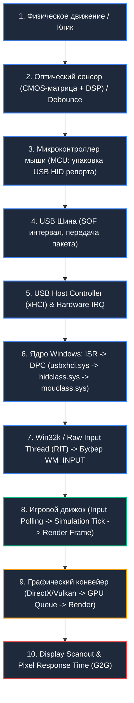

### Математическая декомпозиция суммарной задержки:
$$\tau_{\text{total}} = \tau_{\text{sensor}} + \tau_{\text{debounce}} + \tau_{\text{mcu\_proc}} + \tau_{\text{usb\_poll}} + \tau_{\text{os\_kernel}} + \tau_{\text{engine\_sync}} + \tau_{\text{render}} + \tau_{\text{scanout}} + \tau_{\text{pixel}}$$

Где:
*   $\tau_{\text{sensor}}$ — время захвата кадров матрицы, кросс-корреляции и вычисления дельты $(\Delta X, \Delta Y)$ оптическим DSP ($0.1 - 1.2 \text{ ms}$).
*   $\tau_{\text{debounce}}$ — аппаратная или алгоритмическая задержка антидребезга контактов микропереключателя ($0 \text{ ms}$ для оптических свитчей, $1 - 8 \text{ ms}$ для механических).
*   $\tau_{\text{mcu\_proc}}$ — сериализация HID-дескриптора и подготовка пакета в SRAM микроконтроллера ($0.05 - 0.2 \text{ ms}$).
*   $\tau_{\text{usb\_poll}}$ — ожидание квантованного интервала шины USB ($1.0 \text{ ms}$ при 1000 Hz, $0.125 \text{ ms}$ при 8000 Hz).
*   $\tau_{\text{os\_kernel}}$ — время обработки прерывания ISR, выполнение отложенного вызова процедуры DPC и передача через `Raw Input Thread` (RIT) в `win32k.sys` ($0.02 - 0.15 \text{ ms}$).
*   $\tau_{\text{engine\_sync}}$ — фазовый сдвиг между приходом `WM_INPUT` и фазой опроса ввода игровым циклом (`Input Tick Delay` = $0 \dots \frac{1}{\text{FPS}}$).
*   $\tau_{\text{render}}$ — время построения кадра центральным процессором и рендеринга видеокартой (Draw Calls, GPU execution, VSync queue).
*   $\tau_{\text{scanout}}$ — развертка кадра по интерфейсу DisplayPort/HDMI ($1.92 \text{ ms}$ для 540 Hz, $4.16 \text{ ms}$ для 240 Hz, $6.94 \text{ ms}$ для 144 Hz).
*   $\tau_{\text{pixel}}$ — физическое время переключения жидких кристаллов (GtG — Gray-to-Gray) или OLED-пикселей ($0.03 - 2.0 \text{ ms}$).

В данной главе подробно рассматриваются ключевые звенья цепи: от кремниевой матрицы оптического сенсора до ядра Windows и доставки сырых координат движку игры.

---

## 1. Архитектура оптических сенсоров и физика трекинга

Современная игровая мышь представляет собой сверхвысокоскоростную оптоэлектронную систему машинного зрения реального времени.

```mermaid
graph LR
    subgraph "Оптический модуль мыши"
        LED["Инфракрасный LED / Лазер (850-940 nm)"] -->|"Когерентная / диффузная подсветка"| Mat["Поверхность ковра (Микроструктура)"]
        Mat -->|"Отраженный свет"| Lens["Dual-Lens Оптическая система"]
        Lens -->|"Сфокусированное изображение"| CMOS["CMOS Матрица (36x36 / 40x40 пикселей)"]
        CMOS -->|"Сырой массив кадров (до 20000 FPS)"| DSP["DSP (Digital Signal Processor)"]
        DSP -->|"Spatial Cross-Correlation"| Delta["Дельта координат (dX, dY)"]
    end
    Delta -->|"SPI Bus (24-48 MHz)"| MCU["MCU (ARM Cortex-M4 / Nordic nRF52840/54L15)"]
```

### 1.1. Физический принцип работы: Пространственная кросс-корреляция

Оптический сенсор непрерывно освещает микроструктуру поверхности (текстуру ткани коврика, пластика или микропоры стекла) с помощью инфракрасного светодиода или лазера. Свет падает под фиксированным углом, создавая микротени от волокон.
Отраженный свет через систему линз фокусируется на кремниевой CMOS-матрице (размером, например, $36 \times 36$ или $40 \times 40$ светочувствительных элементов).

Матрица захватывает кадры с частотой от $4\,000$ до $20\,000+$ кадров в секунду (FPS). Встроенный аппаратный DSP процессор вычисляет двумерный вектор смещения между кадром $I_t(x, y)$ в момент времени $t$ и кадром $I_{t+1}(x, y)$ в момент времени $t+1$ с помощью функции нормализованной кросс-корреляции (Normalized Cross-Correlation, NCC) или суммы абсолютных разностей (Sum of Absolute Differences, SAD):

$$\text{SAD}(\Delta x, \Delta y) = \sum_{x} \sum_{y} |I_{t}(x, y) - I_{t+1}(x + \Delta x, y + \Delta y)|$$

Вектор $(\Delta x, \Delta y)$, минимизирующий функцию SAD (или максимизирующий NCC), преобразуется во внутренние отсчеты перемещения (Counts) и сохраняется в выходных регистрах аппаратного интерфейса SPI.

---

### 1.2. Сравнительный анализ архитектур сенсоров: PixArt, Focus Pro и Logitech HERO

| Параметр / Характеристика | PixArt PMW3360 | PixArt PAW3370 | PixArt PAW3395 | PixArt PAW3950 / Focus Pro 35K | Logitech HERO 25K / HERO 2 |
| :--- | :--- | :--- | :--- | :--- | :--- |
| **Год появления** | 2016 | 2020 | 2022 | 2023–2024 | 2020–2024 |
| **Максимальное разрешение (CPI/DPI)** | 12 000 | 19 000 | 26 000 | 35 000 | 25 600 / 32 000 |
| **Максимальная скорость трекинга (IPS)** | 250 IPS (~6.35 м/с) | 400 IPS (~10.16 м/с) | 650 IPS (~16.51 м/с) | 750 IPS (~19.05 м/с) | 500–650 IPS (~16.5 м/с) |
| **Предельное ускорение (Max G)** | 50 G | 50 G | 50 G | 70 G | 50 G |
| **Частота захвата кадров (FPS)** | 12 000 (адаптивная) | ~12 000 | Адаптивная до 20 000 | Адаптивная до 22 000 | Проприетарный dynamic frame rate |
| **Энергопотребление (Active Run)** | ~40 mA (проводной) | ~1.5–2.0 mA (low-power) | ~1.3–1.8 mA | ~1.2 mA | ~1.0–1.4 mA (Sub-micron CMOS) |
| **Аппаратное сглаживание (Smoothing)** | 32 фрейма выше 2000 DPI (~2 мс) | 0 сглаживания до 6400 DPI | 0 сглаживания во всем рабочем диапазоне | 0 сглаживания (Zero Smoothing) | 0 сглаживания во всем диапазоне |
| **Поддержка Motion Sync** | Отсутствует | Аппаратная | Аппаратная (On-die) | Аппаратная расширенная | Проприетарная синхронизация |
| **Высота отрыва (LOD)** | 1.5–2.0 мм (ручная настройка) | 1.0 / 2.0 мм | 1.0 / 2.0 мм + Asymmetric Cut-off | 0.7–2.0 мм (26 уровней настройки) | 1.0–1.2 мм (автокалибровка поверхности) |
| **Трекинг на прозрачном стекле** | Нет | Нет | Ограниченно (>4 мм) | Да (полноценно от 2–4 мм) | Ограниченно |

#### Глубокий анализ архитектуры семейств:
1.  **PixArt PMW3360 / PMW3389**: Легендарный проводной сенсор. Базировался на архитектуре с высоким энергопотреблением. В сенсоре присутствовало неотключаемое ступенчатое сглаживание: при DPI свыше 2000 сенсор активировал алгоритм усреднения по 32 кадрам, что вносило дополнительную задержку ~2.0 мс.
2.  **PixArt PAW3370 / PAW3395**: Переход на сверхнизкое энергопотребление (Low Power Architecture) для беспроводных устройств. PAW3395 устранил алгоритмическое сглаживание на всех стандартных DPI, внедрил аппаратный Motion Sync и поднял скорость срыва до 650 IPS, сделав физический срыв курсора невозможным даже для элитных игроков в шутерах (максимальная скорость руки человека при резком флике не превышает 5–6 м/с, что эквивалентно ~200–240 IPS).
3.  **PixArt PAW3950 (Razer Focus Pro 30K/35K)**: Эксклюзивный кастомный кремний с улучшенной оптикой, позволяющий отслеживать перемещения даже на полированном прозрачном стекле (Glass Tracking) толщиной от 2 мм. Поддерживает асимметричный отрыв (Asymmetric Cut-off): точка отключения сенсора при подъеме ($1.0\text{ мм}$) отличается от точки повторного включения при посадке на ковер ($0.7\text{ мм}$), что исключает паразитное дрожание перекрестия при перестановке мыши.
4.  **Logitech HERO (High Efficiency Rated Optical)**: Собственная разработка Logitech. Использует динамически масштабируемую частоту опроса сенсора в зависимости от скорости физического движения: от ультранизкой частоты кадров в покое до максимальной при движении. Обеспечивает абсолютную 1:1 трансляцию без интерполяции, ускорения и сглаживания на всех значениях от 100 до 25 600/32 000 DPI при минимальном энергопотреблении.

---

### 1.3. Метрики сенсоров: Разрешение, Скорость, Ускорение, LOD и Angle Snapping

*   **Count Per Inch (CPI) / Dots Per Inch (DPI)**: Количество аппаратных отсчетов (counts), генерируемых сенсором при физическом перемещении мыши ровно на 1 дюйм ($25.4\text{ мм}$). 1 count при 1600 DPI = $25.4 / 1600 = 0.015875\text{ мм}$ ($15.875\text{ мкм}$).
*   **Inches Per Second (IPS)**: Максимальная физическая линейная скорость перемещения мыши, при которой процессор DSP гарантированно находит корреляцию между соседними кадрами. При превышении предела IPS возникает явление **Spin-Out** (срыв сенсора): курсор резко блокируется или неконтролируемо улетает в пол/небо.
*   **Acceleration (G-rating)**: Максимальное ускорение, которое сенсор выдерживает без потери трекинга. 50 G соответствует ускорению $490\text{ м/с}^2$. Для сравнения: пиковое ускорение руки профессионального киберспортсмена в фазе разгона при flick-shot составляет $15 - 25\text{ G}$.
*   **Angle Snapping (Угловая привязка / Предикшн)**: Алгоритмическая попытка сенсора выравнивать траекторию движения курсора в идеальную горизонтальную или вертикальную линию при отклонении менее критического угла ($\theta < 3^\circ$). В соревновательных играх Angle Snapping должен быть **категорически отключен**, так как он искажает микрокоррекцию по диагонали.
*   **Lift-Off Distance (LOD)**: Физическая дистанция между подошвой мыши и поверхностью коврика, на которой матрица перестает регистрировать отраженный свет достаточной интенсивности для поиска корреляций. В соревновательных FPS стандартом является минимальный LOD ($0.7 - 1.0\text{ мм}$), предотвращающий смещение прицела при отрыве манипулятора во время активного свайпа.

---

### 1.4. Механика Motion Sync: Фазовая синхронизация Sensor-to-USB

**Motion Sync** — технология синхронизации моментов считывания данных с матрицы сенсора по шине SPI с моментами формирования и отправки очередного USB-пакета (Start of Frame / USB Polling Token).

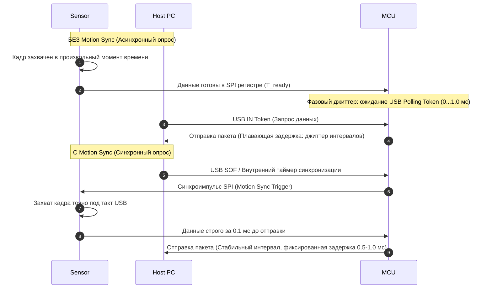

#### Математика и компромисс Motion Sync:
1.  **Без Motion Sync**: Сенсор опрашивает матрицу со своей внутренней частотой (например, $20\text{ kHz}$ / шаг $50\text{ мкс}$). MCU опрашивает сенсор асинхронно относительно тактов USB. В результате разница во времени между моментом физического захвата кадра и моментом его отправки в ПК варьируется от $0$ до $\Delta t_{\text{USB}}$. Это порождает фазовый джиттер на графиках `Interval vs Time` в MouseTester.
2.  **С Motion Sync**: MCU принудительно задерживает считывание данных до момента, строго синхронизированного со следующим тактом USB-порта. В результате график трекинга становится идеально гладким и линейным, исключаются пропуски отсчетов.
3.  **Штраф по задержке (Latency Penalty)**: Платой за синхронизацию является детерминированная дополнительная задержка, равная половине периода опроса USB ($\frac{T_{\text{poll}}}{2}$):
    *   При **1000 Hz** ($T = 1.0\text{ мс}$): Задержка Motion Sync составляет **$+0.5\text{ мс}$** (до $+1.0\text{ мс}$ в худшем сценарии).
    *   При **2000 Hz** ($T = 0.5\text{ мс}$): Задержка Motion Sync составляет **$+0.25\text{ мс}$**.
    *   При **4000 Hz** ($T = 0.25\text{ мс}$): Задержка Motion Sync составляет **$+0.125\text{ мс}$** ($125\text{ \mu s}$).
    *   При **8000 Hz** ($T = 0.125\text{ мс}$): Задержка Motion Sync составляет всего **$+0.0625\text{ мс}$** ($62.5\text{ \mu s}$ — пренебрежимо мала).

#### Практическая рекомендация по Motion Sync:
*   На частоте **1000 Hz**: Отключайте Motion Sync в играх жанра Tactical FPS (CS2, Valorant), где критична задержка первого движения и реакция на клик. Включайте Motion Sync в играх с интенсивным плавным трекингом (Apex Legends, Overwatch 2, Quake Champions).
*   На частотах **4000–8000 Hz**: Motion Sync рекомендуется **всегда включать**, так как штраф по задержке падает ниже $0.1\text{ мс}$, а стабильность интервалов возрастает многократно.

---

## 2. Анализ задержки DPI vs CPI: Физика первого движения (Start-of-Motion)

Среди киберспортсменов исторически укоренился миф о том, что низкое разрешение сенсора (400 или 800 DPI) обеспечивает «более плотный», «контролируемый» или «точный» ввод. Низкоуровневый физический и математический анализ полностью опровергает это заблуждение.

### 2.1. Математика дискретизации расстояния

Сенсор регистрирует перемещение квантованными порциями — отсчетами (Counts). Прежде чем сенсор сможет передать операционной системе минимальный вектор смещения $\Delta X = 1$, мышь должна физически преодолеть минимальное расстояние квантования $D_{\text{min}}$:

$$D_{\text{min}} = \frac{1 \text{ дюйм}}{\text{DPI}} = \frac{25.4 \text{ мм}}{\text{DPI}}$$

*   При **400 DPI**: $D_{\text{min}} = \frac{25.4}{400} = 0.0635\text{ мм} = \mathbf{63.5\text{ мкм}}$.
*   При **800 DPI**: $D_{\text{min}} = \frac{25.4}{800} = 0.03175\text{ мм} = \mathbf{31.75\text{ мкм}}$.
*   При **1600 DPI**: $D_{\text{min}} = \frac{25.4}{1600} = 0.015875\text{ мм} = \mathbf{15.875\text{ мкм}}$.
*   При **3200 DPI**: $D_{\text{min}} = \frac{25.4}{3200} = 0.0079375\text{ мм} = \mathbf{7.9375\text{ мкм}}$.

### 2.2. Физика разгона и задержка регистрации первого отсчета

При начале движения из состояния покоя скорость руки человека не возрастает мгновенно — она подчиняется физическому закону разгона с конечным ускорением. На этапе микродоводки (micro-adjustment) начальная физическая скорость движения манипулятора составляет от $1\text{ мм/с}$ до $20\text{ мм/с}$.

Время задержки $\tau_{\text{start}}$ до генерации первого отсчета при постоянной начальной скорости $v_0$ выражается формулой:
$$\tau_{\text{start}} = \frac{D_{\text{min}}}{v_0} = \frac{25.4}{\text{DPI} \cdot v_0}$$

#### Сравнительная таблица задержки регистрации старта движения (Start-of-Motion Latency):

| Скорость микродоводки ($v_0$) | 400 DPI | 800 DPI | 1600 DPI | 3200 DPI | Выигрыш (3200 vs 400 DPI) |
| :--- | :--- | :--- | :--- | :--- | :--- |
| **2 мм/с** (медленная микродоводка) | **31.75 мс** | **15.88 мс** | **7.94 мс** | **3.97 мс** | **-27.78 мс (-87.5%)** |
| **5 мм/с** (типичная доводка на пиксель) | **12.70 мс** | **6.35 мс** | **3.18 мс** | **1.59 мс** | **-11.11 мс (-87.5%)** |
| **10 мм/с** (средняя скорость прицеливания) | **6.35 мс** | **3.18 мс** | **1.59 мс** | **0.79 мс** | **-5.56 мс (-87.5%)** |
| **50 мм/с** (быстрый свайп / трекинг) | **1.27 мс** | **0.64 мс** | **0.32 мс** | **0.16 мс** | **-1.11 мс (-87.5%)** |

```mermaid
gantt
    title Задержка регистрации первого движения при скорости 5 мм/с
    dateFormat X
    axisFormat %s ms
    section 400 DPI
    Ожидание накопления 63.5 мкм : 0, 127
    section 800 DPI
    Ожидание накопления 31.7 мкм : 0, 63
    section 1600 DPI
    Ожидание накопления 15.8 мкм : 0, 31
    section 3200 DPI
    Ожидание накопления 7.9 мкм : 0, 16
```

### 2.3. Масштабирование eDPI и пиксельный пропуск (Pixel Skipping)

Чтобы сохранить привычную сенсорную дистанцию (см/360°), при увеличении DPI в $N$ раз внутриигровая чувствительность (Sensitivity) пропорционально уменьшается в $N$ раз:
$$\text{eDPI} = \text{DPI} \times \text{In-game Sensitivity} = \text{const}$$

*   **Конфигурация А**: 400 DPI $\times$ In-game Sens 2.0 = 800 eDPI ($51.95\text{ см} / 360^\circ$).
*   **Конфигурация Б**: 1600 DPI $\times$ In-game Sens 0.5 = 800 eDPI ($51.95\text{ см} / 360^\circ$).
*   **Конфигурация В**: 3200 DPI $\times$ In-game Sens 0.25 = 800 eDPI ($51.95\text{ см} / 360^\circ$).

При одинаковом eDPI Конфигурация В регистрирует начало физического движения руки на **11.1 мс быстрее**, чем Конфигурация А, а также полностью исключает эффект **Pixel Skipping** (перескакивание перекрестия через пиксели при микронаведении на дальних дистанциях).

### 2.4. Шумовой порог (Noise Floor) и оптимум 1600–3200 DPI

Почему не использовать 20 000 или 30 000 DPI?
1.  **Noise Floor & Surface Texture Ripple**: При разрешениях свыше $6400\text{ DPI}$ размер одного кванта ($<3.9\text{ мкм}$) становится сопоставим с микронеровностями плетения тканевых нитей коврика и тепловым шумом CMOS-матрицы. В результате неподвижная мышь начинает генерировать спонтанные паразитные отсчеты (джиттер/шум).
2.  **Физиологический тремор**: Высокое разрешение регистрирует микровибрации человеческого пульса и мышечный тонус кисти, что дестабилизирует прицеливание.
3.  **Золотой стандарт соревновательного гейминга**: **1600 DPI** или **3200 DPI** на современных сенсорах (PAW3395, PAW3950, HERO 2) обеспечивают абсолютный минимум задержки старта движения ($1.5 - 3.1\text{ мс}$) при нулевом уровне сенсорного шума и отсутствии алгоритмического сглаживания.

---

## 3. Высокочастотный опрос шины USB (1000 Hz, 2000 Hz, 4000 Hz, 8000 Hz)

Частота опроса шины USB (Polling Rate) определяет частоту, с которой хост-контроллер запрашивает данные у устройства ввода.

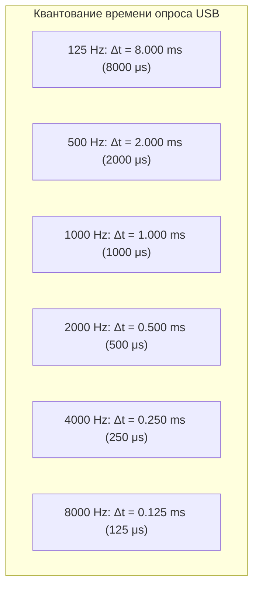

### 3.1. Микросекундные кванты и средняя задержка ожидания

Поскольку физическое движение мыши происходит непрерывно во времени, а передача по USB квантована, средняя задержка ожидания следующего пакета шины ($\tau_{\text{usb}}$) равна половине периода опроса ($\frac{T}{2}$), а максимальная — целому периоду ($T$):

| Частота опроса (Polling Rate) | Период передачи ($T$) | Средняя задержка шины ($\tau_{\text{avg}}$) | Максимальная задержка ($\tau_{\text{max}}$) |
| :--- | :--- | :--- | :--- |
| **125 Hz** (Default Windows) | $8.0\text{ ms} = 8\,000\text{ \mu s}$ | $4.0\text{ ms}$ | $8.0\text{ ms}$ |
| **500 Hz** | $2.0\text{ ms} = 2\,000\text{ \mu s}$ | $1.0\text{ ms}$ | $2.0\text{ ms}$ |
| **1000 Hz** (Standard Gaming) | $1.0\text{ ms} = 1\,000\text{ \mu s}$ | $0.5\text{ ms}$ ($500\text{ \mu s}$) | $1.0\text{ ms}$ |
| **2000 Hz** (High-Speed) | $0.5\text{ ms} = 500\text{ \mu s}$ | $0.25\text{ ms}$ ($250\text{ \mu s}$) | $0.5\text{ ms}$ |
| **4000 Hz** (Ultra-Speed) | $0.25\text{ ms} = 250\text{ \mu s}$ | $0.125\text{ ms}$ ($125\text{ \mu s}$) | $0.25\text{ ms}$ |
| **8000 Hz** (Hyper-Speed) | $0.125\text{ ms} = 125\text{ \mu s}$ | $0.0625\text{ ms}$ ($62.5\text{ \mu s}$) | $0.125\text{ ms}$ |

---

### 3.2. Архитектура прерываний ядра: DPC/ISR оверхед и процессорное насыщение

Переход с 1000 Hz на 8000 Hz увеличивает нагрузку на подсистему прерываний процессора ровно в 8 раз.

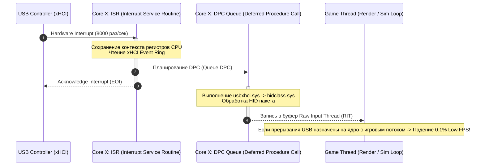

#### Низкоуровневые последствия 8000 Hz для CPU:
1.  **Контекстные переключения (Context Switching) и сброс L1/L2 кэша**: При частоте 8000 Hz ядро процессора прерывается каждые **125 микросекунд**. Обработка прерывания аппаратно сбрасывает конвейер инструкций и вытесняет строки кэша L1D/L1I и L2 данными драйвера `usbxhci.sys`.
2.  **DPC Latency Spikes**: Если DPC-очередь xHCI контроллера переполняется или блокируется другими системными драйверами (например, `nvlddmkm.sys` или `ndis.sys`), задержка обработки ввода возрастает лавинообразно, вызывая микрофризы.
3.  **Деградация 1% и 0.1% Low FPS**: Если игровой поток рендеринга (Render Thread) или физического тика (Main Sim Thread) выполняется на том же физическом ядре CPU, на которое поступают аппаратные прерывания xHCI контроллера, игра начинает терять кадры при каждом быстром движении мыши.

---

### 3.3. Несовместимость игровых движков и переполнение очереди сообщений

#### Проблема Win32 Message Pump:
В устаревших играх на базе DirectX 9/11 (или версиях Unreal Engine 4 / Unity прошлых лет) обработка мышиного ввода происходила через стандартный цикл обработки оконных сообщений Win32:

```cpp
// Устаревший синхронный цикл обработки:
MSG msg;
while (PeekMessage(&msg, NULL, 0, 0, PM_REMOVE)) {
    if (msg.message == WM_INPUT) {
        // Одиночная выборка через GetRawInputData
        UINT dwSize;
        GetRawInputData((HRAWINPUT)msg.lParam, RID_INPUT, NULL, &dwSize, sizeof(RAWINPUTHEADER));
        LPBYTE lpb = new BYTE[dwSize];
        if (GetRawInputData((HRAWINPUT)msg.lParam, RID_INPUT, lpb, &dwSize, sizeof(RAWINPUTHEADER)) == dwSize) {
            RAWINPUT* raw = (RAWINPUT*)lpb;
            ProcessMouseDelta(raw->data.mouse.lLastX, raw->data.mouse.lLastY);
        }
        delete[] lpb;
    }
    TranslateMessage(&msg);
    DispatchMessage(&msg);
}
```

*   При частоте кадров в игре $240\text{ FPS}$ один кадр длится $4.16\text{ мс}$.
*   За время одного кадра мышь на частоте 8000 Hz генерирует:
    $$N_{\text{packets}} = 8000 \text{ Hz} \times 0.00416 \text{ s} \approx \mathbf{33.3 \text{ пакета / кадр}}$$
*   Если движок вызывает `GetRawInputData` с системным вызовом (syscall) для каждого пакета по отдельности, он выполняет 33 context switches на каждый рендер-кадр. Это парализует главный поток игры, приводя к падению FPS с 400 до 40 при интенсивном движении мыши.

#### Современное решение: Буферизованный ввод (`GetRawInputBuffer`) и оптимизация Windows 11:
В современных движках и играх (Source 2 / CS2, Riot Vanguard / Valorant, Apex Legends, Overwatch 2) используется пакетное чтение буфера ввода:

```cpp
// Буферизованная пакетная выборка (Batch Processing):
RAWINPUT rawBuffer[64];
UINT cbSize = sizeof(RAWINPUT) * 64;
UINT count = GetRawInputBuffer(rawBuffer, &cbSize, sizeof(RAWINPUTHEADER));
for (UINT i = 0; i < count; ++i) {
    if (rawBuffer[i].header.dwType == RIM_TYPEMOUSE) {
        AccumulateDelta(rawBuffer[i].data.mouse.lLastX, rawBuffer[i].data.mouse.lLastY);
    }
}
```

#### Обновление Windows 11 High Polling Rate Fix (KB5027303 / KB5028185):
Microsoft полностью переписала стек фоновой обработки ввода в Windows 11:
*   Ввод для фоновых приложений принудительно коалесцируется (сжимается/объединяется) и троттлится до 125 Hz.
*   Приложение переднего плана (Foreground Fullscreen Exclusive Game) получает сырой высокоприоритетный поток ввода без задержек в очереди оконных сообщений.

---

## 4. Архитектура обработки ввода в Windows: Raw Input, Win32k и системный реестр

Поток мышиного ввода проходит путь через всю многоуровневую архитектуру Windows:

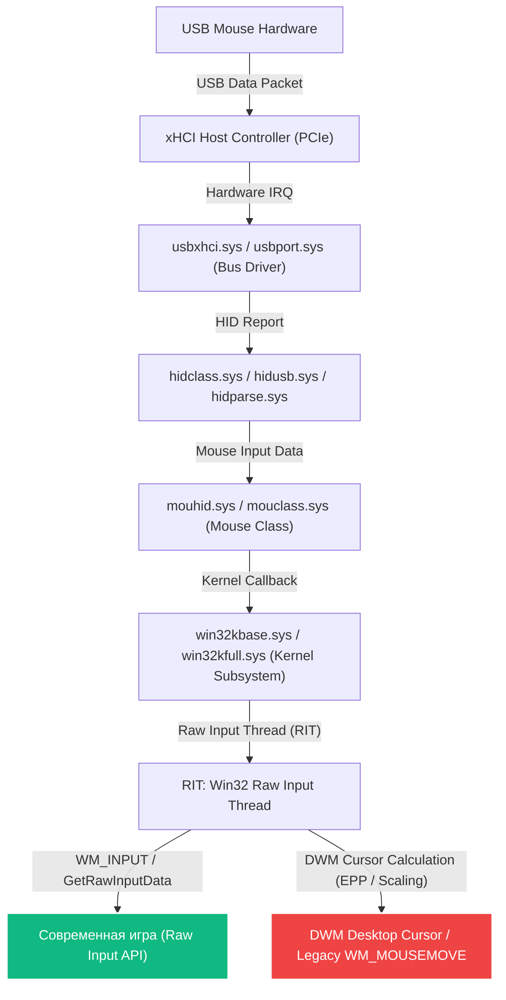

### 4.1. Сравнение API ввода: WM_MOUSEMOVE vs DirectInput vs Raw Input

| Характеристика | `WM_MOUSEMOVE` (Standard Win32) | `DirectInput` (DirectX 7–9 legacy) | `Raw Input` (`WM_INPUT` / `GetRawInputData`) |
| :--- | :--- | :--- | :--- |
| **Уровень обработки** | Пользовательский режим (User-mode Message Queue) | User-mode COM-wrapper поверх HID | Kernel RIT Direct Interface |
| **Влияние Windows Pointer Speed (6/11)** | **Да** (применяются множители масштабирования) | **Да** (в зависимости от флагов инициализации) | **НЕТ** (абсолютный 1:1 аппаратный отсчет) |
| **Влияние Enhance Pointer Precision (Акселерация)** | **Да** (применяются кривые SmoothMouse) | **Да** (в режимах non-exclusive) | **НЕТ** (акселерация ОС полностью игнорируется) |
| **Влияние DPI Scaling дисплея (125%, 150%)** | **Да** (координаты пересчитываются под разрешение) | Зависит от версии DirectInput | **НЕТ** (прямой доступ к физическим дельтам $\Delta X, \Delta Y$) |
| **Коалесцирование сообщений (Message Coalescing)** | **Да** (ОС может объединять сообщения для экономии CPU) | Нет | **НЕТ** (гарантированная доставка каждого пакета) |
| **Задержка (Latency)** | Высокая ($+2 - 10\text{ мс}$) | Средняя ($+1 - 3\text{ мс}$) | **Минимальная аппаратно возможная ($<0.05\text{ мс}$)** |

---

### 4.2. Ползунок скорости Windows Pointer Speed (6/11) и таблица множителей

В классическом интерфейсе Windows (`main.cpl` -> Свойства мыши -> Параметры указателя) ползунок скорости имеет 11 дискретных положений. Он управляет значением реестра `MouseSensitivity` в ветке:
`HKEY_CURRENT_USER\Control Panel\Mouse`

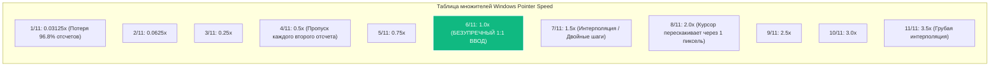

| Положение ползунка | Значение реестра `MouseSensitivity` | Множитель скорости Windows | Математическое последствие для не-Raw Input приложений |
| :--- | :--- | :--- | :--- |
| **1 / 11** | `1` | **0.03125x** ($1/32$) | Потеря 31 из 32 аппаратных отсчетов |
| **2 / 11** | `2` | **0.0625x** ($1/16$) | Потеря 15 из 16 аппаратных отсчетов |
| **3 / 11** | `4` | **0.25x** ($1/4$) | Потеря 3 из 4 аппаратных отсчетов |
| **4 / 11** | `6` | **0.5x** ($1/2$) | Потеря каждого второго аппаратного отсчета |
| **5 / 11** | `8` | **0.75x** ($3/4$) | Дрожание и неравномерность шага |
| **6 / 11 (DEFAULT)** | `10` | **1.0x (1 : 1)** | **Идеальная трансляция: 1 count = 1 pixel (Zero drop / Zero interpolation)** |
| **7 / 11** | `12` | **1.5x** ($3/2$) | Чередование шагов: 1 пиксель, 2 пикселя (пиксельный пропуск) |
| **8 / 11** | `14` | **2.0x** | Каждый отсчет смещает курсор строго на 2 пикселя (невозможно попасть в нечетный пиксель) |
| **9 / 11** | `16` | **2.5x** | Чередование шагов 2 и 3 пикселя |
| **10 / 11** | `18` | **3.0x** | Курсор смещается на 3 пикселя за 1 отсчет |
| **11 / 11** | `20` | **3.5x** | Курсор смещается на 3–4 пикселя за отсчет |

---

### 4.3. Enhance Pointer Precision (Акселерация Windows) и реестровые ключи

Функция «Включить повышенную точность установки указателя» (Enhance Pointer Precision, EPP) представляет собой нелинейную полиномиальную кривую ускорения. При медленном движении мыши курсор искусственно замедляется, а при быстром — ускоряется.

В реестре за акселерацию отвечают следующие ключи в ветке `HKEY_CURRENT_USER\Control Panel\Mouse`:

*   `MouseSpeed` (REG_SZ): Режим ускорения (`0` = отключено, `1` = ускорение удвоено при превышении порога 1, `2` = учет обоих порогов).
*   `MouseThreshold1` (REG_SZ): Первый скоростной порог (в отсчетах).
*   `MouseThreshold2` (REG_SZ): Второй скоростной порог (в отсчетах).
*   `SmoothMouseXCurve` (REG_BINARY): 5-точечная сплайн-кривая преобразования дельт по оси X.
*   `SmoothMouseYCurve` (REG_BINARY): 5-точечная сплайн-кривая преобразования дельт по оси Y.

```powershell
# Принудительное математическое отключение акселерации Windows:
Set-ItemProperty -Path "HKCU:\Control Panel\Mouse" -Name "MouseSensitivity" -Type String -Value "10"
Set-ItemProperty -Path "HKCU:\Control Panel\Mouse" -Name "MouseSpeed" -Type String -Value "0"
Set-ItemProperty -Path "HKCU:\Control Panel\Mouse" -Name "MouseThreshold1" -Type String -Value "0"
Set-ItemProperty -Path "HKCU:\Control Panel\Mouse" -Name "MouseThreshold2" -Type String -Value "0"
```

---

### 4.4. MarkC Mouse Fix: Механика, история и бинарные кривые

**MarkC Mouse Fix** был разработан инженером Mark Cranness для решения критического бага Windows 7 / 8 / 10 / 11: старые игры (например, CS 1.6, Quake Live, Half-Life, игры на движках GoldSrc/Source без включенного Raw Input) принудительно заставляли Windows активировать кривые `SmoothMouseXCurve` и `SmoothMouseYCurve`, даже если в панели управления галочка «Enhance pointer precision» была снята.

MarkC Mouse Fix заменяет полиномиальные коэффициенты сплайна `SmoothMouse` на строго линейные значения (коэффициент наклона кривой $k = 1.000000$), при которых даже в случае принудительного включения EPP ускорение математически равняется нулю (1:1 трансляция).

#### Бинарная структура MarkC для Windows 10/11 при масштабировании дисплея 100%:
```ini
[HKEY_CURRENT_USER\Control Panel\Mouse]
"SmoothMouseXCurve"=hex:\
    00,00,00,00,00,00,00,00,\
    00,00,00,00,00,00,00,00,\
    00,00,00,00,00,00,00,00,\
    00,00,00,00,00,00,00,00,\
    00,00,00,00,00,00,00,00
"SmoothMouseYCurve"=hex:\
    00,00,00,00,00,00,00,00,\
    00,00,00,00,00,00,00,00,\
    00,00,00,00,00,00,00,00,\
    00,00,00,00,00,00,00,00,\
    00,00,00,00,00,00,00,00
```
*(При линейной калибровке 100% DPI кривые обнуляются, устраняя влияние встроенного интерполятора Windows).*

---

## 5. Оптимизация контроллеров и подсистемы USB

Физический интерфейс USB и хост-контроллер материнской платы — фундамент передачи пакетов мыши.

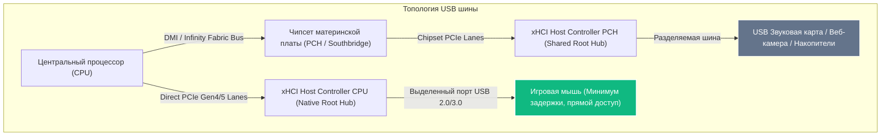

### 5.1. Контроллеры xHCI vs EHCI и выбор оптимального физического порта

1.  **xHCI (eXtensible Host Controller Interface)**: Стандарт USB 3.0 / 3.1 / 3.2 / USB4. Поддерживает аппаратную микрокадровую адресацию ($125\text{ \mu s}$ microframes), низкие задержки планировщика и очереди транзакций в оперативной памяти (Event Rings, Transfer Rings).
2.  **EHCI (Enhanced Host Controller Interface)**: Устаревший стандарт USB 2.0 (High Speed). Отсутствует на современных чипсетах Intel (Z690/Z790/Z890) и AMD (X570/B650/X670/X870), где все порты USB 2.0 обслуживаются xHCI-контроллером через внутренние виртуальные хабы USB 2.0.
3.  **Direct CPU Ports vs PCH Ports**:
    *   **CPU Direct Ports**: На материнских платах верхнего ценового сегмента часть портов задней панели подключена напрямую к контроллеру xHCI внутри кристалла CPU (минуя чипсет). Подключение мыши к CPU Direct Port снижает задержку на **$0.1 - 0.3\text{ мс}$**, так как пакет минует шину DMI/Infinity Fabric.
    *   Проверить топологию подключения можно в диспетчере устройств: `Вид -> Устройства по подключению (Devices by connection)`.

---

### 5.2. Электромагнитная интерференция (EMI) в диапазоне 2.4 GHz

> [!WARNING]
> **Официальный документ Intel (Whitepaper: "USB 3.0 Radio Frequency Interference on 2.4 GHz Wireless Devices")**:
> Неэкранированные или активно работающие порты и кабели стандарта USB 3.0/3.1 генерируют широкополосный электромагнитный шум в спектре **2.4 GHz – 2.5 GHz**.

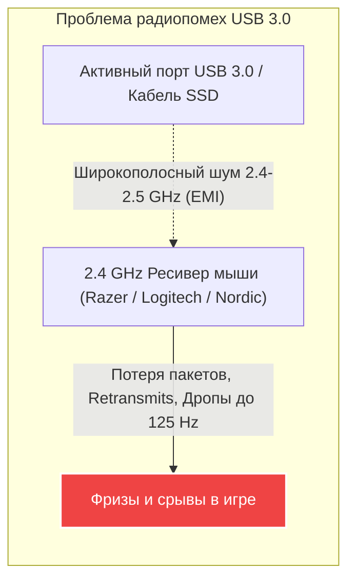

#### Правила размещения беспроводного ресивера (Dongle):
1.  Никогда не вставляйте беспроводной ресивер 2.4 GHz (Logitech LIGHTSPEED, Razer HyperSpeed/HyperPolling) непосредственно в соседний разъем рядом с подключенным кабелем USB 3.0 или скоростной флешкой.
2.  Используйте комплектный экранированный удлинитель (Dongle Extender) и располагайте приемник на расстоянии **$15 - 30\text{ см}$ от коврика и мыши**.
3.  Подключайте удлинитель с приемником в порт **USB 2.0 (черного цвета)**, если он доступен на задней панели.

---

### 5.3. Разгон частоты опроса USB: Драйвер SweetLow `hidusbf`

Для устаревших или стандартных мышей (например, опрашиваемых по умолчанию на 125 Hz или 500 Hz, либо старых моделей Microsoft IntelliMouse Optical 1.1a / 3.0, WMO, Logitech G1) драйвер-фильтр **`hidusbf`** разработчика SweetLow позволяет переопределить параметр дескриптора конечной точки `bInterval` в ядре Windows.

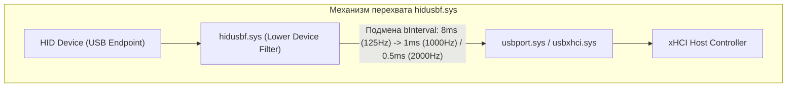

#### Архитектура работы `hidusbf`:
1.  Драйвер устанавливается как **Lower Device Filter** над стеком `HIDCLASS.SYS`.
2.  При инициализации USB-устройства (`URB_FUNCTION_SELECT_CONFIGURATION`) фильтр перехватывает USB Request Block (URB) и принудительно перезаписывает дескриптор интервала `bInterval` (например, меняет значение `8` ($8\text{ мс}$) на `1` ($1\text{ мс}$) или `0` ($125\text{ \mu s}$)).
3.  **Безопасность и целостность**: Разгон по USB затрагивает только частоту опроса интерфейса связи MCU $\leftrightarrow$ Host Controller. Внутренняя частота сенсора DSP не разгоняется и работает в штатном режиме, что исключает риск аппаратного повреждения сенсора.
4.  **Нюансы Windows 11**: Требует установки тестового сертификата или отключения Memory Integrity (HVCI) в изоляции ядра.

---

### 5.4. Отключение режимов энергосбережения USB (Selective Suspend & D3 Power States)

Windows по умолчанию стремится переводить бездействующие конечные точки USB в состояния пониженного энергопотребления (USB 3.0 U1/U2/U3 Link States и USB Selective Suspend D3 Hot/Cold). При выходе из микросна возникает аппаратная задержка пробуждения контроллера (Wake-up latency) от **$1.0$ до $15.0\text{ мс}$**.

#### 1. Отключение Selective Suspend в параметрах электропитания:
```powershell
# Отключение выборочного отключения USB (USB Selective Suspend) в активном плане питания:
powercfg /SETACVALUEINDEX SCHEME_CURRENT 2a737441-1930-4402-8d77-b2bebba4d5a0 48e6b7a6-50f5-4782-a5d4-53bb8f07e226 0
powercfg /SETDCVALUEINDEX SCHEME_CURRENT 2a737441-1930-4402-8d77-b2bebba4d5a0 48e6b7a6-50f5-4782-a5d4-53bb8f07e226 0
powercfg /SETACTIVE SCHEME_CURRENT
```

#### 2. Реестровые параметры отключения энергосбережения HID-устройств:
Для каждого физического USB-устройства в ветке `HKEY_LOCAL_MACHINE\SYSTEM\CurrentControlSet\Enum\USB\...` создаются параметры, запрещающие перевод в D3:

*   `EnhancedPowerManagementEnabled` (DWORD) = `0` (Запретить расширенное управление питанием)
*   `AllowIdleIrpInD3` (DWORD) = `0` (Запретить простой в D3)
*   `EnableSelectiveSuspend` (DWORD) = `0`
*   `DeviceSelectiveSuspended` (DWORD) = `0`
*   `SelectiveSuspendEnabled` (DWORD) = `0`

---

### 5.5. Аффинити прерываний (Interrupt Affinity) и режим MSI/MSI-X для USB xHCI

По умолчанию в Windows все аппаратные прерывания (IRQ) и DPC от USB-контроллеров могут динамически распределяться планировщиком ядра по разным ядрам процессора, либо концентрироваться на **CPU 0**, где уже выполняются основные системные прерывания ОС и сетевого стека DPC.

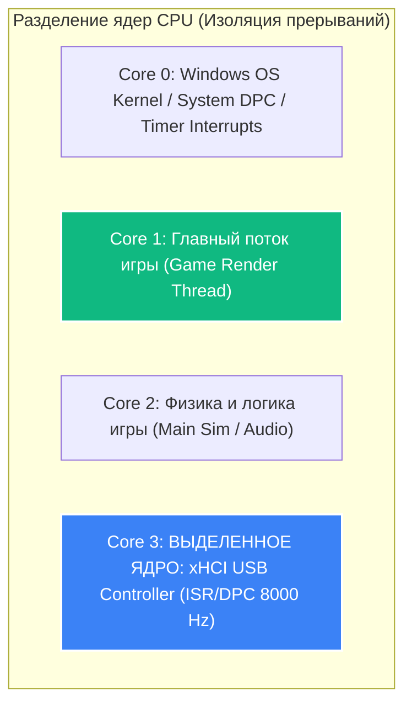

#### 1. Перевод контроллера xHCI в режим MSI / MSI-X (Message Signaled Interrupts):
Классические линейные прерывания (Line-based IRQ / INTx) требуют совместного использования линий прерываний на шине PCIe, что приводит к задержкам арбитража. Режим MSI/MSI-X отправляет прерывание как прямую запись в область памяти APIC (Memory Write Transaction), снижая задержку ISR на **$10 - 25\text{ \mu s}$**.

Ветка реестра для xHCI Host Controller:
`HKEY_LOCAL_MACHINE\SYSTEM\CurrentControlSet\Enum\PCI\<Device_Instance_Path>\Device Parameters\Interrupt Management\MessageSignaledInterruptProperties`
*   `MSISupported` (DWORD) = `1`
*   `MessageNumberLimit` (DWORD) = `16` (или `32` для MSI-X)

#### 2. Фиксация аффинити прерываний (Interrupt Affinity Policy):
Ветка реестра:
`HKEY_LOCAL_MACHINE\SYSTEM\CurrentControlSet\Enum\PCI\<Device_Instance_Path>\Device Parameters\Interrupt Management\Affinity Policy`
*   `DevicePolicy` (DWORD) = `4` (`IrqPolicySpecifiedProcessors` — жесткое следование маске процессоров)
*   `AssignmentSetOverride` (REG_BINARY / REG_QWORD) = Битовая маска ядер CPU.
    *   Например, для назначения прерываний на физическое **Core 2** (3-е логическое ядро, битовая маска `00000100`b = `0x04`):
        `AssignmentSetOverride` = `hex:04,00,00,00,00,00,00,00`

---

## 6. Микропереключатели (Switches) и механика антидребезга (Debounce)

Задержка клика (Click Latency) — критический компонент в соревновательных дуэлях.

```mermaid
graph TD
    subgraph "Механический свитч (Omron / Kailh / Huano)"
        M_CLICK["Физическое замыкание контактов"] --> M_BOUNCE["Механический дребезг пластин (Chatter: 1-5 мс)"]
        M_BOUNCE --> M_ALGO["Алгоритм Debounce (Eager / Deferred Debounce Filter)"]
        M_ALGO -->|"Искусственная задержка +1...8 мс"| M_OUT["Генерация клика в USB"]
    end
    
    subgraph "Оптический свитч (Razer Optical Gen3 / Lightforce / TTC)"
        O_CLICK["Физическое нажатие клавиши"] --> O_BEAM["Прерывание инфракрасного луча шторкой"]
        O_BEAM -->|"0 мс дребезга (Фототранзистор)"| O_OUT["Мгновенная генерация клика (0 мс Debounce)"]
    end
    style O_OUT fill:#10b981,stroke:#fff,stroke-width:2px,color:#fff
    style M_OUT fill:#f59e0b,stroke:#fff,stroke-width:2px,color:#fff
```

### 6.1. Механические микропереключатели vs Оптические

1.  **Механические переключатели (Mechanical Switches)**:
    *   Принцип: Физическое соприкосновение двух металлических лепестков (контактная группа из сплава меди, серебра или золота).
    *   Проблема дребезга (Contact Bouncing / Chatter): В момент удара металлические пластины микроскопически отскакивают друг от друга в течение $0.5 - 4.0\text{ мс}$, генерируя серию ложных сигналов включения/выключения.
    *   Для предотвращения ложных даблкликов (Double-Click Bug) микроконтроллер мыши применяет программный алгоритм **Debounce**:
        *   *Deferred Debounce* (традиционный): MCU ожидает стабилизации сигнала в течение фиксированного времени ($4 - 12\text{ мс}$) перед отправкой пакета нажатия. Добавляет огромную задержку клика.
        *   *Eager Debounce* (быстрый): MCU регистрирует первое замыкание немедленно ($0\text{ мс}$), но блокирует последующие изменения на время Debounce ($4 - 8\text{ мс}$). Однако при отпускании клавиши (Release Latency) задержка все равно присутствует.
2.  **Оптические переключатели (Optical Switches)**:
    *   Принцип: Внутри корпуса переключателя постоянно светит инфракрасный диод на фотодиод. При нажатии непрозрачная шторка прерывает или открывает световой луч.
    *   Преимущество: Физический контакт отсутствует, дребезг контактов математически равен $0\text{ мс}$.
    *   Микроконтроллеру не требуется алгоритм Debounce. Задержка клика снижается до чистого времени опроса USB ($<0.125\text{ мс}$ на 8000 Hz), а риск появления двойного клика полностью исключен на весь срок службы (до 100 млн нажатий).

---

## 7. Инструментарий для тестирования и анализа задержки

Для эмпирической валидации стабильности сенсора, джиттера частоты опроса и сквозной задержки применяются специализированные программно-аппаратные комплексы.

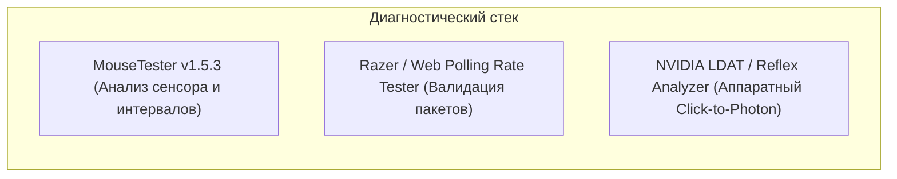

### 7.1. MouseTester v1.5.3: Методология и интерпретация графиков

**MouseTester** (авторы: Microvolts, Ping, r0ach, chjj) — отраслевой стандарт низкоуровневого анализа поведения манипулятора.

#### Основные режимы графиков:
1.  **Interval vs. Time (Интервалы опроса)**:
    *   Отображает время между последовательными USB-пакетами ($\Delta t$).
    *   *Идеальный результат*: Плотная горизонтальная линия на отметке $1.0\text{ мс}$ (для 1000 Hz) или $0.125\text{ мс}$ (для 8000 Hz) без выпадающих точек (Outliers).
    *   *Проблема*: Разброс точек от $0.2$ до $1.8\text{ мс}$ свидетельствует о нестабильности таймера MCU, фазовом джиттере или троттлинге шины USB.
2.  **Counts vs. Time (Плавность трекинга и сглаживание)**:
    *   Отображает количество отсчетов в каждом пакете при равномерном свайпе.
    *   *Идеальный результат*: Идеальная синусоидальная или колоколообразная кривая с плотно прилегающими точками.
    *   *Проблема (Smoothing)*: Если точки выстраиваются в ступенчатые геометрические паттерны с закругленными фронтами — в сенсоре активно неотключаемое сглаживание/фильтрация кадров.
3.  **Frequency vs. Time (Частота опроса в динамике)**:
    *   Демонстрирует реальную частоту пакетов при движении.
4.  **X vs. Y (Траектория)**:
    *   Используется для проверки прямолинейности и детекции паразитного Angle Snapping (проявляется в виде идеальных прямых линий на диагональных проходках).

---

### 7.2. Аппаратные комплексы: NVIDIA LDAT и Reflex Analyzer

*   **NVIDIA LDAT (Latency Display Analysis Tool)**: Аппаратный модуль с фотодатчиком высокой чувствительности и датчиком нажатия на кнопку мыши. Измеряет время от механического замыкания контакта до вспышки выстрела на мониторе с точностью до $0.01\text{ мс}$.
*   **NVIDIA Reflex Latency Analyzer**: Встроенный в G-Sync мониторы аппаратный блок, измеряющий задержку клика мыши, поддерживающей протокол Reflex.

---

## 8. Мифы, плацебо и фатальные ошибки оптимизации

В сообществах твикеров циркулирует множество псевдонаучных инструкций, наносящих вред стабильности и отзывчивости мышиного ввода.

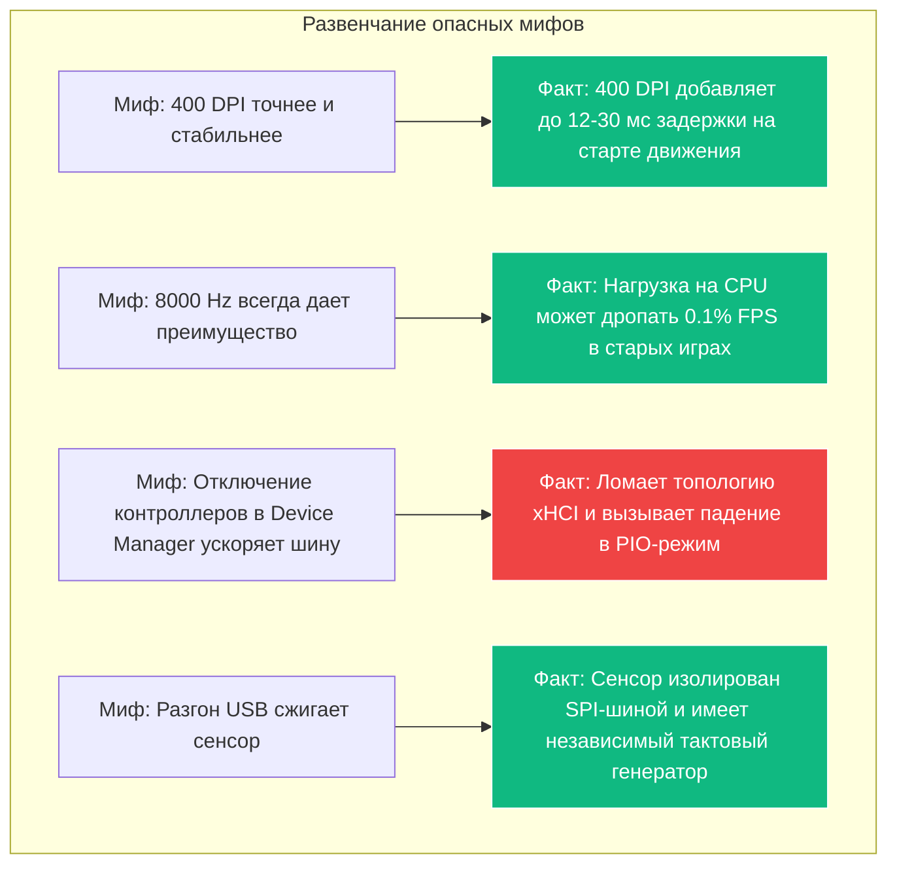

### Миф 1: «Профессионалы играют на 400 DPI, потому что сенсор не интерполирует и работает точнее»
*   **Опровержение**: Подавляющее большинство современных сенсоров (PAW3395, PAW3950, Focus Pro, HERO 2) имеют базовое оптическое разрешение матрицы, многократно превышающее 400 DPI. Работа на 400 DPI — это искусственное объединение/масштабирование отсчетов в микроконтроллере, порождающее задержку первого движения до $+12.7\text{ мс}$ при медленном наведении. Переход на 1600 или 3200 DPI с пересчетом внутриигровой чувствительности дает чистый выигрыш в отзывчивости без потерь.

### Миф 2: «8000 Hz мышь автоматически делает стрельбу плавнее в любой игре»
*   **Опровержение**: 8000 Hz дает преимущество ($125\text{ \mu s}$ задержки шины и микрошаги) только при соблюдении 3 условий:
    1.  Мощный процессор с высокой однопоточной производительностью (Ryzen 7 7800X3D / 9800X3D, Core i7/i9 13–14th Gen).
    2.  Игровой движок с поддержкой `GetRawInputBuffer` или оптимизированным циклом ввода.
    3.  Монитор с ультравысокой частотой обновления (360 Hz, 500 Hz, 540 Hz), где плотность отсчетов 8 kHz визуально синхронизируется с частотой развертки. На мониторах 144 Hz разница между 1000 Hz и 8000 Hz на глаз практически неразличима.

### Миф 3: «Отключение всех корневых концентраторов USB (Root Hubs) в Диспетчере устройств снижает задержку»
*   **Опровержение**: Попытка отключить «лишние» корневые USB-концентраторы часто нарушает внутреннее дерево маршрутизации PCIe xHCI, вынуждая драйвер `usbxhci.sys` переходить в режим совместимости с повышенной задержкой или приводя к неработоспособности клавиатуры и мыши.

### Миф 4: «Разгон частоты опроса USB через hidusbf может перегреть или сжечь сенсор мыши»
*   **Опровержение**: Сенсор мыши подключен к микроконтроллеру по внутренней шине SPI и функционирует на фиксированной тактовой частоте своего кристалла (обычно 24–48 MHz). Разгон USB затрагивает исключительно приемопередатчик USB интерфейса MCU и xHCI контроллер материнской платы.

---

## 9. Пошаговая реализация: Скрипты оптимизации и отката

Ниже представлены готовые к применению, протестированные сценарии PowerShell для глубокой оптимизации параметров мышиного ввода и подсистемы USB в Windows 10/11.

### 9.1. Производственный скрипт оптимизации (`Optimize-MouseAndUSB.ps1`)

```powershell
<#
.SYNOPSIS
    Комплексная низкоуровневая оптимизация параметров мыши и USB в Windows 10/11.
.DESCRIPTION
    1. Устанавливает идеальный 1:1 ввод Windows (6/11 Pointer Speed, Disable EPP).
    2. Отключает акселерацию и выравнивает кривые SmoothMouse (MarkC 100% Linear).
    3. Отключает USB Selective Suspend в схемах электропитания.
    4. Отключает расширенное энергосбережение HID/USB (EnhancedPowerManagementEnabled=0).
    5. Переводит USB xHCI контроллеры в режим MSI (Message Signaled Interrupts).
#>

# Требование прав Администратора
if (-not ([Security.Principal.WindowsPrincipal][Security.Principal.WindowsIdentity]::GetCurrent()).IsInRole([Security.Principal.WindowsBuiltInRole]::Administrator)) {
    Write-Error "Скрипт должен быть запущен от имени Администратора!"
    exit 1
}

Write-Host "[+] Шаг 1: Настройка идеального 1:1 масштабирования указателя Windows..." -ForegroundColor Cyan

# Установка 6/11 скорости указателя (MouseSensitivity = 10) и отключение EPP (Enhanced Pointer Precision)
$MouseRegPath = "HKCU:\Control Panel\Mouse"
Set-ItemProperty -Path $MouseRegPath -Name "MouseSensitivity" -Type String -Value "10"
Set-ItemProperty -Path $MouseRegPath -Name "MouseSpeed" -Type String -Value "0"
Set-ItemProperty -Path $MouseRegPath -Name "MouseThreshold1" -Type String -Value "0"
Set-ItemProperty -Path $MouseRegPath -Name "MouseThreshold2" -Type String -Value "0"

# Обнуление кривых SmoothMouse (Устранение акселерации для старых DirectInput/Win32 игр)
[byte[]]$LinearCurve = @(
    0x00,0x00,0x00,0x00, 0x00,0x00,0x00,0x00,
    0x00,0x00,0x00,0x00, 0x00,0x00,0x00,0x00,
    0x00,0x00,0x00,0x00, 0x00,0x00,0x00,0x00,
    0x00,0x00,0x00,0x00, 0x00,0x00,0x00,0x00,
    0x00,0x00,0x00,0x00, 0x00,0x00,0x00,0x00
)
Set-ItemProperty -Path $MouseRegPath -Name "SmoothMouseXCurve" -Type Binary -Value $LinearCurve
Set-ItemProperty -Path $MouseRegPath -Name "SmoothMouseYCurve" -Type Binary -Value $LinearCurve

Write-Host "[+] Шаг 2: Отключение USB Selective Suspend в планах электропитания..." -ForegroundColor Cyan
# GUID подгруппы USB: 2a737441-1930-4402-8d77-b2bebba4d5a0
# GUID параметра Selective Suspend: 48e6b7a6-50f5-4782-a5d4-53bb8f07e226
powercfg /SETACVALUEINDEX SCHEME_CURRENT 2a737441-1930-4402-8d77-b2bebba4d5a0 48e6b7a6-50f5-4782-a5d4-53bb8f07e226 0
powercfg /SETDCVALUEINDEX SCHEME_CURRENT 2a737441-1930-4402-8d77-b2bebba4d5a0 48e6b7a6-50f5-4782-a5d4-53bb8f07e226 0
powercfg /SETACTIVE SCHEME_CURRENT

Write-Host "[+] Шаг 3: Отключение энергосбережения для всех USB/HID контроллеров и устройств..." -ForegroundColor Cyan
$UsbDevices = Get-ChildItem -Path "HKLM:\SYSTEM\CurrentControlSet\Enum\USB" -Recurse -ErrorAction SilentlyContinue

foreach ($dev in $UsbDevices) {
    if ($dev.PSChildName -eq "Device Parameters") {
        Set-ItemProperty -Path $dev.PSPath -Name "EnhancedPowerManagementEnabled" -Type DWord -Value 0 -ErrorAction SilentlyContinue
        Set-ItemProperty -Path $dev.PSPath -Name "AllowIdleIrpInD3" -Type DWord -Value 0 -ErrorAction SilentlyContinue
        Set-ItemProperty -Path $dev.PSPath -Name "EnableSelectiveSuspend" -Type DWord -Value 0 -ErrorAction SilentlyContinue
        Set-ItemProperty -Path $dev.PSPath -Name "DeviceSelectiveSuspended" -Type DWord -Value 0 -ErrorAction SilentlyContinue
        Set-ItemProperty -Path $dev.PSPath -Name "SelectiveSuspendEnabled" -Type DWord -Value 0 -ErrorAction SilentlyContinue
    }
}

Write-Host "[+] Шаг 4: Активация режима MSI (Message Signaled Interrupts) для xHCI USB контроллеров..." -ForegroundColor Cyan
$PciDevices = Get-ChildItem -Path "HKLM:\SYSTEM\CurrentControlSet\Enum\PCI" -Recurse -ErrorAction SilentlyContinue

foreach ($pci in $PciDevices) {
    # Поиск xHCI контроллеров (Class 0x0C0330)
    $Class = (Get-ItemProperty -Path $pci.PSPath -Name "ClassGUID" -ErrorAction SilentlyContinue).ClassGUID
    $Service = (Get-ItemProperty -Path $pci.PSPath -Name "Service" -ErrorAction SilentlyContinue).Service

    if ($Service -match "USBXHCI|usbxhci") {
        $MsiPath = Join-Path $pci.PSPath "Device Parameters\Interrupt Management\MessageSignaledInterruptProperties"
        if (-not (Test-Path $MsiPath)) {
            New-Item -Path $MsiPath -Force | Out-Null
        }
        Set-ItemProperty -Path $MsiPath -Name "MSISupported" -Type DWord -Value 1
        Set-ItemProperty -Path $MsiPath -Name "MessageNumberLimit" -Type DWord -Value 16
        Write-Host "    -> MSI активирован для xHCI: $($pci.PSChildName)" -ForegroundColor Green
    }
}

Write-Host "`n[SUCCESS] Оптимизация мышиного ввода и USB успешно завершена! Перезагрузите ПК для вступления изменений в силу." -ForegroundColor Green
```

---

### 9.2. Скрипт полного отката к стандартным значениям Windows (`Restore-MouseAndUSB-Defaults.ps1`)

```powershell
<#
.SYNOPSIS
    Откат всех параметров мыши и USB к стандартным заводским значениям Windows.
#>

if (-not ([Security.Principal.WindowsPrincipal][Security.Principal.WindowsIdentity]::GetCurrent()).IsInRole([Security.Principal.WindowsBuiltInRole]::Administrator)) {
    Write-Error "Скрипт должен быть запущен от имени Администратора!"
    exit 1
}

Write-Host "[*] Восстановление стандартных параметров мыши Windows..." -ForegroundColor Yellow

$MouseRegPath = "HKCU:\Control Panel\Mouse"
Set-ItemProperty -Path $MouseRegPath -Name "MouseSensitivity" -Type String -Value "10"
Set-ItemProperty -Path $MouseRegPath -Name "MouseSpeed" -Type String -Value "1"
Set-ItemProperty -Path $MouseRegPath -Name "MouseThreshold1" -Type String -Value "6"
Set-ItemProperty -Path $MouseRegPath -Name "MouseThreshold2" -Type String -Value "10"

# Стандартные кривые ускорения Windows Default SmoothMouse
[byte[]]$DefCurveX = @(
    0x00,0x00,0x00,0x00, 0x00,0x00,0x00,0x00,
    0x15,0x6e,0x00,0x00, 0x00,0x00,0x00,0x00,
    0x00,0x40,0x01,0x00, 0x00,0x00,0x00,0x00,
    0x00,0xa0,0x03,0x00, 0x00,0x00,0x00,0x00,
    0x00,0x40,0x0a,0x00, 0x00,0x00,0x00,0x00
)
[byte[]]$DefCurveY = @(
    0x00,0x00,0x00,0x00, 0x00,0x00,0x00,0x00,
    0x00,0x00,0x38,0x00, 0x00,0x00,0x00,0x00,
    0x00,0x00,0x70,0x00, 0x00,0x00,0x00,0x00,
    0x00,0x00,0xe0,0x00, 0x00,0x00,0x00,0x00,
    0x00,0x00,0xc0,0x01, 0x00,0x00,0x00,0x00
)
Set-ItemProperty -Path $MouseRegPath -Name "SmoothMouseXCurve" -Type Binary -Value $DefCurveX
Set-ItemProperty -Path $MouseRegPath -Name "SmoothMouseYCurve" -Type Binary -Value $DefCurveY

Write-Host "[*] Включение стандартного Selective Suspend..." -ForegroundColor Yellow
powercfg /SETACVALUEINDEX SCHEME_CURRENT 2a737441-1930-4402-8d77-b2bebba4d5a0 48e6b7a6-50f5-4782-a5d4-53bb8f07e226 1
powercfg /SETDCVALUEINDEX SCHEME_CURRENT 2a737441-1930-4402-8d77-b2bebba4d5a0 48e6b7a6-50f5-4782-a5d4-53bb8f07e226 1
powercfg /SETACTIVE SCHEME_CURRENT

Write-Host "`n[RESTORE COMPLETE] Все параметры успешно возвращены к исходным значениям по умолчанию." -ForegroundColor Green
```

---

## 10. Сводная таблица оптимальной конфигурации мышиного тракта

| Компонент / Параметр | Оптимальное соревновательное значение | Техническое обоснование |
| :--- | :--- | :--- |
| **DPI / CPI мыши** | **1600 DPI** или **3200 DPI** | Снижение задержки старта движения ($\tau_{\text{start}}$) на $75-87\%$; нулевой шум матрицы. |
| **In-Game Sensitivity** | Скорректированная под eDPI | Сохранение мышечной памяти при резком росте точности микродоводки. |
| **Частота опроса (Polling)** | **1000 Hz – 4000 Hz** (до 8000 Hz на топовых CPU) | Минимизация квантов ожидания шины USB до $250 - 125\text{ \mu s}$. |
| **Motion Sync** | **ВЫКЛ** на 1000 Hz (Tac-FPS), **ВКЛ** на 4000–8000 Hz | Исключение задержки $+0.5\text{ мс}$ на 1000 Hz; идеальная стабильность интервалов на 8K. |
| **Windows Pointer Speed** | **6 / 11** (`MouseSensitivity = 10`) | Гарантия честного 1:1 маппинга отсчетов без отбрасывания и интерполяции. |
| **Enhance Pointer Precision** | **ВЫКЛЮЧЕНО** (`MouseSpeed = 0`) | Линейность траектории; исключение искажения мышечной памяти ускорением ОС. |
| **MarkC Fix / Linear Curve** | **Применено (Linear 100%)** | Защита от принудительного включения акселерации старыми движками игр. |
| **Размещение ресивера 2.4 GHz** | $15–30\text{ см}$ от мыши через USB 2.0 удлинитель | Полная изоляция от широкополосных помех USB 3.0 EMI в спектре 2.4 GHz. |
| **USB Power Management** | **Selective Suspend & D3 Disabled** | Исключение задержек выхода контроллера и портов из микросна ($1 - 15\text{ мс}$). |
| **Режим прерываний xHCI** | **MSI / MSI-X Mode Enabled** | Исключение задержек арбитража на шине PCIe; прямая запись прерывания в APIC. |
| **Микропереключатели** | **Оптические свитчи (Optical Switches)** | Задержка клика $0\text{ мс}$ (нулевой Debounce delay); отсутствие риска даблклика. |

---

## 11. Ссылки, первоисточники и полезные репозитории

1.  **LordOfMice / hidusbf**: Официальный репозиторий драйвера разгона частоты опроса USB — [GitHub: LordOfMice/hidusbf](https://github.com/LordOfMice/hidusbf)
2.  **MouseTester Software**: Инструмент анализа оптических сенсоров и интервалов опроса — [Overclock.net MouseTester Thread](https://www.overclock.net/threads/mousetester-software.1538694/)
3.  **MarkC Windows Mouse Acceleration Fix**: Оригинальные исследования и таблицы кривых — [MarkC Blog / Mouse Fix](http://donewaiting.com/2008/04/23/markc-mouse-fix-for-windows/)
4.  **Intel Whitepaper**: "USB 3.0 Radio Frequency Interference on 2.4 GHz Devices" — [Intel Document Reference](https://www.intel.com/content/www/us/en/products/docs/io/universal-serial-bus/usb3-frequency-interference-paper.html)
5.  **Microsoft Learn**: Raw Input Architecture & Windows Input Subsystem (`WM_INPUT`, `GetRawInputBuffer`) — [MSDN Raw Input Documentation](https://learn.microsoft.com/en-us/windows/win32/inputdev/raw-input)
6.  **Blur Busters Mouse Polling & Motion Sync Research**: Анализ Mark Rejhon и сообщества — [Blur Busters High Polling Rate Forums](https://forums.blurbusters.com/)
7.  **NVIDIA Reflex & LDAT Latency Analyzer Methodology**: [NVIDIA Developer Latency Guide](https://developer.nvidia.com/reflex)
