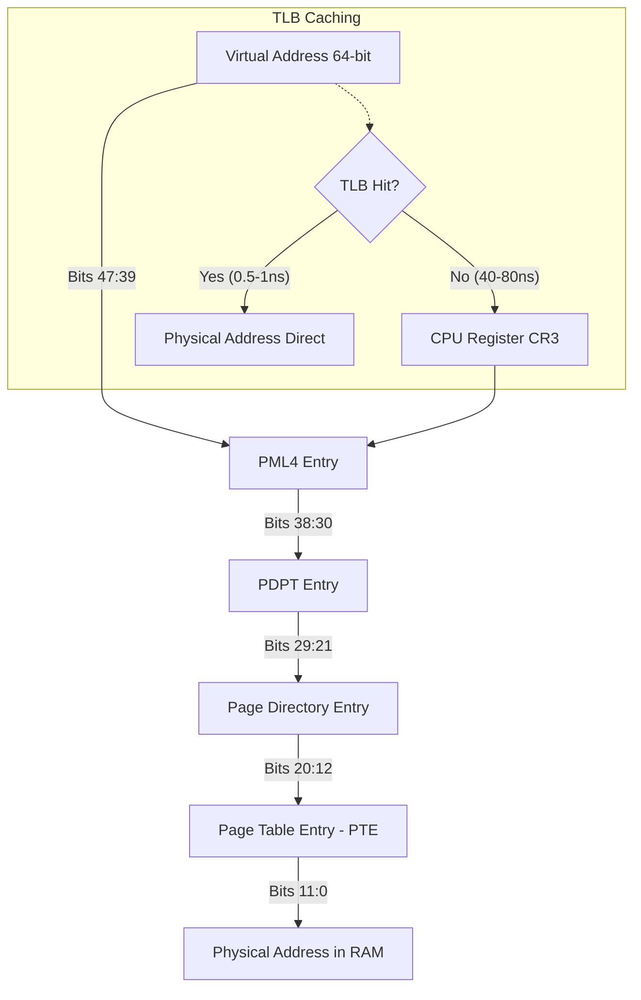
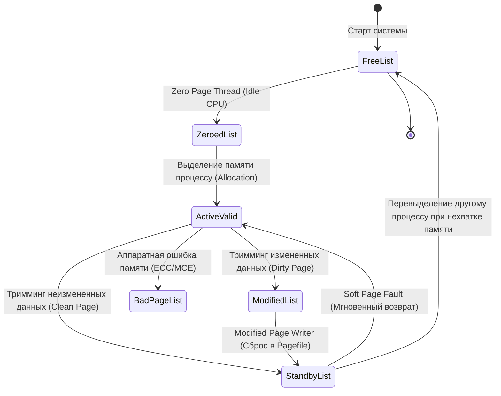
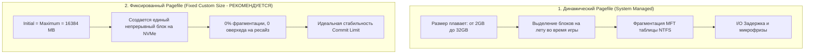
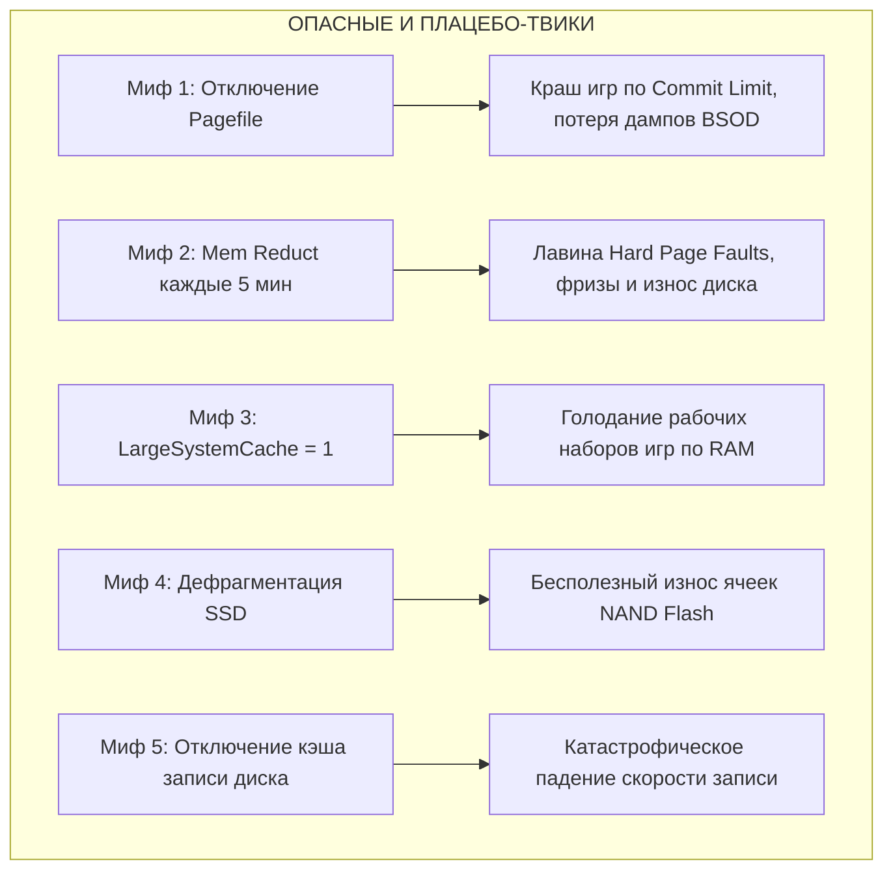

# Архитектура памяти Windows, файл подкачки, Standby List и оптимизация накопителей NVMe/NTFS

---

## Введение: Критическая роль подсистем памяти и хранения данных

В современных соревновательных и AAA-играх (CS2, Escape from Tarkov, Call of Duty: Warzone, Cyberpunk 2077, Apex Legends) производительность системы определяется не только пиковым количеством кадров в секунду (Average FPS), но в первую очередь стабильностью времени кадра (**Frame Time Consistency**) и показателями **1% Low** и **0.1% Low FPS**. 

Микрофризы, статтеры и скачки задержки ввода (Input Lag) в 90% случаев вызваны не нехваткой вычислительной мощности видеокарты, а задержками на уровне операционной системы:
1. **Жесткими страницами подкачки (Hard Page Faults)** — когда процессор обращается к виртуальному адресу, отсутствующему в физической оперативной памяти (RAM), вызывая синхронное блокирующее чтение с накопителя.
2. **Некорректной конфигурацией файла подкачки (Pagefile)** — фрагментацией страничного файла или его полным отключением, приводящим к мгновенному исчерпанию лимита фиксации памяти (Commit Limit) и вытеснению дискового кэша.
3. **Энергосберегающими состояниями шины PCIe и контроллера NVMe (APST / Non-Operational Power States)** — когда задержка пробуждения SSD из состояния глубокого сна (Exit Latency) составляет от 10 до 50 мс, замораживая поток рендеринга на время подгрузки текстур или звуковых файлов.
4. **Нерациональной работой дискового кэша и служб индексации** (SysMain, NTFS Last Access Updates, 8.3 Name Creation).

Данное руководство представляет собой исчерпывающий низкоуровневый анализ архитектуры диспетчера памяти ядра Windows (NT Memory Manager), взаимодействия виртуальной и физической памяти, механизмов кэширования, прямого доступа к хранилищу (DirectStorage / BypassIO) и тонкой настройки твердотельных накопителей (NVMe SSD).

---

## 1. Архитектура диспетчера памяти Windows (NT Memory Manager)

### 1.1. Виртуальное адресное пространство (Virtual Address Space — VAS)

Диспетчер памяти ядра Windows (`ntoskrnl.exe`, подсистема `Mm`) предоставляет каждому 64-битному процессу изолированное виртуальное адресное пространство (VAS). В архитектуре x86-64 (AMD64 / Intel 64) используется плоская модель трансляции адресов:

* **48-битная адресация (4-Level Paging — PML4):** обеспечивает адресное пространство размером 256 ТБ, разделенное на две равные области по 128 ТБ:
  * **User-Mode Space (Пользовательское пространство):** `0x00000000'00000000` — `0x00007FFF'FFFFFFFF` (128 ТБ). Доступно коду приложений и игр.
  * **Kernel-Mode Space (Пространство ядра):** `0xFFFF8000'00000000` — `0xFFFFFFFF'FFFFFFFF` (128 ТБ). Доступно только в режиме Ring 0 (ядро, драйверы, HAL, пулы ядра).
* **57-битная адресация (5-Level Paging — PML5):** поддерживается в новейших процессорах (Intel Ice Lake Server / Arrow Lake / AMD Zen 4/5) и Windows 11 Enterprise/Server, расширяя адресное пространство до 128 ПБ (по 64 ПБ на User/Kernel).

```
+-------------------------------------------------------------------+ 0xFFFFFFFFFFFFFFFF
|                     KERNEL-MODE ADDRESS SPACE                    |
|       (System PTEs, Paged/NonPaged Pools, HAL, NTOSKRNL, Drivers) | (128 TB)
+-------------------------------------------------------------------+ 0xFFFF800000000000
|                     NON-CANONICAL ADDRESS GAP                     |
|           (Недопустимый диапазон адресов в x86-64)                | (16 Million TB)
+-------------------------------------------------------------------+ 0x00007FFFFFFFFFFF
|                      USER-MODE ADDRESS SPACE                      |
|            (Process Code, Heap, Stacks, Loaded DLLs, VRAM)        | (128 TB)
+-------------------------------------------------------------------+ 0x0000000000000000
```

### 1.2. Трансляция адресов и аппаратная подсистема MMU

Трансляция виртуального адреса в физический адрес оперативной памяти выполняется блоком управления памятью процессора (**MMU — Memory Management Unit**) с использованием многоуровневых таблиц страниц (Page Tables):

1. **Регистр CR3 (Page Directory Base Register):** содержит физический базовый адрес таблицы страниц 4-го уровня (PML4) текущего активного потока/процесса. При смене контекста потока (`Context Switch`) ядро обновляет CR3.
2. **Иерархия трансляции 4KB страниц:**
   * `PML4` (Page Map Level 4) -> 9 бит адреса.
   * `PDPT` (Page Directory Pointer Table) -> 9 бит адреса.
   * `PD` (Page Directory) -> 9 бит адреса.
   * `PT` (Page Table) -> 9 бит адреса.
   * `Offset` (Смещение внутри 4KB страницы) -> 12 бит адреса.
3. **TLB (Translation Lookaside Buffer):** аппаратный кэш ассоциативной памяти процессора, хранящий последние трансляции виртуальных адресов в физические.
   * Попадание в TLB (**TLB Hit**): задержка **~0.5–1 нс (1–2 такта CPU)**.
   * Промах TLB (**TLB Miss — Page Walk**): последовательное считывание 4 уровней таблиц из оперативной памяти с задержкой **~40–80 нс**.
   * **PCID (Process Context Identifiers):** механизм x86-64, позволяющий сохранять записи TLB при переключении между процессами без полной очистки (TLB Flush), что снижает оверхед от смены контекста.



### 1.3. Page Faults: Hard Faults vs Soft Faults

Когда процесс обращается к странице памяти, запись PTE (Page Table Entry) которой помечена флагом `Valid = 0` (Not Present), процессор генерирует аппаратное прерывание `#PF` (Interrupt 14 — Page Fault). Обработчик ядра Windows (`KiPageFault` -> `MmAccessFault`) определяет тип сбоя:

| Параметр | Soft Page Fault (Мягкий сбой) | Hard Page Fault (Жесткий сбой) |
| :--- | :--- | :--- |
| **Местоположение страницы** | Физическая память (Standby List, Modified List, Transition PTE, Zeroed List) | Дисковый накопитель (Pagefile.sys или исполняемый EXE/DLL файл) |
| **Необходимость I/O** | Дисковые операции отсутствуют (0 I/O) | Требуется синхронный запрос к NVMe/SATA контроллеру |
| **Задержка разрешения** | **< 100 наносекунд** (обновление PTE в ядре) | **100 микросекунд — 15 миллисекунд** (I/O задержка SSD/HDD) |
| **Влияние на игру** | Практически нулевое | **Мгновенный микрофриз / выпадение кадров (Drop Frame)** |
| **Действие ядра** | Переводит страницу из Standby/Transition в Working Set процесса | Блокирует поток, отправляет IRP-запрос в драйвер хранилища, ждет чтения данных |

> [!CRITICAL]
> **Главная цель оптимизации памяти и накопителя:** свести количество **Hard Page Faults** во время игрового процесса к абсолютному нулю за счет правильной настройки Working Sets, Standby List, размера Pagefile и параметров электропитания NVMe.

---

### 1.4. Рабочие наборы процессов (Working Sets)

**Рабочий набор (Working Set — WS)** — это подмножество виртуальных страниц памяти процесса, которые в данный момент физически присутствуют в оперативной памяти (Resident in RAM) и для которых бит `Valid` в PTE равен `1`.

* **Process Working Set:** страницы, принадлежащие конкретному процессу (код, куча, стек, приватные данные).
* **System Working Set:** системные страницы (System Cache, Paged Pool, драйверы ядра, системный код `ntoskrnl.exe`).
* **Working Set Trimming & Aging:** Фоновый поток ядра `KeBalanceSetManager` и системный диспетчер рабочих наборов регулярно сканируют страницы процессов:
  * Страницы, к которым давно не было обращений (отсутствует флаг `Accessed` в PTE), перемещаются из активного рабочего набора в **Standby List** (если они чистые) или в **Modified List** (если они изменены).
  * Если система испытывает дефицит свободной памяти (Memory Pressure), ядро запускает агрессивный тримминг (Working Set Reduction).

---

### 1.5. Конечный автомат состояний страниц памяти (Page State Machine)

Каждая страница физической оперативной памяти в Windows управляется через системный массив PFN (Page Frame Number Database) и может находиться в одном из 8 взаимоисключающих состояний:



1. **Active / Valid List:** страницы, отображенные в рабочие наборы процессов или ядра. Доступ процессора происходит напрямую без вызова `#PF`.
2. **Standby List (Списки ожидания):** страницы, удаленные из рабочих наборов, но сохранившие свое содержимое. Standby List разделен на **8 приоритетных очередей (от Standby 0 до Standby 7)**:
   * Приоритет определяется приоритетом процесса, которому принадлежала страница, и параметрами Superfetch/SysMain.
   * Если процессу снова требуется эта страница, происходит **Soft Fault**, и страница мгновенно возвращается в Active List.
   * При запросе памяти новым процессором ядро берет страницы из низкоприоритетных очередей (Standby 0–1) и перезаписывает их.
3. **Modified List (Список измененных страниц):** "грязные" (dirty) страницы, содержимое которых было изменено, но еще не записано на диск в Pagefile или исходный файл.
4. **Modified No-Write List:** измененные страницы, запись которых на диск временно заблокирована файловой системой или драйвером.
5. **Free List (Список свободных страниц):** физические страницы, готовые к использованию, но еще содержащие остаточные данные предыдущих процессов.
6. **Zeroed List (Список обнуленных страниц):** страницы, заполненные нулями системным фоновым потоком **Zero Page Thread (Thread 0)** на приоритете 0 во время простоя процессора. Безопасны для выделения новым процессам (предотвращают утечку данных между процессами).
7. **Bad Page List:** страницы, исключенные ядром из-за аппаратных сбоев четности (RAM Hardware Faults) или отчетов WHEA (Windows Hardware Error Architecture).

---

### 1.6. Пулы памяти ядра: PagedPool, NonPagedPool и DisablePagingExecutive

Память ядра Windows разделена на два фундаментальных пула:

* **NonPagedPool (Невыгружаемый пул):** область памяти ядра, которая **гарантированно всегда находится в физической RAM** и никогда не может быть выгружена в файл подкачки.
  * Используется для структур данных, к которым обращаются обработчики прерываний (ISR) и отложенных вызовов процедур (DPC) на уровне `IRQL >= DISPATCH_LEVEL (2)`. Вызов `#PF` на таком уровне IRQL приводит к немедленному экрану смерти **BSOD `IRQL_NOT_LESS_OR_EQUAL` (0x0000000A)**.
  * Содержит: сетевые I/O буферы, дескрипторы очередей прерываний, структуры планировщика, таблицы страниц.
* **PagedPool (Выгружаемый пул):** область памяти ядра, используемая драйверами и системными сервисами на уровне `IRQL < DISPATCH_LEVEL (PASSIVE_LEVEL / APC_LEVEL)`. При нехватке физической RAM эти страницы могут быть перемещены в файл подкачки.

#### Твик ядра: `DisablePagingExecutive`
По умолчанию ядро Windows может выгружать неактивные секции драйверов и ядра (`ntoskrnl.exe`, `win32kbase.sys`) из PagedPool в файл подкачки для экономии памяти на офисных ПК.

При включении `DisablePagingExecutive = 1`:
* Все исполняемые секции ядра NT и всех загруженных драйверов устройств принудительно блокируются в физической памяти (NonPaged state).
* Исключаются задержки и микростаттеры, связанные с подкачкой кода драйверов мыши, видеокарты, звука и сети при возврате из фонового режима.

```powershell
# Принудительная фиксация ядра и драйверов в физической памяти
Set-ItemProperty -Path "HKLM:\SYSTEM\CurrentControlSet\Control\Session Manager\Memory Management" -Name "DisablePagingExecutive" -Type DWord -Value 1
```

---

## 2. Архитектура и механика файла подкачки (Pagefile.sys)

### 2.1. Разоблачение мифа: "Отключение файла подкачки при 32/64 ГБ RAM"

В сообществе игрового твикинга десятилетиями циркулирует опасный миф: *"Если у вас 32 ГБ, 64 ГБ или 128 ГБ оперативной памяти, отключите файл подкачки (Pagefile = 0), чтобы Windows не использовала медленный накопитель и всё работало только в сверхбыстрой RAM"*.

**Это фундаментальное заблуждение, основанное на полном непонимании архитектуры виртуальной памяти Windows.**

```
+-------------------------------------------------------------------------------+
|                      МИФ: "RAM 64GB -> Pagefile = 0"                          |
+-------------------------------------------------------------------------------+
| Ожидание твикера:     Windows хранит 100% данных в RAM, игры работают быстрее  |
| Реальность ядра NT:   Commit Limit падает до размера RAM, крашатся DirectX 12   |
|                       игры, ядро принудительно уничтожает Standby кэш,        |
|                       отключается запись аварийных дампов BSOD (Minidump).    |
+-------------------------------------------------------------------------------+
```

#### Почему полное отключение Pagefile катастрофично для системы:

1. **Архитектура Committed Memory и Commit Limit:**
   * В Windows память резервируется через Win32 API `VirtualAlloc` с флагом `MEM_RESERVE`, а затем фиксируется с флагом `MEM_COMMIT`.
   * **Commit Charge:** суммарный объем приватной виртуальной памяти, которую все запущенные процессы и ядро заявили как потенциально используемую.
   * **Commit Limit:** максимальный теоретический предел фиксации памяти в системе.
   
   $$\text{Commit Limit} = \text{Physical RAM Size} + \sum \text{Pagefile Sizes}$$

   * Если файл подкачки отключен, $\text{Commit Limit} = \text{Physical RAM}$.
   * Современные игры (например, *Hogwarts Legacy*, *Call of Duty: Warzone*, *The Last of Us Part I*, *Starfield*) и приложения для рендеринга запрашивают виртуальный коммит в размере **40–70 ГБ**, даже если фактически используют в RAM всего 16–22 ГБ.
   * При достижении предела коммита любая следующая попытка `VirtualAlloc(MEM_COMMIT)` возвращает ошибку `NULL` с кодом ядра **`STATUS_COMMITMENT_LIMIT` (0xC000012D)**. Игра моментально крашится на рабочий стол без объяснения причин или выводит ошибку "Out of Memory" при наличии 30 ГБ свободной физической памяти в Диспетчере задач!

2. **Уничтожение файлового кэша (Standby List Eviction):**
   * Когда файл подкачки включен, ядро может сбросить редко используемые измененные анонимные страницы (Modified Pages) фонового софта (Discord, Steam, античит, фоновые службы) в `pagefile.sys`, освободив драгоценную физическую RAM под **Standby List (файловый кэш игровых текстур и звуков)**.
   * Без файла подкачки ядро **не имеет права выгрузить грязные страницы**. При малейшем росте нагрузки на память диспетчер памяти Windows вынужден **агрессивно уничтожать и очищать Standby List**, выбрасывая из кэша текстуры и ассеты игры.
   * Результат: при каждом повороте камеры или входе в новую локацию игра обращается к диску за ресурсами, вызывая массивные **Hard Page Faults** и тяжелые просадки 0.1% Low FPS.

3. **Полная поломка механизмов аварийного дампа (Crash Dumps):**
   * При возникновении аппаратного сбоя, нестабильности таймингов памяти или краха драйвера ядро вызывает `KeBugCheckEx` (BSOD).
   * Компонент ядра `Crashdump.sys` не может использовать стандартные драйверы файловой системы для записи дампа на диск во время краха — он напрямую пишет физический образ памяти в секторы, зарезервированные **`pagefile.sys` на системном диске**.
   * Без файла подкачки на диске `C:` создание **Minidump (`%SystemRoot%\Minidump\*.dmp`)** и **Kernel Memory Dump** невозможно. Вы лишаетесь возможности диагностировать причину синего экрана через WinDbg / BlueScreenView.

---

### 2.2. Оптимальная конфигурация: System Managed vs Fixed Custom Size

Существует две стратегии настройки файла подкачки:



#### Почему динамический размер (System Managed) уступает фиксированному:
* При динамическом расширении файла подкачки во время игры ядро Windows выполняет синхронные вызовы к файловой системе NTFS для выделения новых кластеров.
* Это вызывает кратковременный всплеск задержки I/O и приводит к фрагментации файла `pagefile.sys` по всему пространству SSD, увеличивая латентность доступа.

#### Эталонное правило настройки фиксированного размера:
1. Задать одинаковый **Initial Size (Исходный размер)** и **Maximum Size (Максимальный размер)**, чтобы предотвратить динамическое расширение и фрагментацию.
2. Располагать файл подкачки **исключительно на самом быстром накопителе NVMe M.2 (PCIe 4.0 / 5.0)**.
3. Полностью удалить файлы подкачки с медленных HDD и вторичных SATA SSD.
4. Рекомендуемый размер:
   * **При 16 ГБ RAM:** `16384 МБ` (16 ГБ) или `24576 МБ` (24 ГБ).
   * **При 32 ГБ RAM:** `16384 МБ` (16 ГБ) — обеспечивает суммарный Commit Limit = 48 ГБ, достаточный для любых игр.
   * **При 64 ГБ+ RAM:** `8192–16384 МБ` (8–16 ГБ) — гарантирует работу дампов памяти и защищает от ошибок `STATUS_COMMITMENT_LIMIT`.

---

## 3. Standby List, утилиты очистки памяти (ISLC) и Memory Compression

### 3.1. Механика Standby List и почему "свободная память" — это миф

В операционных системах класса NT память, занятая под **Standby List**, помечается многими сторонними утилитами как "занятая", что пугает неподготовленных пользователей.

```
+-------------------------------------------------------------------------------+
|                       ФАКТИЧЕСКОЕ СОСТОЯНИЕ RAM В WINDOWS                     |
+-------------------------------------------------------------------------------+
| [ In Use (Active WS) ] | [ Modified ] | [ Standby List (Кэш) ] | [ Free/Zeroed] |
|       14.2 GB          |    0.4 GB    |        15.8 GB         |     1.6 GB     |
+-------------------------------------------------------------------------------+
| <-- Реально занято --> | <---------- ДОСТУПНО ДЛЯ ПРИЛОЖЕНИЙ (17.4 GB) -------> |
+-------------------------------------------------------------------------------+
```

* **Standby List — это высокоскоростной кэш в оперативной памяти.** В нем хранятся страницы файлов, библиотек DLL и ассетов, к которым недавно обращались.
* Если игре требуется дополнительная память, диспетчер памяти Windows за **наносекунды** переводит необходимые страницы из Standby List в категорию Free/Valid.
* **Свободная память (Zeroed/Free Memory) — это потраченная впустую память**, так как она не выполняет никакой полезной работы и не кэширует данные.

---

### 3.2. Анализ утилиты Intelligent Standby List Cleaner (ISLC)

Утилита **Intelligent Standby List Cleaner (ISLC)**, созданная разработчиком Wagnard (автором DDU), предназначена для автоматического сброса Standby List при выполнении двух условий:
1. `The list size is at least:` (размер Standby List превышает заданный порог, например, 1024 МБ).
2. `Free memory is lower than:` (размер свободной памяти опускается ниже порога, например, 1024 МБ).

#### Внутренний механизм ISLC:
ISLC вызывает недокументированную системную функцию Native API:
```c
NtSetSystemInformation(
    SystemMemoryListInformation, // Класс информации 80 (0x50)
    &MemoryPurgeStandbyList,     // Команда очистки списка ожидания (Command 4)
    sizeof(SYSTEM_MEMORY_LIST_COMMAND)
);
```

#### Когда ISLC действительно помогает:
* В старых играх и движках с дефектным управлением памятью (например, *Battlefield 1/V* на Frostbite, *Escape from Tarkov* на Unity, ранние билды *Call of Duty: Warzone*).
* В этих играх при интенсивном выделении памяти Windows не успевала освобождать страницы из Standby List с достаточной скоростью, что приводило к периодическим статтерам (падению до 0 FPS на 200–500 мс) каждые 15–30 минут сессии.

#### Обратная сторона (Pitfalls & Overhead):
* **Принудительное уничтожение файлового кэша:** если ISLC настроен слишком агрессивно (например, очистка каждые 60 секунд), он удаляет из RAM кэш игровых текстур, шейдеров и звуков.
* При следующем обращении к этим ассетам игра не находит их в RAM (происходит промах) и вынуждена выполнять **Hard Page Fault с диска**, вызывая мгновенный фриз вместо плавной игры.
* Постоянный опрос счетчиков производительности создает паразитный контекстный оверхед на CPU.

> [!TIP]
> **Рекомендация по ISLC:** Если у вас 32 ГБ или 64 ГБ RAM и современная Windows 10/11 с последними обновлениями, **ISLC не требуется**. Используйте его только как временный костыль для конкретных проблемных игр с доказанными утечками памяти (например, *Escape from Tarkov*).

---

### 3.3. Сжатие памяти (Windows Memory Compression)

Начиная с Windows 10 (билд 10586), в ядре появился механизм **Memory Compression** (служба `Store Manager` / процесс `Memory Compression`).

#### Принцип работы:
* Когда страницы процесса становятся неактивными, вместо немедленного сброса на диск в `pagefile.sys` диспетчер памяти сжимает их с помощью легковесного алгоритма (Xpress / LZNT1) и сохраняет в сжатом пуле в оперативной памяти.
* Сжатие позволяет уменьшить размер страниц в 2–3 раза.


#### Оценка эффективности для игровых систем:
* **На слабых ПК с 8–16 ГБ RAM:** сжатие памяти жизненно необходимо, так как оно предотвращает частые дисковые операции с файлом подкачки.
* **На мощных игровых системах с 32–64 ГБ RAM:** сжатие памяти создает **паразитный оверхед на процессор**. Процессор тратит такты и кванты времени на фоновую компрессию/декомпрессию страниц, конкурируя за кэш L3 и ресурсы ядер с основным игровым потоком.

#### Отключение сжатия памяти через PowerShell:
```powershell
# Проверка текущего состояния
Get-MMAgent

# Отключение сжатия памяти (требуется перезагрузка)
Disable-MMAgent -MemoryCompression

# Отключение комбинирования дублирующихся страниц (Page Combining)
Disable-MMAgent -PageCombining
```

---

## 4. Службы управления дисковым кэшем: SysMain (Superfetch) и Prefetch

### 4.1. Механика Prefetcher и Superfetch (SysMain)

* **Prefetcher (Появился в Windows XP):** анализирует первые 10 секунд запуска операционной системы и каждого приложения. Создает файлы трассировки `*.pf` в директории `C:\Windows\Prefetch`, содержащие список необходимых страниц кода и DLL. При следующем запуске эти страницы считываются упреждающим последовательным блоком.
* **Superfetch / SysMain (Появился в Windows Vista):** расширенный демон предсказания поведения пользователя. Анализирует расписание запуска программ (например, запуск браузера утром, запуск игры вечером) и заранее загружает страницы приложений с диска в **Standby List**.

```
Директория C:\Windows\Prefetch\
├── AGENT.EXE-4F1A8C2B.pf
├── CS2.EXE-9D8E7F1A.pf
├── DISCORD.EXE-1B2C3D4E.pf
└── ReadyBoot\Trace1.fx
```

---

### 4.2. Влияние на HDD vs NVMe SSD

| Характеристика | Механический HDD | NVMe SSD (PCIe 3.0/4.0/5.0) |
| :--- | :--- | :--- |
| **Время случайного доступа (Random Access)** | **8–15 миллисекунд** | **0.02–0.05 миллисекунд (20–50 мкс)** |
| **Случайное чтение 4K Q1T1** | 0.5–1.5 МБ/с (70–150 IOPS) | 60–100 МБ/с (15 000–25 000 IOPS) |
| **Польза от Prefetch / SysMain** | **Огромная:** снижает перемещение магнитных головок, ускоряет запуск на 300% | **Нулевая или отрицательная:** NVMe читает случайные блоки мгновенно |
| **Вред от Prefetch / SysMain** | Отсутствует | Фоновые дисковые операции, расход ресурса TBW, спайки DPC Latency |

#### Почему SysMain рекомендуется отключать на игровых ПК с NVMe SSD:
1. **Устранение фоновых спайков I/O:** SysMain периодически сканирует файловую систему и перестраивает кэш, создавая всплески обращений к диску прямо во время матча.
2. **Экономия ресурса ячеек NAND Flash:** непрерывная запись файлов `.pf` и анализ кэша расходуют терабайты ресурса TBW (Total Bytes Written).
3. **Освобождение памяти Standby:** предотвращает засорение оперативной памяти упреждающе загруженными приложениями, которые вам сейчас не нужны.

#### Настройка реестра для Prefetcher и Superfetch:
```powershell
# Полное отключение Prefetcher (0 = Disabled, 1 = App Launch, 2 = Boot, 3 = All)
Set-ItemProperty -Path "HKLM:\SYSTEM\CurrentControlSet\Control\Session Manager\Memory Management\PrefetchParameters" -Name "EnablePrefetcher" -Type DWord -Value 0

# Полное отключение Superfetch
Set-ItemProperty -Path "HKLM:\SYSTEM\CurrentControlSet\Control\Session Manager\Memory Management\PrefetchParameters" -Name "EnableSuperfetch" -Type DWord -Value 0

# Отключение и остановка службы SysMain
Stop-Service -Name "SysMain" -Force -ErrorAction SilentlyContinue
Set-Service -Name "SysMain" -StartupType Disabled
```

---

## 5. Оптимизация накопителей NVMe и файловой системы NTFS

### 5.1. Microsoft DirectStorage API и BypassIO

Традиционный стек ввода-вывода Windows (Win32 Storage Stack) проектировался десятилетиями назад в эпоху медленных жестких дисков:

```
[ Традиционный стек I/O (Legacy Win32 API) ]:
Game -> Win32 ReadFile() -> I/O Manager -> Filter Manager (fltmgr.sys) -> 
NTFS.sys -> StorPort.sys -> NVMe Driver -> Считывание в системную RAM -> 
Декомпрессия на ядрах CPU -> Копирование через PCIe в видеопамять VRAM (GPU)
* Результат: колоссальный оверхед CPU, задержка до 3-5 секунд на загрузку уровня.

[ Архитектура DirectStorage 1.2 + BypassIO ]:
Game -> DirectStorage Queue -> BypassIO (Обход фильтров и стека ядра) -> 
NVMe Direct DMA -> Загрузка сжатых пакетов напрямую в VRAM -> 
Аппаратная декомпрессия на GPU (DirectCompute GDeflate Shaders)
* Результат: скорость передачи до 10-14 ГБ/с, загрузка за 0.3 секунды, 0% нагрузки на CPU!
```



```mermaid
graph TD
    subgraph "Legacy I/O Stack (Высокий CPU Overhead & Задержка)"
        L1[Game Asset Request] --> L2[Win32 ReadFile / Kernel Mode Transition]
        L2 --> L3[Filter Drivers & Antivirus Hooks]
        L3 --> L4[NTFS File System Driver]
        L4 --> L5[StorNVMe Driver -> Read to RAM]
        L5 --> L6[CPU Decompression Threads]
        L6 --> L7[PCIe Copy: RAM to GPU VRAM]
    end

    subgraph "DirectStorage + BypassIO (Минимальная латентность)"
        D1[DirectStorage API Request] --> D2[BypassIO Channel]
        D2 --> D3[NVMe DMA Direct Transfer]
        D3 --> D4[Compressed Data Direct to VRAM]
        D4 --> D5[GPU Decompression via GDeflate Compute]
    end
```

#### Проверка поддержки BypassIO в Windows:
Для работы BypassIO требуются: Windows 11, накопитель NVMe, драйвер без блокирующих сторонних фильтров и форматирование NTFS.
```cmd
fsutil bypassio query C:
```
*Успешный вывод должен содержать: `BypassIO is supported on this volume`.*

---

### 5.2. NVMe Host Memory Buffer (HMB) для безбуферных SSD

Многие популярные бюджетные и среднебюджетные NVMe SSD (например, *WD Blue SN570/SN580/SN770*, *Kingston NV2/NV3*, *Lexar NM790*) являются **DRAM-less** — у них отсутствует распаянная микросхема оперативной памяти для хранения таблицы трансляции адресов (**FTL — Flash Translation Layer**).

* **Технология HMB (Host Memory Buffer):** позволяет контроллеру SSD выделить небольшой буфер (обычно 64 МБ, реже 100–200 МБ) в оперативной памяти компьютера через прямой доступ к памяти (**PCIe DMA**).
* Это обеспечивает скорость произвольного чтения 4K на уровне накопителей с собственным DRAM-буфером.

#### Исправление проблемы крашей Windows 11 24H2 с HMB:
В обновлении Windows 11 24H2 был изменен алгоритм выделения HMB: Windows стала выделять до 200 МБ вместо 64 МБ, что привело к синим экранам **BSOD `CRITICAL_PROCESS_DIED` / `KERNEL_DATA_INPAGE_ERROR`** на некоторых контроллерах Phison и SanDisk/WD.

Для фиксации размера HMB на стабильном значении 64 МБ или отключения (при необходимости):
```powershell
# Ограничение HMB до 64 МБ (Значение 2) или полное отключение при багах (Значение 0)
Set-ItemProperty -Path "HKLM:\SYSTEM\CurrentControlSet\Control\StorPort" -Name "HMBAllocationPolicy" -Type DWord -Value 2
```

---

### 5.3. Конфигурация команды TRIM и сборки мусора (Garbage Collection)

Флэш-память NAND не может перезаписать сектор, содержащий старые данные: перед записью блок страниц должен быть полностью стерт электрическим импульсом.

* **Команда TRIM:** сообщает контроллеру SSD, какие блоки данных больше не содержат полезной информации после удаления файлов в файловой системе.
* Это позволяет контроллеру SSD выполнять фоновую сборку мусора (**Garbage Collection**), сохраняя максимальную скорость записи и снижая коэффициент усиления записи (**WAF — Write Amplification Factor**).

#### Проверка и принудительное включение TRIM:
```powershell
# Проверка состояния (0 = TRIM включен, 1 = TRIM отключен)
fsutil behavior query DisableDeleteNotify

# Принудительное включение TRIM для NTFS и ReFS
fsutil behavior set DisableDeleteNotify NTFS 0
fsutil behavior set DisableDeleteNotify ReFS 0

# Ручной запуск команды Retrim (оптимизации) для системного диска
Optimize-Volume -DriveLetter C -ReTrim -Verbose
```

---

### 5.4. Глубокая оптимизация файловой системы NTFS

Файловая система NTFS по умолчанию выполняет ряд устаревших операций обратной совместимости, создающих постоянную нагрузку на дисковую подсистему.

#### 1. Отключение создания коротких имен DOS 8.3 (`8dot3name`):
* Для каждого создаваемого файла с длинным именем NTFS генерирует дополнительную запись в таблице MFT в формате DOS (например, `PROGRAMF~1`).
* В директориях с десятками тысяч файлов (каталоги Steam, кэш шейдеров DirectX/NVIDIA, библиотеки ассетов) это замедляет поиск и создание файлов на 10–25%.
```powershell
# Полное отключение создания 8.3 имен на всех томах (1 = Disabled everywhere)
fsutil 8dot3name set 1
```

#### 2. Отключение обновления метки времени последнего доступа (`LastAccessUpdate`):
* По умолчанию при каждом чтении любого файла NTFS инициирует операцию **записи на диск**, обновляя атрибут "Время последнего доступа".
* При загрузке игры, считывающей 10 000 мелких текстур и звуков, это генерирует 10 000 паразитных операций записи в метаданные MFT!
```powershell
# Отключение обновления времени доступа (1 = User Managed, Disabled)
fsutil behavior set disablelastaccess 1
```

#### 3. Настройка `LargeSystemCache = 0`:
* Параметр `LargeSystemCache` в реестре определяет приоритет выделения памяти:
  * `LargeSystemCache = 0` (**Desktop/Gaming mode**): ядро отдает приоритет **рабочим наборам процессов (играм)**. Файловый системный кэш динамически ограничивается.
  * `LargeSystemCache = 1` (**File Server mode**): ядро отдает физическую RAM под системный файловый кэш, урезая память у прикладных программ. Включение этого параметра для игр — грубейшая ошибка, приводящая к вылетам из-за нехватки памяти!

```powershell
# Установка LargeSystemCache в режим рабочей станции / игр (0)
Set-ItemProperty -Path "HKLM:\SYSTEM\CurrentControlSet\Control\Session Manager\Memory Management" -Name "LargeSystemCache" -Type DWord -Value 0
```

---

### 5.5. Управление электропитанием накопителей: APST, HIPM/DIPM и задержки пробуждения

Твердотельные накопители NVMe поддерживают спецификацию **Autonomous Power State Transitions (APST)**. Контроллер SSD поддерживает несколько состояний питания:
* **Operational States (PS0, PS1, PS2):** активные рабочие состояния с разным энергопотреблением.
* **Non-Operational Power States (PS3, PS4 / NOPS):** режимы глубокого энергосбережения, при которых тактовые генераторы контроллера отключаются.

```
+-------------------------------------------------------------------------------+
|             ВЛИЯНИЕ ЭНЕРГОСБЕРЕЖЕНИЯ NVMe НА СТАБИЛЬНОСТЬ КАДРА               |
+-------------------------------------------------------------------------------+
| Состояние NVMe: Active (PS0) ---> Простой 100мс ---> Deep Sleep (PS4)         |
| В игре:         Игрок заходит в новую зону -> Запрос меша/текстуры            |
| Задержка:       Контроллер просыпается (Exit Latency EXLAT): **20–50 мс**     |
| Результат:      Рендеринг кадра заблокирован -> **ЖЕСТКИЙ СТАТТЕР (0.1% Low)**|
+-------------------------------------------------------------------------------+
```

Чтобы исключить микростаттеры от засыпания NVMe накопителей, необходимо перевести дисковую подсистему в режим максимальной производительности, отключив тайм-ауты простоя и скрытые параметры задержек переходов в PowerCFG.

#### Разблокировка и отключение скрытых параметров питания NVMe:
Скрытые GUID подгруппы `SUB_DISK` (`0012ee47-9041-4b5d-9b77-535fba8b1442`):

1. **Primary NVMe Idle Timeout (`d639518a-e56d-4345-8af2-b9f32fb26109`):** время простоя перед переходом в первое нерабочее состояние (установить в `0` — никогда).
2. **Secondary NVMe Idle Timeout (`d3d55efd-c1ff-424e-9dc3-441be7833010`):** время простоя перед переходом в глубокий сон (установить в `0` — никогда).
3. **Primary NVMe Power State Transition Latency Tolerance (`fc95af4d-40e7-4b6d-835a-56d131dbc80e`):** допуск задержки перехода (установить в `0`).
4. **Secondary NVMe Power State Transition Latency Tolerance (`dbc9e238-6de9-49e3-92cd-8c2b4946b472`):** допуск задержки вторичного перехода (установить в `0`).
5. **AHCI Link Power Management — HIPM/DIPM (`0b2d69d7-a2a1-449c-9680-f91c70521c60`):** управление питанием канала связи (установить в `0` — Active / No LPM).
6. **Отключение диска после простоя (`6738e2c4-e8a5-4a42-b16a-e040e769756e`):** установить в `0` минут.

---

## 6. Мифы, плацебо и опасные твики (Anti-Patterns)



### Детальный разбор анти-паттернов:

1. **Агрессивные автоочистители RAM (Mem Reduct, CleanMem, Wise Memory Optimizer):**
   * *Что делают:* по таймеру вызывают `EmptyWorkingSet()` для всех запущенных процессов.
   * *Почему это вредно:* принудительный сброс рабочих наборов выгружает активный код игры из физической памяти. В следующую же секунду процессор генерирует тысячи **Hard Page Faults**, чтобы вернуть нужные страницы обратно с SSD. Вместо "ускорения" игра начинает жутко фризить каждые несколько минут.

2. **Включение `LargeSystemCache = 1` для игр:**
   * *Что делает:* заставляет ядро выделять максимум доступной памяти под системный кэш файлов, как на файловых серверах Windows Server.
   * *Почему это вредно:* урезает размер доступной памяти для игрового процесса. Игры начинают испытывать нехватку памяти и крашатся.

3. **Дефрагментация твердотельных накопителей (SSD Defragmentation):**
   * *Что делает:* перемещает файлы для создания непрерывных цепочек кластеров.
   * *Почему это вредно:* контроллер SSD распределяет данные по чипам памяти с помощью сложного алгоритма выравнивания износа (Wear Leveling), и логическая непрерывность адресов NTFS не имеет отношения к физическому размещению данных в чипах NAND. Дефрагментация только расходует драгоценный ресурс перезаписи (TBW) без какого-либо прироста скорости. SSD требуется только **TRIM**.

4. **Отключение кэширования записей Windows на диске (`Turn off Windows write-cache buffer flushing`):**
   * *Что делает:* отключает подтверждение сброса кэша на диск.
   * *Почему это опасно:* при внезапном отключении электричества или синем экране повреждается таблица разделов NTFS и несохраненные файлы игры. Прирост задержки отсутствует.

---

## 7. Сводная таблица параметров реестра

В таблице представлены точные параметры реестра Windows для оптимизации подсистем памяти и хранения данных:

| Полный путь к разделу реестра | Имя параметра | Тип данных | Значение по умолчанию | Оптимальное значение | Назначение и технический эффект |
| :--- | :--- | :--- | :--- | :--- | :--- |
| `HKLM\SYSTEM\CurrentControlSet\Control\Session Manager\Memory Management` | `DisablePagingExecutive` | `REG_DWORD` | `0` | `1` | Блокирует ядро NT и системные драйверы в физической RAM |
| `HKLM\SYSTEM\CurrentControlSet\Control\Session Manager\Memory Management` | `LargeSystemCache` | `REG_DWORD` | `0` | `0` | Приоритет рабочих наборов приложений над системным кэшем |
| `HKLM\SYSTEM\CurrentControlSet\Control\Session Manager\Memory Management` | `ClearPageFileAtShutdown` | `REG_DWORD` | `0` | `0` | Отключает затирание pagefile нулями при выключении ПК (быстрый shutdown) |
| `HKLM\SYSTEM\CurrentControlSet\Control\Session Manager\Memory Management\PrefetchParameters` | `EnablePrefetcher` | `REG_DWORD` | `3` | `0` | Отключает Prefetcher для исключения фонового I/O на NVMe SSD |
| `HKLM\SYSTEM\CurrentControlSet\Control\Session Manager\Memory Management\PrefetchParameters` | `EnableSuperfetch` | `REG_DWORD` | `3` | `0` | Отключает Superfetch (SysMain) на SSD |
| `HKLM\SYSTEM\CurrentControlSet\Control\FileSystem` | `NtfsDisable8dot3NameCreation` | `REG_DWORD` | `2` или `0` | `1` | Отключает генерацию коротких DOS-имен 8.3 на всех разделах |
| `HKLM\SYSTEM\CurrentControlSet\Control\FileSystem` | `NtfsDisableLastAccessUpdate` | `REG_DWORD` | `2` (User managed) | `1` | Отключает обновление метки времени последнего доступа при чтении |
| `HKLM\SYSTEM\CurrentControlSet\Control\FileSystem` | `NtfsMemoryUsage` | `REG_DWORD` | `1` | `2` | Увеличивает лимиты Lookaside-списков и памяти для подсистемы NTFS |
| `HKLM\SYSTEM\CurrentControlSet\Control\StorPort` | `HMBAllocationPolicy` | `REG_DWORD` | Отсутствует | `2` | Фиксирует размер буфера Host Memory Buffer (64 МБ) для DRAM-less SSD |

---

## 8. Полный скрипт автоматизации настройки (PowerShell)

Следующий скрипт выполняет комплексную настройку памяти, файла подкачки, служб и параметров электропитания накопителей с предварительным созданием точки восстановления.

```powershell
<#
.SYNOPSIS
    Комплексная оптимизация памяти, файла подкачки и подсистемы хранения NVMe/NTFS.
.DESCRIPTION
    Скрипт настраивает параметры ядра NT, фиксирует размер Pagefile на самом быстром NVMe,
    отключает SysMain/Prefetch, настраивает NTFS и исключает задержки сна NVMe.
.NOTES
    Требуются права Администратора (Run as Administrator).
#>

# 1. Проверка прав Администратора
if (-not ([Security.Principal.WindowsPrincipal][Security.Principal.WindowsIdentity]::GetCurrent()).IsInRole([Security.Principal.WindowsBuiltInRole]::Administrator)) {
    Write-Error "Скрипт должен быть запущен от имени Администратора!"
    Exit
}

Write-Host "=================================================================" -ForegroundColor Cyan
Write-Host " 🚀 ОПТИМИЗАЦИЯ ПАМЯТИ, PAGEFILE И НАКОПИТЕЛЕЙ NVMe / NTFS " -ForegroundColor Cyan
Write-Host "=================================================================" -ForegroundColor Cyan

# 2. Создание точки восстановления системы
try {
    Write-Host "[1/7] Создание контрольной точки восстановления системы..." -ForegroundColor Yellow
    Checkpoint-Computer -Description "WinOptimizer_Memory_Storage_Backup" -RestorePointType "MODIFY_SETTINGS" -ErrorAction SilentlyContinue
    Write-Host "  -> Точка восстановления успешно создана." -ForegroundColor Green
} catch {
    Write-Warning "  -> Не удалось создать точку восстановления (возможно, отключена защита системы)."
}

# 3. Настройка параметров ядра и Диспетчера памяти
Write-Host "[2/7] Настройка параметров ядра Memory Management..." -ForegroundColor Yellow
$MemPath = "HKLM:\SYSTEM\CurrentControlSet\Control\Session Manager\Memory Management"

# Блокировка ядра и драйверов в физической RAM
Set-ItemProperty -Path $MemPath -Name "DisablePagingExecutive" -Type DWord -Value 1
# Приоритет приложений над системным кэшем
Set-ItemProperty -Path $MemPath -Name "LargeSystemCache" -Type DWord -Value 0
# Отключение очистки Pagefile при завершении работы (ускорение выключения)
Set-ItemProperty -Path $MemPath -Name "ClearPageFileAtShutdown" -Type DWord -Value 0
Write-Host "  -> DisablePagingExecutive = 1, LargeSystemCache = 0 применены." -ForegroundColor Green

# 4. Отключение Memory Compression и Page Combining
Write-Host "[3/7] Отключение сжатия памяти (Memory Compression)..." -ForegroundColor Yellow
Disable-MMAgent -MemoryCompression -ErrorAction SilentlyContinue
Disable-MMAgent -PageCombining -ErrorAction SilentlyContinue
Write-Host "  -> Сжатие памяти и комбинирование страниц отключены." -ForegroundColor Green

# 5. Отключение SysMain и Prefetcher для SSD
Write-Host "[4/7] Отключение Prefetcher, Superfetch и службы SysMain..." -ForegroundColor Yellow
$PrefPath = "HKLM:\SYSTEM\CurrentControlSet\Control\Session Manager\Memory Management\PrefetchParameters"
if (-not (Test-Path $PrefPath)) { New-Item -Path $PrefPath -Force | Out-Null }
Set-ItemProperty -Path $PrefPath -Name "EnablePrefetcher" -Type DWord -Value 0
Set-ItemProperty -Path $PrefPath -Name "EnableSuperfetch" -Type DWord -Value 0

Stop-Service -Name "SysMain" -Force -ErrorAction SilentlyContinue
Set-Service -Name "SysMain" -StartupType Disabled
Write-Host "  -> Prefetcher = 0, Superfetch = 0, служба SysMain отключена." -ForegroundColor Green

# 6. Оптимизация файловой системы NTFS и TRIM
Write-Host "[5/7] Тонкая настройка NTFS и протокола TRIM..." -ForegroundColor Yellow
# Отключение коротких имен 8.3
fsutil 8dot3name set 1 | Out-Null
# Отключение обновления времени последнего доступа
fsutil behavior set disablelastaccess 1 | Out-Null
# Включение TRIM для NTFS и ReFS
fsutil behavior set DisableDeleteNotify NTFS 0 | Out-Null
fsutil behavior set DisableDeleteNotify ReFS 0 | Out-Null

$FsPath = "HKLM:\SYSTEM\CurrentControlSet\Control\FileSystem"
Set-ItemProperty -Path $FsPath -Name "NtfsMemoryUsage" -Type DWord -Value 2
Set-ItemProperty -Path $FsPath -Name "LongPathsEnabled" -Type DWord -Value 1

# Стабильность HMB для NVMe
$StorPortPath = "HKLM:\SYSTEM\CurrentControlSet\Control\StorPort"
if (-not (Test-Path $StorPortPath)) { New-Item -Path $StorPortPath -Force | Out-Null }
Set-ItemProperty -Path $StorPortPath -Name "HMBAllocationPolicy" -Type DWord -Value 2
Write-Host "  -> NTFS 8.3 отключен, LastAccess отключен, TRIM активен, HMB настроен." -ForegroundColor Green

# 7. Разблокировка и отключение энергосбережения накопителей в PowerCFG
Write-Host "[6/7] Настройка энергосбережения дисковой подсистемы (NVMe APST / LPM)..." -ForegroundColor Yellow

$SubDisk = "0012ee47-9041-4b5d-9b77-535fba8b1442"
$Guids = @(
    "d639518a-e56d-4345-8af2-b9f32fb26109", # Primary NVMe Idle Timeout
    "d3d55efd-c1ff-424e-9dc3-441be7833010", # Secondary NVMe Idle Timeout
    "fc95af4d-40e7-4b6d-835a-56d131dbc80e", # Primary Transition Latency Tolerance
    "dbc9e238-6de9-49e3-92cd-8c2b4946b472", # Secondary Transition Latency Tolerance
    "0b2d69d7-a2a1-449c-9680-f91c70521c60", # AHCI Link Power Management - HIPM/DIPM
    "6738e2c4-e8a5-4a42-b16a-e040e769756e"  # Turn off hard disk after
)

# Разблокировка параметров в графическом интерфейсе
foreach ($guid in $Guids) {
    powercfg -attributes $SubDisk $guid -ATTRIB_HIDE 2>$null
}

# Отключение энергосбережения для текущей схемы питания
# Отключение сна дисков (0 минут)
powercfg -setacvalueindex SCHEME_CURRENT $SubDisk 6738e2c4-e8a5-4a42-b16a-e040e769756e 0
# Отключение AHCI Link Power Management (0 = Active / Disabled LPM)
powercfg -setacvalueindex SCHEME_CURRENT $SubDisk 0b2d69d7-a2a1-449c-9680-f91c70521c60 0
# Отключение Primary NVMe Idle Timeout (0 мс)
powercfg -setacvalueindex SCHEME_CURRENT $SubDisk d639518a-e56d-4345-8af2-b9f32fb26109 0
# Отключение Secondary NVMe Idle Timeout (0 мс)
powercfg -setacvalueindex SCHEME_CURRENT $SubDisk d3d55efd-c1ff-424e-9dc3-441be7833010 0
# Минимальная толерантность задержек
powercfg -setacvalueindex SCHEME_CURRENT $SubDisk fc95af4d-40e7-4b6d-835a-56d131dbc80e 0
powercfg -setacvalueindex SCHEME_CURRENT $SubDisk dbc9e238-6de9-49e3-92cd-8c2b4946b472 0

# Применение схемы питания
powercfg -setactive SCHEME_CURRENT
Write-Host "  -> Задержки перехода NVMe и тайм-ауты простоя отключены." -ForegroundColor Green

# 8. Конфигурация фиксированного файла подкачки (16 ГБ на C:)
Write-Host "[7/7] Настройка фиксированного размера файла подкачки (Pagefile)..." -ForegroundColor Yellow
try {
    # Отключение автоматического управления размером
    $ComputerSystem = Get-WmiObject -Class Win32_ComputerSystem
    $ComputerSystem.AutomaticManagedPagefile = $False
    $ComputerSystem.Put() | Out-Null

    # Установка фиксированного размера 16384 MB (16 GB) на системном диске C:
    $PageSetting = Get-WmiObject -Class Win32_PageFileSetting -Filter "Name like 'C:%'"
    if ($PageSetting) {
        $PageSetting.InitialSize = 16384
        $PageSetting.MaximumSize = 16384
        $PageSetting.Put() | Out-Null
    } else {
        Set-CimInstance -Query "Select * from Win32_PageFileSetting" -Property @{InitialSize = 16384; MaximumSize = 16384} -ErrorAction SilentlyContinue
    }
    Write-Host "  -> Фиксированный Pagefile установлен: 16384 MB (Initial = Maximum)." -ForegroundColor Green
} catch {
    Write-Warning "  -> Не удалось автоматически изменить размер Pagefile через WMI. Выполните настройку через sysdm.cpl."
}

Write-Host "=================================================================" -ForegroundColor Cyan
Write-Host " ✅ ВСЕ ОПТИМИЗАЦИИ УСПЕШНО ПРИМЕНЕНЫ! " -ForegroundColor Green
Write-Host " ⚠️  Для вступления в силу изменений ядра перезагрузите компьютер." -ForegroundColor Yellow
Write-Host "=================================================================" -ForegroundColor Cyan
```

---

## 9. Скрипт отката параметров к значениям по умолчанию (Rollback)

В случае необходимости возврата операционной системы к заводским стандартным настройкам используйте следующий скрипт:

```powershell
<#
.SYNOPSIS
    Откат всех параметров памяти, Prefetch, NTFS и Pagefile к заводским настройкам.
#>

if (-not ([Security.Principal.WindowsPrincipal][Security.Principal.WindowsIdentity]::GetCurrent()).IsInRole([Security.Principal.WindowsBuiltInRole]::Administrator)) {
    Write-Error "Запустите PowerShell от имени Администратора!"
    Exit
}

Write-Host "🔄 Выполняется откат параметров к значениям по умолчанию..." -ForegroundColor Yellow

# 1. Возврат настроек памяти
$MemPath = "HKLM:\SYSTEM\CurrentControlSet\Control\Session Manager\Memory Management"
Set-ItemProperty -Path $MemPath -Name "DisablePagingExecutive" -Type DWord -Value 0
Set-ItemProperty -Path $MemPath -Name "LargeSystemCache" -Type DWord -Value 0
Set-ItemProperty -Path $MemPath -Name "ClearPageFileAtShutdown" -Type DWord -Value 0

# 2. Включение Memory Compression
Enable-MMAgent -MemoryCompression -ErrorAction SilentlyContinue
Enable-MMAgent -PageCombining -ErrorAction SilentlyContinue

# 3. Включение Prefetcher и SysMain
$PrefPath = "HKLM:\SYSTEM\CurrentControlSet\Control\Session Manager\Memory Management\PrefetchParameters"
Set-ItemProperty -Path $PrefPath -Name "EnablePrefetcher" -Type DWord -Value 3
Set-ItemProperty -Path $PrefPath -Name "EnableSuperfetch" -Type DWord -Value 3
Set-Service -Name "SysMain" -StartupType Automatic
Start-Service -Name "SysMain" -ErrorAction SilentlyContinue

# 4. Возврат настроек NTFS
fsutil 8dot3name set 0 | Out-Null
fsutil behavior set disablelastaccess 2 | Out-Null
$FsPath = "HKLM:\SYSTEM\CurrentControlSet\Control\FileSystem"
Set-ItemProperty -Path $FsPath -Name "NtfsMemoryUsage" -Type DWord -Value 1

# 5. Возврат автоматического управления Pagefile
$ComputerSystem = Get-WmiObject -Class Win32_ComputerSystem
$ComputerSystem.AutomaticManagedPagefile = $True
$ComputerSystem.Put() | Out-Null

Write-Host "✅ Заводские параметры успешно восстановлены. Перезагрузите компьютер." -ForegroundColor Green
```

---

## 10. Методология бенчмаркинга и валидации задержек

Для объективной проверки результатов оптимизации подсистем памяти и хранения данных необходимо использовать специализированный комплекс диагностических утилит:

```
+-------------------------------------------------------------------------------+
|                       КОМПЛЕКС ВАЛИДАЦИИ И БЕНЧМАРКИНГА                       |
+-------------------------------------------------------------------------------+
| 1. AIDA64 Extreme:          Задержка RAM (Latency in ns), Read/Write/Copy     |
| 2. CrystalDiskMark:         Случайное чтение 4K Q1T1 (IOPS и задержка в мкс)  |
| 3. AS SSD Benchmark:        Время доступа к диску (Read/Write Access Time)    |
| 4. CapFrameX / PresentMon:  Анализ плавности Frame Time, 1% Low и 0.1% Low    |
| 5. Process Hacker / Sysinternals: Мониторинг Hard Faults/sec и Commit Charge  |
+-------------------------------------------------------------------------------+
```

### 10.1. AIDA64 Memory & Cache Benchmark
* **Метрика:** Memory Latency (Задержка памяти в наносекундах).
* **Целевые значения:**
  * DDR4 (3600–4000 МГц, настроенные тайминги): **38–48 нс**.
  * DDR5 (6000–8000 МГц, настроенные субтайминги): **52–62 нс**.
* **Влияние твиков:** Отключение Memory Compression и изоляция ядра снижают разброс задержки памяти (Jitter) при параллельной нагрузке.

### 10.2. CrystalDiskMark (Профиль "Real World Performance")
* **Ключевой тест:** `RND4K Q1T1` (Случайное чтение блоками 4 КБ с глубиной очереди 1 в 1 поток).
* **Почему важен:** 95% игровых операций подгрузки ассетов происходят именно в режиме случайного чтения одиночными запросами (Q1T1).
* **Ожидаемый результат на PCIe 4.0/5.0 NVMe:** скорость **65–100 МБ/с**, время отклика **< 40 мкс**.

### 10.3. AS SSD Benchmark — Read Access Time
* **Метрика:** `Acc.time Read` (Время доступа при чтении).
* **Норма для NVMe SSD:** **0.020–0.040 мс (20–40 мкс)**.
* Если до оптимизации время доступа подскакивало до **0.15–0.50 мс**, это свидетельствовало об активных энергосберегающих состояниях APST/LPM. После отключения тайм-аутов задержка стабилизируется на минимальном уровне.

### 10.4. Мониторинг Hard Faults в реальном времени
С помощью **Process Hacker** или **Диспетчера задач (вкладка Производительность -> Монитор ресурсов)**:
1. Запустите требовательную игру (*Cyberpunk 2077*, *Escape from Tarkov* или *Warzone*).
2. Откройте **Монитор ресурсов -> Память**.
3. Проверьте график **"Ошибок страниц/сек" (Hard Faults/sec)**.
4. **Результат успешной оптимизации:** во время активного геймплея количество жестких сбоев страниц должно быть **строго равно 0** (допускаются редкие всплески только во время загрузочных экранов смены локаций).

---

## 11. Заключение

Оптимизация оперативной памяти, файла подкачки и накопителей NVMe — это комплексная инженерная задача, требующая глубокого понимания архитектуры ядра NT.

Применение описанного в данной главе комплекса мер гарантирует:
1. **Абсолютную стабильность приложений и игр:** устранение крашей по `STATUS_COMMITMENT_LIMIT` при сохранении возможности создания аварийных дампов BSOD.
2. **Ликвидацию микростаттеров (0.1% Low FPS):** предотвращение засыпания контроллеров NVMe (APST) и исключение паразитных операций записи метаданных NTFS.
3. **Максимальную отзывчивость системы:** фиксацию ядра в оперативной памяти (`DisablePagingExecutive = 1`) и освобождение квантов процессора за счет отключения ресурсоемкого сжатия памяти на мощных ПК.
