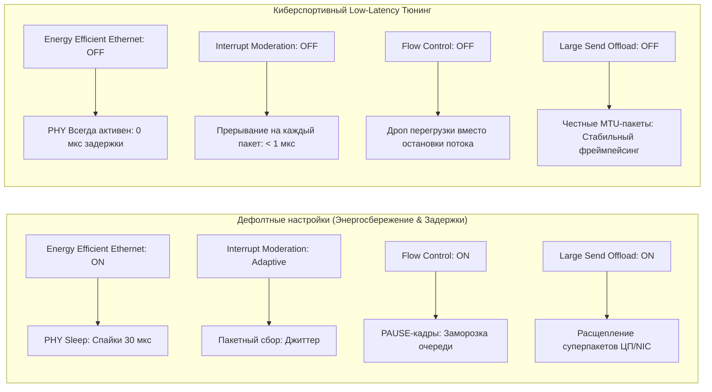
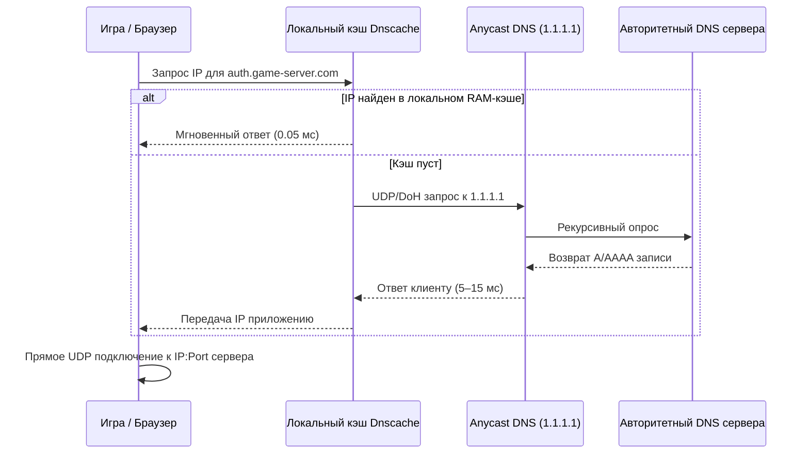
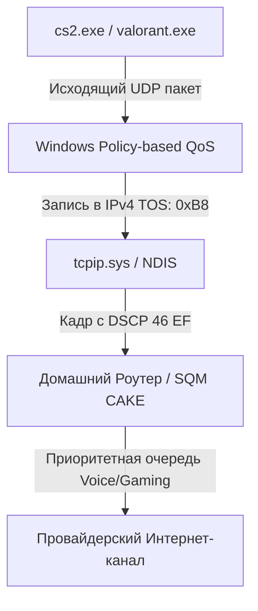

# Сетевой стек Windows, TCP/IP, UDP, сетевые адаптеры и задержки в играх (Network Latency Engineering)

> **Статус документа:** Исчерпывающее техническое руководство и низкоуровневый анализ  
> **Целевая аудитория:** Системные инженеры, сетевые архитекторы, киберспортсмены, low-latency исследователи  
> **Совместимость:** Windows 10 (21H2–22H2), Windows 11 (22H2–24H2), Windows Server 2019/2022/2025  

---

## Содержание

1. [Низкоуровневая архитектура сетевого стека Windows (Kernel & Hardware Level)](#1-низкоуровневая-архитектура-сетевого-стека-windows-kernel--hardware-level)
   - [1.1. Физический уровень, Ethernet-кадры и аппаратный тракт NIC](#11-физический-уровень-ethernet-кадры-и-аппаратный-тракт-nic)
   - [1.2. Ingress Pipeline: Путь входящего пакета от кабеля до приложения](#12-ingress-pipeline-путь-входящего-пакета-от-кабеля-до-приложения)
   - [1.3. Egress Pipeline: Путь исходящего пакета от сокета до кабеля](#13-egress-pipeline-путь-исходящего-пакета-от-сокета-до-кабеля)
   - [1.4. Декомпозиция сетевой задержки (Latency Breakdown)](#14-декомпозиция-сетевой-задержки-latency-breakdown)
   - [1.5. Механика протоколов в соревновательных играх: TCP против UDP](#15-механика-протоколов-в-соревновательных-играх-tcp-против-udp)
2. [Оптимизация подсистемы TCP/IP через системный реестр](#2-оптимизация-подсистемы-tcpip-через-системный-реестр)
   - [2.1. Алгоритм Нейгла (RFC 896) и Delayed ACK (RFC 1122): Патология задержки 200 мс](#21-алгоритм-нейгла-rfc-896-и-delayed-ack-rfc-1122-патология-задержки-200-мс)
   - [2.2. Параметры интерфейсов: `TcpAckFrequency`, `TCPNoDelay`, `TCPDelAckTicks`](#22-параметры-интерфейсов-tcpackfrequency-tcpnodelay-tcpdelackticks)
   - [2.3. Сетевой троттлинг MMCSS: `NetworkThrottlingIndex` и `SystemResponsiveness`](#23-сетевой-троттлинг-mmcss-networkthrottlingindex-и-systemresponsiveness)
   - [2.4. Тюнинг драйвера сокетов AFD (`FastSendDatagramThreshold`)](#24-тюнинг-драйвера-сокетов-afd-fastsenddatagramthreshold)
   - [2.5. Параметры `DefaultTTL`, `MaxUserPort`, `TcpTimedWaitDelay`, `DisableUserTOSSetting`](#25-параметры-defaultttl-maxuserport-tcptimedwaitdelay-disableusertossetting)
3. [Глобальные параметры Netsh TCP и PowerShell NetTCPSetting](#3-глобальные-параметры-netsh-tcp-и-powershell-nettcpsetting)
   - [3.1. TCP Auto-Tuning Level: Механика масштабирования окна (RFC 1323)](#31-tcp-auto-tuning-level-механика-масштабирования-окна-rfc-1323)
   - [3.2. Алгоритмы управления перегрузкой (Congestion Providers: CUBIC vs BBR2 vs CTCP vs NewReno)](#32-алгоритмы-управления-перегрузкой-congestion-providers-cubic-vs-bbr2-vs-ctcp-vs-newreno)
   - [3.3. Явное уведомление о перегрузке (ECN Capability)](#33-явное-уведомление-о-перегрузке-ecn-capability)
   - [3.4. RSS (Receive Side Scaling) против RSC (Receive Segment Coalescing)](#34-rss-receive-side-scaling-против-rsc-receive-segment-coalescing)
   - [3.5. Дополнительные глобальные параметры: Fast Open, Timestamps, Initial/Min RTO](#35-дополнительные-глобальные-параметры-fast-open-timestamps-initialmin-rto)
4. [Аппаратный тюнинг сетевых карт (NIC Driver Advanced Properties)](#4-аппаратный-тюнинг-сетевых-карт-nic-driver-advanced-properties)
   - [4.1. Энергосбережение: EEE (802.3az), Green Ethernet, Ultra Low Power Mode](#41-энергосбережение-eee-8023az-green-ethernet-ultra-low-power-mode)
   - [4.2. Interrupt Moderation (ITR): Прерывания реального времени против пакетной обработки](#42-interrupt-moderation-itr-прерывания-реального-времени-против-пакетной-обработки)
   - [4.3. Аппаратные кольцевые буферы (Rx/Tx Descriptors): Баланс Bufferbloat и Packet Drop](#43-аппаратные-кольцевые-буферы-rxtx-descriptors-баланс-bufferbloat-и-packet-drop)
   - [4.4. Flow Control (IEEE 802.3x): Опасность PAUSE-кадров в соревновательном гейминге](#44-flow-control-ieee-8023x-опасность-pause-кадров-в-соревновательном-гейминге)
   - [4.5. Large Send Offload (LSO v2) и Checksum Offload: Аппаратная разгрузка ЦП](#45-large-send-offload-lso-v2-и-checksum-offload-аппаратная-разгрузка-цп)
   - [4.6. Speed & Duplex: Автосогласование 802.3ab и принудительные режимы](#46-speed--duplex-автосогласование-8023ab-и-принудительные-режимы)
5. [Изоляция прерываний, MSI-X и аффинити ядер (DPC/ISR Isolation)](#5-изоляция-прерываний-msi-x-и-аффинити-ядер-dpcisr-isolation)
   - [5.1. Архитектура MSI-X и таблица векторов прерываний](#51-архитектура-msi-x-и-таблица-векторов-прерываний)
   - [5.2. Настройка `Affinity Policy` и привязка очередей к физическим ядрам ЦП](#52-настройка-affinity-policy-и-привязка-очередей-к-физическим-ядрам-цп)
   - [5.3. Диагностика DPC/ISR латентности через LatencyMon и Windows Performance Analyzer (ETW)](#53-диагностика-dpcisr-латентности-через-latencymon-и-windows-performance-analyzer-etw)
6. [DNS-оптимизация, шифрование DoH и сетевые службы](#6-dns-оптимизация-шифрование-doh-и-сетевые-службы)
   - [6.1. Жизненный цикл DNS-запроса и его влияние на игровой процесс](#61-жизненный-цикл-dns-запроса-и-его-влияние-на-игровой-процесс)
   - [6.2. Anycast DNS-резолверы: Cloudflare, Google, Quad9](#62-anycast-dns-резолверы-cloudflare-google-quad9)
   - [6.3. Настройка DNS over HTTPS (DoH) в Windows 11](#63-настройка-dns-over-https-doh-в-windows-11)
   - [6.4. Оптимизация кэша `Dnscache` и отключение LLMNR/NetBIOS](#64-оптимизация-кэша-dnscache-и-отключение-llmnrnetbios)
7. [Борьба с Bufferbloat: Маршрутизаторы, SQM (CAKE / fq_codel) и QoS DSCP](#7-борьба-с-bufferbloat-маршрутизаторы-sqm-cake--fq_codel-и-qos-dscp)
   - [7.1. Физическая природа Bufferbloat: Почему раздутые буферы убивают пинг](#71-физическая-природа-bufferbloat-почему-раздутые-буферы-убивают-пинг)
   - [7.2. Smart Queue Management (SQM): fq_codel и CAKE на уровне роутера](#72-smart-queue-management-sqm-fq_codel-и-cake-на-уровне-роутера)
   - [7.3. Маркировка пакетов QoS DSCP на Windows (Policy-based QoS)](#73-маркировка-пакетов-qos-dscp-на-windows-policy-based-qos)
8. [Мифы, плацебо и опасные твики сетевого стека](#8-мифы-плацебо-и-опасные-твики-сетевого-стека)
9. [Комплексные скрипты автоматизации и безопасного отката](#9-комплексные-скрипты-автоматизации-и-безопасного-отката)
   - [9.1. Production-Grade PowerShell скрипт оптимизации](#91-production-grade-powershell-скрипт-оптимизации)
   - [9.2. Скрипт восстановления заводских настроек Windows (Rollback)](#92-скрипт-восстановления-заводских-настроек-windows-rollback)
10. [Справочные материалы, стандарты RFC и инструментарий](#10-справочные-материалы-стандарты-rfc-и-инструментарий)

---

## 1. Низкоуровневая архитектура сетевого стека Windows (Kernel & Hardware Level)

### 1.1. Физический уровень, Ethernet-кадры и аппаратный тракт NIC

Сетевая коммуникация на канальном уровне Ethernet (IEEE 802.3) функционирует дискретными блоками данных — **кадрами (Ethernet Frames)**. 

```
+-------------------+---------------+--------------------+------------------+---------------+-----------+
| Преамбула + SFD   | Заголовок MAC | Заголовок IP (IPv4)| Заголовок TCP/UDP| Полезная нагр.| FCS (CRC) |
| (8 байт)          | (14 байт)     | (20 байт)          | (20/8 байт)      | (46-1460 байт)| (4 байта) |
+-------------------+---------------+--------------------+------------------+---------------+-----------+
                    <--------------------------- MTU (1500 байт) --------------------------->
```

Между кадрами на физической среде передачи обязательно выдерживается **Inter-Packet Gap (IPG)** длительностью в 96 битовых интервалов (96 нс для 1 Гбит/с, 9.6 нс для 10 Гбит/с), необходимый для восстановления тактовой синхронизации PHY-трансивера.

Сетевой адаптер (Network Interface Card, NIC) состоит из следующих критических аппаратных узлов:
1. **PHY (Physical Layer Transceiver):** Преобразует аналоговые сигналы витой пары (1000BASE-T PAM-5, 2.5GBASE-T PAM-16) в цифровые последовательности символов.
2. **MAC (Media Access Control Engine):** Проверяет контрольную сумму кадра (FCS/CRC32), фильтрует MAC-адреса, удаляет преамбулу.
3. **RX/TX FIFO (First-In, First-Out SRAM):** Встроенная статическая память контроллера для первичного приема байт до выгрузки в системную память через шину PCIe.
4. **DMA Controller (Direct Memory Access):** Аппаратный контроллер, переносящий пакеты напрямую из SRAM адаптера в оперативную память (RAM) хоста по шине PCIe в виде Transaction Layer Packets (TLP) минуя процессор.
5. **MSI-X Interrupt Engine:** Генерирует адресные прерывания PCIe Message Signaled Interrupts для оповещения ядер ЦП о готовности новых дескрипторов.

```mermaid
flowchart TD
    subgraph Hardware ["Аппаратный уровень (NIC & PCIe)"]
        PHY[PHY Transceiver] -->|Аналоговый сигнал в цифру| MAC[MAC Controller]
        MAC -->|Проверка CRC / Фильтрация| RXFIFO[RX FIFO SRAM]
        RXFIFO -->|DMA Transfer через PCIe TLP| HostRAM[Host RAM: RX Ring Buffer Descriptors]
        HostRAM -->|Trigger| MSIX[MSI-X Interrupt Engine]
    end

    subgraph Kernel ["Ядро Windows (NDIS & Network Stack)"]
        MSIX -->|PCIe Interrupt Vector| LAPIC[Local APIC CPU Core]
        LAPIC -->|ISR Вызов| MiniportISR["NDIS Miniport ISR (ndis.sys / e1d.sys)"]
        MiniportISR -->|Очередь DPC (Queue)| DPCQueue[DPC Queue: KiExecuteDpcList]
        DPCQueue -->|Обработка кольца дескрипторов| MiniportDPC[Miniport Interrupt DPC]
        MiniportDPC -->|NET_BUFFER_LIST (NBL)| NDISProt["NDIS Protocol Driver (tcpip.sys)"]
        NDISProt -->|Маршрутизация / Сборка / Демультиплексирование| AFD[AFD.sys - Ancillary Function Driver]
    end

    subgraph UserMode ["Пользовательский режим (User-Mode Application)"]
        AFD -->|Сокетные буферы SO_RCVBUF| Winsock[Winsock 2: ws2_32.dll]
        Winsock -->|IOCP / RIO / recvfrom| GameThread[Game Engine Thread: CS2 / Valorant / Apex]
    end
```

---

### 1.2. Ingress Pipeline: Путь входящего пакета от кабеля до приложения

Каждый сетевой пакет, приходящий на сетевую карту, проходит строгую многоступенчатую цепочку обработки в ядре Windows:

1. **Аппаратный прием и DMA-трансфер:**
   - Кадр поступает в PHY, декодируется MAC-контроллером.
   - Контроллер DMA запрашивает следующий свободный дескриптор из **RX Ring Buffer** (выделенного драйвером пула физической памяти RAM).
   - Пакет записывается в память хоста через PCIe TLP Memory Write.
2. **Прерывание (ISR - Interrupt Service Routine):**
   - Контроллер генерирует прерывание **MSI-X**.
   - Local APIC целевого ядра процессора переводит ядро на уровень приоритета прерываний `DIRQL` (Device IRQL).
   - Выполняется функция `MiniportISR` драйвера сетевой карты (`ndis.sys` / `rt640x64.sys` / `e1d68x64.sys`).
   - Задача ISR минимальна: замаскировать аппаратные прерывания на контроллере (чтобы не переполнить стек), прочитать статус регистра и поставить в очередь ядра `DPC` (Deferred Procedure Call). Время выполнения ISR: **< 1–2 мкс**.
3. **Отложенный вызов процедур (DPC) и NDIS:**
   - Планировщик Windows выполняет DPC на уровне `DISPATCH_LEVEL` (IRQL 2).
   - Функция `MiniportDpc` драйвера читает дескрипторы RX Ring, оборачивает память пакета в структуры Windows **`NET_BUFFER_LIST` (NBL)** и **`NET_BUFFER` (NB)**.
   - NDIS передает цепочку NBL в протокольный драйвер ядра **`tcpip.sys`**.
4. **Обработка в `tcpip.sys`:**
   - Парсинг заголовков IPv4/IPv6 (проверка TTL, контрольных сумм, фрагментации).
   - Парсинг транспортного уровня:
     - Для **TCP**: Проверка порядкового номера (Sequence Number), флагов SYN/ACK/FIN/PSH, обновление скользящего окна (Sliding Window), обработка алгоритма перегрузки, отправка ACK.
     - Для **UDP**: Проверка порта источника/назначения, валидация длины дейтаграммы, мгновенная передача в сокетную подсистему без фазы квитирования.
5. **Драйвер сокетов AFD (`afd.sys`) и Winsock (`ws2_32.dll`):**
   - `tcpip.sys` передает данные в `afd.sys` (Ancillary Function Driver for WinSock).
   - `afd.sys` помещает дейтаграмму/сегмент в кольцевой буфер приема сокета (`SO_RCVBUF`).
   - Если сокет использует блокирующий `recv()` / `recvfrom()`, поток приложения пробуждается из состояния ожидания (`Wait`).
   - В высокопроизводительных движках используются асинхронный **I/O Completion Ports (IOCP)** или **Registered I/O (RIO)**, позволяющие потоку забирать пакеты напрямую из зарегистрированной памяти без лишнего копирования (`Zero-Copy`).

---

### 1.3. Egress Pipeline: Путь исходящего пакета от сокета до кабеля

Отправка пакета игровым движком (например, отправка тика с координатами и действиями игрока `usercmd`):

1. Приложение вызывает `sendto()` (UDP) или `send()` (TCP) в `ws2_32.dll`.
2. Запрос падает через `DeviceIoControl` в `afd.sys`.
3. `afd.sys` блокирует страницы памяти (Lock Pages) или копирует буфер в системный пул, формируя I/O Request Packet (IRP) или структуру NBL.
4. `tcpip.sys` формирует заголовок TCP/UDP, вычисляет порт, добавляет заголовок IPv4 (вычисляет Checksum, устанавливает DSCP/TOS, TTL), определяет маршрут по таблице маршрутизации и ARP-кэшу.
5. NDIS передает NBL в Miniport Driver сетевой карты.
6. Драйвер помещает физический адрес буфера в **TX Ring Buffer Descriptors**.
7. DMA контроллер сетевой карты вычитывает данные из RAM по PCIe шине в TX FIFO.
8. MAC формирует Ethernet-кадр (CRC32), PHY модулирует физический сигнал в витую пару.

---

### 1.4. Декомпозиция сетевой задержки (Latency Breakdown)

Общее время прохождения пакета в оба конца (**RTT — Round-Trip Time / Ping**) складывается из четырех фундаментальных физических и программных компонентов:

$$\text{RTT} = 2 \times (T_{\text{prop}} + T_{\text{trans}} + T_{\text{proc}} + T_{\text{queue}})$$

| Компонент задержки | Физическая / Программная сущность | Типичное значение | Возможность оптимизации |
| :--- | :--- | :--- | :--- |
| **$T_{\text{prop}}$ (Propagation Delay)** | Скорость распространения электромагнитной волны в среде: в оптоволокне $v \approx 200\,000\text{ км/с}$ ($\approx 5\text{ мкс/км}$), в меди $\approx 230\,000\text{ км/с}$. | 5–40 мс (зависит от расстояния до сервера) | Выбор географически близкого сервера, оптимизация BGP-маршрутов провайдера. |
| **$T_{\text{trans}}$ (Transmission Delay)** | Время, необходимое для выталкивания всех битов пакета в среду передачи: $T_{\text{trans}} = \frac{L}{C}$ ($L$ — размер пакета в битах, $C$ — пропускная способность канала). Для пакета 1500 байт на 100 Мбит/с: $120\text{ мкс}$, на 1 Гбит/с: $12\text{ мкс}$. | 1.2–120 мкс | Повышение скорости физического линка (1 Gbps / 2.5 Gbps), уменьшение лишнего оверхеда. |
| **$T_{\text{proc}}$ (Processing Delay)** | Время обработки пакета в NIC, PCIe транзакциях, исполнении ISR/DPC, стеке NDIS `tcpip.sys` и планировщике потоков Windows. | 5–150 мкс | **Прямой фокус данного руководства:** Отключение энергосбережения NIC, аффинити прерываний, отключение троттлинга MMCSS, отключение RSC. |
| **$T_{\text{queue}}$ (Queuing Delay)** | Время ожидания пакета в очередях буферов NIC хоста, коммутаторов, домашнего роутера и оборудования провайдера (**Bufferbloat**). | **0.5 мс – 500+ мс** (при перегрузке) | Настройка SQM (CAKE/fq_codel) на роутере, отключение Flow Control, правильный размер Rx/Tx дескрипторов. |

**Джиттер (Jitter)** — это дисперсия (вариация) задержки пакетов во времени:

$$\text{Jitter} = |RTT_{(i)} - RTT_{(i-1)}|$$

В соревновательных играх высокий джиттер даже при низком среднем пинге приводит к разрушению плавности: клиентский буфер интерполяции не успевает компенсировать разрывы, вызывая телепортации моделей игроков и "проглатывание" попаданий (hitreg inconsistency).

---

### 1.5. Механика протоколов в соревновательных играх: TCP против UDP

| Характеристика | TCP (Transmission Control Protocol) | UDP (User Datagram Protocol) |
| :--- | :--- | :--- |
| **Ориентация** | Потоковый (Stream-oriented), надежный. | Дейтаграммный (Datagram-oriented), ненадежный. |
| **Установка соединения** | 3-Way Handshake (SYN -> SYN-ACK -> ACK) — потеря 1 RTT. | Отсутствует (Connectionless). Мгновенная отправка данных. |
| **Гарантия доставки** | Обязательная: потерянный сегмент переотправляется (ARQ). | Отсутствует: потерянные пакеты игнорируются. |
| **Head-of-Line Blocking** | **Да (Критично):** Если пакет №2 потерян, пакеты №3, №4, №5 задерживаются в буфере ОС и не отдаются приложению до переотправки №2. | **Нет:** Приложение мгновенно получает пакет №3, даже если №2 потерян. |
| **Управление перегрузкой** | Обязательно (AIMD, CUBIC, BBR) — искусственно зажимает скорость при потерях. | Отсутствует на уровне ядра (управляется кодом самого игрового движка). |
| **Применение в играх** | Авторизация, лобби, внутриигровые магазины, чат, загрузка ассетов, MMORPG старого типа (WoW). | **Игровой цикл (Netcode):** CS2 (Sub-tick), Valorant (128-tick), Apex Legends (20-tick), Warzone, Fortnite, Overwatch 2. |

#### Почему соревновательные шутеры используют UDP
В соревновательном сетевом коде данные устаревают каждые 8–15 миллисекунд (один тикрейт). Если пакет с координатами противника за кадр $N$ потерялся, его переотправка через 50–100 мс по TCP **абсолютно бесполезна**, так как в кадре $N+5$ координаты уже изменились. Механизм Head-of-Line Blocking в TCP заблокировал бы доставку актуальных данных, вызвав мгновенный фриз игры. UDP позволяет игровому движку самому управлять состоянием через Snapshot Interpolation, Delta Compression и Client-Side Prediction / Rollback Netcode.

---

## 2. Оптимизация подсистемы TCP/IP через системный реестр

### 2.1. Алгоритм Нейгла (RFC 896) и Delayed ACK (RFC 1122): Патология задержки 200 мс

В 1984 году Джон Нейгл создал алгоритм для борьбы с проблемой "Small-Packet Problem" (когда заголовок TCP/IP занимает 40 байт, а полезная нагрузка — 1 байт, создавая оверхед 4000%). 

**Правило Нейгла (RFC 896):**
Если у приложения есть неотправленные данные размером меньше размера максимального сегмента (MSS, обычно 1460 байт), эти данные **НЕ отправляются**, пока не будет получено подтверждение (ACK) от удаленной стороны на все ранее отправленные пакеты.

**Отложенное подтверждение (Delayed ACK, RFC 1122):**
Принимающая сторона не отправляет ACK немедленно на каждый входящий сегмент, а ждет до **200 мс** (или второго входящего сегмента), чтобы "прицепить" (piggyback) подтверждение к исходящему пакету данных.

#### Патологический тупик (ACK Delay Pathology):
Когда игра на TCP отправляет мелкий запрос (например, 64 байта) и ждет ответ от сервера, а сервер отправляет 64 байта и ждет подтверждения:
1. Клиент отправил пакет и включил алгоритм Нейгла.
2. Сервер получил пакет, но включил таймер Delayed ACK на 200 мс.
3. Клиент не может отправить следующий пакет, потому что ждет ACK.
4. Сервер не отправляет ACK, потому что ждет данных от клиента или истечения 200 мс.
5. **Результат:** Искусственная задержка ровно в **200 миллисекунд** на пустом месте.

---

### 2.2. Параметры интерфейсов: `TcpAckFrequency`, `TCPNoDelay`, `TCPDelAckTicks`

Для ликвидации задержек в TCP-приложениях и MMO-играх параметры выставляются в реестре для каждого сетевого интерфейса.

Путь в реестре:  
`HKLM\SYSTEM\CurrentControlSet\Services\Tcpip\Parameters\Interfaces\{GUID}`  
*(где `{GUID}` — уникальный идентификатор вашего сетевого адаптера)*

```
                       Сетевой интерфейс {GUID}
+--------------------------------------------------------------------+
| TcpAckFrequency = 1 (DWORD)  -> Немедленный ACK на каждый пакет   |
| TCPNoDelay      = 1 (DWORD)  -> Принудительное отключение Nagle   |
| TcpDelAckTicks  = 0 (DWORD)  -> Обнуление таймера задержки ACK    |
+--------------------------------------------------------------------+
```

| Параметр | Тип | Значение по умолчанию | Оптимальное значение | Техническое описание |
| :--- | :--- | :--- | :--- | :--- |
| **`TcpAckFrequency`** | `REG_DWORD` | `2` (или отсутствует) | `1` | Задает количество пакетов, после которого отправляется ACK. При значении `1` подтверждение уходит **немедленно** на каждый полученный TCP-сегмент без ожидания таймера Delayed ACK. |
| **`TCPNoDelay`** | `REG_DWORD` | `0` (или отсутствует) | `1` | Отключает алгоритм Нейгла на уровне сокетов интерфейса. Пакеты любого размера выталкиваются в сетевой стек мгновенно. |
| **`TcpDelAckTicks`** | `REG_DWORD` | `2` (200 мс) | `0` | Задает интервал таймера Delayed ACK (1 тик = 100 мс в ядре NT). `0` полностью отключает отложенные подтверждения. *(Задается в `Tcpip\Parameters`)*. |

#### Команды PowerShell для автоматического поиска активного сетевого GUID и применения:
```powershell
# Определение GUID активного сетевого адаптера с IPv4 шлюзом
$ActiveAdapter = Get-NetAdapter | Where-Object { $_.Status -eq "Up" -and $_.HardwareInterface -eq $true } | Select-Object -First 1
$AdapterGuid = $ActiveAdapter.InterfaceGuid

$TcpInterfacesPath = "HKLM:\SYSTEM\CurrentControlSet\Services\Tcpip\Parameters\Interfaces\$AdapterGuid"

# Применение низколатентных параметров TCP
Set-ItemProperty -Path $TcpInterfacesPath -Name "TcpAckFrequency" -Value 1 -Type DWord -Force
Set-ItemProperty -Path $TcpInterfacesPath -Name "TCPNoDelay" -Value 1 -Type DWord -Force

# Глобальное обнуление тиков Delayed ACK
Set-ItemProperty -Path "HKLM:\SYSTEM\CurrentControlSet\Services\Tcpip\Parameters" -Name "TcpDelAckTicks" -Value 0 -Type DWord -Force
```

---

### 2.3. Сетевой троттлинг MMCSS: `NetworkThrottlingIndex` и `SystemResponsiveness`

В операционные системы семейства Windows NT встроен сервис **Multimedia Class Scheduler Service (MMCSS)**. Исторически (начиная с Windows Vista) при воспроизведении любого мультимедийного потока (аудио через WASAPI, видео в браузере, Discord голосовая связь) Windows ограничивает обработку не-мультимедийных сетевых пакетов для предотвращения "заикания" звука на слабых одноядерных процессорах.

Путь в реестре:  
`HKLM\SOFTWARE\Microsoft\Windows NT\CurrentVersion\Multimedia\SystemProfile`

```
+---------------------------------------------------------------------------------------------------+
| NetworkThrottlingIndex = 0xFFFFFFFF (DWORD) -> Полное отключение троттлинга сетевых пакетов      |
| SystemResponsiveness   = 0x00000000 (DWORD) -> 100% процессорных квантов для игровых задач        |
+---------------------------------------------------------------------------------------------------+
```

#### Механизм троттлинга:
По умолчанию `NetworkThrottlingIndex = 10` (`0x0000000a`). Это означает, что при воспроизведении звука/видео ядро Windows обрабатывает максимум **10 000 пакетов в секунду (pps)** на интерфейсе, искусственно задерживая остальные пакеты в очереди DPC. При превышении лимита пакеты отбрасываются (Drop), вызывая резкие спайки пинга и потерю пакетов (Loss) в играх во время общения в Discord или прослушивания музыки.

- `NetworkThrottlingIndex = 0xFFFFFFFF` (шестнадцатеричное `ffffffff`, десятичное `4294967295`) — **полностью отключает сетевой троттлинг**. Драйвер NDIS обрабатывает все входящие пакеты с максимально возможной скоростью без лимита pps.
- `SystemResponsiveness = 0` (десятичное `0`, по умолчанию `20`) — указывает планировщику MMCSS выделять **0%** процессорного времени на фоновые системные мультимедийные задачи в пользу приложений реального времени с высоким приоритетом (Foreground Game Process).

```powershell
Set-ItemProperty -Path "HKLM:\SOFTWARE\Microsoft\Windows NT\CurrentVersion\Multimedia\SystemProfile" -Name "NetworkThrottlingIndex" -Value 0xFFFFFFFF -Type DWord -Force
Set-ItemProperty -Path "HKLM:\SOFTWARE\Microsoft\Windows NT\CurrentVersion\Multimedia\SystemProfile" -Name "SystemResponsiveness" -Value 0 -Type DWord -Force
```

---

### 2.4. Тюнинг драйвера сокетов AFD (`FastSendDatagramThreshold`)

**AFD.sys (Ancillary Function Driver for WinSock)** — это шлюз ядра Windows между сокетами WinSock2 пользовательского режима и протокольным стеком `tcpip.sys`.

Путь в реестре:  
`HKLM\SYSTEM\CurrentControlSet\Services\AFD\Parameters`

| Параметр | Тип | По умолчанию | Оптимальное значение | Техническое обоснование |
| :--- | :--- | :--- | :--- | :--- |
| **`FastSendDatagramThreshold`** | `REG_DWORD` | `1024` (байт) | `1500` | Определяет максимальный размер UDP-дейтаграммы, которая отправляется через высокоскоростной внутренний путь ядра (Fast I/O Path) без блокировки и аллокации промежуточных IRP структур. Установка в `1500` охватывает стандартный размер Ethernet MTU, снижая латентность отправки UDP-пакетов в шутерах. |
| **`FastCopyReceiveThreshold`** | `REG_DWORD` | `1024` (байт) | `1500` | Позволяет драйверу копировать входящие сетевые дейтаграммы размером до 1500 байт по быстрому пути передачи в буфер сокета приложения. |
| **`DoNotUseNLA`** | `REG_SZ` / `DWORD` | Отсутствует | `1` *(в `Tcpip\QoS`)* | Заставляет сетевой стек применять политики QoS без обязательной валидации через службу Network Location Awareness (NLA). |

```powershell
If (!(Test-Path "HKLM:\SYSTEM\CurrentControlSet\Services\AFD\Parameters")) {
    New-Item -Path "HKLM:\SYSTEM\CurrentControlSet\Services\AFD\Parameters" -Force | Out-Null
}
Set-ItemProperty -Path "HKLM:\SYSTEM\CurrentControlSet\Services\AFD\Parameters" -Name "FastSendDatagramThreshold" -Value 1500 -Type DWord -Force
Set-ItemProperty -Path "HKLM:\SYSTEM\CurrentControlSet\Services\AFD\Parameters" -Name "FastCopyReceiveThreshold" -Value 1500 -Type DWord -Force
```

---

### 2.5. Параметры `DefaultTTL`, `MaxUserPort`, `TcpTimedWaitDelay`, `DisableUserTOSSetting`

Путь в реестре:  
`HKLM\SYSTEM\CurrentControlSet\Services\Tcpip\Parameters`

```powershell
$TcpParamsPath = "HKLM:\SYSTEM\CurrentControlSet\Services\Tcpip\Parameters"

# DefaultTTL: 64 (Стандарт Linux/Unix, снижает вероятность зацикливания пакетов и стандартизирует стек)
Set-ItemProperty -Path $TcpParamsPath -Name "DefaultTTL" -Value 64 -Type DWord -Force

# MaxUserPort: 65534 (Расширяет диапазон эфемерных портов для высокоинтенсивных сетевых сессий)
Set-ItemProperty -Path $TcpParamsPath -Name "MaxUserPort" -Value 65534 -Type DWord -Force

# TcpTimedWaitDelay: 30 (Снижает время удержания закрытого сокета в состоянии TIME_WAIT с 240 до 30 секунд)
Set-ItemProperty -Path $TcpParamsPath -Name "TcpTimedWaitDelay" -Value 30 -Type DWord -Force

# DisableUserTOSSetting: 0 (Разрешает приложениям и политикам QoS управлять байтом Type of Service / DSCP в заголовке IP)
Set-ItemProperty -Path $TcpParamsPath -Name "DisableUserTOSSetting" -Value 0 -Type DWord -Force

# Отключение резервирования 20% полосы планировщиком пакетов QoS
If (!(Test-Path "HKLM:\SOFTWARE\Policies\Microsoft\Windows\Psched")) {
    New-Item -Path "HKLM:\SOFTWARE\Policies\Microsoft\Windows\Psched" -Force | Out-Null
}
Set-ItemProperty -Path "HKLM:\SOFTWARE\Policies\Microsoft\Windows\Psched" -Name "NonBestEffortLimit" -Value 0 -Type DWord -Force
```

---

## 3. Глобальные параметры Netsh TCP и PowerShell NetTCPSetting

### 3.1. TCP Auto-Tuning Level: Механика масштабирования окна (RFC 1323)

Размер окна приема (**RWIN — Receive Window**) определяет объем данных в байтах, который отправитель может выдать в сеть до получения первого подтверждения (ACK). 

В классическом TCP заголовок выделяет под размер окна всего 16 бит (максимум $2^{16} - 1 = 65\,535\text{ байт} = 64\text{ КБ}$). На каналах с высоким произведением емкости на задержку (**BDP — Bandwidth-Delay Product**):

$$\text{BDP} = \text{Bandwidth (бит/с)} \times \text{RTT (секунды)}$$

*Пример:* На гигабитном канале (1000 Мбит/с) при пинге до европейского сервера 40 мс:
$$\text{BDP} = 1\,000\,000\,000 \times 0.040 = 40\,000\,000\text{ бит} = 5\text{ Мбайт}$$

Если окно ограничено 64 КБ, максимальная теоретическая скорость составит:
$$\text{Max Throughput} = \frac{\text{RWIN}}{\text{RTT}} = \frac{65535 \times 8}{0.040} \approx 13.1\text{ Мбит/с}$$

> [!WARNING]
> **Опасный миф:** Отключение Auto-Tuning (`autotuninglevel=disabled`) блокирует TCP Window Scaling (RFC 1323) и ограничивает размер RWIN величиной **64 КБ**. Это уничтожает скорость скачивания на любых современных тарифах выше 15 Мбит/с и **не снижает пинг в играх**!

#### Режимы Auto-Tuning в Windows:
- `disabled`: Фиксация RWIN на 64 КБ (Категорически запрещено).
- `highlyrestricted`: Масштабирование окна с консервативным коэффициентом.
- `restricted`: Умеренное увеличение окна.
- `normal` (**Рекомендуется**): Динамическое масштабирование окна вплоть до 16 МБ в зависимости от BDP и пропускной способности.
- `experimental`: Агрессивное масштабирование окна (может вызывать микро-перегрузки буферов на некоторых роутерах).

Команда:
```cmd
netsh int tcp set global autotuninglevel=normal
```

---

### 3.2. Алгоритмы управления перегрузкой (Congestion Providers: CUBIC vs BBR2 vs CTCP vs NewReno)

Алгоритм контроля перегрузок определяет, как стек TCP наращивает окно перегрузки ($cwnd$) при успешной передаче и как сжимает его при потере пакетов.

```
       AIMD / NewReno                     CUBIC (Кубическая кривая)              BBRv2 (Моделирование линка)
      cwnd                               cwnd                                   cwnd
       ^    /|  /|  /|                    ^     .---.     .---.                  ^  ====  ====  ====
       |   / | / | / |                    |    /     \   /     \                 |  |  |  |  |  |  |
       |  /  |/  |/  |                    |   /       '-'       '-'              |  |  |  |  |  |  |
       +--------------> Время             +-------------------------> Время      +-------------------------> Время
       Линейный рост / Сброс на 50%       Быстрое восстановление емкости         Контроль по RTT + Bottleneck BW
```

1. **NewReno (RFC 6582):** Классический алгоритм AIMD (Additive Increase, Multiplicative Decrease). Медленный линейный рост, резкий сброс окна на 50% при малейшем дропе. Устарел.
2. **Compound TCP (CTCP):** Проприетарный алгоритм Microsoft. Комбинирует оценку потерь с отслеживанием изменений RTT (Delay-based). Эффективен, но уступает современным стандартам.
3. **CUBIC (RFC 8312):** Стандарт по умолчанию в Linux и современных сборках Windows 10/11. Функция окна описывается кубическим уравнением от времени с момента последней перегрузки. Обеспечивает стабильный пинг, быстрое заполнение гигабитных каналов и минимальный джиттер.
4. **BBRv2 (Bottleneck Bandwidth and RTT):** Разработка Google. Вместо реагирования на потери пакетов строит модель реальной пропускной способности узкого места и минимального RTT физического канала, кардинально снижая задержку при перегрузках.

> [!CAUTION]
> **Критический баг BBRv2 на Windows 11 (23H2 / 24H2):**  
> Принудительное включение `bbr2` через `netsh` на клиентах Windows 11 вызывает повреждение Loopback-трафика (Localhost). Приводит к сбоям в Steam (`Connection Error`), локальных веб-серверах, Discord и ошибкам `NS_BINDING_ABORT` в браузерах.  
> **Рекомендация:** Использовать стабильный и проверенный **CUBIC** (`default` в современных версиях).

Команды настройки:
```cmd
:: Установка проверенного стабильного провайдера CUBIC для всех шаблонов
netsh int tcp set supplemental Template=Internet CongestionProvider=CUBIC
netsh int tcp set supplemental Template=Datacenter CongestionProvider=CUBIC
netsh int tcp set supplemental Template=Compat CongestionProvider=CUBIC
netsh int tcp set supplemental Template=DatacenterCustom CongestionProvider=CUBIC
netsh int tcp set supplemental Template=InternetCustom CongestionProvider=CUBIC
```

---

### 3.3. Явное уведомление о перегрузке (ECN Capability)

**ECN (Explicit Congestion Notification, RFC 3168)** позволяет маршрутизаторам на пути следования пакета сообщать о начале перегрузки буферов без физического сброса пакетов (Drop). Маршрутизатор выставляет биты `CE` (Congestion Experienced) в поле DiffServ/TOS заголовка IP, а принимающий хост возвращает флаг `ECE` в TCP-заголовке.

- `ecncapability=enabled`: Устраняет дропы пакетов на современных магистральных маршрутизаторах, снижая вероятность ретрансмиссий.
- `ecncapability=disabled`: Требуется только в случае, если устаревший провайдер или старый домашний роутер некорректно отбрасывает ECN-маркированные пакеты (ECN Blackhole).

Команда:
```cmd
netsh int tcp set global ecncapability=enabled
```

---

### 3.4. RSS (Receive Side Scaling) против RSC (Receive Segment Coalescing)

#### Receive Side Scaling (RSS) -> `rss=enabled` (ОБЯЗАТЕЛЬНО ВКЛЮЧИТЬ)
RSS позволяет сетевой карте вычислять хеш (Toeplitz Hash) по заголовкам входящих пакетов (IP источника/назначения, порты) и распределять обработку очередей прерываний и DPC по **разным ядрам процессора**. Это предотвращает "захлебывание" одного ядра при интенсивном входящем трафике.

#### Receive Segment Coalescing (RSC) -> `rsc=disabled` (ОБЯЗАТЕЛЬНО ОТКЛЮЧИТЬ ДЛЯ ГЕЙМИНГА)
RSC — аппаратная функция сетевой карты, объединяющая несколько последовательно пришедших TCP-сегментов в один гигантский пакет (до 64 КБ) прямо в буфере NIC до передачи в ядро `tcpip.sys`.
- **Плюс:** Снижает нагрузку на процессор при скачивании гигантских файлов на скоростях 10–40 Гбит/с.
- **Минус для игр:** Сетевой адаптер **придерживает пакеты во времени** (Packet Holding Time), ожидая накопления сегментов для склейки. Это вносит непредсказуемый аппаратный джиттер и микро-задержки в доставку пакетов реального времени!

Команды:
```cmd
netsh int tcp set global rss=enabled
netsh int tcp set global rsc=disabled
```

---

### 3.5. Дополнительные глобальные параметры: Fast Open, Timestamps, Initial/Min RTO

- **TCP Fast Open (`fastopen=enabled`):** (RFC 7413) Позволяет передавать полезные данные непосредственно внутри первого пакета `SYN` (если ранее был получен криптографический TFO-cookie). Экономит целый 1 RTT при повторных подключениях к игровым веб-сервисам и лобби.
- **Timestamps (`timestamps=disabled`):** (RFC 1323) Добавляет 12 байт временных меток в каждый TCP-заголовок. Отключение экономит полосу пропускания и устраняет оверхед вычисления меток таймера процессором на стабильных низколатентных проводных подключениях.
- **Initial RTO (`initialRto=2000`):** Задает начальный тайм-аут повторной передачи при установке соединения (по умолчанию 3000 мс). Снижение до 2000 мс ускоряет детекцию сбойных узлов.

Сводные команды PowerShell:
```powershell
# Глобальные параметры Netsh TCP
netsh int tcp set global autotuninglevel=normal
netsh int tcp set global rss=enabled
netsh int tcp set global rsc=disabled
netsh int tcp set global ecncapability=enabled
netsh int tcp set global timestamps=disabled
netsh int tcp set global fastopen=enabled
netsh int tcp set global initialRto=2000
netsh int tcp set global nonsackrttresiliency=disabled
netsh int tcp set global maxsynretransmissions=2
```

---

## 4. Аппаратный тюнинг сетевых карт (NIC Driver Advanced Properties)

Конфигурация драйверов сетевых карт (Intel Gigabit/2.5G/10G Ethernet, Realtek Gaming 2.5GbE/GbE Family Controller, Marvell AQtion 10GbE) осуществляется через стандартизированные NDIS-ключи (Standardized INF Keywords) и интерфейс `Set-NetAdapterAdvancedProperty`.



---

### 4.1. Энергосбережение: EEE (802.3az), Green Ethernet, Ultra Low Power Mode

- **Energy Efficient Ethernet (EEE / IEEE 802.3az):**  
  Переводит физический трансивер (PHY) в состояние **Low Power Idle (LPI)**, если в течение нескольких микросекунд нет трафика. При поступлении игрового пакета PHY требуется от **10 до 30 микросекунд** только на прогрев и выход из сна. Это порождает случайные микро-спайки задержки при каждом редком обмене тиками.
- **Green Ethernet / Power Saving Gigabit / Energy Saving:**  
  Снижает мощность передатчика в зависимости от длины кабеля. Приводит к деградации отношения сигнал/шум (SNR) и микро-ошибкам CRC на высоких частотах.
- **Действие:** **Полное отключение (`Disabled`) всех энергосберегающих функций.**

---

### 4.2. Interrupt Moderation (ITR): Прерывания реального времени против пакетной обработки

**Interrupt Moderation (Сглаживание/модерация прерываний)** заставляет контроллер задерживать генерацию аппаратного прерывания MSI-X, накапливая группу пакетов в буфере, чтобы выдать одно прерывание на всю пачку.

- **Включено (Adaptive / Low / Medium):** Экономит 1–3% нагрузки на слабых офисных процессорах, но превращает непрерывный поток данных в "дерганые" пачки, разрушая стабильность сетевого тикрейта.
- **Отключено (`Disabled` / `Off`):** Сетевая карта генерирует прерывание **мгновенно** при записи пакета в память через DMA. Обеспечивает минимально достижимый инпут-лаг сетевого стека (Sub-microsecond latency).
- **Требование:** Рекомендуется к отключению на современных многоядерных процессорах (AMD Ryzen 5000/7000/9000, Intel Core 12–14-го поколений).

---

### 4.3. Аппаратные кольцевые буферы (Rx/Tx Descriptors): Баланс Bufferbloat и Packet Drop

Дескрипторы приема (Receive Buffers / Rx Descriptors) и передачи (Transmit Buffers / Tx Descriptors) задают размер кольцевого буфера в оперативной памяти (RAM), куда контроллер помещает указатели на физические страницы памяти пакетов.

- **Слишком малый размер (например, 64–128):** При внезапном скачке фонового трафика или микро-задержке DPC кольцо переполняется, и NIC физически отбрасывает пакеты (Hardware Packet Drop).
- **Слишком большой размер (например, 2048–4096):** Создает локальный **Host Bufferbloat**: пакеты отстаиваются в длинной очереди драйвера перед отправкой, увеличивая латентность.
- **Оптимальный диапазон для киберспорта:** **512 — 1024 дескриптора** (для гигабитных и 2.5G линков).

---

### 4.4. Flow Control (IEEE 802.3x): Опасность PAUSE-кадров в соревновательном гейминге

Управление потоком (Flow Control) позволяет перегруженному коммутатору или сетевой карте отправлять специальный Ethernet-кадр паузы (**PAUSE Frame, Опкод 0x8808**), требуя от передающей стороны полностью заморозить отправку на указанное количество квантов времени.

В играх получение даже одного PAUSE-кадра замораживает передачу всех очередей пакетов на **1–10+ миллисекунд**, порождая критический сетевой лаг. В соревновательном сегменте предпочтительнее локальный сброс перегруженного пакета алгоритмом приложения, чем тотальная остановка физического линка.
- **Действие:** **Отключить (`Disabled`).**

---

### 4.5. Large Send Offload (LSO v2) и Checksum Offload: Аппаратная разгрузка ЦП

#### Large Send Offload (LSO v2 IPv4 & IPv6) -> `Disabled`
LSO позволяет операционной системе передавать сетевой карте один гигантский буфер размером до 64 КБ, поручая кремнию NIC самостоятельно разбивать его на пакеты размера MTU (1500 байт) и генерировать заголовки TCP/IP.
- **Проблема:** Включение LSO часто вызывает микро-зависания DPC-драйвера, неравномерность таймингов отправки пакетов и баги в драйверах Realtek/Intel.
- **Рекомендация:** **Отключить (`Disabled`).**

#### Checksum Offload (IPv4, TCP, UDP) -> `Rx & Tx Enabled` (ВКЛЮЧИТЬ)
Сетевая карта аппаратно на лету вычисляет и валидирует 16-битные контрольные суммы заголовков IP и сегментов TCP/UDP в кремниевых сумматорах MAC-блока с нулевой задержкой, полностью разгружая арифметико-логические устройства (ALU) процессора.
- **Рекомендация:** **Включить (`Rx & Tx Enabled`).**

---

### 4.6. Speed & Duplex: Автосогласование 802.3ab и принудительные режимы

Стандарт IEEE 802.3ab (1000BASE-T Gigabit Ethernet) **строго требует** обязательного протокола автосогласования (Auto-Negotiation) для корректного распределения ролей Master/Slave тактовой синхронизации по всем 4 витым парам. 
- Ручная принудительная установка `1.0 Gbps Full Duplex` на некоторых свитчах нарушает стандарт и может приводить к невидимым битовым ошибкам синхронизации или падению линка до 100 Мбит/с (Half Duplex).
- **Рекомендация:** Оставлять **`Auto Negotiation`**, за исключением случаев работы с редкими управляемыми свитчами 10G/2.5G с явной фиксацией скорости.

---

### Сводная таблица параметров NDIS и конфигурация через PowerShell

| Имя параметра в драйвере (Display Name) | NDIS Keyword | Рекомендуемое значение | Обоснование |
| :--- | :--- | :--- | :--- |
| **Energy Efficient Ethernet** | `*EEE` | `0` (Disabled) | Устранение спайков задержки при выходе PHY из LPI-сна |
| **Interrupt Moderation** | `*InterruptModeration` | `0` (Disabled) | Мгновенная доставка пакета в DPC без накопления |
| **Interrupt Moderation Rate** | `ITR` | `Off` / `0` | Отключение таймера сглаживания прерываний |
| **Flow Control** | `*FlowControl` | `0` (Disabled) | Предотвращение заморозки линка PAUSE-кадрами |
| **Large Send Offload v2 (IPv4)** | `*LsoV2IPv4` | `0` (Disabled) | Исключение задержек сегментации и спайков DPC |
| **Large Send Offload v2 (IPv6)** | `*LsoV2IPv6` | `0` (Disabled) | Исключение задержек сегментации и спайков DPC |
| **IPv4 Checksum Offload** | `*IPChecksumOffloadIPv4` | `3` (Rx & Tx Enabled) | Аппаратный расчет контрольных сумм в NIC |
| **TCP Checksum Offload (IPv4)**| `*TCPChecksumOffloadIPv4`| `3` (Rx & Tx Enabled) | Аппаратный расчет контрольных сумм в NIC |
| **UDP Checksum Offload (IPv4)**| `*UDPChecksumOffloadIPv4`| `3` (Rx & Tx Enabled) | Аппаратный расчет контрольных сумм в NIC |
| **Receive Side Scaling (RSS)** | `*RSS` | `1` (Enabled) | Распараллеливание очередей по ядрам ЦП |
| **Receive Segment Coalescing** | `*RscIPv4` / `*RscIPv6`| `0` (Disabled) | Устранение джиттера от объединения сегментов |
| **Receive Buffers (Rx)** | `*ReceiveBuffers` | `512` или `1024` | Предотвращение аппаратного сброса пакетов |
| **Transmit Buffers (Tx)** | `*TransmitBuffers` | `512` или `1024` | Предотвращение локального Bufferbloat в RAM |
| **Green Ethernet** | `*GreenEthernet` | `0` (Disabled) | Запрет снижения мощности передатчика |
| **Gigabit Lite / Power Saving**| `*GigaLite` | `0` (Disabled) | Запрет энергосберегающих режимов |
| **Wake on Magic Packet / Pattern**| `*WakeOnMagicPacket` | `0` (Disabled) | Отключение фонового анализа сигнатур сетевой картой |

#### Универсальный скрипт PowerShell для настройки параметров сетевого адаптера:
```powershell
$Adapter = Get-NetAdapter | Where-Object { $_.Status -eq "Up" -and $_.HardwareInterface -eq $true } | Select-Object -First 1
$AdapterName = $Adapter.Name

Write-Host "Настройка сетевого адаптера: $AdapterName" -ForegroundColor Cyan

# Функция безопасного применения расширенного параметра
function Set-NICAdvProp {
    param([string]$Keyword, [string]$Value)
    try {
        Set-NetAdapterAdvancedProperty -Name $AdapterName -RegistryKeyword $Keyword -RegistryValue $Value -ErrorAction SilentlyContinue
    } catch {}
}

# Отключение энергосбережения
Set-NICAdvProp -Keyword "*EEE" -Value "0"
Set-NICAdvProp -Keyword "*GreenEthernet" -Value "0"
Set-NICAdvProp -Keyword "*GigaLite" -Value "0"
Set-NICAdvProp -Keyword "AdvancedEEE" -Value "0"
Set-NICAdvProp -Keyword "*AutoPowerSaveModeEnabled" -Value "0"

# Отключение сглаживания прерываний и управления потоком
Set-NICAdvProp -Keyword "*InterruptModeration" -Value "0"
Set-NICAdvProp -Keyword "*FlowControl" -Value "0"

# Отключение LSO и RSC
Set-NICAdvProp -Keyword "*LsoV2IPv4" -Value "0"
Set-NICAdvProp -Keyword "*LsoV2IPv6" -Value "0"
Set-NICAdvProp -Keyword "*RscIPv4" -Value "0"
Set-NICAdvProp -Keyword "*RscIPv6" -Value "0"

# Включение аппаратного Checksum Offload
Set-NICAdvProp -Keyword "*IPChecksumOffloadIPv4" -Value "3"
Set-NICAdvProp -Keyword "*TCPChecksumOffloadIPv4" -Value "3"
Set-NICAdvProp -Keyword "*UDPChecksumOffloadIPv4" -Value "3"
Set-NICAdvProp -Keyword "*TCPChecksumOffloadIPv6" -Value "3"
Set-NICAdvProp -Keyword "*UDPChecksumOffloadIPv6" -Value "3"

# Включение RSS
Set-NICAdvProp -Keyword "*RSS" -Value "1"
Set-NICAdvProp -Keyword "*NumRssQueues" -Value "4"

# Оптимизация буферов дескрипторов
Set-NICAdvProp -Keyword "*ReceiveBuffers" -Value "1024"
Set-NICAdvProp -Keyword "*TransmitBuffers" -Value "1024"

# Отключение Wake-on-LAN
Set-NICAdvProp -Keyword "*WakeOnMagicPacket" -Value "0"
Set-NICAdvProp -Keyword "*WakeOnPattern" -Value "0"
Set-NICAdvProp -Keyword "*PMARPOffload" -Value "0"
Set-NICAdvProp -Keyword "*PMNSOffload" -Value "0"

Write-Host "Аппаратные параметры адаптера успешно сконфигурированы!" -ForegroundColor Green
```

---

## 5. Изоляция прерываний, MSI-X и аффинити ядер (DPC/ISR Isolation)

### 5.1. Архитектура MSI-X и таблица векторов прерываний

Традиционные прерывания по физическим линиям (Line-Based IRQ) разделяются между несколькими PCI-устройствами, требуя последовательного опроса всех драйверов на шине.

**MSI-X (Message Signaled Interrupts Extended)** передает прерывание как обычную транзакцию записи PCIe по целевому адресу в контроллере Local APIC конкретного ядра ЦП. MSI-X поддерживает до **2048 независимых векторов прерываний**, позволяя выделить каждой RSS-очереди сетевой карты собственный вектор и привязать его к индивидуальному вычислительному ядру.

Путь в реестре:  
`HKLM\SYSTEM\CurrentControlSet\Enum\PCI\<Device_Instance_ID>\Device Parameters\Interrupt Management\MessageSignaledInterruptProperties`

| Параметр | Тип | Значение | Описание |
| :--- | :--- | :--- | :--- |
| **`MSISupported`** | `REG_DWORD` | `1` | Активирует режим работы через Message Signaled Interrupts |
| **`MessageNumberLimit`** | `REG_DWORD` | `16` (или `32`) | Задает лимит векторов прерываний устройства |

---

### 5.2. Настройка `Affinity Policy` и привязка очередей к физическим ядрам ЦП

По умолчанию Windows распределяет прерывания сетевой карты на **Ядро 0 (Core 0)**. 
- На Ядре 0 исполняется подавляющее большинство системных DPC ядра Windows, системных прерываний, планировщик потоков и файловая система NTFS.
- В то же время главный игровой поток (Game Main Render Thread) нередко по умолчанию запускается на Core 0 или Core 1.
- Возникает жесткая интерференция: DPC сетевой карты вытесняют главный поток игры, вызывая микрофризы (Frame Drop) и деградацию 0.1% Low FPS.

```
       Битовая маска аффинити ядер (Affinity Bitmask)
+--------+--------+--------+--------+--------+--------+--------+--------+
| Core 7 | Core 6 | Core 5 | Core 4 | Core 3 | Core 2 | Core 1 | Core 0 |
| Bit 7  | Bit 6  | Bit 5  | Bit 4  | Bit 3  | Bit 2  | Bit 1  | Bit 0  |
| 128    | 64     | 32     | 16     | 8      | 4      | 2      | 1      |
+--------+--------+--------+--------+--------+--------+--------+--------+
Пример: Привязка прерываний NIC к Core 2 и Core 3:
Маска = Bit 2 (4) + Bit 3 (8) = 12 (0x0C в шестнадцатеричном виде)
```

Путь в реестре:  
`HKLM\SYSTEM\CurrentControlSet\Enum\PCI\<Device_Instance_ID>\Device Parameters\Interrupt Management\Affinity Policy`

1. **`DevicePolicy` (`REG_DWORD` = `4`):** Режим `IrqPolicySpecifiedProcessors` (принудительное назначение прерываний строго на ядра из маски).
2. **`AssignmentSetOverride` (`REG_BINARY` или `REG_DWORD`):** Шестнадцатеричная битовая маска выделенных физических ядер.
3. **`DevicePriority` (`REG_DWORD` = `3`):** Устанавливает высший приоритет обслуживания прерываний устройства (`High`).

#### Настройка очередей RSS через PowerShell (`Set-NetAdapterRss`):
```powershell
# Привязка RSS очередей к ядрам, начиная с Core 2 (пропуская Core 0 и Core 1)
# Используем 4 ядра (Core 2, 3, 4, 5)
Set-NetAdapterRss -Name $AdapterName `
                  -BaseProcessorGroup 0 `
                  -BaseProcessorNumber 2 `
                  -MaxProcessorGroup 0 `
                  -MaxProcessors 4 `
                  -NumberOfReceiveQueues 4 `
                  -Profile NUMAStatic
```

---

### 5.3. Диагностика DPC/ISR латентности через LatencyMon и Windows Performance Analyzer (ETW)

Для валидации аппаратных задержек сетевой подсистемы используются:

1. **LatencyMon (Resplendence):**
   - Анализирует задержки вызовов функций `ndis.sys`, `tcpip.sys` и Miniport-драйвера (`rt640x64.sys` / `e1d68x64.sys`).
   - Идеальный показатель DPC Routine Execution Time для сетевого драйвера: **< 15–20 мкс** (без всплесков выше 100 мкс).
2. **Windows Performance Recorder / Analyzer (WPA / ETW Trace):**
   - Запуск профилирования сетевых провайдеров ETW:
     ```cmd
     wpr -start Network -start DPC -start Interrupt
     :: Воспроизведение игры / сетевой нагрузки
     wpr -stop C:\net_trace.etl
     ```
   - Анализ в WPA: Графики *DPC/ISR Duration by Module*, поиск узких мест в стеке `ndis.sys!ndisProcessDpcQueue`.

---

## 6. DNS-оптимизация, шифрование DoH и сетевые службы

### 6.1. Жизненный цикл DNS-запроса и его влияние на игровой процесс



> [!NOTE]
> **Важное разграничение:** DNS-сервер **НЕ влияет** на пинг внутри матча в CS2, Valorant или Apex Legends! Как только игра получила IP-адрес игрового сервера, весь игровой трафик идет напрямую по протоколу UDP на IP-адрес хоста минуя DNS.  
> Однако быстрый DNS критически важен для:
> - Минимального времени поиска матча (Matchmaking) и авторизации.
> - Мгновенного резолвинга голосовых каналов Discord и античита (Vanguard / EAC / BattlEye).
> - Устранения задержек при загрузке ассетов, текстур и веб-интерфейсов в меню.

---

### 6.2. Anycast DNS-резолверы: Cloudflare, Google, Quad9

| Провайдер DNS | Первичный IPv4 | Вторичный IPv4 | Первичный IPv6 | Вторичный IPv6 | Особенности |
| :--- | :--- | :--- | :--- | :--- | :--- |
| **Cloudflare** | `1.1.1.1` | `1.0.0.1` | `2606:4700:4700::1111` | `2606:4700:4700::1001` | **Минимальная задержка** в РФ и мире за счет обширной сети Anycast Edge, строгая приватность (без логов). |
| **Google Public DNS**| `8.8.8.8` | `8.8.4.4` | `2001:4860:4860::8888` | `2001:4860:4860::8844` | Максимальная стабильность, глобальная гео-маршрутизация EDNS Client Subnet (ECS). |
| **Quad9 (Security)** | `9.9.9.9` | `149.112.112.112` | `2620:fe::fe` | `2620:fe::9` | Встроенная аппаратная фильтрация ботнетов, фишинга и вредоносных IP на уровне шлюза. |

---

### 6.3. Настройка DNS over HTTPS (DoH) в Windows 11

DNS over HTTPS (DoH) шифрует DNS-запросы по протоколу TLS 1.3 через порт 443, защищая от подмены ответов (DNS Spoofing), перехвата провайдером и атак Man-in-the-Middle (MitM).

```powershell
# Назначение статических адресов Cloudflare DNS на адаптер
Set-DnsClientServerAddress -InterfaceAlias $AdapterName -ServerAddresses ("1.1.1.1", "1.0.0.1")

# Настройка шифрования DoH (Windows 11)
Set-DnsClientDohServerAddress -ServerAddress "1.1.1.1" `
                              -DohTemplate "https://cloudflare-dns.com/dns-query" `
                              -AllowFallbackToUdp $false `
                              -AutoUpgrade $true

Set-DnsClientDohServerAddress -ServerAddress "1.0.0.1" `
                              -DohTemplate "https://cloudflare-dns.com/dns-query" `
                              -AllowFallbackToUdp $false `
                              -AutoUpgrade $true
```

---

### 6.4. Оптимизация кэша `Dnscache` и отключение LLMNR/NetBIOS

#### Оптимизация кэширования DNS в реестре
Путь: `HKLM\SYSTEM\CurrentControlSet\Services\Dnscache\Parameters`

```powershell
$DnsCachePath = "HKLM:\SYSTEM\CurrentControlSet\Services\Dnscache\Parameters"
# MaxCacheTtl: 86400 (Хранение успешных DNS записей в RAM до 1 суток)
Set-ItemProperty -Path $DnsCachePath -Name "MaxCacheTtl" -Value 86400 -Type DWord -Force
# MaxNegativeCacheTtl: 5 (Сброс ошибочных / недоступных DNS записей через 5 секунд вместо 15 минут)
Set-ItemProperty -Path $DnsCachePath -Name "MaxNegativeCacheTtl" -Value 5 -Type DWord -Force
```

#### Отключение устаревших широковещательных протоколов
**LLMNR (Link-Local Multicast Name Resolution)** и **NetBIOS over TCP/IP** генерируют постоянный фоновый паразитный широковещательный трафик (Multicast/Broadcast) в локальной сети, прерывая ядро процессора лишними сетевыми пакетами.

```powershell
# Отключение LLMNR через Group Policy в реестре
If (!(Test-Path "HKLM:\SOFTWARE\Policies\Microsoft\Windows NT\DNSClient")) {
    New-Item -Path "HKLM:\SOFTWARE\Policies\Microsoft\Windows NT\DNSClient" -Force | Out-Null
}
Set-ItemProperty -Path "HKLM:\SOFTWARE\Policies\Microsoft\Windows NT\DNSClient" -Name "EnableMulticast" -Value 0 -Type DWord -Force

# Отключение NetBIOS over TCP/IP на всех сетевых интерфейсах
$NetBtPath = "HKLM:\SYSTEM\CurrentControlSet\Services\NetBT\Parameters\Interfaces"
Get-ChildItem $NetBtPath | ForEach-Object {
    Set-ItemProperty -Path $_.PSPath -Name "NetbiosOptions" -Value 2 -Type DWord -Force
}
```

---

## 7. Борьба с Bufferbloat: Маршрутизаторы, SQM (CAKE / fq_codel) и QoS DSCP

### 7.1. Физическая природа Bufferbloat: Почему раздутые буферы убивают пинг

**Bufferbloat (Раздувание буферов)** — это фундаментальный дефект архитектуры пакетных сетей, при котором сетевое оборудование (роутеры, кабельные модемы, DSLAM, GPON OLT) выделяет гигантские буферы памяти для сглаживания пиковых нагрузок.

```
       БЕЗ SQM (Неуправляемый гигантский FIFO буфер)
       +-------------------------------------------------------------+
Пакет  | [Торрент 1500B] [Торрент 1500B] ... [Торрент] [ИГРА 64B]    | ===> Узкий канал WAN
       +-------------------------------------------------------------+
       Результат: Игровой пакет ждет выкачки 50 МБ видео. ПИНГ: 15 мс -> 450 мс!

       С SQM (CAKE / fq_codel: Справедливые раздельные очереди по потокам)
       Поток 1 (Торрент): [Пакет] [Пакет] [Пакет] === (Дроп / ECN при перегрузке)
       Поток 2 (Игра):    [ИГРА 64B] ------------===> Мгновенный приоритетный выход! ПИНГ: 15 мс
```

Когда канал передачи данных (Upload или Download) загружается на 100% (например, кто-то в доме смотрит 4K видео или качает обновление), пакеты становятся в гигантскую очередь FIFO. 
- Время нахождения пакета в очереди вырастает с 5 мс до **300–1000 мс**.
- **Критический факт:** Никакие манипуляции внутри операционной системы Windows **не способны устранить Bufferbloat на внешнем оборудовании провайдера**, если переполнение происходит в очереди домашнего роутера или провайдерского шлюза.

---

### 7.2. Smart Queue Management (SQM): fq_codel и CAKE на уровне роутера

Единственное 100% эффективное решение проблемы Bufferbloat — развертывание алгоритмов **Smart Queue Management (SQM)** на домашнем маршрутизаторе (OpenWrt, pfSense, OPNsense, Keenetic, ASUSWRT-Merlin, RouterOS / MikroTik):

1. **fq_codel (Fair Queueing Controlled Delay, RFC 8290):**  
   Хеширует входящие и исходящие потоки по кортежу из 5 полей (IP src/dst, Port src/dst, Protocol), раскладывая пакеты по 1024 независимым виртуальным очередям. Мелкие пакеты (игровой тикрейт, DNS, VoIP) мгновенно проскакивают без очереди, пока "тяжелые" потоки загрузки плавно регулируются.
2. **CAKE (Common Applications Kept Enhanced):**  
   Вершина развития алгоритмов управления очередями. Включает автоматический шейпинг полосы, трехуровневую систему приоритетов DiffServ, подавление оверхеда заголовков Ethernet/ATM/PTM и встроенный контроль RTT.

#### Методика настройки SQM на роутере:
- Измерьте реальную пропускную способность канала на чистой линии.
- Установите предел скорости шейпера (**Bandwidth Limit**) на уровне **88–93%** от максимальной скорости скачивания (Download) и отдачи (Upload).
- Это искусственно переносит "бутылочное горлышко" с неуправляемого провайдерского оборудования на ваш роутер, где CAKE удерживает сетевую задержку на уровне физического нуля даже при 100% нагрузке торрентами.
- **Инструмент проверки:** Тест [Waveform Bufferbloat Test](https://www.waveform.com/tools/bufferbloat) (Цель: Оценка **Grade A+**, добавочный пинг под нагрузкой $+0\dots+2\text{ мс}$).

---

### 7.3. Маркировка пакетов QoS DSCP на Windows (Policy-based QoS)

Протокол IP поддерживает механизм **Differentiated Services (DiffServ)** через поле DSCP (6 бит в заголовке IPv4 TOS / IPv6 Traffic Class). 

Для соревновательных шутеров критически важно маркировать исходящие UDP-пакеты значением **DSCP 46 (Expedited Forwarding — EF / `0x2E` / ToS `0xB8`)** или **DSCP 34 (AF41)**, чтобы домашний роутер с поддержкой QoS мгновенно отправлял эти пакеты в высокоприоритетную очередь без задержки.



#### Разблокировка DSCP-маркировки в реестре Windows
По умолчанию Windows блокирует ручную установку DSCP сторонними приложениями и политиками без доменной сети:

```powershell
# Разрешение пользовательской маркировки ToS/DSCP
Set-ItemProperty -Path "HKLM:\SYSTEM\CurrentControlSet\Services\Tcpip\Parameters" -Name "DisableUserTOSSetting" -Value 0 -Type DWord -Force

# Применение QoS без привязки к домену NLA
If (!(Test-Path "HKLM:\SYSTEM\CurrentControlSet\Services\Tcpip\QoS")) {
    New-Item -Path "HKLM:\SYSTEM\CurrentControlSet\Services\Tcpip\QoS" -Force | Out-Null
}
Set-ItemProperty -Path "HKLM:\SYSTEM\CurrentControlSet\Services\Tcpip\QoS" -Name "Do not use NLA" -Value "1" -Type String -Force
```

#### Назначение политик QoS для соревновательных игр через PowerShell (`New-NetQosPolicy`):
```powershell
# Удаление старых политик при наличии
Remove-NetQosPolicy -Name "CS2_Gaming_QoS" -Confirm:$false -ErrorAction SilentlyContinue
Remove-NetQosPolicy -Name "Valorant_Gaming_QoS" -Confirm:$false -ErrorAction SilentlyContinue
Remove-NetQosPolicy -Name "Apex_Gaming_QoS" -Confirm:$false -ErrorAction SilentlyContinue

# Создание политик с высшим приоритетом DSCP 46 (Expedited Forwarding)
New-NetQosPolicy -Name "CS2_Gaming_QoS" `
                 -AppPathNameMatchCondition "cs2.exe" `
                 -IPProtocolMatchCondition Both `
                 -DSCPAction 46 `
                 -NetworkProfile All

New-NetQosPolicy -Name "Valorant_Gaming_QoS" `
                 -AppPathNameMatchCondition "VALORANT-Win64-Shipping.exe" `
                 -IPProtocolMatchCondition Both `
                 -DSCPAction 46 `
                 -NetworkProfile All

New-NetQosPolicy -Name "Apex_Gaming_QoS" `
                 -AppPathNameMatchCondition "r5apex.exe" `
                 -IPProtocolMatchCondition Both `
                 -DSCPAction 46 `
                 -NetworkProfile All
```

---

## 8. Мифы, плацебо и опасные твики сетевого стека

В сетевом сообществе и YouTube-гайдах циркулирует огромное количество псевдонаучных твиков, ломающих стабильность Windows. Разберем их с точки зрения низкоуровневой архитектуры:

```
+-------------------------------------------------------------------------------------------------------------+
| МИФ 1: "Отключение TCP Auto-Tuning (autotuninglevel=disabled) снижает пинг"                                |
| РЕАЛЬНОСТЬ: Блокирует RWIN на 64 КБ. Пинг в UDP-играх не меняется, а скорость интернета падает в 50-100 раз|
+-------------------------------------------------------------------------------------------------------------+
| МИФ 2: "Ручная прописка ключа TcpWindowSize в реестре Windows 10/11"                                       |
| РЕАЛЬНОСТЬ: Ключ полностью депрекейтнут (устарел) со времен Windows Vista и игнорируется tcpip.sys         |
+-------------------------------------------------------------------------------------------------------------+
| МИФ 3: "Твик TcpAckFrequency уменьшает пинг в CS2, Valorant и Apex Legends"                                |
| РЕАЛЬНОСТЬ: Шутеры работают на UDP. TcpAckFrequency обрабатывается исключительно в коде TCP стека           |
+-------------------------------------------------------------------------------------------------------------+
| МИФ 4: "Уменьшение MTU до 576 или 1400 байт ускоряет передачу"                                             |
| РЕАЛЬНОСТЬ: Приводит к искусственной фрагментации IP-пакетов, удваивает оверхед заголовков и нагрузку на ЦП|
+-------------------------------------------------------------------------------------------------------------+
| МИФ 5: "Отключение Checksum Offload снижает задержку"                                                      |
| РЕАЛЬНОСТЬ: Заставляет процессор вручную программно складывать байты в ALU вместо мгновенного расчета в NIC|
+-------------------------------------------------------------------------------------------------------------+
| МИФ 6: "Игровые VPN (ExitLag/NoPing) уменьшают пинг ниже скорости света"                                   |
| РЕАЛЬНОСТЬ: Помогают ТОЛЬКО при неоптимальной BGP-маршрутизации вашего провайдера. При прямой оптике - вред |
+-------------------------------------------------------------------------------------------------------------+
```

---

## 9. Комплексные скрипты автоматизации и безопасного отката

### 9.1. Production-Grade PowerShell скрипт оптимизации

Сохраните данный скрипт как `Optimize-NetworkStack.ps1` и запустите от имени Администратора:

```powershell
# ==============================================================================
# WINDOWS ADVANCED LOW-LATENCY NETWORK STACK OPTIMIZATION SCRIPT
# Версия: 3.5 Professional | Архитектура: Windows 10 / 11 / Server
# ==============================================================================

# Проверка прав Администратора
if (-NOT ([Security.Principal.WindowsPrincipal][Security.Principal.WindowsIdentity]::GetCurrent()).IsInRole([Security.Principal.WindowsBuiltInRole]::Administrator)) {
    Write-Error "Скрипт должен быть запущен с правами Администратора (Run as Administrator)!"
    Exit
}

Write-Host "================================================================" -ForegroundColor Cyan
Write-Host " НАЧАЛО КОМПЛЕКСНОЙ ОПТИМИЗАЦИИ СЕТЕВОГО СТЕКА И АДАПТЕРА" -ForegroundColor Cyan
Write-Host "================================================================" -ForegroundColor Cyan

# 1. Поиск активного физического сетевого адаптера
$ActiveAdapter = Get-NetAdapter | Where-Object { $_.Status -eq "Up" -and $_.HardwareInterface -eq $true } | Select-Object -First 1
if (!$ActiveAdapter) {
    Write-Error "Активный физический сетевой адаптер не обнаружен!"
    Exit
}
$AdapterName = $ActiveAdapter.Name
$AdapterGuid = $ActiveAdapter.InterfaceGuid
Write-Host "[+] Обнаружен активный сетевой адаптер: $AdapterName ($AdapterGuid)" -ForegroundColor Green

# 2. Оптимизация системного реестра TCP/IP Interfaces
Write-Host "[*] Конфигурация параметров TCP/IP интерфейса..." -ForegroundColor Yellow
$TcpInterfacesPath = "HKLM:\SYSTEM\CurrentControlSet\Services\Tcpip\Parameters\Interfaces\$AdapterGuid"
Set-ItemProperty -Path $TcpInterfacesPath -Name "TcpAckFrequency" -Value 1 -Type DWord -Force
Set-ItemProperty -Path $TcpInterfacesPath -Name "TCPNoDelay" -Value 1 -Type DWord -Force

# 3. Глобальные параметры реестра TCP/IP
Write-Host "[*] Конфигурация параметров ядра Tcpip\Parameters..." -ForegroundColor Yellow
$TcpParamsPath = "HKLM:\SYSTEM\CurrentControlSet\Services\Tcpip\Parameters"
Set-ItemProperty -Path $TcpParamsPath -Name "DefaultTTL" -Value 64 -Type DWord -Force
Set-ItemProperty -Path $TcpParamsPath -Name "MaxUserPort" -Value 65534 -Type DWord -Force
Set-ItemProperty -Path $TcpParamsPath -Name "TcpTimedWaitDelay" -Value 30 -Type DWord -Force
Set-ItemProperty -Path $TcpParamsPath -Name "TcpDelAckTicks" -Value 0 -Type DWord -Force
Set-ItemProperty -Path $TcpParamsPath -Name "DisableUserTOSSetting" -Value 0 -Type DWord -Force

# 4. Настройка MMCSS и отключение сетевого троттлинга
Write-Host "[*] Отключение сетевого троттлинга MMCSS..." -ForegroundColor Yellow
$SystemProfilePath = "HKLM:\SOFTWARE\Microsoft\Windows NT\CurrentVersion\Multimedia\SystemProfile"
Set-ItemProperty -Path $SystemProfilePath -Name "NetworkThrottlingIndex" -Value 0xFFFFFFFF -Type DWord -Force
Set-ItemProperty -Path $SystemProfilePath -Name "SystemResponsiveness" -Value 0 -Type DWord -Force

# 5. Тюнинг драйвера сокетов AFD (UDP Low-Latency Path)
Write-Host "[*] Оптимизация порогов Fast I/O в AFD.sys..." -ForegroundColor Yellow
$AfdParamsPath = "HKLM:\SYSTEM\CurrentControlSet\Services\AFD\Parameters"
if (!(Test-Path $AfdParamsPath)) { New-Item -Path $AfdParamsPath -Force | Out-Null }
Set-ItemProperty -Path $AfdParamsPath -Name "FastSendDatagramThreshold" -Value 1500 -Type DWord -Force
Set-ItemProperty -Path $AfdParamsPath -Name "FastCopyReceiveThreshold" -Value 1500 -Type DWord -Force

# 6. Отключение резервирования пропускной способности Psched
If (!(Test-Path "HKLM:\SOFTWARE\Policies\Microsoft\Windows\Psched")) {
    New-Item -Path "HKLM:\SOFTWARE\Policies\Microsoft\Windows\Psched" -Force | Out-Null
}
Set-ItemProperty -Path "HKLM:\SOFTWARE\Policies\Microsoft\Windows\Psched" -Name "NonBestEffortLimit" -Value 0 -Type DWord -Force

# 7. Глобальные параметры Netsh TCP
Write-Host "[*] Применение глобальных параметров Netsh TCP..." -ForegroundColor Yellow
netsh int tcp set global autotuninglevel=normal
netsh int tcp set global rss=enabled
netsh int tcp set global rsc=disabled
netsh int tcp set global ecncapability=enabled
netsh int tcp set global timestamps=disabled
netsh int tcp set global fastopen=enabled
netsh int tcp set global initialRto=2000
netsh int tcp set global nonsackrttresiliency=disabled
netsh int tcp set global maxsynretransmissions=2

# Установка стабильного провайдера перегрузок CUBIC
netsh int tcp set supplemental Template=Internet CongestionProvider=CUBIC
netsh int tcp set supplemental Template=Datacenter CongestionProvider=CUBIC
netsh int tcp set supplemental Template=Compat CongestionProvider=CUBIC
netsh int tcp set supplemental Template=DatacenterCustom CongestionProvider=CUBIC
netsh int tcp set supplemental Template=InternetCustom CongestionProvider=CUBIC

# 8. Аппаратные параметры сетевого адаптера (NIC Advanced Properties)
Write-Host "[*] Конфигурация аппаратных параметров драйвера NIC..." -ForegroundColor Yellow
function Set-NICParam {
    param([string]$Key, [string]$Val)
    try { Set-NetAdapterAdvancedProperty -Name $AdapterName -RegistryKeyword $Key -RegistryValue $Val -ErrorAction SilentlyContinue } catch {}
}

# Отключение энергосбережения
Set-NICParam "*EEE" "0"
Set-NICParam "*GreenEthernet" "0"
Set-NICParam "*GigaLite" "0"
Set-NICParam "AdvancedEEE" "0"
Set-NICParam "*AutoPowerSaveModeEnabled" "0"

# Отключение сглаживания прерываний и управления потоком
Set-NICParam "*InterruptModeration" "0"
Set-NICParam "*FlowControl" "0"

# Отключение LSO и RSC на сетевой карте
Set-NICParam "*LsoV2IPv4" "0"
Set-NICParam "*LsoV2IPv6" "0"
Set-NICParam "*RscIPv4" "0"
Set-NICParam "*RscIPv6" "0"

# Включение аппаратного Checksum Offload
Set-NICParam "*IPChecksumOffloadIPv4" "3"
Set-NICParam "*TCPChecksumOffloadIPv4" "3"
Set-NICParam "*UDPChecksumOffloadIPv4" "3"
Set-NICParam "*TCPChecksumOffloadIPv6" "3"
Set-NICParam "*UDPChecksumOffloadIPv6" "3"

# Включение и тюнинг RSS
Set-NICParam "*RSS" "1"
Set-NICParam "*NumRssQueues" "4"
Set-NICParam "*ReceiveBuffers" "1024"
Set-NICParam "*TransmitBuffers" "1024"

# Отключение Wake-on-LAN и сетевых фильтров
Set-NICParam "*WakeOnMagicPacket" "0"
Set-NICParam "*WakeOnPattern" "0"
Set-NICParam "*PMARPOffload" "0"
Set-NICParam "*PMNSOffload" "0"

# 9. Настройка DNS Cloudflare и оптимизация Dnscache
Write-Host "[*] Настройка Anycast DNS Cloudflare (1.1.1.1)..." -ForegroundColor Yellow
Set-DnsClientServerAddress -InterfaceAlias $AdapterName -ServerAddresses ("1.1.1.1", "1.0.0.1")

$DnsCachePath = "HKLM:\SYSTEM\CurrentControlSet\Services\Dnscache\Parameters"
Set-ItemProperty -Path $DnsCachePath -Name "MaxCacheTtl" -Value 86400 -Type DWord -Force
Set-ItemProperty -Path $DnsCachePath -Name "MaxNegativeCacheTtl" -Value 5 -Type DWord -Force

# Отключение LLMNR
If (!(Test-Path "HKLM:\SOFTWARE\Policies\Microsoft\Windows NT\DNSClient")) {
    New-Item -Path "HKLM:\SOFTWARE\Policies\Microsoft\Windows NT\DNSClient" -Force | Out-Null
}
Set-ItemProperty -Path "HKLM:\SOFTWARE\Policies\Microsoft\Windows NT\DNSClient" -Name "EnableMulticast" -Value 0 -Type DWord -Force

# 10. Разблокировка QoS DSCP Tagging
Write-Host "[*] Активация политик QoS DSCP..." -ForegroundColor Yellow
If (!(Test-Path "HKLM:\SYSTEM\CurrentControlSet\Services\Tcpip\QoS")) {
    New-Item -Path "HKLM:\SYSTEM\CurrentControlSet\Services\Tcpip\QoS" -Force | Out-Null
}
Set-ItemProperty -Path "HKLM:\SYSTEM\CurrentControlSet\Services\Tcpip\QoS" -Name "Do not use NLA" -Value "1" -Type String -Force

Write-Host "================================================================" -ForegroundColor Green
Write-Host " ОПТИМИЗАЦИЯ УСПЕШНО ЗАВЕРШЕНА! ПЕРЕЗАГРУЗИТЕ КОМПЬЮТЕР." -ForegroundColor Green
Write-Host "================================================================" -ForegroundColor Green
```

---

### 9.2. Скрипт восстановления заводских настроек Windows (Rollback)

Сохраните данный скрипт как `Restore-NetworkDefaults.ps1` для мгновенного возврата сетевого стека к дефолтному состоянию Windows:

```powershell
# ==============================================================================
# WINDOWS NETWORK STACK RESTORATION SCRIPT (ROLLBACK TO DEFAULTS)
# ==============================================================================

if (-NOT ([Security.Principal.WindowsPrincipal][Security.Principal.WindowsIdentity]::GetCurrent()).IsInRole([Security.Principal.WindowsBuiltInRole]::Administrator)) {
    Write-Error "Скрипт должен быть запущен с правами Администратора!"
    Exit
}

Write-Host "[*] Восстановление заводских параметров сетевого стека..." -ForegroundColor Yellow

$ActiveAdapter = Get-NetAdapter | Where-Object { $_.Status -eq "Up" -and $_.HardwareInterface -eq $true } | Select-Object -First 1
$AdapterGuid = $ActiveAdapter.InterfaceGuid
$AdapterName = $ActiveAdapter.Name

# 1. Удаление параметров TCP Interfaces
$TcpInterfacesPath = "HKLM:\SYSTEM\CurrentControlSet\Services\Tcpip\Parameters\Interfaces\$AdapterGuid"
Remove-ItemProperty -Path $TcpInterfacesPath -Name "TcpAckFrequency" -ErrorAction SilentlyContinue
Remove-ItemProperty -Path $TcpInterfacesPath -Name "TCPNoDelay" -ErrorAction SilentlyContinue

# 2. Удаление параметров Tcpip\Parameters
$TcpParamsPath = "HKLM:\SYSTEM\CurrentControlSet\Services\Tcpip\Parameters"
Remove-ItemProperty -Path $TcpParamsPath -Name "DefaultTTL" -ErrorAction SilentlyContinue
Remove-ItemProperty -Path $TcpParamsPath -Name "MaxUserPort" -ErrorAction SilentlyContinue
Remove-ItemProperty -Path $TcpParamsPath -Name "TcpTimedWaitDelay" -ErrorAction SilentlyContinue
Remove-ItemProperty -Path $TcpParamsPath -Name "TcpDelAckTicks" -ErrorAction SilentlyContinue
Remove-ItemProperty -Path $TcpParamsPath -Name "DisableUserTOSSetting" -ErrorAction SilentlyContinue

# 3. Сброс MMCSS к заводским значениям
$SystemProfilePath = "HKLM:\SOFTWARE\Microsoft\Windows NT\CurrentVersion\Multimedia\SystemProfile"
Set-ItemProperty -Path $SystemProfilePath -Name "NetworkThrottlingIndex" -Value 10 -Type DWord -Force
Set-ItemProperty -Path $SystemProfilePath -Name "SystemResponsiveness" -Value 20 -Type DWord -Force

# 4. Удаление параметров AFD
$AfdParamsPath = "HKLM:\SYSTEM\CurrentControlSet\Services\AFD\Parameters"
Remove-ItemProperty -Path $AfdParamsPath -Name "FastSendDatagramThreshold" -ErrorAction SilentlyContinue
Remove-ItemProperty -Path $AfdParamsPath -Name "FastCopyReceiveThreshold" -ErrorAction SilentlyContinue

# 5. Сброс Netsh TCP к заводским значениям
netsh int tcp reset
netsh int ip reset

# 6. Сброс свойств сетевого адаптера
Reset-NetAdapterAdvancedProperty -Name $AdapterName -DisplayName "*" -ErrorAction SilentlyContinue

# 7. Сброс DNS на получение по DHCP
Set-DnsClientServerAddress -InterfaceAlias $AdapterName -ResetServerAddresses

Write-Host "[+] Все сетевые параметры успешно возвращены к заводским дефолтам Windows!" -ForegroundColor Green
```

---

## 10. Справочные материалы, стандарты RFC и инструментарий

### Официальные стандарты IETF (Request for Comments)
- **RFC 793:** Transmission Control Protocol (TCP Specification).
- **RFC 896:** Congestion Control in IP/TCP Internetworks (Nagle's Algorithm).
- **RFC 1122:** Requirements for Internet Hosts — Communication Layers (Delayed ACK Timer).
- **RFC 1323 / RFC 7323:** TCP Extensions for High Performance (Window Scale, Timestamps, PAWS).
- **RFC 2018:** TCP Selective Acknowledgment Options (SACK).
- **RFC 3168:** The Addition of Explicit Congestion Notification (ECN) to IP.
- **RFC 7413:** TCP Fast Open (TFO).
- **RFC 8290:** The FlowQueue-CoDel Packet Scheduler (fq_codel).
- **RFC 8312:** CUBIC for Fast and Long-Distance Networks.

### Инструментарий для анализа сетевой производительности
1. **Wireshark (v4.x+):** Эталонный анализатор сетевых пакетов. Анализ Delta Time между пакетами, обнаружение TCP Retransmissions, Duplicate ACKs, Out-of-order Delivery.
2. **LatencyMon (Resplendence):** Анализ задержек DPC/ISR в модулях `ndis.sys` и `tcpip.sys`.
3. **Windows Performance Analyzer (WPA) / Xperf:** Трассировка событий ядра ETW (`Microsoft-Windows-NDIS-PacketCapture`, `Microsoft-Windows-TCPIP`).
4. **Flent (The Flexible Network Tester):** Профессиональный инструмент тестирования Bufferbloat по тесту `rrul` (Realtime Response Under Load).
5. **Waveform Bufferbloat Test:** Онлайн-бенчмарк задержки под нагрузкой.
6. **Interrupt Affinity Tool (Gopplat / Microsoft IntAff):** Утилита привязки векторов прерываний MSI-X сетевых карт к ядрам ЦП.
