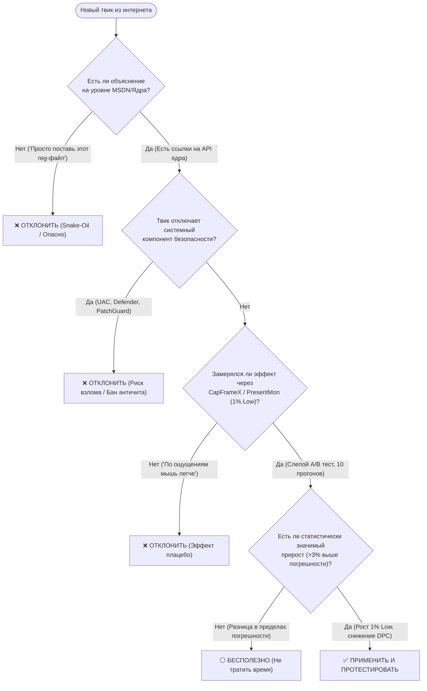

# 🧠 Развенчание мифов, плацебо и вредоносных твиков Windows (Debunked Guide)

> **Статус документа:** Исчерпывающее инженерное руководство по низкоуровневой архитектуре ядра Windows, виртуальной памяти, планировщику CPU, сетевому стеку и научному бенчмаркингу.  
> **Целевая аудитория:** Системные инженеры, энтузиасты низкоуровневой оптимизации, киберспортсмены, оверклокеры.  
> **Версия ОС:** Применимо к Windows 10 (21H2–22H2) и Windows 11 (22H2–24H2).

---

## 📑 Содержание

1. [Введение: Анатомия индустрии «Snake-Oil» твикинга](#1-введение-анатомия-индустрии-snake-oil-твикинга)
2. [Модуль 1: Мифы о памяти и подсистеме хранения (VMM & Storage)](#2-модуль-1-мифы-о-памяти-и-подсистеме-хранения-vmm--storage)
   - [1.1. Полное отключение файла подкачки (Pagefile)](#11-полное-отключение-файла-подкачки-pagefile)
   - [1.2. Очистители оперативной памяти (RAM Cleaners / EmptyWorkingSet)](#12-очистители-оперативной-памяти-ram-cleaners--emptyworkingset)
   - [1.3. Чистильщики реестра (Registry Cleaners)](#13-чистильщики-реестра-registry-cleaners)
   - [1.4. LargeSystemCache = 1 для ускорения игр](#14-largesystemcache--1-для-ускорения-игр)
   - [1.5. DisablePagingExecutive = 1 как «панацея» от свопинга](#15-disablepagingexecutive--1-как-панацея-от-свопинга)
   - [1.6. ClearPageFileAtShutdown = 1 для производительности](#16-clearpagefileatshutdown--1-для-производительности)
   - [1.7. Удаление папки Prefetch для ускорения запуска](#17-удаление-папки-prefetch-для-ускорения-запуска)
3. [Модуль 2: Мифы о процессоре, планировщике и ядре (CPU & Kernel Scheduler)](#3-модуль-2-мифы-о-процессоре-планировщике-и-ядре-cpu--kernel-scheduler)
   - [2.1. SystemResponsiveness = 0 и магия MMCSS](#21-systemresponsiveness--0-и-магия-mmcss)
   - [2.2. Установка процессам приоритета Realtime](#22-установка-процессам-приоритета-realtime)
   - [2.3. Войны системных таймеров: bcdedit, HPET, useplatformclock и TSC](#23-войны-системных-таймеров-bcdedit-hpet-useplatformclock-и-tsc)
   - [2.4. Поголовное отключение Hyper-Threading / SMT](#24-поголовное-отключение-hyper-threading--smt)
   - [2.5. Ручные маски привязки ядер (Affinity Mask) вслепую](#25-ручные-маски-привязки-ядер-affinity-mask-вслепую)
4. [Модуль 3: Мифы о службах и «агрессивном деблойте» (Services & Debloating)](#4-модуль-3-мифы-о-службах-и-агрессивном-деблойте-services--debloating)
   - [3.1. «Отключение 100+ служб удваивает FPS»](#31-отключение-100-служб-удваивает-fps)
   - [3.2. Отключение службы журналов событий (Event Log / wevtsvc)](#32-отключение-службы-журналов-событий-event-log--wevtsvc)
   - [3.3. Варварское удаление Windows Defender через реестр](#33-варварское-удаление-windows-defender-через-реестр)
5. [Модуль 4: Сетевые мифы и сетевой стек (Network & Netcode)](#5-модуль-4-сетевые-мифы-и-сетевой-стек-network--netcode)
   - [4.1. NetworkThrottlingIndex = 0xffffffff и «буст гигабита»](#41-networkthrottlingindex--0xffffffff-и-буст-гигабита)
   - [4.2. TCPNoDelay и TcpAckFrequency для UDP-шутеров](#42-tcpnodelay-и-tcpackfrequency-для-udp-шутеров)
   - [4.3. Ручное занижение MTU до 1492 / 576](#43-ручное-занижение-mtu-до-1492--576)
6. [Модуль 5: Кастомные урезанные ISO (Stripped Gaming OS Snake-Oil)](#6-модуль-5-кастомные-урезанные-iso-stripped-gaming-os-snake-oil)
   - [5.1. Архитектурные разрушения урезанных сборок](#51-архитектурные-разрушения-урезанных-сборок)
   - [5.2. Угрозы безопасности и скрытые бэкдоры](#52-угрозы-безопасности-и-скрытые-бэкдоры)
   - [5.3. Несовместимость с античитами и подсистемами ОС](#53-несовместимость-с-античитами-и-подсистемами-ос)
7. [Модуль 6: Графические мифы и видеодрайверы (Graphics & D3D)](#7-модуль-6-графические-мифы-и-видеодрайверы-graphics--d3d)
   - [6.1. Повсеместное отключение MPO (Multi-Plane Overlay)](#61-повсеместное-отключение-mpo-multi-plane-overlay)
   - [6.2. Low Latency Mode 'Ultra' против NVIDIA Reflex](#62-low-latency-mode-ultra-против-nvidia-reflex)
   - [6.3. Глобальный таймер 0.500 ms как источник «+30% FPS»](#63-глобальный-таймер-0500-ms-как-источник-30-fps)
8. [Модуль 7: Доказательная методология тестирования (Evidence-Based Benchmarking)](#8-модуль-7-доказательная-методология-тестирования-evidence-based-benchmarking)
   - [7.1. Правильный замер инпут-лага и фреймпейсинга](#71-правильный-замер-инпут-лага-и-фреймпейсинга)
   - [7.2. Блок-схема оценки любого твика (Decision Flowchart)](#72-блок-схема-оценки-любого-твика-decision-flowchart)
9. [Модуль 8: Сводная таблица параметров и скрипты восстановления (Rollback)](#9-модуль-8-сводная-таблица-параметров-и-скрипты-восстановления-rollback)
   - [8.1. Большая таблица «Миф vs Заводской стандарт»](#81-большая-таблица-миф-vs-заводской-стандарт)
   - [8.2. PowerShell скрипт полного отката опасных твиков](#82-powershell-скрипт-полного-отката-опасных-твиков)
10. [Источники и референсы](#10-источники-и-референсы)

---

## 1. Введение: Анатомия индустрии «Snake-Oil» твикинга

Начиная с эпохи Windows 98 и Windows XP, вокруг операционных систем Microsoft сформировался многомиллионный рынок так называемых «твиков оптимизации». В те годы аппаратные ограничения были экстремальными: компьютеры комплектовались 128–512 МБ оперативной памяти, медленными жесткими дисками со скоростью случайного чтения 0.5 МБ/с и одноядерными процессорами. В таких условиях любая фоновая дисковая активность или нехватка ОЗУ приводила к полному зависанию системы.

Многие инструкции, кочующие по современным YouTube-каналам, Telegram-пакам и TikTok-гайдам, были сформулированы более 20 лет назад для устаревших ядер NT 5.x. Перенос этих инструкций на современные ядра **Windows NT 10.0 (Windows 10 / Windows 11)**, работающие на многоядерных архитектурах (x86-64-v3/v4) с быстрыми NVMe SSD (PCIe 4.0/5.0 со скоростями более 7000 МБ/с и сотнями тысяч IOPS) и десятками гигабайт DDR4/DDR5 памяти, не просто бесполезен — он **деструктивен**.

```
  ┌─────────────────────────────────────────────────────────────────────────┐
  │                         ПОРОЧНЫЙ КРУГ ПЛАЦЕБО                          │
  └─────────────────────────────────────────────────────────────────────────┘
         │
         ▼
  [Ютубер публикует «+100 FPS Pack»] ──► Содержит 50 устаревших/вредных ключей реестра
         │
         ▼
  [Пользователь применяет скрипт] ────► Перезагрузка очищает кэши (Cold Start)
         │
         ▼
  [Психологический эффект плацебо] ──► «Игра кажется плавнее!» (Confirmation Bias)
         │
         ▼
  [Реальные замеры Frametime / ETW] ──► Рост микрофризов, вылеты из-за OOM, поломка DPC
         │
         ▼
  [Пользователь ставит новый «Pack»] ─► Пытается исправить нестабильность новыми твиками
```

### Главные причины живучести мифов:
1. **Confirmation Bias (Предвзятость подтверждения):** Пользователь, потративший время на настройку, подсознательно убеждает себя, что мышь двигается «легче», а картинка стала «четче», даже если объективные замеры показывают отсутствие изменений или деградацию.
2. **Отсутствие слепого A/B тестирования:** Замеры проводятся «на глаз» или через средний счетчик FPS (который скрывает просадки 1% и 0.1% Low, вызванные page faults).
3. **Непонимание низкоуровневой архитектуры ядра (Kernel Internals):** Создатели твик-паков часто не знают, как работает виртуальная память (VMM), планировщик квантов (Scheduler), стек ввода-вывода (I/O Stack) и обработка аппаратных прерываний (ISR/DPC).

---

## 2. Модуль 1: Мифы о памяти и подсистеме хранения (VMM & Storage)

### 1.1. Полное отключение файла подкачки (Pagefile)

#### ❌ Миф:
> «Если у меня 16, 32 или 64 ГБ оперативной памяти, файл подкачки (`pagefile.sys`) не нужен. Отключение файла подкачки заставит Windows держать абсолютно всё в сверхбыстрой RAM, продлит жизнь SSD и устранит любые статтеры».

#### 🔬 Низкоуровневая реальность ядра Windows (VMM):
Менеджер виртуальной памяти Windows (*Virtual Memory Manager*, VMM) оперирует концепцией **виртуального адресного пространства**, а не физической оперативной памятью напрямую.

```
       ВИРТУАЛЬНОЕ АДРЕСНОЕ ПРОСТРАНСТВО ПРОЦЕССА (Virtual Address Space)
  ┌────────────────────────────────────────────────────────────────────────┐
  │ [Reserved Space] │     [Committed Memory]     │     [Free Space]       │
  └────────────────────────────────────────────────────────────────────────┘
                              │
              ┌───────────────┴───────────────┐
              ▼                               ▼
    ┌──────────────────┐            ┌──────────────────┐
    │  Физическая RAM  │            │   pagefile.sys   │
    │  (Resident Set)  │            │  (Backing Store) │
    └──────────────────┘            └──────────────────┘
```

1. **Модель Commit Charge и Commit Limit:**  
   Когда приложение выделяет память через Win32 API `VirtualAlloc(..., MEM_COMMIT, ...)`, ядро резервирует лимит выделения (*Commit Limit*).
   $$\text{Commit Limit} = \text{Физическая RAM} + \text{Текущий размер всех файлов подкачки}$$
   Если файл подкачки отключен, Commit Limit строго равен размеру физической RAM. Как только сумма *закоммиченной* памяти всех процессов и ядра превышает физическую RAM (даже если физически занято всего 60% RAM, а остальное — лишь зарезервированные виртуальные страницы), последующие вызовы `VirtualAlloc` или `malloc` возвращают `NULL` (`STATUS_COMMITMENT_LIMIT`).
2. **Аварийные краши Out-of-Memory (OOM):**  
   Современные игры (на движках Unreal Engine 5, Frostbite, Anvil, Source 2) запрашивают гигантские объемы виртуального пространства под кэши текстур, геометрии и стриминга ассетов. При отсутствии pagefile игра мгновенно падает на рабочий стол с ошибкой `OutOfMemoryException` или крашит драйвер видеокарты, не сумевший выделить буфер под шейдеры.
3. **Модифицированные страницы (Modified Page Writer):**  
   Windows непрерывно анализирует использование памяти. Страницы, к которым не было обращений длительное время (страницы фоновых сервисов, спящих библиотек, редко используемых обработчиков), переводятся из активного рабочего набора (*Working Set*) в список модифицированных (*Modified Page List*).  
   Если pagefile включен, поток `Modified Page Writer` ядра сбрасывает эти «холодные» страницы на диск, освобождая физическую RAM под **Standby List** (дисковый файловый кэш, текстуры игры, кэш чтения). При отключенном pagefile «мертвые» страницы намертво блокируют блоки физической RAM, лишая игру дискового кэша.
4. **Невозможность записи Crash Dump (BSOD):**  
   При возникновении фатальной ошибки ядра (*Kernel Panic / BugCheck*) система сохраняет аварийный дамп (`MEMORY.DMP` или `Minidump`). Процесс записи осуществляется драйвером `crashdmp.sys` непосредственно в заголовки `pagefile.sys` на системном диске, так как стек файловой системы NTFS в момент BSOD уже заблокирован. Без pagefile создание дампов **невозможно**, что делает диагностику нестабильности железа и драйверов невыполнимой.

#### 📊 Эмпирические последствия:
* **Тест в игре Rust / Hogwarts Legacy / Warzone (32 GB RAM):** При отключенном Pagefile краш через 30–60 минут геймплея из-за спайка Commit Charge выше 32.8 ГБ.
* **Деградация 0.1% Low:** Потеря дискового кэша Standby List приводит к жестким фризам (до 250 мс) при динамической подгрузке локаций с диска.

#### ⚙️ Как должно быть настроено (Best Practice):
Оставить файл подкачки под управлением системы (*System Managed*) на самом быстром NVMe SSD либо зафиксировать его размер (Custom Size) в диапазоне **16384 МБ – 16384 МБ** для предотвращения фрагментации файла.

---

### 1.2. Очистители оперативной памяти (RAM Cleaners / EmptyWorkingSet)

#### ❌ Миф:
> «Утилиты вроде Mem Reduct, CleanMem, Wise Memory Optimizer или скрипты автоочистки Standby List на таймере освобождают оперативную память, убирают лаги и делают игру идеально плавной».

#### 🔬 Низкоуровневая реальность ядра Windows:
Все так называемые «оптимизаторы памяти» работают по одному примитивному механизму: они в цикле вызывают недокументированные или штатные функции Windows API:
```c
// Функция, вызываемая всеми "чистильщиками" памяти
EmptyWorkingSet(hProcess);
// или
SetProcessWorkingSetSize(hProcess, (SIZE_T)-1, (SIZE_T)-1);
```

```
                     ЧТО ДЕЛАЕТ RAM CLEANER
   ┌──────────────────────────────────────────────────────────┐
   │             Активная игра (Working Set в RAM)            │
   │  Текстуры, буферы кадров, матрицы коллизий, код физики   │
   └──────────────────────────────────────────────────────────┘
                                │
          RAM Cleaner вызывает EmptyWorkingSet()
                                │
                                ▼
   ┌──────────────────────────────────────────────────────────┐
   │  Ядро ПРИНУДИТЕЛЬНО помечает ВСЕ страницы как Invalid    │
   │      и сбрасывает их в Standby / Modified / Pagefile     │
   └──────────────────────────────────────────────────────────┘
                                │
             Следующий кадр игры (Game Loop Tick)
                                │
                                ▼
   ┌──────────────────────────────────────────────────────────┐
   │ 💥 КАТАСТРОФИЧЕСКИЙ ВСПЛЕСК HARD & SOFT PAGE FAULTS      │
   │ CPU зависает, ожидая считывания данных обратно в RAM.   │
   │ FPS падает до 1-5 к/с (Massive Frame Drop / Stutter)     │
   └──────────────────────────────────────────────────────────┘
```

1. **Механика Working Set Trimming:**  
   Вызов `EmptyWorkingSet` заставляет диспетчер памяти принудительно изъять практически все физические страницы (*Page Frames*) из рабочего набора процесса. Диспетчер памяти обнуляет биты присутствия в таблицах страниц PTE (*Page Table Entries*).
2. **Взрывной рост Page Faults:**  
   В следующий же миллисекундный квант времени потоки игры пытаются обратиться к своим переменным, объектам в куче и коду функций. Поскольку страницы были выгружены, MMU процессора генерирует аппаратное исключение **Page Fault** (`#PF`, прерывание 14h).
   - Если страница осталась в Standby List, происходит **Soft Page Fault** (ядро перенастраивает PTE, тратя тысячи тактов процессора и сбрасывая кэши L1/L2/L3 TLB).
   - Если страница ушла на диск, происходит **Hard Page Fault** (поток переходит в состояние ожидания I/O, игра намертво замирает на 5–50 миллисекунд).
3. **Иллюзия «свободной памяти»:**  
   Пользователь видит в Диспетчере задач падение занятой памяти с 80% до 20% и радуется. Однако «свободная» RAM в современной ОС — это **бесполезная, простаивающая память**. Неиспользуемая память должна служить дисковым кэшем. Чистильщики памяти уничтожают кэш, заставляя систему заново читать файлы с накопителя.

> [!CAUTION]
> **Исключение (ISLC):** Утилита *Intelligent Standby List Cleaner* (автор Wagnard) создавалась для исправления конкретного бага утечки памяти в старых версиях Windows 10 (билд 1709/1803), где Standby List не освобождался вовремя при запуске тяжелых игр. В современных сборках Windows 10 (22H2) и Windows 11 (23H2/24H2) этот баг ядра давно исправлен. Использование очистки Standby по таймеру каждые 5 минут во время игры гарантированно вызывает микростаттеры в момент срабатывания таймера.

---

### 1.3. Чистильщики реестра (Registry Cleaners)

#### ❌ Миф:
> «CCleaner и другие чистильщики реестра удаляют тысячи старых ключей, уменьшают размер реестра и ускоряют работу процессора и отзывчивость системы».

#### 🔬 Низкоуровневая реальность ядра Windows (Configuration Manager):
Реестр Windows — это не текстовый файл (в отличие от конфигурационных файлов `.ini` или `.json`), который парсится с начала до конца.

```
       БИНАРНАЯ ИЕРАРХИЯ КУСТОВ РЕЕСТРА (HIVE B-TREE ARCHITECTURE)
  ┌────────────────────────────────────────────────────────────────────┐
  │ Root Cell (hb_bin) ──► B-Tree Index Nodes (O(log N) Lookup)        │
  │                            ├── Key Node A (KCB cached in RAM)      │
  │                            ├── Key Node B                          │
  │                            └── Key Node C                          │
  └────────────────────────────────────────────────────────────────────┘
```

1. **Структура Hive и B-Tree:**  
   Кусты реестра (`SYSTEM`, `SOFTWARE`, `SAM`, `SECURITY`, `NTUSER.DAT`) представляют собой бинарные базы данных, организованные в блоки фиксированного размера (**HBIN** по 4096 байт) со структурой сбалансированного B-дерева (*B-Tree*).
2. **Абсолютная асимптотическая скорость O(log N):**  
   Поиск ключа по B-дереву происходит за $O(\log N)$ операций. Наличие 10 000 неиспользуемых ключей в ветках типа `HKCR\CLSID` увеличивает глубину дерева максимум на 1 уровень, что эквивалентно разнице во времени выборки в **несколько наносекунд**.
3. **Key Control Block (KCB) Cache:**  
   Компонент ядра *Configuration Manager* кэширует наиболее часто используемые ключи в оперативной памяти в виде структур `KCB` (Key Control Block). Реестр не читается непрерывно с диска.
4. **Неустранимые риски повреждения ОС:**  
   Автоматические чистильщики реестра используют примитивные эвристические правила поиска «висячих» путей. В результате регулярно удаляются:
   - Ассоциации интерфейсов COM/DCOM и CLSID, используемые системными службами.
   - Ссылки на зарегистрированные WMI/ETW провайдеры.
   - Ветки `AppPath` и параметры подсистемы WinSxS.  
   Итог — сломанные обновления Windows Update, сбои при установке драйверов и повреждение профилей пользователей.

---

### 1.4. LargeSystemCache = 1 для ускорения игр

#### ❌ Миф:
> «Ключ `LargeSystemCache = 1` заставляет Windows использовать весь объем ОЗУ под системный кэш, что ускоряет загрузку игр и повышает FPS».

#### 🔬 Архитектурный разбор:
* **Путь в реестре:** `HKLM\SYSTEM\CurrentControlSet\Control\Session Manager\Memory Management`
* **Параметр:** `LargeSystemCache` (DWORD)

```
        РАСПРЕДЕЛЕНИЕ ПАМЯТИ ПРИ LARGESYSTEMCACHE
  LargeSystemCache = 0 (По умолчанию - Рабочая станция):
  ┌─────────────────────────────────┬─────────────────────────────────┐
  │  Рабочие наборы приложений      │  Системный файловый кэш        │
  │  (Game Working Set - ПРИОРИТЕТ) │  (System File Cache)            │
  └─────────────────────────────────┴─────────────────────────────────┘

  LargeSystemCache = 1 (Серверный режим):
  ┌──────────────────┬────────────────────────────────────────────────┐
  │ Игры (УРЕЗАНО)   │  Системный файловый кэш (БЕЗЛИМИТНЫЙ ЗАХВАТ)   │
  └──────────────────┴────────────────────────────────────────────────┘
```

Данный параметр был разработан для **Windows NT 4.0 Server / Windows 2000 Server**, выполняющих роль выделенных файловых серверов (File/Print Server).
- При значении `0` (по умолчанию для клиентских Windows) менеджер памяти отдает абсолютный приоритет рабочим наборам пользовательских приложений.
- При значении `1` ядру дается указание отдавать всю свободную память системному кэшу файловой системы (*System Working Set*), агрессивно выгружая страницы пользовательских процессов при любом интенсивном файловом обмене.
- **Влияние на игры:** Запуск игры в режиме `LargeSystemCache = 1` приводит к тому, что при фоновом чтении файлов или подгрузке ассетов VMM начинает сжимать рабочий набор игры и видеодрайвера. Это провоцирует **тяжелые статтеры и дропы кадров**, а на видеокартах AMD Radeon и NVIDIA в определенных версиях драйверов вызывало BSOD `DRIVER_IRQL_NOT_LESS_OR_EQUAL` из-за нехватки невыгружаемого пула для буферов драйвера.

---

### 1.5. DisablePagingExecutive = 1 как «панацея» от свопинга

#### ❌ Миф:
> «Ключ `DisablePagingExecutive = 1` запрещает Windows сбрасывать системные файлы на диск, держит всю ОС в памяти и полностью убирает задержки ввода».

#### 🔬 Архитектурный разбор:
* **Путь:** `HKLM\SYSTEM\CurrentControlSet\Control\Session Manager\Memory Management`
* **Параметр:** `DisablePagingExecutive` (DWORD)

1. **Что на самом деле делает параметр:**  
   Он указывает ядру `ntoskrnl.exe`, что драйверы режима ядра и системный выгружаемый пул (*Paged Pool*), работающие в адресном пространстве ядра (*Kernel Space*), не должны перемещаться в `pagefile.sys` при нехватке физической памяти.
2. **Почему это плацебо на современных ПК:**  
   На современных ПК с 16–64 ГБ оперативной памяти ядро Windows **и так никогда не выгружает исполняемый код ядра на диск**, если только свободная память не упадет ниже критического порога (~200 МБ).
3. **Что этот ключ НЕ делает:**  
   Он **никак не влияет** на память пользовательского режима (*User Mode*). Он не защищает процесс игры, Discord, браузер или оверлеи от свопинга. На производительность в играх и DPC Latency этот ключ оказывает **0.00% влияния**.

---

### 1.6. ClearPageFileAtShutdown = 1 для производительности

#### ❌ Миф:
> «Очистка файла подкачки при выключении ПК очищает систему от мусора и ускоряет последующий запуск Windows».

#### 🔬 Архитектурный разбор:
* **Путь:** `HKLM\SYSTEM\CurrentControlSet\Control\Session Manager\Memory Management`
* **Параметр:** `ClearPageFileAtShutdown` (DWORD)

Этот параметр является **механизмом безопасности военного уровня** (соответствие стандарту DoD 5220.22-M). При значении `1` ядро Windows в процессе завершения работы последовательно перезаписывает весь объем файла `pagefile.sys` нулями (`0x00`), чтобы предотвратить извлечение паролей и ключей шифрования злоумышленником, имеющим физический доступ к диску.
- **Реальный эффект:** Выключение и перезагрузка компьютера замедляются на **30–120 секунд** (в зависимости от размера pagefile и скорости накопителя).
- **Влияние на FPS и задержки:** **Ровно 0.00%**. При следующем старте Windows все равно не читает старые данные из файла подкачки, так как таблицы виртуальных страниц инициализируются заново.

---

### 1.7. Удаление папки Prefetch для ускорения запуска

#### ❌ Миф:
> «В папке `C:\Windows\Prefetch` скапливается мусор. Если удалить все файлы `.pf` и отключить службу SuperFetch (SysMain), система перестанет засорять диск и игры будут запускаться мгновенно».

#### 🔬 Архитектурный разбор:
Подсистема **Windows Prefetcher** — один из наиболее эффективных механизмов оптимизации I/O, разработанных Microsoft.

```
                    КАК РАБОТАЕТ WINDOWS PREFETCHER
   ┌──────────────────────────────────────────────────────────┐
   │             Первый запуск приложения / игры              │
   │  Трассировка обращений к диску: читаются 1000+ файлов    │
   └──────────────────────────────────────────────────────────┘
                                │
                                ▼
   ┌──────────────────────────────────────────────────────────┐
   │         Создание мета-карты запуска (файл .pf)           │
   │  Страницы упорядочиваются в один последовательный поток  │
   └──────────────────────────────────────────────────────────┘
                                │
                                ▼
   ┌──────────────────────────────────────────────────────────┐
   │            Последующие запуски (Fast Launch)             │
   │  Ядро делает асинхронный упреждающий Sequential Read      │
   │      Время старта приложения сокращается в 2-4 раза      │
   └──────────────────────────────────────────────────────────┘
```

1. При запуске программы Prefetcher отслеживает первые 10 секунд работы и формирует файл трассировки `APPNAME-HASH.pf`.
2. В файле записан список конкретных страниц DLL, ресурсов и исполняемых секций, которые реально требуются приложению.
3. При следующем запуске ядро считывает нужные данные **одним непрерывным асинхронным блоком** еще до того, как само приложение запросит их.
4. **Удаление папки Prefetch:** Принудительно сбрасывает все карты оптимизации. При следующем старте игры операционная система вынуждена выполнять тысячи мелких случайных операций чтения (*Random 4K Read*), что увеличивает время загрузки уровней и вызывает заикания звука.

---

## 3. Модуль 2: Мифы о процессоре, планировщике и ядре (CPU & Kernel Scheduler)

### 2.1. SystemResponsiveness = 0 и магия MMCSS

#### ❌ Миф:
> «Параметр `SystemResponsiveness = 0` отдает 100% мощности процессора играм и полностью отключает резервирование ресурсов под системные фоновые задачи».

#### 🔬 Низкоуровневый разбор (MMCSS Architecture):
* **Путь:** `HKLM\SOFTWARE\Microsoft\Windows NT\CurrentVersion\Multimedia\SystemProfile`
* **Параметр:** `SystemResponsiveness` (DWORD)

```
             АРХИТЕКТУРА СЛУЖБЫ MMCSS (Multimedia Class Scheduler)
  ┌────────────────────────────────────────────────────────────────────────┐
  │  Служба MMCSS (mmcss.dll) регулирует приоритеты потоков мультимедиа    │
  └────────────────────────────────────────────────────────────────────────┘
          │                                              │
          ▼                                              ▼
  [MMCSS Audio/Video Threads]                 [Низкоприоритетные потоки]
  Приоритеты 16-31 (Realtime/High)            Резервируется SystemResponsiveness %
```

1. **Что такое MMCSS:**  
   *Multimedia Class Scheduler Service* — служба, гарантирующая, что мультимедийные приложения реального времени (в первую очередь аудиопотоки WASAPI/DirectSound и воспроизведение видео) не будут прерываться фоновыми задачами (печать, индексация, сетевые фоновые передачи).
2. **Что реально означает SystemResponsiveness:**  
   По умолчанию параметр равен `20` (десятичное). Это означает, что **максимум 80% времени CPU** отдается высокоприоритетным мультимедиа-потокам, зарегистрированным в MMCSS, а **минимум 20% времени гарантированно резервируется** для низкоприоритетных фоновых потоков, чтобы предотвратить их полную блокировку (*Thread Starvation*).
3. **Жесткое аппаратное ограничение ядра (Clamping Mechanism):**  
   В коде планировщика Windows зашита проверка:
   ```c
   // Псевдокод планировщика MMCSS
   if (SystemResponsiveness < 10) {
       SystemResponsiveness = 20; // Сброс к безопасному значению по умолчанию!
   }
   ```
   Если выставить значение `0`, ядро Windows в большинстве версий просто **сбрасывает значение обратно к дефолтным 20%**, либо интерпретирует некорректное значение как ошибку конфигурации.
4. **Игры НЕ используют MMCSS для основного цикла рендеринга:**  
   Ни одна современная игра (CS2, Valorant, Apex Legends) не регистрирует свой главный рендер-поток через API `AvSetMmThreadCharacteristics("Games", ...)`. Этот API использует только аудиодвижок (через Windows Audio Service). Попытка твикать `SystemProfile` не дает игровому процессу ни одного лишнего мегагерца или процента CPU.

---

### 2.2. Установка процессам приоритета Realtime

#### ❌ Миф:
> «Если выставить в Диспетчере задач или через Process Hacker приоритет игры на 'Realtime' (Реального времени), игра получит абсолютный приоритет над всей системой, и задержка ввода снизится до абсолютного нуля».

#### 🔬 Низкоуровневый разбор (Windows Priority Inversion & Starvation):
Шкала приоритетов планировщика потоков Windows содержит 32 уровня (от `0` до `31`):

```
       ШКАЛА ПРИОРИТЕТОВ ПЛАНИРОВЩИКА WINDOWS NT
  ┌───────┬───────────────────────────────┬──────────────────────────────────────────┐
  │ Уровни│ Класс приоритета             │ Типичные потоки                          │
  ├───────┼───────────────────────────────┼──────────────────────────────────────────┤
  │ 0     │ Zero Page Thread              │ Очистка свободных страниц памяти         │
  │ 1-15  │ Dynamic Priority (Low/Normal) │ Пользовательские приложения, Explorer    │
  │ 13-15 │ High Priority                 │ Интерактивный UI, аудио высокого уровня  │
  ├───────┼───────────────────────────────┼──────────────────────────────────────────┤
  │ 16-31 │ REALTIME PRIORITY CLASS       │ ЯДЕРНЫЕ ПОТОКИ, DPC/APC, ДРАЙВЕРЫ ВВОДА  │
  └───────┴───────────────────────────────┴──────────────────────────────────────────┘
```

```
          КАТАСТРОФА ПРИОРИТЕТА REALTIME ДЛЯ ИГРЫ
   ┌──────────────────────────────────────────────────────────┐
   │         Игра запущена с приоритетом REALTIME (24-31)     │
   │           Потоки игры грузят доступные ядра на 100%      │
   └──────────────────────────────────────────────────────────┘
                                │
              Планировщик блокирует исполнение:
                                │
        ├───► [csrss.exe] ───────► Обработка Raw Input мыши ЗАВИСАЕТ
        ├───► [dwm.exe] ─────────► Композитинг кадров на дисплей БЛОКИРУЕТСЯ
        ├───► [USB HID Driver] ──► Прерывания мыши/клавиатуры ОТБРАСЫВАЮТСЯ
        └───► [Kernel Watchdog] ─► Срабатывает тайм-аут ядра ──► BSOD (DPC Watchdog)
```

1. **Блокировка подсистемы ввода (Raw Input Starvation):**  
   За опрос и обработку событий мыши и клавиатуры отвечают процесс клиент-серверной подсистемы `csrss.exe` и драйверы устройств ввода `mouclass.sys` / `hidusb.sys`. Они работают на приоритетах **13–16**.  
   Если игровой цикл с тяжелым физическим движком или рендером начинает работать на уровне приоритета **24**, процессор **физически перестает отдавать кванты времени драйверам мыши**. Результат — хаотические «залипания» прицела, рывки камеры и пропуск кликов.
2. **Блокировка DWM (Desktop Window Manager):**  
   Процесс `dwm.exe` отвечает за синхронизацию буферов отображения (Flip Model presentation). Голодание DWM приводит к разрывам кадров, пропускам циклов VSYNC/G-Sync и ощущению желеобразного экрана.
3. **BSOD `DPC_WATCHDOG_VIOLATION`:**  
   Если поток реального времени удерживает ядро слишком долго без передачи управления системным процедурам отложенного вызова (DPC), сторожевой таймер ядра генерирует фатальный сбой с аварийной остановкой системы.

---

### 2.3. Войны системных таймеров: bcdedit, HPET, useplatformclock и TSC

#### ❌ Миф:
> «Команды `bcdedit /set useplatformclock true` или `bcdedit /deletevalue useplatformclock` в сочетании с `disabledynamictick yes` и `tscsyncpolicy Enhanced` полностью устраняют микростаттеры на любом ПК».

#### 🔬 Аппаратный и программный анализ архитектуры таймеров:
Современные платформы x86-64 используют несколько аппаратных источников измерения времени:
1. **TSC (Time Stamp Counter) / Invariant TSC:** Регистр MSR процессора (`IA32_TIME_STAMP_COUNTER`), инкрементируемый с постоянной базовой частотой независимо от частоты ядер и энергосбережения (C-states). Читается инструкцией `RDTSC` / `RDTSCP` за **12–20 тактов CPU (менее 5 наносекунд)**.
2. **HPET (High Precision Event Timer):** Отдельный физический чип-таймер на материнской плате, подключенный через медленную шину южного моста (PCH / Chipset). Чтение требует обращения по шине ввода-вывода (MMIO) и занимает **от 500 до 2000 наносекунд (в 100–400 раз медленнее, чем TSC!)**.
3. **ACPI PM Timer:** Медленный таймер управления питанием (частота 3.579545 МГц).

```
         СРАВНЕНИЕ ЗАДЕРЖКИ СЧИТЫВАНИЯ АППАРАТНЫХ ТАЙМЕРОВ
  ┌──────────────────────────────────────────────────────────────────┐
  │ Invariant TSC (RDTSC): ■ (~4-5 ns)                               │
  │ HPET (useplatformclock yes): ■■■■■■■■■■■■■■■■■■■■■■■■ (~800-1500 ns)│
  └──────────────────────────────────────────────────────────────────┘
```

#### Разбор опасных BCD-флагов:
* **`useplatformclock true` (КАТАСТРОФА ДЛЯ FPS):**  
  Принудительно заставляет ядро Windows игнорировать сверхбыстрый процессорный Invariant TSC и опрашивать медленный внешний чип HPET при каждом системном замере времени (`QueryPerformanceCounter`).  
  *Результат:* В играх с частыми запросами времени падение среднего FPS на **15–30%**, дикие просадки 1% Low и микростаттеры.
* **`useplatformclock false` / `deletevalue`:**  
  Возвращает систему к автоматическому выбору (на всех современных процессорах Intel Core и AMD Ryzen выбирается Invariant TSC). Значение должно быть **удалено** через `/deletevalue`.
* **`disabledynamictick yes`:**  
  Отключает функцию динамического тика (энергосберегающая остановка системного таймера ядра при простое CPU). На стационарных ПК снижает задержку выхода ядер из глубоких C-States, но на ноутбуках критически повышает расход батареи. На современных системах с профилем питания «Высокая производительность» Dynamic Tick де-факто неактивен.
* **`tscsyncpolicy Enhanced / Legacy`:**  
  Попытка форсировать синхронизацию счетчиков TSC между сокетами/ядрами. На процессорах AMD Ryzen с несколькими CCD или процессорах Intel с разнородными ядрами (P/E-cores) принудительная установка `Legacy` может привести к **рассинхронизации таймеров ядер**, что вызывает дергание анимации и микротелепортации моделей игроков в соревновательных играх.

---

### 2.4. Поголовное отключение Hyper-Threading / SMT

#### ❌ Миф:
> «Отключение Hyper-Threading на Intel или SMT на AMD Ryzen снижает температуру, убирает межъядерную задержку и всегда дает прирост FPS и идеальную плавность».

#### 🔬 Архитектурный разбор:
*Simultaneous Multithreading* (SMT) / *Hyper-Threading* (HT) позволяет одному физическому ядру исполнять два независимых аппаратных потока (*Hardware Threads*), используя общие исполнительные блоки (ALU, FPU, векторные регистры) и разделяя кэши L1 и L2.

```
                  РАСПРЕДЕЛЕНИЕ РЕСУРСОВ ЯДРА ПРИ SMT
       ФИЗИЧЕСКОЕ ЯДРО (Execution Engine: ALU, FPU, AGU)
  ┌─────────────────────────────────────────────────────────────┐
  │                 Общий кэш L1 Data / L1 Instruction          │
  ├──────────────────────────────┬──────────────────────────────┤
  │   Логический поток 0 (T0)    │    Логический поток 1 (T1)   │
  └──────────────────────────────┴──────────────────────────────┘
```

1. **Когда отключение SMT имело смысл (Ретроспектива):**  
   На старых процессорах (4 ядра / 8 потоков) в старых играх (CS:GO на Source 1, DX9), которые нагружали всего 1–2 потока, отключение HT предотвращало переключение контекста и конкуренцию потоков за L1/L2 кэш, давая мизерный буст.
2. **Почему отключение SMT ломает современные игры:**  
   Современные движки (Unreal Engine 5, Source 2 в CS2, Frostbite в Battlefield, REDengine в Cyberpunk 2077) создают десятки рабочих потоков (*Worker Threads*): симуляция физики, аудио-пайплайн, декомпрессия ассетов DirectStorage, компиляция PSO/шейдеров, обработка сетевого стека.  
   На 6- или 8-ядерном процессоре с отключенным SMT (например, Ryzen 5 7600X или Core i5 13600K без HT) все физические ядра загружаются на **100%**. Планировщик начинает непрерывно вытеснять критические потоки рендеринга фоновыми задачами, вызывая **катастрофические просадки 0.1% Low FPS и фризы длительностью до 100 мс**.

---

### 2.5. Ручные маски привязки ядер (Affinity Mask) вслепую

#### ❌ Миф:
> «Нужно привязать процесс игры через Task Manager или софт к Ядрам 2, 4, 6, отключив Ядро 0, чтобы разгрузить Windows и убрать инпут-лаг».

#### 🔬 Архитектурный разбор:
Современные планировщики Windows 11 (начиная с 22H2/23H2) и микрокод современных процессоров используют сложнейшие аппаратные топологические алгоритмы:
- **Intel Thread Director:** Аппаратный контроллер в процессорах Intel Core 12–14-го поколений, анализирующий типы инструкций на лету и распределяющий высокопроизводительные потоки на P-ядра, а фоновые задачи — на E-ядра.
- **AMD CPPC2 (Collaborative Power Performance Control):** Автоматически определяет «золотые ядра» (*Preferred Cores*) с наивысшим частотным потенциалом и минимальной задержкой доступа к 3D V-Cache (на процессорах серии X3D).

**Что происходит при ручной привязке (Affinity):**  
Пользователь ломает работу Thread Director и CPPC2. Если заблокировать игре доступ к ядрам, игра не сможет задействовать динамические потоки декомпрессии или будет загнана на один CCX без 3D V-Cache, что снизит производительность на 20–40%.

---

## 4. Модуль 3: Мифы о службах и «агрессивном деблойте» (Services & Debloating)

### 3.1. «Отключение 100+ служб удваивает FPS»

#### ❌ Миф:
> «Отключение служб Windows через Black Viper Guide или скрипты деблойта освобождает гигабайты памяти, разгружает процессор и снижает системные задержки».

#### 🔬 Архитектурный разбор подсистемы служб (Service Control Manager):

```
          КАК УСТРОЕНЫ СЛУЖБЫ В СОВРЕМЕННОЙ WINDOWS
  [services.exe (SCM)] ──► Запускает пулы процессов svchost.exe
                                 │
        ┌────────────────────────┼────────────────────────┐
        ▼                        ▼                        ▼
  [svchost.exe - NetSvcs]   [svchost.exe - Local]    [svchost.exe - Dcom]
  (Состояние: IDLE)         (Состояние: STOPPED)     (Состояние: IDLE)
  CPU: 0.00%                CPU: 0.00%               CPU: 0.00%
  RAM: Virtual Paged        RAM: 0 байт              RAM: Virtual Paged
```

1. **Модель исполнения служб (svchost.exe):**  
   Службы Windows скомпилированы в виде DLL-библиотек. Они исполняются внутри общих пулов процессов `svchost.exe`.
2. **Пассивное состояние (Trigger-Start & Idle):**  
   Подавляющее большинство служб Windows не выполняют активных действий. Они находятся либо в состоянии `STOPPED`, либо висят в режиме ожидания системного события (*Trigger-Start* по событию RPC/ETW). В состоянии ожидания служба потребляет **ровно 0.000% циклов CPU**.
3. **Крушение зависимостей (Dependency Hell):**  
   Отключение «ненужных» по мнению дилетантов служб приводит к разрушению критических системных стеков:
   - Отключение `CryptSvc` (Криптографические службы) ──► Невозможность проверки цифровых подписей драйверов и античитов (Vanguard, Faceit).
   - Отключение `RpcSs` / `DcomLaunch` ──► Полный отказ графической подсистемы и интерфейса Windows.
   - Отключение `AppHostSvc` / `StateRepository` ──► Неработоспособность DirectX Graphics инфраструктуры и настроек дисплея.
   - Отключение служб печати (`Spooler`) при отсутствии принтера не дает **ни одного кадра в секунду прироста**.

---

### 3.2. Отключение службы журналов событий (Event Log / wevtsvc)

#### ❌ Миф:
> «Служба Windows Event Log постоянно пишет логи на диск, создает дисковую нагрузку и лаги в играх. Ее нужно отключить».

#### 🔬 Архитектурный разбор:
1. **Механизм циклического буфера в памяти:**  
   Служба `wevtsvc` не сбрасывает каждое событие на диск синхронно. События собираются в кольцевых буферах оперативной памяти через высокопроизводительный механизм ETW (*Event Tracing for Windows*) и сбрасываются на накопитель асинхронно крупными блоками с ультранизким приоритетом I/O.
2. **Катастрофические последствия отключения:**  
   - Ломается подсистема отчетов об ошибках (*Windows Error Reporting*, WER).
   - При крашах драйверов (NVIDIA/AMD) видеоподсистема не может зарегистрировать TDR (*Timeout Detection and Recovery*), что вместо восстановления драйвера приводит к намертво зависшему черному экрану.
   - Перестают функционировать утилиты диагностики производительности: **LatencyMon**, **CapFrameX**, **PresentMon**.

---

### 3.3. Варварское удаление Windows Defender через реестр

#### ❌ Миф:
> «Удаление папок Защитника Windows или ломание его веток реестра убирает системный оверхед и ускоряет ПК».

#### 🔬 Архитектурный разбор:
*Защитник Windows* (Microsoft Defender Antivirus) глубоко интегрирован в подсистему безопасности ядра (`WdFilter.sys`, ELAM — Early Launch Anti-Malware).
- При попытке «вырезать» Defender через правку реестра без официального отключения через групповые политики (GPO) или доверенные интерфейсы, системный сторожевой процесс `SecurityHealthService` переходит в цикл постоянных перезапусков, **создавая паразитную нагрузку на CPU от 15% до 30%** и спамя ошибками в ядро.
- **Корректное решение:** Добавить папку с играми и процессами лаунчеров в **Исключения Defender** (*Exclusions*), либо корректно приостановить защиту реального времени через Group Policy.

---

## 5. Модуль 4: Сетевые мифы и сетевой стек (Network & Netcode)

### 5.1. NetworkThrottlingIndex = 0xffffffff и «буст гигабита»

#### ❌ Миф:
> «Установка `NetworkThrottlingIndex = 0xffffffff` разгоняет интернет, снижает сетевой пинг и убирает лаги в сетевых играх».

#### 🔬 Низкоуровневый разбор (NDIS Packet Throttling):
* **Путь:** `HKLM\SOFTWARE\Microsoft\Windows NT\CurrentVersion\Multimedia\SystemProfile`
* **Параметр:** `NetworkThrottlingIndex` (DWORD)

```
        КАК РАБОТАЕТ NETWORK THROTTLING В WINDOWS
  [Воспроизведение мультимедиа через MMCSS активно]
                         │
        ┌────────────────┴────────────────┐
        ▼                                 ▼
  [Сетевой пакет игры / приложения]  [Сетевой драйвер NDIS.SYS]
  По умолчанию: максимум 10 пакетов/мс ──► Защита аудиопотока от DPC-спайков
  При ffffffff: троттлинг ОТКЛЮЧЕН   ──► Спам DPC прерываний на слабых NIC
```

1. **История возникновения параметра:**  
   Введен в Windows Vista. При воспроизведении медиафайлов сетевые пакеты не-мультимедийных приложений ограничивались частотой 10 пакетов на миллисекунду, чтобы сетевая карта не забивала шину прерываниями и не вызывала заикания звука.
2. **Почему это не ускоряет сетевые игры:**  
   - Если в фоне не играет музыка через плееры со старым интерфейсом MMCSS, этот механизм **вообще не активен**.
   - На современных гигабитных и 2.5G сетевых картах (Intel I225-V/I226-V, Realtek RTL8125) полное отключение троттлинга (`0xffffffff`) при плохом роутере или торрент-активности может вызвать всплеск прерываний в `ndis.sys` и `tcpip.sys`, что **увеличивает DPC Latency** и вызывает фризы в играх.

---

### 5.2. TCPNoDelay и TcpAckFrequency для UDP-шутеров

#### ❌ Миф:
> «Включение `TCPNoDelay = 1` и `TcpAckFrequency = 1` во всех интерфейсах реестра снижает пинг вдвое во всех сетевых играх (CS2, Valorant, Apex, Warzone)».

#### 🔬 Сетевой анализ транспортных протоколов:

```
            СРАВНЕНИЕ ТРАНСПОРТНЫХ ПРОТОКОЛОВ В ГЕЙМИНГЕ
  ┌────────────────────────────────────────────────────────────────────┐
  │ 🔴 TCP (Transmission Control Protocol):                            │
  │    Гарантированная доставка, подтверждения ACK, алгоритм Nagle.   │
  │    ИСПОЛЬЗУЕТСЯ: Загрузка файлов, Web, чаты, Discord API.          │
  ├────────────────────────────────────────────────────────────────────┤
  │ 🟢 UDP (User Datagram Protocol):                                  │
  │    БЕЗ ПОДТВЕРЖДЕНИЙ, БЕЗ АЛГОРИТМА НАГЛА, МИНИМАЛЬНАЯ ЗАДЕРЖКА.   │
  │    ИСПОЛЬЗУЕТСЯ: CS2, Valorant, Apex Legends, Warzone, Fortnite.   │
  └────────────────────────────────────────────────────────────────────┘
```

1. **Глобальное заблуждение:**  
   Параметры `TCPNoDelay` (отключение алгоритма Нейгла для объединения мелких пакетов) и `TcpAckFrequency` (частота отправки подтверждений о получении) относятся **ИСКЛЮЧИТЕЛЬНО К ПРОТОКОЛУ TCP**.
2. **UDP в соревновательных играх:**  
   Все современные соревновательные шутеры в реальном времени (Counter-Strike 2, Valorant, Call of Duty, Apex Legends, Overwatch 2, Rainbow Six Siege) передают игровой сетевой трафик (координаты тика, стрельба, пакеты снарядов) через протокол **UDP**.
3. **Реальный эффект твика:**  
   Влияние параметров TCP на UDP-трафик игр равно **строго 0.000%**.  
   Более того, включение `TcpAckFrequency = 1` для сетевой карты заставляет стек отвечать пакетом ACK на каждый входящий TCP-сегмент (вместо одного ACK на каждые 2 сегмента). При интенсивной сетевой нагрузке (загрузка стрима, фоновое скачивание) это **удваивает количество аппаратных прерываний сетевой карты**, перегружая системное ядро CPU.

---

### 5.3. Ручное занижение MTU до 1492 / 576

#### ❌ Миф:
> «Уменьшение MTU (Maximum Transmission Unit) до 576 или 1492 делает сетевые пакеты компактными, убирает задержки в оптоволоконных сетях».

#### 🔬 Архитектурный разбор:
1. **Стандарт Ethernet:** Стандартный размер MTU для сетей Ethernet составляет **1500 байт** (или 1492 для PPPoE подключений).
2. **Фрагментация пакетов:** Если принудительно занизить MTU на ПК, любые пакеты стандартного размера начинают фрагментироваться маршрутизатором на несколько частей. Каждый фрагмент требует собственного IP-заголовка.
3. **Результат:** Рост накладных расходов сети, потеря пакетов (*Packet Loss*) на промежуточных узлах и увеличение сетевого джиттера (*Jitter*).

---

## 6. Модуль 5: Кастомные урезанные ISO (Stripped Gaming OS Snake-Oil)

### 6.1. Архитектурные разрушения урезанных сборок

В сообществе геймеров крайне популярны кастомные модифицированные дистрибутивы (ReviOS, AtlasOS, Ghost Spectre, KernelOS, сборки с энтузиастских форумов и Telegram-каналов). Создатели обещают «чистый Windows без телеметрии с 30 процессами в диспетчере задач».

```
                     АНАТОМИЯ СЛОМАННОЙ КАСТОМНОЙ ISO
   ┌──────────────────────────────────────────────────────────┐
   │             Оригинальный образ Windows 11                │
   └──────────────────────────────────────────────────────────┘
                                │
        Вырезание компонентов через NTLite / DISM
                                │
        ├───► Вырезан WinSxS (Servicing Stack) ──► Нельзя ставить обновления безопасности
        ├───► Вырезаны службы изоляции (VBS/HVCI) ──► Компьютер открыт для руткитов
        ├───► Вырезан Windows Store / Xbox Live ─► Не работают игры Game Pass и кодеки
        └───► Отключена проверка подписей ──────► БАН в Faceit AC и Riot Vanguard
```

1. **Уничтожение Servicing Stack (хранилища WinSxS):**  
   Для уменьшения веса ISO авторы вырезают системную папку `WinSxS`. После этого команды восстановления целостности `sfc /scannow` и `DISM /RestoreHealth` перестают работать, а установка накопительных обновлений безопасности (*Cumulative Updates*) становится **невозможной**. Любая попытка обновления приводит к состоянию вечной циклической перезагрузки (*Bootloop*).
2. **Поломка зависимостей сред выполнения:**  
   Удаление компонентов приводит к крашам Visual C++ Redistributable, .NET Framework runtime, отсутствию аудиокодеков (AAC/HEVC) и сбоям в работе DirectML/DirectStorage.

---

### 6.2. Угрозы безопасности и скрытые бэкдоры

* **Полное отключение UAC и защиты памяти:** Во многих «твик-сборках» по умолчанию выключен контроль учетных записей (UAC), отключена защита от эксплойтов (*Exploit Protection / DEP*) и включен вход под встроенным Administrator. Любой вредоносный скрипт, скачанный через браузер или Discord, получает мгновенные права `NT AUTHORITY\SYSTEM` без запроса пользователя.
* **Внедренные вредоносные модули:** Независимые аудиты кастомных сборок из сомнительных источников неоднократно выявляли встроенные скрытые майнеры криптовалюты, модифицированные DNS-серверы и крадлеры сессий Telegram/Steam.

---

### 6.3. Несовместимость с античитами и подсистемами ОС

* **Riot Vanguard (Valorant), FACEIT Anti-Cheat, EA Anticheat, Ricochet:**  
  Современные античиты уровня ядра (*Kernel-Level Ring 0*) требуют наличия валидной цифровой подписи системных файлов, включенного доверенного платформенного модуля (TPM 2.0) и безопасной загрузки (Secure Boot).
* Кастомные сборки с отключенными сертификатами или модифицированным ядром `ntoskrnl.exe` вызывают мгновенный бан или ошибку запуска игры (*«System Integrity Check Failed»* / *«Vanguard Error VAN 1067 / VAN 9003»*).

---

## 7. Модуль 6: Графические мифы и видеодрайверы (Graphics & D3D)

### 7.1. Повсеместное отключение MPO (Multi-Plane Overlay)

#### ❌ Миф:
> «MPO (многоплоскостное наложение) — это источник всех лагов и статтеров в играх. Отключение ключа `DisableMPO` обязательно для любого геймера».

#### 🔬 Архитектурный разбор:
* **Путь:** `HKLM\SOFTWARE\Microsoft\Windows\Dwm`
* **Параметр:** `OverlayTestMode = 5` (Отключение MPO)

```
              СРАВНЕНИЕ ВЫВОДА КАДРОВ: MPO VS СТАНДАРТНЫЙ DWM
  Без MPO (Через DWM Composition Swapchain):
  [Окно Игры] ──► [Буфер DWM] ──► [Композитинг рабочего стола] ──► [GPU Display Engine]
  Задержка: +1 кадр буферизации, рост нагрузки на GPU!

  С включенным MPO (Аппаратные плоскости Direct Overlay):
  [Окно Игры] ─────────────── ПРЯМОЙ ВЫВОД ───────────────► [Hardware Plane 0]
  [Окно Discord / Оверлей] ── ПРЯМОЙ ВЫВОД ───────────────► [Hardware Plane 1]
  Задержка: 0 мс задержки композитинга, эквивалентно Exclusive Fullscreen!
```

1. **Что такое MPO на самом деле:**  
   *Multi-Plane Overlay* — аппаратная технология контроллера дисплея современных GPU (NVIDIA Turing/Ampere/Ada, AMD RDNA 2/3, Intel Arc). Она позволяет контроллеру дисплея аппаратно объединять несколько плоскостей (окно игры, видеоплеер, оверлей Discord) без пропускания их через буфер композитинга DWM.
2. **Преимущества MPO:**  
   Позволяет играть в режиме «Окно без рамки» (*Borderless Windowed*) с задержкой ввода, **абсолютно идентичной чистому эксклюзивному полноэкранному режиму (Exclusive Fullscreen)**, без задержек при переключении через Alt-Tab.
3. **Когда отключение MPO оправдано:**  
   Отключение MPO — это исключительно временный «костыль» (*workaround*) для систем, столкнувшихся с конкретным багом мерцания экрана (*flickering*) на старых версиях видеодрайверов 2022 года. На современных драйверах отключение MPO **увеличивает задержку ввода в оконных режимах**.

---

### 7.2. Low Latency Mode 'Ultra' против NVIDIA Reflex

#### ❌ Миф:
> «Нужно всегда включать Low Latency Mode = Ultra в панели NVIDIA, это уменьшает задержку лучше любых внутриигровых настроек».

#### 🔬 Архитектурный разбор:
- **Low Latency Mode = On:** Ограничивает очередь предрендерных кадров драйвера до 1 кадра на стороне CPU.
- **Low Latency Mode = Ultra:** Ограничивает очередь кадров до 1 кадра и сдвигает момент отправки кадра CPU непосредственно перед циклом VBlank GPU. **Работает только в Direct3D 9 / Direct3D 11**. Не работает в нативных движках Direct3D 12 и Vulkan!
- **NVIDIA Reflex (In-Game SDK):** Работает на уровне самого игрового движка. Reflex заставляет игровой цикл (*Game Loop: Input -> Simulation -> Render*) исполняться синхронно с освобождением конвейера GPU, полностью опустошая очередь ожидания рендера.

> [!IMPORTANT]
> Если в игре доступен **NVIDIA Reflex (Low Latency = On / On+Boost)**, настройка в панели управления драйвера `Low Latency Mode` автоматически игнорируется и переопределяется Reflex SDK. Принудительное включение Ultra в драйвере при активном Reflex бессмысленно.

---

### 7.3. Глобальный таймер 0.500 ms как источник «+30% FPS»

#### ❌ Миф:
> «Форсирование системного таймера на 0.500 мс через сторонние программы удваивает плавность и поднимает FPS на 20-30%».

#### 🔬 Архитектурный разбор:
1. **Windows Timer Resolution:** Стандартный тик таймера ядра Windows составляет **15.625 мс** (64 прерывания в секунду) для экономии энергии. Приложения могут запрашивать уменьшение кванта таймера до **1.0 мс** или **0.5 мс** через вызов API `timeBeginPeriod(1)`.
2. **Изменения в Windows 10 (2004+) и Windows 11:** Microsoft изменила архитектуру таймеров. Запрос высокого разрешения таймера стал **локальным для конкретного процесса** (*Per-Process Timer Resolution*), исключая глобальное влияние на всю ОС.
3. **Реальный эффект:**  
   Уменьшение таймера до 0.5 мс повышает точность задержек в функции `Sleep()` игровых движков, что предотвращает пропуски кадров в некоторых старых играх (например, старые версии Source или движки на DirectX 9). **Прирост FPS равен 0%**. Утилиты удержания таймера не увеличивают частоту кадров.

---

## 8. Модуль 7: Доказательная методология тестирования (Evidence-Based Benchmarking)

Для того чтобы отличить реальную аппаратную оптимизацию от плацебо, необходимо использовать профессиональные инструменты низкоуровневого замера.

### 8.1. Правильный замер инпут-лага и фреймпейсинга

```
       ПИРАМИДА ДОКАЗАТЕЛЬНОГО ТЕСТИРОВАНИЯ ПРОИЗВОДИТЕЛЬНОСТИ
  ┌────────────────────────────────────────────────────────────────────┐
  │ 🥇 Уровень 1 (Аппаратный): NVIDIA LDAT / Рапидная камера 1000 FPS   │
  │    Замеряет реальный End-to-End лаг: от клика мыши до пикселя.     │
  ├────────────────────────────────────────────────────────────────────┤
  │ 🥈 Уровень 2 (Трассировка ядра): Windows Performance Analyzer (ETW) │
  │    Анализ задержек DPC/ISR, переключения контекста, Hard Faults.   │
  ├────────────────────────────────────────────────────────────────────┤
  │ 🥉 Уровень 3 (Программный фреймпейсинг): CapFrameX / PresentMon     │
  │    Замер Frametime, 1% Low, 0.1% Low, PCL (PC Latency).            │
  └────────────────────────────────────────────────────────────────────┘
```

#### Правила научного тестирования:
1. **Минимум 5–10 прогонов:** Один прогон бенчмарка не имеет статистической значимости. Необходимо рассчитывать среднее арифметическое и стандартное отклонение ($\sigma$).
2. **Фиксация теплового режима (Thermal Equilibrium):** Перед тестом видеокарта и процессор должны быть прогреты до рабочей температуры (10 минут стресс-теста), чтобы исключить разницу в частотах из-за алгоритмов авторазгона (NVIDIA GPU Boost / AMD Precision Boost).
3. **Исключение холодного старта (Cold Cache):** Первый запуск после перезагрузки считывает данные с диска. Зачетными являются только 2-й и последующие запуски.

---

### 8.2. Блок-схема оценки любого твика (Decision Flowchart)



---

## 9. Модуль 8: Сводная таблица параметров и скрипты восстановления (Rollback)

### 8.1. Большая таблица «Миф vs Заводской стандарт»

| Параметр / Ключ реестра | «Мифическое» значение | Заводское значение Windows (Stock) | Реальный эффект мифа | Вердикт |
| :--- | :--- | :--- | :--- | :--- |
| `PagingFiles` (Файл подкачки) | Отключен (`None`) | `System Managed` (По выбору системы) | Вылеты игр по OOM, потеря аварийных дампов BSOD, деградация дискового кэша | **КАТАСТРОФА** |
| `EmptyWorkingSet` (RAM Cleaners) | Циклический вызов | Вызов по решению VMM | Всплеск Hard/Soft Page Faults, микрофризы до 50 мс, сброс кэша CPU | **ВРЕДНО** |
| `SystemResponsiveness` | `0` (DWORD) | `20` (Hex: `0x14`) | Сбрасывается ядром к 20; игры не используют MMCSS | **ПЛАЦЕБО** |
| `NetworkThrottlingIndex` | `0xffffffff` | `10` (Hex: `0x0a`) | Отключает троттлинг только при проигрывании аудио; возможен рост DPC на слабых сетевых картах | **БЕСПОЛЕЗНО** |
| `LargeSystemCache` | `1` (DWORD) | `0` (DWORD) | Отдает всю память кэшу файлов, урезая память игры; статтеры текстур | **ВРЕДНО** |
| `DisablePagingExecutive` | `1` (DWORD) | `0` (DWORD) | Не выгружает код ядра; на современных ПК ядро и так в памяти; не защищает игры | **ПЛАЦЕБО** |
| `ClearPageFileAtShutdown` | `1` (DWORD) | `0` (DWORD) | Перезаписывает гигабайты pagefile нулями; замедляет выключение на 1–2 мин | **ВРЕДНО** |
| `TCPNoDelay` / `TcpAckFrequency` | `1` (DWORD) | Отсутствует (По умолчанию) | Не влияет на UDP-трафик игр (CS2, Valorant); удваивает число прерываний TCP | **БЕСПОЛЕЗНО** |
| `useplatformclock` (BCD) | `true` | Отсутствует (Удалено) | Заставляет опрашивать медленный чип HPET; падение FPS на 15–30% | **КАТАСТРОФА** |
| `OverlayTestMode` (MPO) | `5` (MPO Disabled) | Отсутствует (MPO Enabled) | Увеличивает задержку в окне без рамки, повышает нагрузку на DWM | **ВРЕДНО** |
| Чистильщики реестра | Удаление ключей | Не требуется | Риск повреждения COM/CLSID и системных библиотек при ускорении 0.000% | **ОПАСНО** |

---

### 8.2. PowerShell скрипт полного отката опасных твиков

Следующий скрипт предназначен для запуска в среде **PowerShell от имени Администратора**. Он восстанавливает эталонные параметры ядра, реестра, таймеров и памяти, устраняя последствия использования некачественных «твик-паков».

```powershell
<#
.SYNOPSIS
    Скрипт восстановления эталонных заводских параметров Windows (Rollback Harmful Tweaks).
    Устраняет последствия применения разрушительных твик-паков и snake-oil оптимизаций.
#>

# Требование прав Администратора
if (-not ([Security.Principal.WindowsPrincipal][Security.Principal.WindowsIdentity]::GetCurrent()).IsInRole([Security.Principal.WindowsBuiltInRole]::Administrator)) {
    Write-Error "Скрипт должен быть запущен от имени Администратора!"
    Exit
}

Write-Host "=================================================================" -ForegroundColor Cyan
Write-Host "   ВОССТАНОВЛЕНИЕ ЭТАЛОННЫХ СИСТЕМНЫХ НАСТРОЕК WINDOWS          " -ForegroundColor Cyan
Write-Host "=================================================================" -ForegroundColor Cyan

# 1. Восстановление параметров памяти (Memory Management)
Write-Host "[1/6] Восстановление параметров подсистемы памяти..." -ForegroundColor Yellow
$MemPath = "HKLM:\SYSTEM\CurrentControlSet\Control\Session Manager\Memory Management"

Set-ItemProperty -Path $MemPath -Name "DisablePagingExecutive" -Value 0 -Type DWord -Force
Set-ItemProperty -Path $MemPath -Name "LargeSystemCache" -Value 0 -Type DWord -Force
Set-ItemProperty -Path $MemPath -Name "ClearPageFileAtShutdown" -Value 0 -Type DWord -Force

# Включение управляемого системой файла подкачки (если был отключен)
$CurrentPaging = (Get-ItemProperty -Path $MemPath).PagingFiles
if (-not $CurrentPaging -or $CurrentPaging -eq "") {
    Write-Host "   -> Включение системного файла подкачки на диске C:..." -ForegroundColor Green
    Set-ItemProperty -Path $MemPath -Name "PagingFiles" -Value "C:\pagefile.sys 0 0" -Type MultiString -Force
}

# 2. Восстановление профиля мультимедиа (MMCSS)
Write-Host "[2/6] Восстановление параметров мультимедиа и сети (MMCSS)..." -ForegroundColor Yellow
$SysProfilePath = "HKLM:\SOFTWARE\Microsoft\Windows NT\CurrentVersion\Multimedia\SystemProfile"

Set-ItemProperty -Path $SysProfilePath -Name "SystemResponsiveness" -Value 20 -Type DWord -Force
Set-ItemProperty -Path $SysProfilePath -Name "NetworkThrottlingIndex" -Value 10 -Type DWord -Force

# 3. Восстановление загрузочных параметров таймеров (BCD)
Write-Host "[3/6] Очистка опасных флагов таймеров BCD (HPET/TSC)..." -ForegroundColor Yellow
try {
    bcdedit /deletevalue useplatformclock 2>$null
    bcdedit /deletevalue useplatformtick 2>$null
    bcdedit /deletevalue disabledynamictick 2>$null
    bcdedit /deletevalue tscsyncpolicy 2>$null
    Write-Host "   -> Флаги BCD успешно возвращены к дефолтным значениям." -ForegroundColor Green
} catch {
    Write-Host "   -> Флаги BCD уже находились в стандартном состоянии." -ForegroundColor Gray
}

# 4. Восстановление MPO (Multi-Plane Overlay)
Write-Host "[4/6] Проверка и восстановление MPO (Multi-Plane Overlay)..." -ForegroundColor Yellow
$DwmPath = "HKLM:\SOFTWARE\Microsoft\Windows\Dwm"
if (Test-Path $DwmPath) {
    Remove-ItemProperty -Path $DwmPath -Name "OverlayTestMode" -ErrorAction SilentlyContinue
    Write-Host "   -> Ограничения MPO сняты (аппаратное наложение активно)." -ForegroundColor Green
}

# 5. Очистка паразитных параметров TCP/IP
Write-Host "[5/6] Очистка сетевого стека TCP/IP от паразитных ключей..." -ForegroundColor Yellow
$TcpInterfaces = "HKLM:\SYSTEM\CurrentControlSet\Services\Tcpip\Parameters\Interfaces\*"
Get-Item -Path $TcpInterfaces | ForEach-Object {
    Remove-ItemProperty -Path $_.PSPath -Name "TcpAckFrequency" -ErrorAction SilentlyContinue
    Remove-ItemProperty -Path $_.PSPath -Name "TCPNoDelay" -ErrorAction SilentlyContinue
    Remove-ItemProperty -Path $_.PSPath -Name "TcpDelAckTicks" -ErrorAction SilentlyContinue
}

# 6. Проверка и запуск службы SysMain (SuperFetch / Prefetcher)
Write-Host "[6/6] Проверка системных служб оптимизации I/O..." -ForegroundColor Yellow
Set-Service -Name "SysMain" -StartupType Automatic -ErrorAction SilentlyContinue
Start-Service -Name "SysMain" -ErrorAction SilentlyContinue
Set-Service -Name "EventLog" -StartupType Automatic -ErrorAction SilentlyContinue
Start-Service -Name "EventLog" -ErrorAction SilentlyContinue

Write-Host "=================================================================" -ForegroundColor Cyan
Write-Host "   СИСТЕМА УСПЕШНО ВОССТАНОВЛЕНА! ПЕРЕЗАГРУЗИТЕ КОМПЬЮТЕР.       " -ForegroundColor Green
Write-Host "=================================================================" -ForegroundColor Cyan
```

---

## 10. Источники и референсы

1. **Mark Russinovich, David Solomon, Alex Ionescu** — *Windows Internals, Part 1 & Part 2 (7th Edition)*, Microsoft Press.
2. **Microsoft Learn / MSDN Documentation:**
   - *Memory Management Architecture & Virtual Address Space:* [learn.microsoft.com/en-us/windows/win32/memory/about-memory-management](https://learn.microsoft.com/en-us/windows/win32/memory/about-memory-management)
   - *Multimedia Class Scheduler Service (MMCSS):* [learn.microsoft.com/en-us/windows/win32/procthread/multimedia-class-scheduler-service](https://learn.microsoft.com/en-us/windows/win32/procthread/multimedia-class-scheduler-service)
   - *Multiplane Overlay Support (MPO):* [learn.microsoft.com/en-us/windows-hardware/drivers/display/multiplane-overlay-support](https://learn.microsoft.com/en-us/windows-hardware/drivers/display/multiplane-overlay-support)
   - *Acquiring High-Resolution Time Stamps (TSC vs HPET):* [learn.microsoft.com/en-us/windows/win32/sysinfo/acquiring-high-resolution-time-stamps](https://learn.microsoft.com/en-us/windows/win32/sysinfo/acquiring-high-resolution-time-stamps)
3. **Исследования задержек и аппаратного тайминга:**
   - *Blur Busters (Mark Rejhon)* — Low Latency Display & Timer Synchronization Studies ([blurbusters.com](https://blurbusters.com)).
   - *CapFrameX & PresentMon Project* — Frametime Variance and 0.1% Low Analysis ([capframex.com](https://www.capframex.com)).
   - *LatencyMon (Resplendence Software)* — Real-Time Audio & DPC/ISR Execution Analysis.
