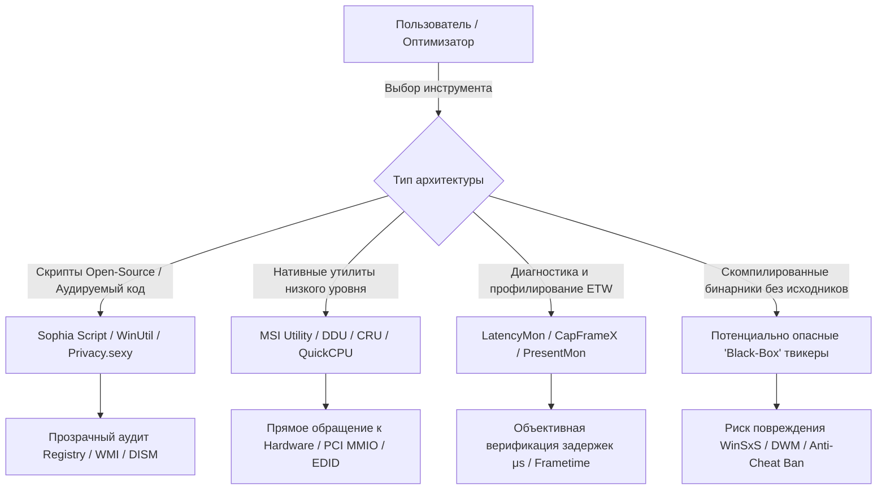
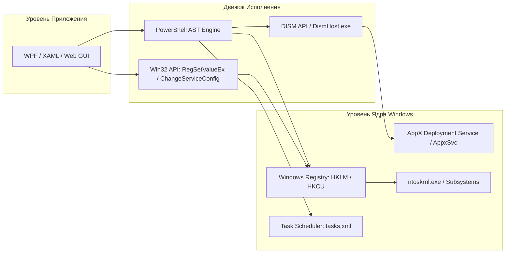
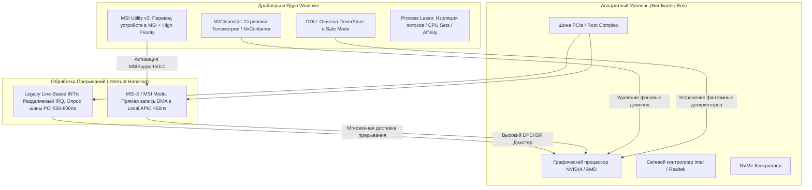
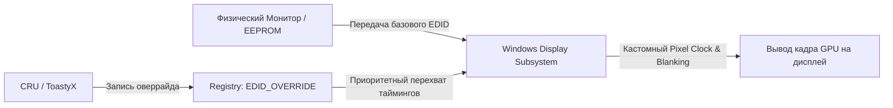
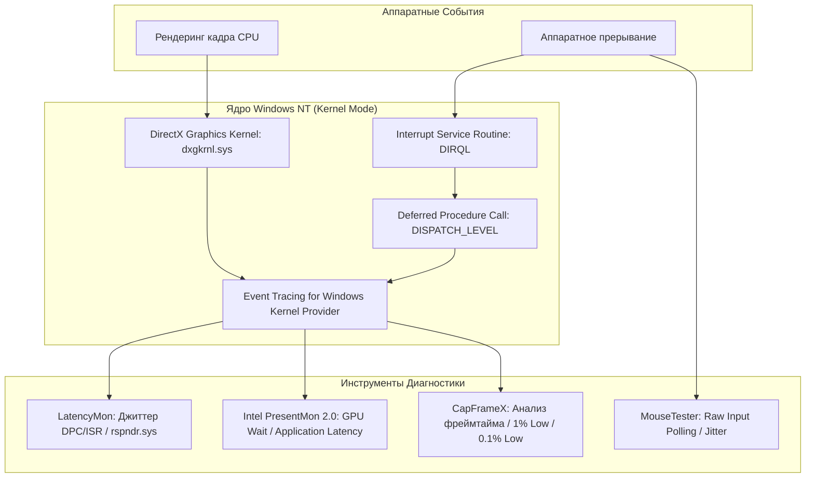
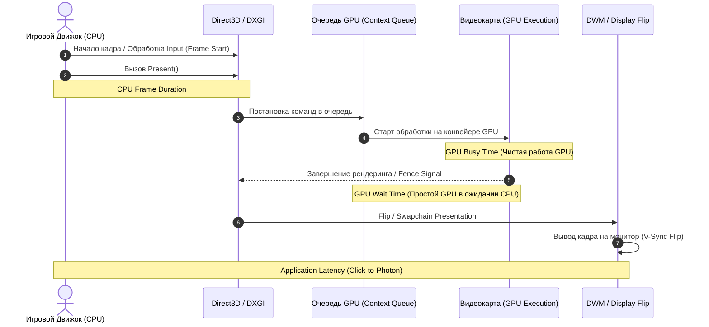
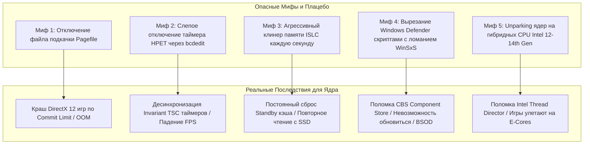
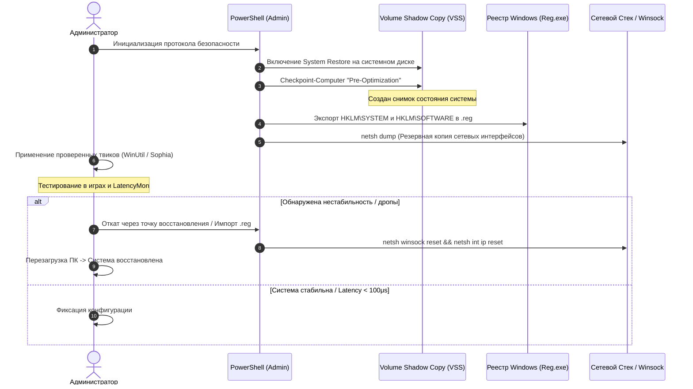

# Экосистема Open-Source Утилит, Скриптов Оптимизации и GitHub Репозиториев Windows

---

## 1. Архитектурный Манифест: Принципы Инженерного Аудита и Безопасности

В среде низкоуровневой настройки Windows (Windows OS Optimization & Kernel Tuning) существует фундаментальный водораздел между **научной, доказательной инженерией производительности** и **деструктивным «змеиным маслом» (Snake Oil)**. 

Современное ядро Windows NT (начиная с гибридной архитектуры Windows 10/11 x64, сборки 19045, 22631, 26100+) представляет собой высокоинтегрированную систему с тесными взаимосвязями между подсистемами:
* **Композитором DWM (Desktop Window Manager)** и графическим стеком **DirectX Graphics Kernel (`dxgkrnl.sys`)**.
* **Планировщиком потоков NT Kernel (`ntoskrnl.exe`)**, механизмами **Heterogeneous Scheduling (Intel Thread Director / AMD CPPC2)** и квантованием приоритетов.
* **Подсистемой безопасности VBS (Virtualization-based Security) / HVCI (Hypervisor-protected Code Integrity)** и прерываниями **APIC/MSI-X**.
* **Стеком ввода-вывода Raw Input / HID Class Driver** и диспетчером мультимедиа **MMCSS (Multimedia Class Scheduler Service)**.

Применение случайных `.bat` или `.reg` файлов из непроверенных источников с «твиками реестра» способно необратимо повредить базу транзакций **Component-Based Servicing (CBS / WinSxS)**, сломать механизм обработки системных прерываний, нарушить выравнивание таймеров ядра и привести к нестабильности фреймрейта (**Frame Pacing Degradation**), спайкам **DPC/ISR Latency** и BSOD.



### Критерии верификации инструментов оптимизации
1. **Открытый исходный код (Open Source / Publicly Auditable):** Возможность декомпиляции или прямого чтения сценариев (PowerShell AST, C# WPF, C++ Win32).
2. **Идемпотентность и обратимость:** Каждый примененный ключ реестра или отключенная служба должны иметь детерминированный алгоритм полного отката к дефолтному состоянию (`Default Out-of-Box State`).
3. **Совместимость с античитами уровня ядра (Kernel-Level Anti-Cheats):** Отсутствие блокировок со стороны **Riot Vanguard, Easy Anti-Cheat (EAC), BattlEye, FACEIT AC**.
4. **Неповреждение целостности системных файлов:** Запрет на грубое удаление системных библиотек из `C:\Windows\System32` и повреждение репозитория компонентов `DISM / Component Store`.

---

## 2. Сравнительная Архитектурная Таблица Твикеров и Деблойтеров

Ниже представлен детальный сравнительный анализ пяти ведущих инструментов деблойта и конфигурирования системы.

| Параметр | Chris Titus Tech WinUtil | Sophia Script for Windows | Optimizer (hellzerg) | Privacy.sexy | O&O ShutUp10++ |
| :--- | :--- | :--- | :--- | :--- | :--- |
| **Репозиторий / Источник** | `ChrisTitusTech/winutil` | `farag2/Sophia-Script-for-Windows` | `hellzerg/optimizer` | `undergroundwires/privacy.sexy` | O&O Software GmbH (Freeware) |
| **Язык / Архитектура** | PowerShell 5.1/7 + WPF/XAML | Модульный PowerShell (PSM1/PSD1) + SophiApp (C#) | C# (.NET Framework 4.8 / .NET 8) Win32 | TypeScript / Electron / YAML-генератор | C++ / Win32 Native Binary |
| **Интерфейс** | GUI (WPF окно через PowerShell) | CLI (Preset) / SophiApp GUI | GUI (WPF Desktop App) | Web / Desktop GUI (Code Export) | GUI (Классическое Win32 окно) |
| **Механизм деблойта AppX** | `Remove-AppxPackage` + `DISM` | Granular `Appx` / `Provisioned` Filter | Пакетный UWP Uninstaller | Генерируемый PowerShell скрипт | Не удаляет AppX (только запрет) |
| **Работа со службами** | Перевод в Manual / Disabled | Модульный сервис-менеджер | Пакетные пресеты служб | Отключение сервисов через SC | Управление политиками служб |
| **Модификация ISO (Microwin)** | Да (Интегрированный модуль) | Нет (Фокус на работающей ОС) | Нет | Нет | Нет |
| **Пакетный менеджер** | Winget / Chocolatey GUI wrapper | Нет (Опциональный вызов) | Встроенный менеджер софта | Нет | Нет |
| **Управление GPO / Реестром** | Прямая запись в Registry | Прямая запись / WMI / GPO | Прямая запись через Win32 API | Экспорт .BAT / .PS1 команд | Прямая запись в Registry/Policies |
| **Прозрачность кода** | 100% (Открытый репозиторий) | 100% (Открытый репозиторий) | 100% (Открытый репозиторий) | 100% (Открытый YAML/TS) | 0% (Проприетарный аудит) |
| **Уровень риска** | Низкий / Средний | Минимальный (Строгий контроль) | Средний | Настраиваемый (Strict Mode) | Минимальный |

---

## 3. Системные Твикеры и Деблойтеры



### 3.1. Chris Titus Tech WinUtil (`ChrisTitusTech/winutil`)

#### Архитектура и Исходный Код
WinUtil представляет собой монолитно-модульный инструмент автоматизации, запускаемый прямо из оперативной памяти через командную строку PowerShell.
* **Точка входа:** Загрузчик `start.ps1` скачивает агрегированный релизный файл `winutil.ps1`.
* **GUI-подсистема:** Интерфейс формируется с использованием **XAML (Extensible Application Markup Language)**, парсинг которого выполняется через .NET сборку `[System.Windows.Markup.XamlReader]::Parse($xaml)`. Отрисовка событий реализована с помощью синхронизированных хеш-таблиц (`[hashtable]::Synchronized(@{})`) для предотвращения зависания потока диспетчера UI.
* **Слой конфигурации:** Метаданные твиков, список пакетов Winget и правила деблойта разделены на JSON-структуры в каталоге `/config`.

#### Ключевые Функциональные Блоки
1. **Tweaks Tab (Оптимизация системы):**
   * Создание системной точки восстановления (`System Restore Point`).
   * Отключение телеметрии (`Telemetry`), истории действий (`Activity History`), отслеживания местоположения.
   * Отключение гибернации (`powercfg /h off`) для освобождения `hiberfil.sys`.
   * Отключение режима Fast Startup (предотвращает утечки памяти ядра при гибридном выключении).
   * Отключение GameDVR и фоновой записи клипов в `bcastdvr.exe`.
2. **Microwin (Модуль создания кастомных дистрибутивов Windows):**
   * Монтирование оригинального образа `install.wim` / `install.esd` через PowerShell командлеты DISM (`Mount-WindowsImage`).
   * Пакетное удаление интегрированных UWP-пакетов (`Remove-AppxProvisionedPackage`).
   * Удаление компонентов Edge, OneDrive, Cortana, телеметрии на этапе подготовки WIM.
   * Генерация файла автоматических ответов `unattend.xml` для обхода системных требований Windows 11 (TPM 2.0, Secure Boot, требование Microsoft Account / Network Connection при установке через bypass OOBE `OOBE\BYPASSNRO`).
   * Обратная упаковка и сжатие в ESD-образ (`Export-WindowsImage -CompressionType Max`).
3. **Install Tab (Пакетный менеджер):**
   * Абстракция над **Windows Package Manager (Winget)** и Chocolatey. Позволяет в один клик развертывать runtime-библиотеки (Visual C++ Redistributable 2005–2022, DirectX End-User Runtimes, .NET Desktop Runtime), браузеры, игровые лаунчеры и утилиты.

#### Быстрый запуск из PowerShell (Admin)
```powershell
# Запуск актуальной версии WinUtil напрямую из памяти
irm https://christitus.com/win | iex
```

#### Точечные манипуляции реестром из модуля WinUtil
```powershell
# Отключение телеметрии Diagnostic Data
Set-ItemProperty -Path "HKLM:\SOFTWARE\Policies\Microsoft\Windows\DataCollection" -Name "AllowTelemetry" -Type DWord -Value 0

# Отключение Windows GameDVR (Xbox Game Bar Background Recording)
Set-ItemProperty -Path "HKCU:\System\GameConfigStore" -Name "GameDVR_Enabled" -Type DWord -Value 0
Set-ItemProperty -Path "HKLM:\SOFTWARE\Policies\Microsoft\Windows\GameDVR" -Name "AllowGameDVR" -Type DWord -Value 0

# Отключение фонового отслеживания сетевого трафика NetworkThrottlingIndex (Gaming Network Fix)
Set-ItemProperty -Path "HKLM:\SOFTWARE\Microsoft\Windows NT\CurrentVersion\Multimedia\SystemProfile" -Name "NetworkThrottlingIndex" -Type DWord -Value 0xFFFFFFFF
Set-ItemProperty -Path "HKLM:\SOFTWARE\Microsoft\Windows NT\CurrentVersion\Multimedia\SystemProfile" -Name "SystemResponsiveness" -Type DWord -Value 0
```

---

### 3.2. Sophia Script for Windows (`farag2/Sophia-Script-for-Windows`) & SophiApp

#### Архитектура и Принципы Проектирования
Sophia Script — это наиболее глубокий, стандартизированный и гранулярный проект для деблойта и конфигурирования Windows 10/11 в мире. В отличие от монолитных скриптов, Sophia Script спроектирован как полноценный модуль PowerShell (`.psm1` / `.psd1`), содержащий более 150 изолированных функций.
* **Качество кода:** Написан со строгой типизацией параметров, обработкой исключений `try/catch/finally` и поддержкой конвейера PowerShell (Pipeline).
* **Слой абстракции:** Разделен на исполнительный движок (`Sophia.psm1`), конфигурационный манифест (`Sophia.psd1`) и пользовательский файл пресета (`Sophia.ps1`), в котором администратор комментирует/раскомментирует нужные функции.
* **SophiApp:** Нативная графическая оболочка на **C# / WPF (.NET 8)**, использующая паттерн **MVVM (Model-View-ViewModel)**. Полностью исключает запуск скрытых фоновых процессов, выполняя действия через транзакционные вызовы Windows API.

#### Ключевые возможности и сценарии
* **Гранулярное удаление UWP/AppX:** Разделение на приложения текущего пользователя (`Get-AppxPackage`) и системные пакеты для всех будущих пользователей (`Get-AppxProvisionedPackage`). Предотвращает поломку Microsoft Store и системных компонентов калькулятора/терминала.
* **Очистка планировщика задач (Task Scheduler):** Отключение более 60 задач телеметрии, диагностических сборщиков CEIP (Customer Experience Improvement Program) и фоновых трекеров:
  * `\Microsoft\Windows\Customer Experience Improvement Program\Consolidator`
  * `\Microsoft\Windows\Customer Experience Improvement Program\UsbCeip`
  * `\Microsoft\Windows\Application Experience\Microsoft Compatibility Appraiser`
  * `\Microsoft\Windows\Application Experience\ProgramDataUpdater`
  * `\Microsoft\Windows\Autochk\Proxy`
  * `\Microsoft\Windows\DiskDiagnostic\Microsoft-Windows-DiskDiagnosticDataCollector`
* **Настройка безопасности и приватности:** Отключение Cortana, Windows Copilot, AI Recall, SmartScreen для программ, Windows Error Reporting (`WerSvc`), отправки рукописного ввода.
* **Сетевая оптимизация:** Конфигурирование безопасного протокола **DNS over HTTPS (DoH)** для системных сетевых адаптеров (Cloudflare 1.1.1.1, Quad9, AdGuard).

#### Консольный запуск
```powershell
# Запуск загрузчика Sophia Script в интерактивном режиме
irm https://raw.githubusercontent.com/farag2/Sophia-Script-for-Windows/master/Sophia.ps1 | iex
```

#### Пример системных функций из ядра модуля
```powershell
# Отключение задач телеметрии в планировщике
$Tasks = @(
    "\Microsoft\Windows\Application Experience\Microsoft Compatibility Appraiser",
    "\Microsoft\Windows\Application Experience\ProgramDataUpdater",
    "\Microsoft\Windows\Customer Experience Improvement Program\Consolidator",
    "\Microsoft\Windows\Customer Experience Improvement Program\UsbCeip",
    "\Microsoft\Windows\DiskDiagnostic\Microsoft-Windows-DiskDiagnosticDataCollector"
)
foreach ($Task in $Tasks) {
    Get-ScheduledTask -TaskPath ($Task | Split-Path -Parent) -TaskName ($Task | Split-Path -Leaf) -ErrorAction SilentlyContinue | Disable-ScheduledTask
}

# Отключение изоляции ядер Core Isolation (VBS/HVCI) для прироста 1% Low FPS
Set-ItemProperty -Path "HKLM:\SYSTEM\CurrentControlSet\Control\DeviceGuard" -Name "EnableVirtualizationBasedSecurity" -Type DWord -Value 0
Set-ItemProperty -Path "HKLM:\SYSTEM\CurrentControlSet\Control\DeviceGuard\Scenarios\HypervisorEnforcedCodeIntegrity" -Name "Enabled" -Type DWord -Value 0
```

---

### 3.3. Optimizer by hellzerg (`hellzerg/optimizer`)

#### Архитектура
**Optimizer** — это автономная (Portable), высокопроизводительная утилита, написанная на **C#** с интерфейсом **WPF**. Программа не требует установки и скомпилирована в виде единого бинарного файла, содержащего встроенные ресурсы.
* Взаимодействие с системой осуществляется через прямые P/Invoke вызовы функций Win32 API (`advapi32.dll`, `kernel32.dll`, `user32.dll`) вместо медленных вызовов внешних утилит командной строки.
* Поддерживает **Silent Mode** и автоматизацию развертывания через шаблоны конфигураций JSON и флаги командной строки.

#### Функционал
* **Universal Tweaks:** Отключение телеметрии Office, Visual Studio, Mozilla, Google Chrome, NVIDIA Telemetry; отключение системной службы телеметрии `DiagTrack` и `dmwappushservice`.
* **Windows 11 Specifics:** Восстановление классического контекстного меню проводника (без задержки отрисовки XAML-контекста), возвращение панели задач влево, отключение Copilot, виджетов Windows, стикеров рабочего стола.
* **Сетевой блок:** Очистка кэша DNS Resolver, форсированное применение cURL/Ping тестов, оптимизация MTU, отключение сетевого регулирования трафика.
* **Аппаратные фиксы:** Включение/отключение таймера HPET (High Precision Event Timer), отключение гибернации, управление кэшем страниц ядра.

#### Командная строка для автоматизации (CLI Switches)
```cmd
:: Запуск Optimizer в тихом режиме с профилем настроек
Optimizer.exe /silent /preset=gaming_config.json

:: Перезагрузка системы после применения твиков
Optimizer.exe /silent /restart
```

---

### 3.4. Privacy.sexy (`undergroundwires/privacy.sexy`)

#### Архитектура «Код-как-Конфигурация» (YAML-Driven Engine)
Privacy.sexy представляет собой передовой проект в области прозрачного аудита безопасности.
* Вместо жестко закодированных алгоритмов в исполняемом файле, все системные изменения описаны в виде структурированных **YAML-файлов** в открытом репозитории.
* Каждый твик содержит:
  * Уникальный идентификатор (`id`).
  * Четкое описание последствий для системы.
  * Точный скрипт применения (`run`) на PowerShell/CMD/Bash.
  * Точный скрипт отката (`revert`).
* Пользователь может выбрать требуемый уровень приватности в Web-интерфейсе или Desktop Electron App и экспортировать готовый, легко читаемый `.bat` или `.ps1` скрипт, проверив каждую строчку перед исполнением.

```yaml
# Пример структуры YAML-манифеста Privacy.sexy
id: disable-telemetry-service
category: Windows/Telemetry
name: Disable Connected User Experiences and Telemetry Service
description: Disables the DiagTrack service responsible for event logging and telemetry transmission.
recommendation: standard
commands:
  run:
    - type: powershell
      command: Stop-Service -Name DiagTrack -Force; Set-Service -Name DiagTrack -StartupType Disabled
  revert:
    - type: powershell
      command: Set-Service -Name DiagTrack -StartupType Automatic; Start-Service -Name DiagTrack
```

---

### 3.5. O&O ShutUp10++

#### Архитектура Управления Групповыми Политиками (GPO)
O&O ShutUp10++ — эталонная проприетарная бесплатная утилита от немецкой компании O&O Software GmbH.
* Не требует установки (Portable x64 binary).
* Не удаляет системные файлы и пакеты. Работает исключительно на уровне манипуляции параметрами **Registry Group Policy Objects (GPO)** в ветке `HKLM\SOFTWARE\Policies\Microsoft\Windows\` и `HKCU\Software\Policies\Microsoft\Windows\`.
* Классифицирует все параметры на 3 цветовые категории:
  1. **Зеленый (Рекомендовано):** Абсолютно безопасные твики телеметрии, не нарушающие функционал системы.
  2. **Желтый (Условно рекомендовано):** Отключение служб биометрии (Windows Hello), синхронизации буфера обмена, истории поиска.
  3. **Красный (Не рекомендовано):** Отключение обновлений Windows Update, камеры, микрофона, служб геолокации (может нарушить работу периферии и софта).

```registry
; Ключевые GPO-параметры, записываемые O&O ShutUp10++
[HKEY_LOCAL_MACHINE\SOFTWARE\Policies\Microsoft\Windows\DataCollection]
"AllowTelemetry"=dword:00000000
"DoNotShowFeedbackNotifications"=dword:00000001

[HKEY_LOCAL_MACHINE\SOFTWARE\Policies\Microsoft\Windows\Windows Search]
"AllowCortana"=dword:00000000
"DisableWebSearch"=dword:00000001
"ConnectedSearchUseWeb"=dword:00000000

[HKEY_LOCAL_MACHINE\SOFTWARE\Policies\Microsoft\Windows\CloudContent]
"DisableWindowsConsumerFeatures"=dword:00000001
"DisableSoftLanding"=dword:00000001
```

---

## 4. Утилиты Низкоуровневой Оптимизации Драйверов и Аппаратных Задержек



---

### 4.1. NVCleanstall (TechPowerUp) & NVSlimmer

#### Проблема заводских пакетов NVIDIA Game Ready / Studio
Официальный дистрибутив драйверов NVIDIA (размером 600–700 МБ) перегружен вспомогательными модулями:
* **NVTelemetry:** Фоновый сбор телеметрии производительности и поведения пользователя, отправляемый на серверы NVIDIA.
* **NvContainer:** Фоновые процессы (`nvcontainer.exe`), создающие дополнительные сокеты и опрашивающие системные счетчики каждые несколько миллисекунд.
* **Shield Wireless Controller Service:** Служба поддержки контроллеров Shield.
* **GeForce Experience Core / NodeJS Backend:** Занимает до 1 ГБ оперативной памяти и периодически инжектирует хуки в цепочки DWM/DXGI.

#### Механика работы NVCleanstall
1. **Распаковка архива драйвера:** Временное извлечение инсталлятора во временный каталог через алгоритмы 7-Zip.
2. **Парсинг манифестов компонентов:** Чтение `setup.cfg` и каталогов пакетов (`Display.Driver`, `NVI2`, `NVTelemetry`, `GFExperience`, `PPC`, `PhysX`, `HDAudio`).
3. **Стриппинг компонентов:** Удаление всех модулей, кроме чистого графического драйвера ядра (`Display.Driver`) и, при необходимости, **PhysX**.
4. **Инъекция твиков в INF-файлы:**
   * Автоматическое включение **Message Signaled Interrupts (MSI Mode)** непосредственно в секцию установки `[nv_disp.reg]`.
   * Отключение энергосбережения HD Audio Sleep (предотвращает щелчки и микролаги звука при выводе через HDMI/DisplayPort).
   * Отключение HDCP (High-bandwidth Digital Content Protection) для снижения оверхеда захвата кадров через карты захвата.
   * Форсирование чистого профиля установки (Clean Installation Script).

---

### 4.2. Display Driver Uninstaller (DDU by Wagnardsoft)

#### Почему Safe Mode (Безопасный режим) критически обязателен?
В штатном режиме Windows системные службы, графическая подсистема ядра `dxgkrnl.sys`, драйвер дисплея `nvlddmkm.sys` / `amdkmdag.sys` и процесс `dwm.exe` удерживают открытые системные дескрипторы (Handles) на библиотеки драйвера в `C:\Windows\System32\DriverStore\FileRepository\`.

При попытке удаления или обновления поверх старого драйвера:
1. Заблокированные файлы не удаляются, а помещаются в очередь `PendingFileRenameOperations`.
2. В реестре остаются фантомные ветки устройств `Enum\PCI` с некорректными привязками Service GUID.
3. Возникает феномен «грязного стека драйвера», приводящий к резкому увеличению времени обработки DPC в `dxgkrnl.sys` (всплески до 1000–3000 мкс).

**DDU в среде Safe Mode:**
* Загружает базовый драйвер VESA/VGA (`vga.sys` / `basicdisplay.sys`).
* Полностью разгружает сторонние файлы ядра.
* Удаляет устройства через API **SetupAPI / PnPUtil** (`pnputil /delete-driver oemXX.inf /uninstall /force`).
* Блокирует автоматическую загрузку драйверов через Windows Update путем временной модификации системной политики `SearchOrderConfig`:
  `HKLM\SOFTWARE\Microsoft\Windows\CurrentVersion\DriverSearching\SearchOrderConfig = 0`.

---

### 4.3. MSI Utility v3 (Message Signaled Interrupts)

#### Физика и теория прерываний: Line-Based INTx против MSI/MSI-X
В архитектуре шины PCI исторически использовались физические линии прерываний **Line-Based Interrupts (INTA#, INTB#, INTC#, INTD#)**:
1. Когда GPU генерирует прерывание, он переводит соответствующую линию на шине в низкий уровень напряжения.
2. Контроллер прерываний (IO-APIC) отправляет вектор процессору.
3. Поскольку линии INTx разделяются между несколькими устройствами (**IRQ Sharing**, например, GPU делит IRQ 16 с USB-контроллером или аудиокартой), процессор обязан приостановить текущий поток и выполнить транзакцию чтения по шине PCI (**PCI Bus Read Transaction**), чтобы опросить регистры каждого устройства и выяснить, кто именно сгенерировал прерывание.
4. Транзакция чтения по шине занимает **300–800 нс**. В этот момент процессор простаивает.

**Message Signaled Interrupts (MSI / MSI-X):**
1. Устройство не дергает физические линии шины.
2. Вместо этого GPU выполняет прямую запись **32-битного DMA-сообщения (PCIe Memory Write TLP)** по зарезервированному адресу в память **Local APIC** процессора (область `0xFEE00000`).
3. Прерывание является строго адресным, не разделяется ни с кем, вектор прерывания уникален. Время доставки прерывания сокращается до **<30–50 нс**, исключая задержки на опрос шины.

```registry
; Включение MSI Mode и высокого приоритета для видеокарты в реестре Windows
[HKEY_LOCAL_MACHINE\SYSTEM\CurrentControlSet\Enum\PCI\<GPU_Device_Instance_ID>\Device Parameters\Interrupt Management\MessageSignaledInterruptProperties]
"MSISupported"=dword:00000001
"MessageNumberLimit"=dword:00000001

[HKEY_LOCAL_MACHINE\SYSTEM\CurrentControlSet\Enum\PCI\<GPU_Device_Instance_ID>\Device Parameters\Interrupt Management\Affinity Policy]
"DevicePriority"=dword:00000003
```
*Где `DevicePriority`: `3` = High (Высокий), `2` = Normal, `1` = Low, `0` = Undefined.*

> [!IMPORTANT]
> Перевод видеокарты (GPU), сетевого адаптера (NIC) и NVMe-накопителя в режим **MSI Mode (High Priority)** полностью устраняет микрофризы, вызванные аппаратными конфликтами очередей прерываний.

---

### 4.4. Custom Resolution Utility (CRU by ToastyX)

#### Архитектура EDID / CTA-861 Override
CRU не изменяет файлы драйверов и не перепрошивает монитор. Она создает программный оверрайд блока данных идентификации дисплея (**Extended Display Identification Data — EDID**) в системном реестре Windows по пути:
`HKLM\SYSTEM\CurrentControlSet\Enum\DISPLAY\<Monitor_ID>\<Instance_ID>\Device Parameters\EDID_OVERRIDE`.



#### Ключевые возможности для соревновательного гейминга
1. **Large Vertical Total (VT) Tweaks (Стробинг подсветки):**
   * В мониторах с технологиями стробирования подсветки (BenQ DyAc / DyAc2, ASUS ELMB, ViewSonic PureXP) время отклика матрицы ограничено скоростью сканирования пикселей сверху вниз.
   * Увеличение параметра **Vertical Total (VT)** (например, стандартный VT 1125 при 1080p увеличивается до VT 1350 или 1500) расширяет область **Vertical Blanking Interval (VBI)** — паузу между отрисовкой кадров.
   * Это дает жидким кристаллам матрицы дополнительное время (1–2 мс) для завершения фазового перехода до того, как вспыхнет импульс подсветки. В результате полностью устраняется двоение картинки (**Strobe Crosstalk / Ghosting**).
2. **Удаление мусорных Extension Blocks (CEA-861):**
   * Удаление аудио-дескрипторов (если монитор не имеет колонок), режимов TV-разрешений (4K@60Hz, 1080i, 4:2:2 YCbCr) принудительно фиксирует видеокарту в нативном формате **Full Range RGB (0-255)** и предотвращает сброс частоты обновления при запуске старых игр.
3. **Утилита `restart64.exe`:**
   * Выполняет мгновенный сброс и перезапуск графического видеостека через вызов D3D/DXGI IOCTL без необходимости перезагрузки ПК.

---

### 4.5. Process Lasso (Bitsum)

#### Теория управления процессами ядра Windows
Штатный планировщик Windows NT распределяет потоки по ядрам на основе динамических приоритетов и квантов времени (**Quantum Time Slices**). В условиях тяжелых фоновых нагрузок (Discord, браузеры, античиты, OBS, фоновые компиляторы шейдеров) высокоприоритетные потоки игры могут испытывать задержки диспетчеризации (**Scheduling Latency**).

#### Ключевые технологии Process Lasso
1. **ProBalance (Process Balance):**
   * В режиме реального времени мониторит загрузку процессора каждым процессом. Если фоновый процесс начинает монополизировать процессорное время, вызывая рост очереди потоков (**Processor Queue Length > 1**), ProBalance временно понижает класс приоритета фонового процесса с `Normal` до `Below Normal`.
   * Как только нагрузка спадает, приоритет мгновенно возвращается. Главный игровой поток никогда не голодает (**Thread Starvation Prevention**).
2. **CPU Affinity против CPU Sets:**
   * **Hard CPU Affinity (`SetProcessAffinityMask`):** Жестко блокирует исполнение потоков процесса только на указанных ядрах. *Ограничение:* Если все выбранные ядра заняты, поток встает в очередь, даже если соседние ядра простаивают. Может конфликтовать с античитами.
   * **CPU Sets (`SetProcessDefaultCpuSets` / `SetThreadSelectedCpuSets`):** Механизм «мягкого» распределения (введен в Windows 10). Указывает планировщику приоритетные ядра для выполнения процесса, но в случае пиковых нагрузок разрешает ядру кратковременно мигрировать потоки на свободные ядра. Не вызывает жестких блокировок и полностью прозрачен для EAC/Vanguard.
3. **Оптимизация AMD Ryzen X3D (Dual-CCD Tuning):**
   * На процессорах AMD Ryzen 9 7900X3D, 7950X3D, 9950X3D (где только CCD0 оснащен 3D V-Cache, а CCD1 имеет стандартный кэш с более высокими частотами):
   * Process Lasso позволяет жестко привязать игру к **CCD0 (Cores 0-7 / 0-15)** с огромным L3-кэшем 96 МБ, а фоновые задачи (Discord, OBS, Spotify, браузер) привязать к **CCD1 (Cores 8-15 / 16-31)**. Это устраняет межъядерные задержки шины **Infinity Fabric (Inter-CCD Latency ~70-80 ns)**.
4. **Disable Windows Dynamic Power Throttling (EcoQoS):**
   * Принудительное снятие флага `PROCESS_POWER_THROTTLING_EXECUTION_SPEED` для игровых процессов гарантирует, что Windows не переведет потоки рендеринга на энергоэффективные ядра (E-Cores) в фоновом режиме.

---

### 4.6. QuickCPU

#### Прямое взаимодействие с регистрами процессора (MSR)
QuickCPU использует специализированный низкоуровневый драйвер ядра для прямого чтения и записи **Model Specific Registers (MSR)** процессоров Intel и AMD:
* **Core Parking (Парковка ядер):** Управление битовыми масками параметров схемы электропитания Windows. Принудительная установка `CPMinCores` и `CPMaxCores` в значение `100%` полностью запрещает перевод неактивных ядер в состояние глубокого сна **C-States (C3/C6/C7)**. Это исключает задержку пробуждения ядра (**Core Wakeup Latency ~20–100 мкс**) при внезапном поступлении нагрузки.
* **Energy Performance Preference (EPP / Speed Shift - MSR `0x1B8`):** Перевод аппаратного регистра EPP процессоров Intel/AMD в значение `0` (Max Performance) заставляет внутренний контроллер частоты CPU удерживать максимальные турбо-частоты без сброса множителя между кадрами.

```powershell
# Разблокировка и отключение парковки ядер через PowerShell (PowerCFG)
powercfg -setacvalueindex scheme_current sub_processor CPMINCORES 100
powercfg -setacvalueindex scheme_current sub_processor CPMAXCORES 100
powercfg -setactive scheme_current
```

---

## 5. Комплексы Диагностики, Профилирования и Телеметрии Задержек



---

### 5.1. LatencyMon (Resplendence)

#### Физика DPC (Deferred Procedure Call) и ISR (Interrupt Service Routine)
Для понимания архитектуры задержек операционной системы Windows необходимо различать уровни приоритета прерываний **IRQL (Interrupt Request Level)**:
1. **ISR (Interrupt Service Routine):** Выполняется на самом высоком аппаратном уровне `DIRQL`. При возникновении аппаратного события (пришел сетевой пакет, кадр отправлен на монитор) процессор мгновенно бросает исполнение любого пользовательского кода и выполняет код ISR драйвера. ISR обязан выполниться за доли микросекунды: он просто сохраняет состояние и ставит в очередь отложенный вызов процедуры — **DPC**.
2. **DPC (Deferred Procedure Call):** Выполняется на программном уровне `DISPATCH_LEVEL (IRQL 2)`. В то время как на процессорном ядре выполняется DPC-рутина драйвера, **планировщик Windows не может переключить контекст ни на один поток пользовательского режима** (включая поток игры CS2, Apex или Valorant).
3. **DPC Latency Spike (Спайк задержки):** Если проблемный драйвер (например, сетевой драйвер Wi-Fi или графический драйвер с включенной телеметрией) зависает внутри своего DPC-вызова на **1000–3000 мкс (1–3 мс)**, игровой движок пропускает дедлайн подготовки кадра. Пользователь видит это как резкий микрофриз, дроп 0.1% Low FPS или треск в аудиокарте.

#### Как LatencyMon выявляет проблемные модули ядра
LatencyMon инжектирует драйвер ядра `rspndr.sys` и подписывается на события ETW ядра. Он с точностью до наносекунд измеряет время выполнения функций `KiInterruptDispatch` и `KiRetireDpcList`.

```
+---------------------------------------------------------------------------------------+
| КРИТИЧЕСКИЕ ДРАЙВЕРЫ И МЕТРИКИ В LATENCYMON                                           |
+----------------------+--------------------------+-------------------------------------+
| Файл драйвера        | Описание подсистемы      | Нормальное время исполнения (DPC)  |
+----------------------+--------------------------+-------------------------------------+
| nvlddmkm.sys         | Драйвер ядра NVIDIA      | 50 - 250 мкс (Спайки >500 = Проблема)|
| amdkmdag.sys         | Драйвер ядра AMD Radeon  | 50 - 200 мкс                       |
| ndis.sys / tcpip.sys | Сетевой стек Windows     | 20 - 80 мкс                         |
| storport.sys         | Драйвер контроллера NVMe | 10 - 50 мкс                         |
| Wdf01000.sys         | Kernel Mode Driver Frame | 30 - 100 мкс                        |
| dxgkrnl.sys          | DirectX Graphics Kernel  | 40 - 150 мкс                        |
| ACPI.sys             | Управление питанием ACPI | 20 - 80 мкс (Спайки >1000 = C-State)|
+----------------------+--------------------------+-------------------------------------+
```

#### Шкала качества системы (DPC Latency Rating)
* **< 100 мкс:** Эталонная система (Киберспортивный стандарт, ноль статтеров).
* **100 – 300 мкс:** Отличное состояние для игр и стриминга.
* **300 – 800 мкс:** Приемлемо, но возможны редкие микрофризы при высокой загрузке шины.
* **> 1000 мкс (Красная зона):** Критическая нестабильность, дропы кадров, заикания звука.

---

### 5.2. CapFrameX (`CXWorld/CapFrameX`)

#### Архитектура захвата телеметрии фреймтайма
CapFrameX — это флагманский open-source комплекс захвата и глубокого статистического анализа времени рендеринга кадров (**Frametime Analysis**).
* **Слой перехвата:** Использует модифицированный сервис **Intel PresentMon** для бескрюкового перехвата событий подсистемы DXGI/DirectX через **Event Tracing for Windows (ETW)**. Отсутствие прямого хукинга DLL гарантирует **100% безопасность во всех античитах (VAC, Vanguard, EAC, BattlEye)**.
* **Слой сенсоров:** Интегрированная библиотека **LibreHardwareMonitor** обеспечивает синхронный сбор данных с датчиков CPU/GPU (температуры, частоты по ядрам, вольтажи, энергопотребление, сброс троттлинга) с частотой опроса до 100 Гц.
* **Слой оверлея:** Передача телеметрии в реальном времени через разделяемую память в **RivaTuner Statistics Server (RTSS)**.

#### Ключевые метрики плавности геймплея
1. **Average FPS:** Средняя частота кадров за отрезок времени (малоинформативна без учета распределения).
2. **1% Low (P1 / 99-й процентиль):** Средний FPS худшего 1% кадров. Отражает общую плавность геймплея и просадки в насыщенных сценах (перестрелки, дымовые гранаты, эффекты).
3. **0.1% Low (P0.1 / 99.9-й процентиль):** Средний FPS самых худших 0.1% кадров. Отражает наличие жестких системных статтеров, фоновых DPC-спайков и просадок от подгрузки ассетов с диска.
4. **Stuttering Percentage / Deviation (Показатель статтеринга):** Процент кадров, время рендеринга которых превышает средний фреймтайм более чем на **2.5×** ($T_{frame} > 2.5 \times T_{avg}$).

---

### 5.3. Intel PresentMon 2.0 (`GameTechDev/PresentMon`)

#### Революция метрик: переход от FPS к задержкам конвейера рендеринга
PresentMon 2.0 кардинально меняет методологию оценки производительности. Вместо тривиального замера времени вызова `Present()`, PresentMon перехватывает низкоуровневые события провайдеров `Microsoft-Windows-DxgKrnl` и `Microsoft-Windows-Dwm-Core`.



#### Ключевые метрики PresentMon 2.0
* **GPU Busy (Чистая занятость GPU):** Время (в мс), которое видеокарта реально тратит на выполнение команд рендеринга конкретного кадра.
* **GPU Wait (Время ожидания GPU):** Время, в течение которого видеокарта простаивает в ожидании, пока процессор передаст следующую пачку команд.
* **Application Latency (Задержка приложения):** Время от момента, когда игровой движок начал опрашивать ввод и генерировать кадр на процессоре, до момента, когда готовый кадр отправлен на физический флип экрана. Это наиболее точный программный аналог задержки **Click-to-Photon**.

#### Диагностика узких мест (Bottleneck Detection)
* **Если `Frame Time` $\approx$ `GPU Busy`:** Система уперлась в видеокарту (**GPU Bound**). Оптимальный сценарий для минимального джиттера ввода при использовании NVIDIA Reflex / AMD Anti-Lag.
* **Если `GPU Busy` $\ll$ `Frame Time` (высокий `GPU Wait`):** Система жестко уперлась в производительность центрального процессора или задержки памяти (**CPU / Memory Subsystem Bound**). Требуется тюнинг субтаймингов RAM, отключение VBS, настройка приоритетов ядер.

---

### 5.4. MouseTester (`microe1/MouseTester`)

#### Архитектура перехвата Raw Input
MouseTester использует подсистему **Windows Raw Input API** (`RegisterRawInputDevices` с флагом `RIDEV_INPUTSINK` и обработчик оконных сообщений `WM_INPUT`). Каждое движение мыши генерирует аппаратный пакет отчетов (Report Packet), метки времени которого считываются через аппаратный счетчик высокого разрешения `QueryPerformanceCounter` (QPC).

#### Аналитические графики и их интерпретация
1. **Interval vs. Time (Интервалы опроса):**
   * При частоте опроса **1000 Гц** идеальный интервал между пакетами составляет **1.0 мс**.
   * При частоте **4000 Гц** — **0.25 мс**.
   * При частоте **8000 Гц** — **0.125 мс**.
   * На графике отображается разброс точек (Джиттер). Если точки распадаются на полосы (например, при 1000 Гц возникают спайки до 2.0–3.0 мс), это свидетельствует о перегрузке корневого USB-концентратора, конфликтах прерываний DPC или троттлинге процессора.
2. **Frequency vs. Time (Стабильность частоты):**
   * Проверка способности связки «Контроллер мыши + USB Host Controller + CPU» удерживать заявленный Polling Rate без провалов.
3. **xCount / yCount vs. Time (Анализ сенсора):**
   * Позволяет выявить аппаратное сглаживание сенсора (**Sensor Smoothing**), коррекцию траектории (**Angle Snapping**) или срыв сенсора при резких фликах (**Spin-out**).

---

### 5.5. Microsoft Sysinternals Suite

Набор эталонных утилит от Марка Руссиновича (Mark Russinovich, CTO Microsoft Azure) для глубокого аудита ядра Windows.

#### 1. AutoRuns (`Autoruns64.exe`)
Самый мощный в мире анализатор автозагрузки. Сканирует более 140 точек расширения автозапуска **ASEP (Auto-Start Extensibility Points)**:
* Ветки `Run`, `RunOnce` в реестре HKLM/HKCU.
* Библиотеки инъекций `AppInit_DLLs`, `Explorer ShellExecuteHooks`.
* Драйверы ядра (`Drivers Tab`) и системные службы (`Services Tab`).
* Скрытые задачи планировщика (`Task Scheduler Tab`), WMI Event Consumers, Winsock Layered Service Providers (LSP).
* **Интеграция с VirusTotal:** Мгновенная проверка хешей всех бинарников по базе из 70+ антивирусов.

#### 2. Process Explorer (`procexp64.exe`)
Ультимативная замена диспетчера задач:
* **Подключение серверов символов Microsoft (Symbol Server):** Позволяет просматривать стек вызовов потоков ядра в реальном времени (`ntdll.dll!KiUserApcDispatcher -> dxgkrnl.sys -> nvlddmkm.sys`).
* **Мониторинг типов памяти:** Разделение на Committed, Working Set, Private Bytes, Paged/Non-Paged Pool.
* **GPU Engine Tracking:** Мониторинг выделенной видеопамяти (**Dedicated GPU Memory**), разделяемой системной памяти (**Shared System Memory**) и загрузки блоков декодирования NVENC/NVDEC.
* **Поиск дескрипторов и DLL:** Мгновенный поиск процесса, заблокировавшего файл или порт ввода-вывода (`Ctrl + F`).

#### 3. Process Monitor (`ProcMon64.exe`)
Журналирование активности файловой системы, реестра, сетевых сокетов и создания процессов на уровне драйвера ядра `PROCMON24.SYS`.
* **Диагностика лагов:** Фильтрация событий по условию `Duration > 0.01s` позволяет мгновенно обнаружить фоновые службы, совершающие синхронные дисковые операции ввода-вывода во время игры.

#### 4. RAMMap (`RAMMap64.exe`)
Низкоуровневый анализатор использования физической оперативной памяти:
* **Структура кэша памяти:** Детализация по спискам страниц: `Active`, `Standby List` (кэш чтения), `Modified Page List` (грязные страницы, ожидающие сброса на накопитель), `Modified No-Write`, `Free`, `Zeroed`.
* **Очистка Standby List:** Функция `Empty -> Empty Standby List` позволяет мгновенно освободить кэш ожидания без перезагрузки системы в случае сбоев старых игр.

---

## 6. Каталог Проверенных GitHub Репозиториев и Инструментов

Ниже представлена кураторская таблица лучших открытых проектов для тонкой настройки, тюнинга и мониторинга Windows.

| Проект / Название | Автор / Ссылка | Стек / Технология | Назначение и Описание | Рекомендуемая Команда / Запуск |
| :--- | :--- | :--- | :--- | :--- |
| **WinUtil** | [`ChrisTitusTech/winutil`](https://github.com/ChrisTitusTech/winutil) | PowerShell, XAML, C# | Универсальный деблойтер, менеджер пакетов, Microwin ISO creator | `irm https://christitus.com/win \| iex` |
| **Sophia Script** | [`farag2/Sophia-Script-for-Windows`](https://github.com/farag2/Sophia-Script-for-Windows) | PowerShell Module | Глубокий гранулярный аудит, деблойт UWP, планировщик задач, DoH | `irm https://raw.githubusercontent.com/farag2/Sophia-Script-for-Windows/master/Sophia.ps1 \| iex` |
| **SophiApp** | [`Sophia-Community/SophiApp`](https://github.com/Sophia-Community/SophiApp) | C#, WPF, .NET 8 | Современный графический интерфейс для модуля Sophia Script | Скачивание релиза `.exe` с GitHub |
| **Optimizer** | [`hellzerg/optimizer`](https://github.com/hellzerg/optimizer) | C#, .NET Win32 | Автономный твикер приватности, производительности и интерфейса | `Optimizer.exe /silent /preset=config.json` |
| **Privacy.sexy** | [`undergroundwires/privacy.sexy`](https://github.com/undergroundwires/privacy.sexy) | TypeScript, Electron, YAML | Генератор прозрачных скриптов очистки и приватности по шаблонам | Запуск через Desktop App или Web UI |
| **CapFrameX** | [`CXWorld/CapFrameX`](https://github.com/CXWorld/CapFrameX) | C#, PresentMon, RTSS | Захват и анализ фреймтайма, 1% Low, сенсорная телеметрия | Запуск GUI + подключение RTSS |
| **PresentMon** | [`GameTechDev/PresentMon`](https://github.com/GameTechDev/PresentMon) | C++, ETW Engine | Анализ задержек конвейера рендеринга, метрики GPU Busy / Wait | Запуск PresentMon Overlay Service |
| **MouseTester** | [`microe1/MouseTester`](https://github.com/microe1/MouseTester) | C#, Raw Input API | Тестирование стабильности частоты опроса и сенсора мыши | Запуск `MouseTester.exe` от Администратора |
| **ExplorerPatcher** | [`valinet/ExplorerPatcher`](https://github.com/valinet/ExplorerPatcher) | C, C++, Win32 DLL | Возврат классической быстрой панели задач Windows 10 в Windows 11 | Установка через инсталлятор GitHub |
| **BloatyNosy / PlugNTurn** | [`builtbybel/BloatyNosy`](https://github.com/builtbybel/BloatyNosy) | C#, .NET | Модульный анализатор ненужных компонентов Windows 11 | Запуск автономного исполняемого файла |
| **Win11Debloat** | [`Raphire/Win11Debloat`](https://github.com/Raphire/Win11Debloat) | PowerShell | Легковесный быстрый скрипт удаления телеметрии и предустановленного софта | `irm https://win11debloat.raphire.net \| iex` |
| **PC Tuning Guide** | [`amitxv/PC-Tuning-Guide`](https://github.com/amitxv/PC-Tuning-Guide) | Markdown Knowledge Base | Документированная база знаний по минимизации DPC Latency и Input Lag | Чтение документации репозитория |

---

## 7. Мифы, Плацебо, Опасные Твики и Скрытые Ловушки

В сообществе твикинга циркулирует огромное количество псевдонаучных мифов, которые на практике либо снижают стабильность системы, либо напрямую ухудшают время кадра.



### Миф 1: «Полное отключение файла подкачки (Pagefile) ускоряет систему, если много RAM»
* **Реальность:** Менеджер виртуальной памяти Windows NT (`Virtual Memory Manager / VMM`) спроектирован так, что страницы памяти, выделенные процессами под режим `MEM_COMMIT`, требуют обязательного резервирования адресного пространства (**Commit Limit** = Физическая память + Файл подкачки).
* **Последствия отключения:** Современные игры на DirectX 12 / Vulkan (Cyberpunk 2077, Warzone, Alan Wake 2, Hogwarts Legacy) при запуске аллоцируют гигантские виртуальные буферы под трансляцию ресурсов видеопамяти. При `Pagefile = 0`, даже при наличии 32 или 64 ГБ свободной физической RAM, игра моментально падает с ошибкой `Out of Memory (Crash to Desktop)`, а механизм создания дампов памяти BSOD полностью отключается.
* **Инженерное решение:** Зафиксировать минимальный и максимальный размер файла подкачки на самом быстром NVMe SSD равным **16384 МБ (16 ГБ)**. Это предотвратит динамическую фрагментацию файла `pagefile.sys` и исключит исчерпание лимита фиксации.

### Миф 2: «Слепое отключение HPET в bcdedit дает прирост плавности»
* **Реальность:** В современных процессорах (начиная с Intel Core 6-го поколения Skylake и AMD Zen 1) базовым таймером ядра является **Invariant TSC (Time Stamp Counter)**, работающий на неизменной частоте независимо от энергосбережения P-States.
* **Опасность:** Выполнение команд `bcdedit /deletevalue useplatformclock` и одновременное отключение High Precision Event Timer в диспетчере устройств при включенной виртуализации (VBS) может перевести ядро на устаревший медленный таймер ACPI PM Timer, увеличивая время вызова функции `QueryPerformanceCounter` с 15 нс до 1500 нс.
* **Инженерное решение:** Оставлять конфигурацию таймеров в заводском состоянии BIOS/Windows. Проверять задержку вызова QPC через утилиту `TimerBench`.

### Миф 3: «Постоянная циклическая очистка Standby List через ISLC»
* **Реальность:** Список `Standby List` в оперативной памяти — это **бесплатный кэш ранее прочитанных файлов с диска**. Если оперативной памяти достаточно, наличие кэшированных страниц ускоряет повторный запуск приложений и загрузку текстур.
* **Вред утилит:** Агрессивная очистка Standby List каждые 500 мс принудительно стирает закэшированные шейдеры и файлы игры, заставляя игровой движок повторно совершать дорогостоящие дисковые операции ввода-вывода через драйвер NVMe, порождая новые DPC-спайки и статтеры.

### Миф 4: «Полное вырезание Windows Defender самодельными bat-скриптами»
* **Реальность:** Грубое удаление ключей `WinDefend` и удаление исполняемых файлов `MsMpEng.exe` повреждает транзакционную базу данных TrustedInstaller и CBS (Component-Based Servicing). В результате операционная система навсегда теряет возможность устанавливать обновления безопасности, а компоненты Windows Store и Xbox Live перестают функционировать.
* **Инженерное решение:** Использовать официальные политики отключения мониторинга реального времени через Group Policy (`DisableRealtimeMonitoring = 1`) или переводить Defender в пассивный режим при установке легковесного антивируса.

---

## 8. Пошаговый Протокол Безопасного Применения и Отката

Перед началом проведения любых оптимизационных процедур необходимо строго следовать регламенту обеспечения отказоустойчивости.



### Шаг 1: Автоматизированное создание точки восстановления и бэкап реестра
Выполните следующий скрипт в консоли **PowerShell от имени Администратора**:

```powershell
# 1. Принудительное включение службы восстановления системы на диске C:
Enable-ComputerRestore -Drive "C:\"

# 2. Создание системной контрольной точки восстановления
Checkpoint-Computer -Description "Pre-Optimization_Master_Backup" -RestorePointType "MODIFY_SETTINGS"

# 3. Экспорт ключевых системных кустов реестра в отдельный каталог бэкапа
$BackupDir = "C:\System_Backups"
if (!(Test-Path $BackupDir)) { New-Item -ItemType Directory -Path $BackupDir -Force }

Write-Host "[+] Экспорт кустов реестра HKLM\SYSTEM и HKLM\SOFTWARE..." -ForegroundColor Cyan
reg export "HKLM\SYSTEM" "$BackupDir\HKLM_SYSTEM_Backup.reg" /y
reg export "HKLM\SOFTWARE" "$BackupDir\HKLM_SOFTWARE_Backup.reg" /y
reg export "HKCU" "$BackupDir\HKCU_Backup.reg" /y

# 4. Бэкап конфигурации сетевых адаптеров
netsh dump > "$BackupDir\Network_Configuration_Backup.txt"

Write-Host "[✓] Резервное копирование успешно завершено. Файлы сохранены в $BackupDir" -ForegroundColor Green
```

### Шаг 2: Скрипт мгновенного аварийного отката (Emergency Rollback Protocol)
В случае возникновения сетевых аномалий, сбоев аудио или графического стека запустите скрипт полного сброса:

```powershell
# Аварийный сброс сетевого стека, DNS и таблиц маршрутизации
Write-Host "[!] Сброс сетевого стека Windows..." -ForegroundColor Yellow
netsh winsock reset
netsh int ip reset
ipconfig /release
ipconfig /flushdns
ipconfig /renew

# Восстановление стандартной схемы электропитания (Сбалансированная)
powercfg -restoredefaultschemes
powercfg -setactive 381b4222-f694-41f0-9685-ff5bb260df2e

# Восстановление целостности системных файлов через DISM и SFC
Write-Host "[!] Проверка и восстановление репозитория компонентов WinSxS..." -ForegroundColor Yellow
dism /online /cleanup-image /restorehealth
sfc /scannow

Write-Host "[✓] Система возвращена к стабильному заводскому состоянию. Перезагрузите ПК." -ForegroundColor Green
```

---

## 9. Итоговые Рекомендации по Эксплуатации

1. **Не запускайте все твикеры одновременно:** Выберите один проверенный инструмент базовой настройки (например, **Sophia Script** для деблойта или **WinUtil** для базовой конфигурации).
2. **Изолируйте драйверы через MSI Mode:** Переведите графический ускоритель и сетевой адаптер в **MSI Mode** с высоким приоритетом через `MSI Utility v3` — это даст гарантированное снижение джиттера фреймтайма.
3. **Всегда валидируйте результат объективными инструментами:**
   * Проверяйте системные задержки через **LatencyMon** (целевой DPC < 100 мкс).
   * Оценивайте стабильность времени рендеринга и метрику **0.1% Low FPS** через **CapFrameX**.
   * Диагностируйте баланс загрузки CPU/GPU через **PresentMon 2.0 (GPU Busy / Wait)**.
   * Контролируйте стабильность частоты опроса мыши через **MouseTester**.
